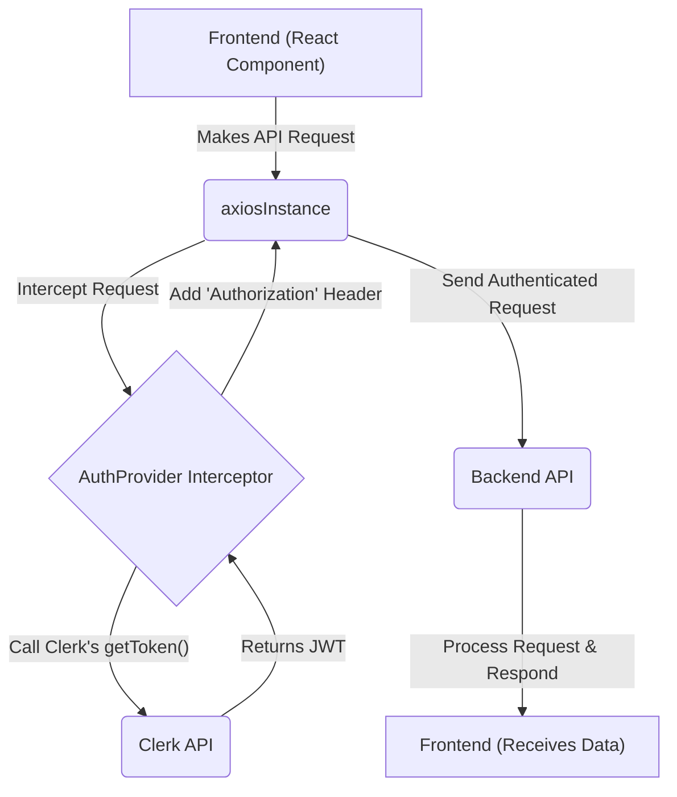
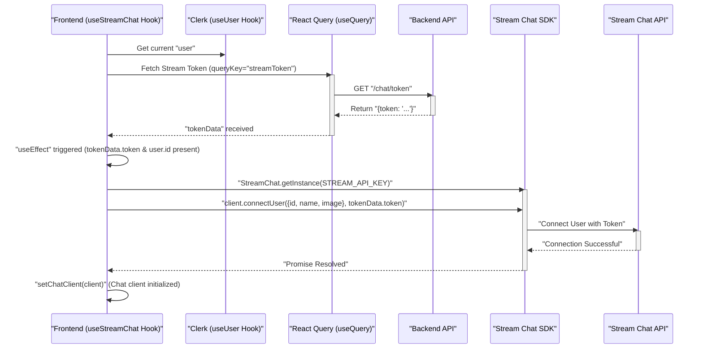

 # Frontend Services and State Management

This document details the core frontend services responsible for API interactions, user authentication, and real-time communication via Stream Chat. It covers how `axios` is configured for authenticated requests, the role of Clerk for user management, and the `useStreamChat` hook for managing Stream Chat client state.

## API Interaction & Configuration

The application utilizes `axios` for making HTTP requests to the backend API. A centralized `axiosInstance` is configured to ensure consistent base URL and handle credentials, streamlining all API communications.

The `axiosInstance` is created with a `baseURL` derived from environment variables, allowing for flexible deployment across development and production environments. The `withCredentials: true` setting is crucial for sending and receiving HTTP cookies, which are often used for session management or authentication tokens.

```javascript
// frontend/src/lib/axios.js
import axios from "axios";

const BASE_URL = import.meta.env.VITE_API_BASE_URL

export const axiosInstance = axios.create({
  baseURL: BASE_URL,
  withCredentials: true,  // Sending Cookies
});
```
This configuration ensures that all requests made using `axiosInstance` will target the correct backend endpoint and include necessary credentials automatically.
[View on GitHub](https://github.com/santrupt29/zync/blob/main/frontend/src/lib/axios.js)

For specific API calls, such as fetching a Stream Chat token, dedicated functions are created to encapsulate the logic. These functions use the pre-configured `axiosInstance`.

```javascript
// frontend/src/lib/api.js
import { axiosInstance } from "./axios.js";

export async function getStreamToken() {
    const response = await axiosInstance.get("/chat/token");
    return response.data;
}
```
The `getStreamToken` function exemplifies a clear, reusable API call that leverages `axiosInstance` to interact with the backend `/chat/token` endpoint.
[View on GitHub](https://github.com/santrupt29/zync/blob/main/frontend/src/lib/api.js)

## Authentication with Clerk & Axios Interceptors

Authentication is managed using Clerk, a comprehensive user management platform. On the client side, Clerk handles user sessions, and `AuthProvider` ensures that all outgoing `axios` requests are automatically authenticated with a valid JWT.

The `AuthProvider` component sets up an `axios` request interceptor. This interceptor runs before every request made by `axiosInstance`, asynchronously fetching a fresh authentication token from Clerk and attaching it as a Bearer token in the `Authorization` header. This approach centralizes authentication logic, preventing the need to manually add tokens to each API call.

```javascript
// frontend/src/providers/AuthProvider.jsx
import { createContext, useEffect } from "react";
import { useAuth } from "@clerk/clerk-react";
import { axiosInstance } from "../lib/axios.js";
import toast from "react-hot-toast";
import React from "react";
const AuthContext = createContext();

export default function AuthProvider({ children }) {
    const {getToken} = useAuth();

    useEffect(() => {
        // setup axios interceptor
        const interceptor = axiosInstance.interceptors.request.use(async (config) => {
            try {
                const token = await getToken();
                if (token) {
                    config.headers.Authorization = `Bearer ${token}`;
                }
            } catch (error) {
               if (error.message?.includes("auth") || error.message?.includes("token")) {
                toast.error("Authentication issue. Please refresh the page.")
            }
            console.log("Error getting token:", error);
            }
            return config;
        }, (error) => {
            console.error("Axios request Error:", error);
            return Promise.reject(error);
        });
        // Clean up function to remove the interceptor, to avoid memory leaks
        return () => {
            axiosInstance.interceptors.request.eject(interceptor);
        };

        }, [getToken]);

        return <AuthContext.Provider value={{}}>{children}</AuthContext.Provider>;
}
```
The `useEffect` hook in `AuthProvider` registers the interceptor when the component mounts and cleans it up when it unmounts, preventing memory leaks and ensuring proper token management throughout the application's lifecycle.
[View on GitHub](https://github.com/santrupt29/zync/blob/main/frontend/src/providers/AuthProvider.jsx)

Here's a flowchart illustrating the authentication request flow:





## Stream Chat Integration

The `useStreamChat` custom React hook centralizes the logic for connecting to and managing the Stream Chat client. This hook leverages `react-query` for fetching the necessary Stream token and `useEffect` for initializing and managing the Stream Chat client lifecycle.

```javascript
// frontend/src/hooks/useStreamChat.js
import React, {useState, useEffect} from "react";
import { StreamChat } from "stream-chat";
import { useUser } from "@clerk/clerk-react";
import { useQuery } from "@tanstack/react-query";
import { getStreamToken } from "../lib/api.js";
import * as Sentry from "@sentry/react";

const STREAM_API_KEY = import.meta.env.VITE_STREAM_API_KEY;

export const useStreamChat = () => {
    const { user } = useUser();
    const [chatClient, setChatClient] = useState(null);
  
    // fetch stream token using react-query
    const {
      data: tokenData,
      isLoading,
      error,
    } = useQuery({
      queryKey: ["streamToken"],
      queryFn: getStreamToken,
      enabled: !!user?.id, // this will take the object and convert it to a boolean
    });

    // init stream chat client
    useEffect(() => {
      if (!tokenData?.token || !user?.id || !STREAM_API_KEY) return;
  
      const client = StreamChat.getInstance(STREAM_API_KEY);
      let cancelled = false;
  
      const connect = async () => {
        try {
          await client.connectUser(
            {
              id: user.id,
              name:
                user.fullName ?? user.username ?? user.primaryEmailAddress?.emailAddress ?? user.id,
              image: user.imageUrl ?? undefined,
            },
            tokenData.token
          );
          if (!cancelled) {
            setChatClient(client);
          }
        } catch (error) {
          console.log("Error connecting to stream", error);
          Sentry.captureException(error, {
            tags: { component: "useStreamChat" },
            extra: {
              context: "stream_chat_connection",
              userId: user?.id,
              streamApiKey: STREAM_API_KEY ? "present" : "missing",
            },
          });
        }
      };
  
      connect();
  
      // cleanup
      return () => {
        cancelled = true;
        client.disconnectUser();
      };
    }, [tokenData?.token, user?.id]);
  
    return { chatClient, isLoading, error };
  };
```
The hook first fetches a `streamToken` from the backend using `react-query`, ensuring the token is only fetched when a user is logged in (`enabled: !!user?.id`). Once the token and user ID are available, a `useEffect` hook initializes the `StreamChat` client and connects the user. This `useEffect` also includes a cleanup function to disconnect the user when the component unmounts or dependencies change, preventing stale connections and resource leaks. Error handling includes Sentry integration for robust monitoring.
[View on GitHub](https://github.com/santrupt29/zync/blob/main/frontend/src/hooks/useStreamChat.js)

Here's a sequence diagram illustrating the Stream Chat connection process:





## Key Integration Points

*   **Centralized API Client**: Using `axiosInstance` ensures a single point of configuration for all backend API interactions, making it easy to manage base URLs, credentials, and future interceptors.
*   **Seamless Authentication**: The `AuthProvider`'s `axios` interceptor automatically injects Clerk-provided JWTs into every request. This design decouples authentication concerns from individual components, leading to cleaner and more maintainable code. Errors during token retrieval are handled gracefully with user notifications.
*   **Robust Stream Chat Management**: The `useStreamChat` hook encapsulates the complex lifecycle of the Stream Chat client. It correctly handles token fetching, client initialization, user connection, and proper disconnection during component unmount. The use of `react-query` for the token fetch provides caching, retries, and loading/error states out-of-the-box, enhancing the user experience. Sentry integration ensures that any issues during the Stream Chat connection process are automatically reported for proactive debugging.
*   **Environment Variable Reliance**: Both `axiosInstance` and `useStreamChat` rely on environment variables (`VITE_API_BASE_URL`, `VITE_STREAM_API_KEY`) for configuration, promoting flexibility and security by avoiding hardcoded sensitive values.

These integrations highlight a clean, modular, and robust approach to managing frontend services, state, and external API dependencies.