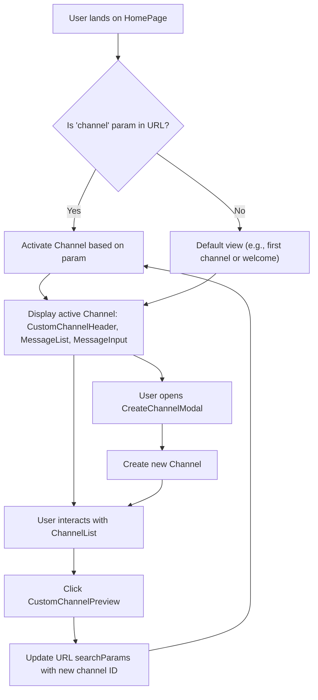
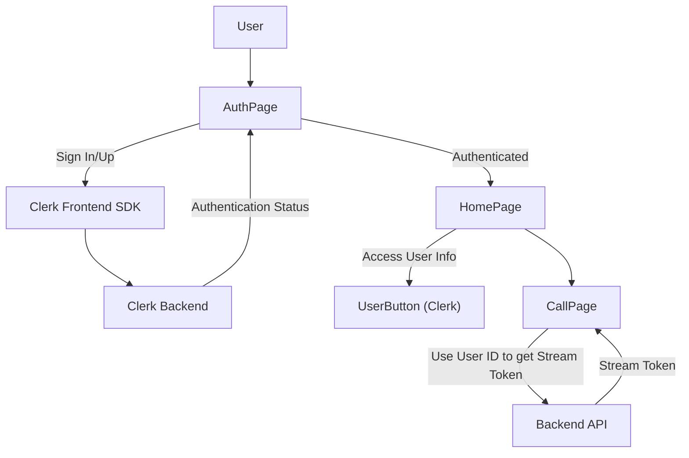

 # Pages and Core Features

This section provides a detailed overview of the core pages within the Zync application's frontend, outlining their purpose, key components, and integration points. Each page is designed to deliver a specific user experience, from initial authentication to real-time communication.

## AuthPage: User Authentication

The `AuthPage.jsx` component serves as the primary gateway for users to sign in or sign up to the Zync application. It provides a welcoming interface with branding, key features, and a clear call to action for authentication via Clerk.

*   **Purpose**: Facilitate user authentication (sign-in/sign-up) using Clerk.
*   **Key Components**:
    *   **Brand Presentation**: Displays the Zync logo and name.
    *   **Hero Section**: Highlights the application's value proposition ("Where Work Happens ✨") and core features (real-time messaging, video calls, secure & private).
    *   **`SignInButton`**: Leverages Clerk's pre-built UI component for authentication, configured in `modal` mode.
    *   **Visual Elements**: Includes illustrative images and an overlay for an engaging aesthetic.

**Authentication Flow**

The authentication process is straightforward, relying entirely on Clerk's robust service. When a user clicks the "Get Started with Zync" button, Clerk's authentication modal is triggered, handling the entire sign-in or sign-up flow.

```jsx
// frontend/src/pages/AuthPage.jsx
// Line 39-44
<SignInButton mode="modal">
  <button className="cta-button">
    Get Started with Zync
    <span className="button-arrow">→</span>
  </button>
</SignInButton>
```
[View on GitHub](https://github.com/santrupt29/zync/blob/main/frontend/src/pages/AuthPage.jsx#L39-L44)

The `AuthPage` focuses purely on presentation and initiating the Clerk authentication flow, delegating the actual user management and session handling to Clerk.

## HomePage: Real-time Messaging and Channel Management

The `HomePage.jsx` is the central hub for real-time messaging, displaying active channels, direct messages, and enabling users to create new communication channels. It heavily relies on the Stream Chat SDK for its core functionality.

*   **Purpose**: Provide the main chat interface, including channel lists, message displays, and user management.
*   **Key Components**:
    *   **`Chat` Context**: The root component from `stream-chat-react` that provides the chat client context to all child components.
    *   **`ChannelList`**: Displays a list of channels the user is a member of, allowing for filtering and custom previews.
    *   **`CustomChannelPreview`**: A custom component to render each channel in the list, enabling specific styling and behavior.
    *   **`CreateChannelModal`**: A modal component (likely for creating new public or private chat channels).
    *   **`UsersList`**: Displays a list of other users for direct messaging.
    *   **`Channel`**: Renders the active chat channel, containing message history and input.
    *   **`CustomChannelHeader`**: Provides a custom header for the active channel, showing channel name, members, and possibly call initiation options.
    *   **`MessageList` / `MessageInput` / `Thread`**: Standard Stream Chat components for displaying messages, composing new ones, and managing message threads.
    *   **`UserButton`**: Clerk's component for user profile management.

**Chat Initialization**

The `HomePage` initializes the Stream Chat client using a custom `useStreamChat` hook, which manages the client's lifecycle and loading state. The active channel is determined by URL search parameters, allowing for deep linking into specific conversations.

```jsx
// frontend/src/pages/HomePage.jsx
// Line 25-33
  useEffect(() => {
    if (chatClient) {
      const channelId = searchParams.get("channel");
      if (channelId) {
        const channel = chatClient.channel("messaging", channelId);
        setActiveChannel(channel);
      }
    }
  }, [chatClient, searchParams]);
```
[View on GitHub](https://github.com/santrupt29/zync/blob/main/frontend/src/pages/HomePage.jsx#L25-L33)

This ensures that upon loading the page, if a `channel` parameter is present in the URL, the corresponding channel is automatically made active.

**Channel Interaction Flow**

The user's interaction with channels and direct messages follows a clear path:





This flow illustrates how users navigate between channels, either directly via URL or by selecting from the `ChannelList`.

## CallPage: Real-time Video Conferencing

The `CallPage.jsx` component is dedicated to handling real-time video and audio calls using the Stream Video SDK. It orchestrates the connection to a specific call instance, manages user participation, and provides call controls.

*   **Purpose**: Enable users to join and participate in video and audio calls.
*   **Key Components**:
    *   **`StreamVideo`**: The root component for the Stream Video SDK, providing the video client context.
    *   **`StreamCall`**: Manages a specific call instance, handling connection and state.
    *   **`CallControls`**: Provides UI elements for call management (mute, unmute, end call, etc.).
    *   **`SpeakerLayout`**: Displays participants in a speaker-focused layout.
    *   **`useCallStateHooks`**: A hook from the SDK to access the current state of the call, such as `CallingState`.
    *   **`getStreamToken`**: An API utility function to fetch an authentication token for Stream services.

**Call Initialization and Connection**

Upon entering the `CallPage` with a `callId` from the URL, the component fetches a Stream token for the current user. Once the token is acquired, a `StreamVideoClient` and `StreamCall` instance are initialized, and the user attempts to join the call.

```jsx
// frontend/src/pages/CallPage.jsx
// Line 30-49
    const initCall = async () => {
      if (!tokenData.token || !user || !callId) return;

      try {
        const videoClient = new StreamVideoClient({
          apiKey: STREAM_API_KEY,
          user: {
            id: user.id,
            name: user.fullName,
            image: user.imageUrl,
          },
          token: tokenData.token,
        });

        const callInstance = videoClient.call("default", callId);
        await callInstance.join({ create: true });

        setClient(videoClient);
        setCall(callInstance);
      } catch (error) {
        console.log("Error init call:", error);
        toast.error("Cannot connect to the call.");
      } finally {
        setIsConnecting(false);
      }
    };
```
[View on GitHub](https://github.com/santrupt29/zync/blob/main/frontend/src/pages/CallPage.jsx#L30-L49)

If the user successfully joins, `StreamVideo` and `StreamCall` components render, displaying the video conference interface with `SpeakerLayout` and `CallControls`. If the call state indicates the user has `LEFT`, they are programmatically navigated back to the home page.

## LandingPage: Marketing and Overview

The `LandingPage.jsx` serves as the public-facing entry point for the Zync application. It's designed to attract new users by showcasing the application's features, benefits, and social proof.

*   **Purpose**: Introduce Zync, highlight its features, provide social proof, and encourage user sign-up.
*   **Key Sections**:
    *   **Hero Section**: Captivates visitors with a catchy title, descriptive subtitle, key feature pills, and a "Get Started" call to action. It uses subtle animations and floating UI elements for visual appeal.
    *   **Stats Section**: Displays impressive statistics about Zync's usage and reliability.
    *   **Features Section**: Details Zync's core functionalities with icons, titles, and descriptions.
    *   **Testimonials Section**: Showcases positive feedback from current users to build trust.
    *   **Footer**: Provides navigation links and legal information.
*   **Navigation**: The "Get Started with Zync" button navigates users to the `/auth` page to initiate the sign-up/sign-in process.

**Call to Action**

The primary call to action on the landing page is to initiate the authentication flow, directing users to the `AuthPage`.

```jsx
// frontend/src/pages/LandingPage.jsx
// Line 110-112
  const handleLogin = async () => {
    navigate("/auth");
  }
```
[View on GitHub](https://github.com/santrupt29/zync/blob/main/frontend/src/pages/LandingPage.jsx#L110-L112)

This simple handler ensures a smooth transition from marketing content to the user onboarding process.

## Key Integration Points

### User Identity and Authentication (Clerk)

Clerk is a cornerstone for user identity in Zync. Both the `AuthPage` and `HomePage` (`UserButton`) directly integrate with Clerk. The `CallPage` also relies on the authenticated `user` object from Clerk to fetch Stream tokens.





This diagram highlights how Clerk manages user identity across different pages, either directly through its UI components or by providing user data for backend interactions.

### Real-time Communication (Stream SDKs)

Stream's Chat and Video SDKs are fundamental to Zync's core functionality.

*   **Stream Chat Integration (`HomePage`)**: The `HomePage` uses `Chat`, `ChannelList`, `Channel`, `MessageList`, `MessageInput`, and `Thread` components from `stream-chat-react`. A custom `useStreamChat` hook handles client initialization.
*   **Stream Video Integration (`CallPage`)**: The `CallPage` uses `StreamVideo`, `StreamCall`, `CallControls`, and `SpeakerLayout` from `@stream-io/video-react-sdk` for video conferencing. It fetches a token from the backend to authorize the Stream Video client.

This layered integration allows for robust and scalable real-time communication capabilities within the application.