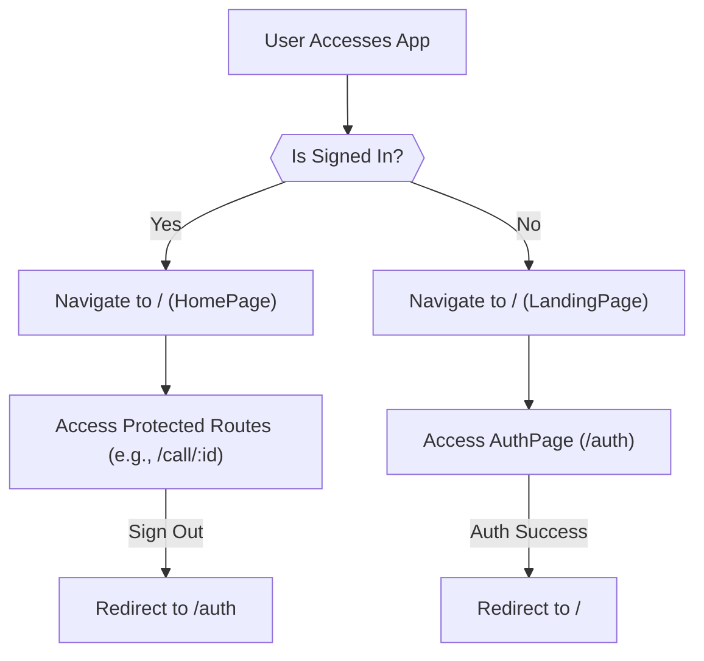
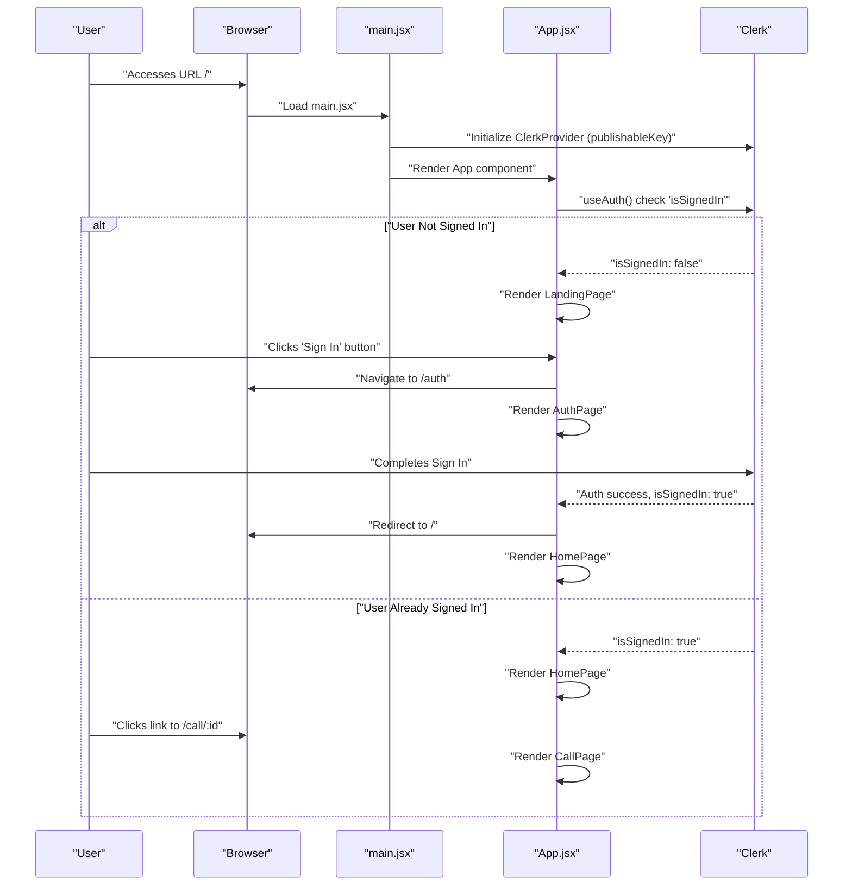

 # Frontend Application Structure

This document provides a comprehensive overview of the frontend application's architecture, including its core components, routing mechanisms, and essential integrations. The application leverages modern React practices, Vite for tooling, and a suite of powerful libraries to deliver a robust and scalable user experience.

## Application Entry Point: `main.jsx`

The `frontend/src/main.jsx` file serves as the primary entry point for the React application. It is responsible for bootstrapping the entire application, setting up critical providers, and integrating foundational services like authentication and error monitoring.

Here's a look at its core responsibilities:

*   **DOM Rendering**: Initializes the React application by rendering the root `App` component into the `root` element of the HTML.
*   **Strict Mode**: Encapsulates the application within `React.StrictMode` for identifying potential problems in an application.
*   **Clerk Provider**: Wraps the application with `ClerkProvider` to enable authentication functionalities, requiring a `VITE_CLERK_PUBLISHABLE_KEY` from environment variables.
*   **React Router**: Integrates `BrowserRouter` to enable client-side routing.
*   **React Query**: Sets up `QueryClientProvider` to manage server-state, data fetching, caching, and synchronization.
*   **Authentication Context**: `AuthProvider` (presumably a custom context) likely manages and exposes authentication-related states or functions.
*   **Sentry Integration**: Initializes Sentry for error tracking and performance monitoring, including `reactRouterV7BrowserTracingIntegration` for route change tracing.
*   **Toaster**: Includes `Toaster` from `react-hot-toast` for displaying non-blocking notifications.

```jsx title="frontend/src/main.jsx"
// ...imports
import { ClerkProvider } from '@clerk/clerk-react'
import { BrowserRouter, /* ... */ } from 'react-router'
import {
  QueryClient,
  QueryClientProvider,
} from '@tanstack/react-query'
import { Toaster } from 'react-hot-toast'
import AuthProvider from './providers/AuthProvider.jsx'
import * as Sentry from "@sentry/react";

const queryClient = new QueryClient();

const PUBLISHABLE_KEY = import.meta.env.VITE_CLERK_PUBLISHABLE_KEY;
if (!PUBLISHABLE_KEY) {
  throw new Error("VITE_CLERK_PUBLISHABLE_KEY is not set");
}

Sentry.init({
  dsn: import.meta.env.VITE_SENTRY_DSN,
  integrations: [
    Sentry.reactRouterV7BrowserTracingIntegration({ /* ... */ }),
  ],
  tracesSampleRate: 1.0,
});

createRoot(document.getElementById('root')).render(
  <StrictMode>
    <ClerkProvider publishableKey={PUBLISHABLE_KEY}>
      <BrowserRouter>
      <QueryClientProvider client={queryClient}>
        <AuthProvider>
        <App/>
        </AuthProvider>
        <Toaster />
    </QueryClientProvider>
    </BrowserRouter>
    </ClerkProvider>
  </StrictMode>
)
```
[View on GitHub](https://github.com/santrupt29/zync/blob/main/frontend/src/main.jsx)

## Main Application Component: `App.jsx`

The `frontend/src/App.jsx` component is the central hub for the application's routing logic. It dynamically renders different pages based on the current URL and the user's authentication status, utilizing Clerk for authentication management and React Router for navigation.

Key aspects of `App.jsx`:

*   **Authentication Guard**: Uses `useAuth()` from Clerk to determine `isSignedIn` status. If the authentication state is not yet loaded (`!isLoaded`), it renders `null` to prevent UI flicker.
*   **Sentry Routing Integration**: Wraps `Routes` with `Sentry.withSentryReactRouterV7Routing` to automatically track route changes and performance in Sentry.
*   **Conditional Routing**: All routes are protected or redirected based on the user's authentication status.
    *   `/`: Navigates to `HomePage` if signed in, otherwise to `LandingPage`.
    *   `/auth`: Navigates to `AuthPage` if not signed in, otherwise redirects to `/`.
    *   `/call/:id`: A protected route for video calls, requiring authentication. If not signed in, it redirects to `/auth`.
    *   `*` (Catch-all): Redirects authenticated users to `/` and unauthenticated users to `/auth`.

```jsx title="frontend/src/App.jsx"
import React from 'react'
import { SignedIn, SignedOut, SignInButton, useAuth, UserButton } from '@clerk/clerk-react'
import { Routes, Route, Navigate } from 'react-router'
import HomePage from './pages/HomePage.jsx'
import AuthPage from './pages/AuthPage.jsx'
import CallPage from './pages/CallPage.jsx'
import LandingPage from './pages/LandingPage.jsx'
import * as Sentry from "@sentry/react";

const SentryRoutes = Sentry.withSentryReactRouterV7Routing(Routes);

const App = () => {
  const {isSignedIn, isLoaded} = useAuth();
  if (!isLoaded) return null;

  return (
    <>
      <SentryRoutes>
      <Route path="/" element={isSignedIn ? <HomePage /> : <LandingPage />} />
      <Route path="/auth" element={!isSignedIn ? <AuthPage /> : <Navigate to={"/"} replace />} />

      <Route
        path="/call/:id"
        element={isSignedIn ? <CallPage /> : <Navigate to={"/auth"} replace />}
      />

      <Route
        path="*"
        element={isSignedIn ? <Navigate to={"/"} replace /> : <Navigate to={"/auth"} replace />}
      />
    </SentryRoutes>
    </>
  )
}

export default App
```
[View on GitHub](https://github.com/santrupt29/zync/blob/main/frontend/src/App.jsx)

## Frontend Dependencies and Scripts: `package.json`

The `frontend/package.json` file defines the project's metadata, scripts for development and building, and all required dependencies and devDependencies. This provides a clear overview of the technologies integrated into the frontend.

Key dependencies include:

*   **Clerk React**: For authentication and user management.
*   **Sentry React**: For error monitoring and performance tracing.
*   **Stream.io SDKs (`@stream-io/video-react-sdk`, `stream-chat`, `stream-chat-react`)**: For real-time video and chat functionalities.
*   **Tailwind CSS**: For utility-first CSS styling.
*   **React Query**: For efficient data fetching, caching, and synchronization.
*   **Axios**: HTTP client for making API requests.
*   **React Router**: For declarative routing.
*   **Vite**: The build tool and development server.

```json title="frontend/package.json"
{
  "name": "frontend",
  "private": true,
  "version": "0.0.0",
  "type": "module",
  "scripts": {
    "dev": "vite",
    "build": "vite build",
    "lint": "eslint .",
    "preview": "vite preview"
  },
  "dependencies": {
    "@clerk/clerk-react": "^5.37.0",
    "@sentry/react": "^10.1.0",
    "@stream-io/video-react-sdk": "^1.19.2",
    "@tailwindcss/vite": "^4.1.12",
    "@tanstack/react-query": "^5.83.0",
    "axios": "^1.11.0",
    "lucide-react": "^0.541.0",
    "react": "^19.1.1",
    "react-dom": "^19.1.1",
    "react-hot-toast": "^2.5.2",
    "react-router": "^7.6.3",
    "stream-chat": "^9.14.0",
    "stream-chat-react": "^13.3.0",
    "tailwindcss": "^4.1.12"
  },
  "devDependencies": {
    "@eslint/js": "^9.33.0",
    "@types/react": "^19.1.10",
    "@types/react-dom": "^19.1.7",
    "@vitejs/plugin-react": "^5.0.0",
    "eslint": "^9.33.0",
    "eslint-plugin-react-hooks": "^5.2.0",
    "eslint-plugin-react-refresh": "^0.4.20",
    "globals": "^16.3.0",
    "vite": "^7.1.2"
  }
}
```
[View on GitHub](https://github.com/santrupt29/zync/blob/main/frontend/package.json)

## Build Configuration: `vite.config.js`

The `frontend/vite.config.js` file configures Vite, the next-generation frontend tooling. It specifies how the project should be built, served in development, and includes plugins for various functionalities.

```javascript title="frontend/vite.config.js"
import { defineConfig } from 'vite'
import tailwindcss from '@tailwindcss/vite'
export default defineConfig({
  plugins: [
    tailwindcss(),
  ],
})
```
[View on GitHub](https://github.com/santrupt29/zync/blob/main/frontend/vite.config.js)

Currently, the configuration is minimal, primarily integrating Tailwind CSS as a Vite plugin. This plugin allows Tailwind to process CSS during development and build, enabling utility-first styling.

## Frontend Application Flow

The following diagram illustrates the high-level flow of the frontend application, particularly focusing on the initial load and routing decisions.





## Key Integration Points

### Authentication with Clerk

Clerk handles user authentication, session management, and user profiles. The integration is seamless through `ClerkProvider` in `main.jsx` and `useAuth()` hook in `App.jsx`.

*   **Setup**: `ClerkProvider` is the top-level component, publishing the `PUBLISHABLE_KEY`.
*   **Status Check**: `useAuth()` in `App.jsx` provides `isSignedIn` and `isLoaded` states, which are crucial for conditional rendering and route protection.
*   **Protected Routes**: All core application functionalities (e.g., `HomePage`, `CallPage`) are guarded, ensuring only authenticated users can access them.

### Real-time Communication with Stream SDKs

The application integrates `@stream-io/video-react-sdk`, `stream-chat`, and `stream-chat-react` for real-time communication features, such as video calls and chat. These SDKs provide a robust foundation for building interactive and collaborative experiences. The `CallPage` component is where these SDKs are primarily utilized, facilitating dynamic video conferencing.

### Error Monitoring with Sentry

Sentry is integrated for comprehensive error tracking and performance monitoring. This helps in proactively identifying and resolving issues in production.

*   **Initialization**: Sentry is initialized in `main.jsx` with a DSN and `tracesSampleRate`.
*   **React Router Tracing**: The `Sentry.reactRouterV7BrowserTracingIntegration` is configured to automatically trace navigation events, providing insights into route performance.
*   **Component Wrapping**: `Sentry.withSentryReactRouterV7Routing(Routes)` ensures that any errors occurring within the route components are automatically captured and reported to Sentry.

### Data Management with React Query

`@tanstack/react-query` is employed for managing server-side data, offering powerful caching, background refetching, and state synchronization capabilities.

*   **Provider Setup**: `QueryClientProvider` wraps the application, making `QueryClient` available to all components.
*   **Benefits**: Reduces boilerplate for data fetching, improves user experience with instant updates, and optimizes network requests.

### Frontend Development Workflow

The development workflow is streamlined using Vite and Tailwind CSS.

*   **Vite**: Provides an extremely fast development server with Hot Module Replacement (HMR) and an optimized build process.
*   **Tailwind CSS**: Enables rapid UI development through a utility-first CSS framework, configured via `vite.config.js`.

### Application Component Interaction

The following sequence diagram illustrates a typical user journey through the authentication and protected route access.


