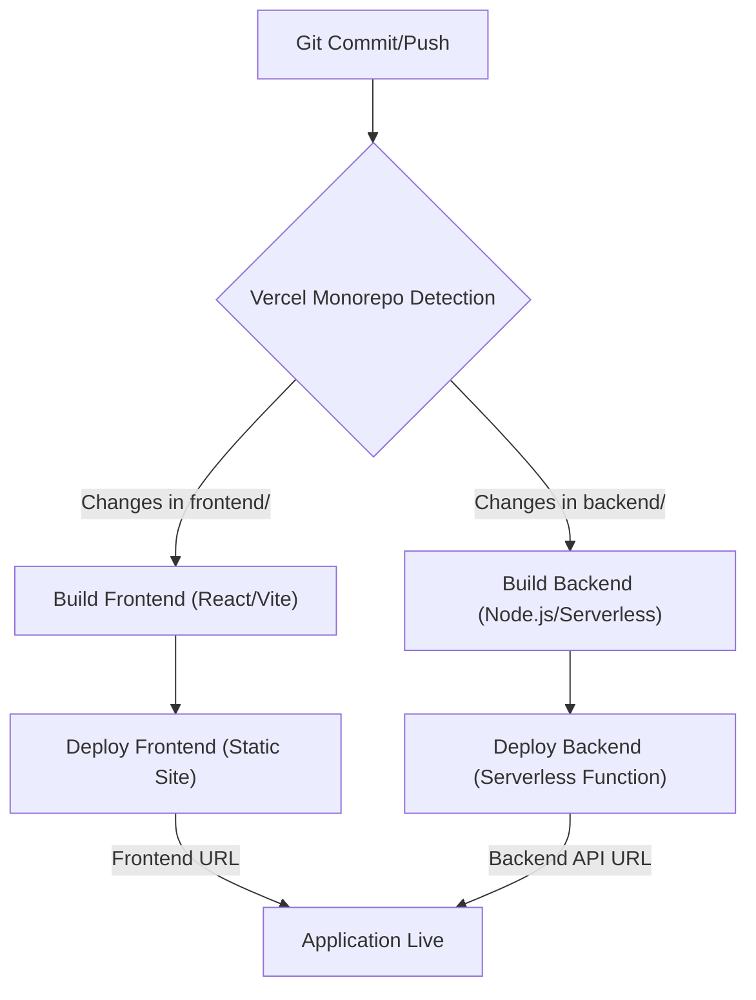
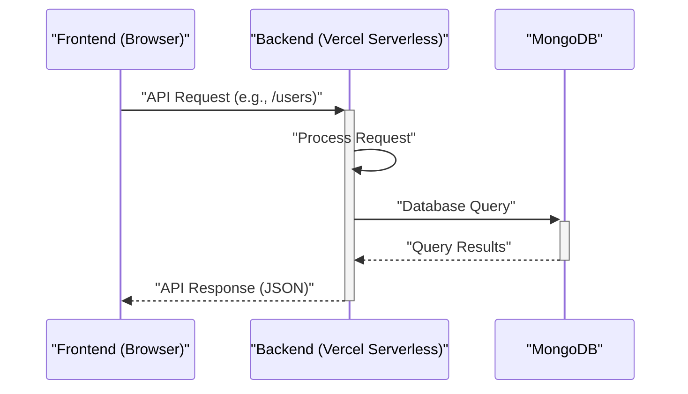

 # Deployment and Environment

This section provides comprehensive details on deploying the application, including environment-specific configurations and Vercel deployment setups for both the backend and frontend services. Understanding these configurations is crucial for consistent deployments across different environments and for ensuring all necessary services are correctly integrated.

## Environment Configuration

The application utilizes environment variables to manage sensitive information and configuration settings that vary between development, testing, and production environments. These variables are loaded at runtime, ensuring flexibility and security.

### Backend Environment Variables

The backend service, built with Node.js, uses the `dotenv` library to load environment variables from `.env` files. The `backend/src/config/env.js` file centralizes the access to these variables, making them easily manageable and accessible throughout the application.

```javascript
// backend/src/config/env.js
import "dotenv/config";

export const ENV = {
  PORT: process.env.PORT || 3000,
  MONGO_URI: process.env.MONGO_URI,
  NODE_ENV: process.env.NODE_ENV || "development",
  CLERK_PUBLISHABLE_KEY: process.env.CLERK_PUBLISHABLE_KEY,
  CLERK_SECRET_KEY: process.env.CLERK_SECRET_KEY,
  STREAM_API_KEY: process.env.STREAM_API_KEY,
  STREAM_API_SECRET: process.env.STREAM_API_SECRET,
  SENTRY_DSN: process.env.SENTRY_DSN,
  INNGEST_EVENT_KEY: process.env.INNGEST_EVENT_KEY,
  INNGEST_SIGNING_KEY: process.env.INNGEST_SIGNING_KEY,
  CLIENT_URL: process.env.CLIENT_URL,
};
```
[View on GitHub](https://github.com/santrupt29/zync/blob/main/backend/src/config/env.js)

**Key Variables and Their Purpose:**

*   **`PORT`**: The port on which the backend server listens (defaulting to 3000).
*   **`MONGO_URI`**: Connection string for the MongoDB database.
*   **`NODE_ENV`**: Indicates the current environment (e.g., `development`, `production`).
*   **`CLERK_PUBLISHABLE_KEY`, `CLERK_SECRET_KEY`**: Credentials for Clerk authentication service.
*   **`STREAM_API_KEY`, `STREAM_API_SECRET`**: Credentials for Stream API (e.g., for real-time chat or activity feeds).
*   **`SENTRY_DSN`**: Data Source Name for Sentry error tracking.
*   **`INNGEST_EVENT_KEY`, `INNGEST_SIGNING_KEY`**: Keys for Inngest serverless function orchestration.
*   **`CLIENT_URL`**: The URL of the frontend application, used for CORS or redirect purposes.

### Managing Environment Variables Locally

For local development, create a `.env` file in the `backend` directory. This file will hold the values for the environment variables specific to your local setup.

```plaintext
# backend/.env example
PORT=3000
MONGO_URI=mongodb://localhost:27017/zync_dev
NODE_ENV=development
CLERK_PUBLISHABLE_KEY=pk_live_your_clerk_publishable_key
CLERK_SECRET_KEY=sk_live_your_clerk_secret_key
STREAM_API_KEY=your_stream_api_key
STREAM_API_SECRET=your_stream_api_secret
SENTRY_DSN=https://your_sentry_dsn
INNGEST_EVENT_KEY=your_inngest_event_key
INNGEST_SIGNING_KEY=your_inngest_signing_key
CLIENT_URL=http://localhost:5173
```

**Important**: `.env` files should **never** be committed to version control. Ensure they are listed in your `.gitignore` file to prevent sensitive information from being exposed.

## Deployment with Vercel

Both the backend and frontend services are configured for deployment on Vercel, a platform for static sites and serverless functions. Vercel's integrated CI/CD capabilities automate the deployment process based on Git commits.

### Backend Deployment (Vercel)

The `backend/vercel.json` file defines how the backend service is built and routed on Vercel. It specifies the entry point for the Node.js application and ensures all incoming requests are directed to the `src/server.js` file.

```json
// backend/vercel.json
{
    "version": 2,
    "builds": [
      {
        "src": "src/server.js",
        "use": "@vercel/node"
      }
    ],
    "routes": [
      {
        "src": "/(.*)",
        "dest": "src/server.js"
      }
    ],
    "env": {
      "NODE_ENV": "production"
    }
  }
```
[View on GitHub](https://github.com/santrupt29/zync/blob/main/backend/vercel.json)

**Configuration Details:**

*   **`version`**: Specifies the Vercel configuration version.
*   **`builds`**: Defines how the source code is built. Here, `src/server.js` is built using the `@vercel/node` builder, indicating a Node.js serverless function.
*   **`routes`**: Directs all incoming requests (`/(.*)`) to the compiled `src/server.js` function. This effectively makes the entire backend a single Vercel Serverless Function.
*   **`env`**: Sets environment variables specific to the Vercel deployment. `NODE_ENV` is explicitly set to `production` for optimal performance and security. Other sensitive variables (like `MONGO_URI`, `CLERK_SECRET_KEY`, etc.) should be configured as "Environment Variables" directly within the Vercel project settings, not hardcoded in `vercel.json`.

### Frontend Deployment (Vercel)

The frontend application, built with React and Vite, is served as a static site. The `frontend/vercel.json` file is relatively simple, primarily handling routing to ensure all requests resolve to the main `index.html` file.

```json
// frontend/vercel.json
{
    "rewrites": [
      {
        "source": "/(.*)",
        "destination": "/"
      }
    ]
  }
```
[View on GitHub](https://github.com/santrupt29/zync/blob/main/frontend/vercel.json)

**Configuration Details:**

*   **`rewrites`**: This rule ensures that any request path (`/(.*)`) is rewritten to the root path (`/`). This is crucial for single-page applications (SPAs) like React apps, as it allows client-side routing to handle different URLs without the server trying to find corresponding files. Essentially, all routes will load `index.html`, and the React Router will take over.

### Frontend Project Setup

The frontend README provides context on the technology stack, confirming the use of React and Vite for a fast development experience and optimized builds.

```markdown
# frontend/README.md
# React + Vite

This template provides a minimal setup to get React working in Vite with HMR and some ESLint rules.

Currently, two official plugins are available:

- [@vitejs/plugin-react](https://github.com/vitejs/vite-plugin-react/blob/main/packages/plugin-react) uses [Babel](https://babeljs.io/) for Fast Refresh
- [@vitejs/plugin-react-swc](https://github.com/vitejs/vite-plugin-react/blob/main/packages/vite-plugin-react-swc) uses [SWC](https://swc.rs/) for Fast Refresh
```
[View on GitHub](https://github.com/santrupt29/zync/blob/main/frontend/README.md)

This highlights that the frontend leverages Vite for its build tool, enabling features like Hot Module Replacement (HMR) for a smooth development workflow and efficient production bundles.

## Key Integration Points

### Vercel Deployment Flow

The deployment process for both frontend and backend on Vercel involves detecting changes in the respective directories, building the projects, and then deploying them.





**Explanation:**
1.  **Git Commit/Push**: Any commit pushed to the configured branch (e.g., `main`) triggers a Vercel deployment.
2.  **Vercel Monorepo Detection**: Vercel detects which sub-projects (frontend or backend) have changes based on their respective directories.
3.  **Build Frontend**: If changes are in `frontend/`, Vercel builds the React/Vite application.
4.  **Deploy Frontend**: The built static assets for the frontend are deployed.
5.  **Build Backend**: If changes are in `backend/`, Vercel builds the Node.js serverless function.
6.  **Deploy Backend**: The compiled backend serverless function is deployed.
7.  **Application Live**: Both the frontend (served as a static site) and the backend (exposed via a serverless API endpoint) are now live, forming the complete application.

### Backend-Frontend Communication

The frontend client communicates with the backend API. It's crucial that the `CLIENT_URL` environment variable in the backend properly reflects the deployed frontend URL to handle CORS requests correctly, especially in production environments.





**Explanation:**
1.  **Frontend (Browser)** initiates an API request to the Backend.
2.  **Backend (Vercel Serverless)** processes the request.
3.  **Backend** interacts with **MongoDB** to fetch or update data.
4.  **MongoDB** responds with query results to the **Backend**.
5.  **Backend** sends an API response back to the **Frontend (Browser)**.

### Best Practices for Deployment

*   **Environment Variables**: Always store sensitive information (API keys, database credentials) as environment variables in Vercel project settings, rather than committing them to `vercel.json` or `.env` files in your repository.
*   **Branching Strategy**: Implement a robust branching strategy (e.g., GitFlow, GitHub Flow) where `main` branch deployments are automated to production and feature branches are deployed to preview environments.
*   **Logging and Monitoring**: Utilize Sentry (configured via `SENTRY_DSN`) and Vercel's built-in logging to monitor application health and quickly identify issues in production.
*   **CORS Configuration**: Ensure the backend correctly handles Cross-Origin Resource Sharing (CORS) by whitelisting your frontend's deployed URL, particularly when `CLIENT_URL` is set to the production frontend URL.