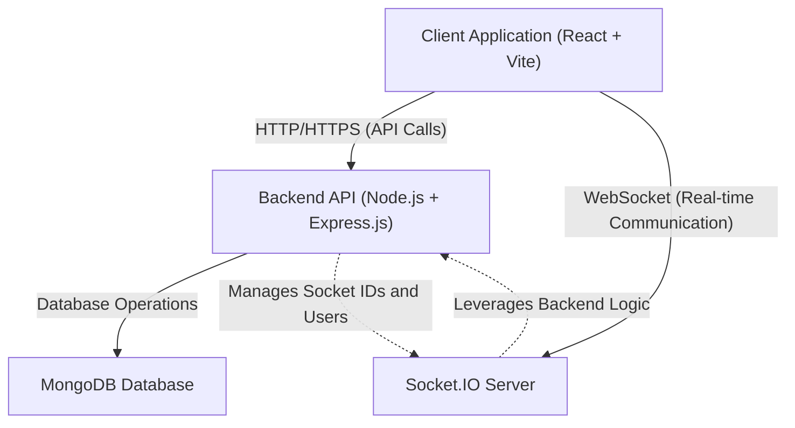
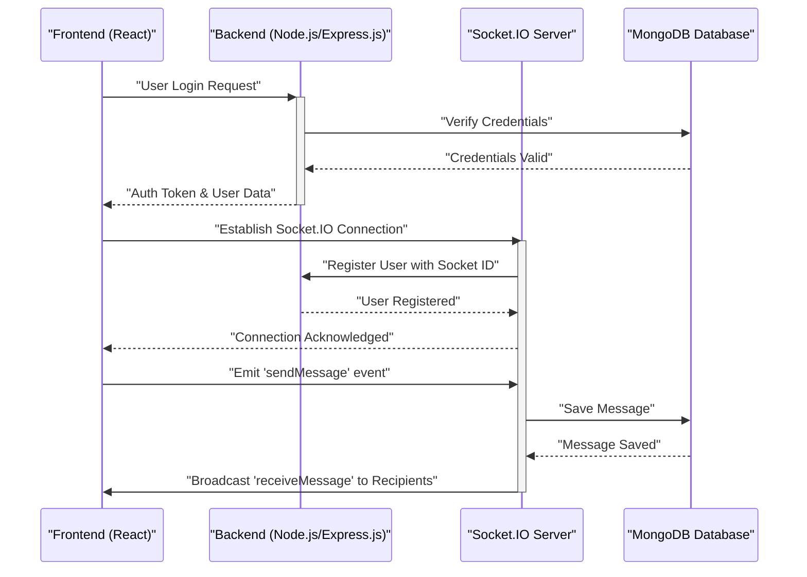

 # System Overview

The Chat-App-MERN project is a full-stack real-time chat application built using the MERN (MongoDB, Express.js, React, Node.js) stack. This document provides a high-level overview of the system's architecture, core technologies, and how its various components interact. The primary goal of this application is to demonstrate a functional chat system with user authentication, real-time messaging, and robust state management.

The project is structured to separate frontend and backend concerns, facilitating independent development and deployment of each component. Real-time communication is powered by Socket.IO, ensuring an interactive and responsive user experience.

## Project Purpose and Features

The Chat-App-MERN project serves as a comprehensive example of a modern web application, showcasing:

*   **User Authentication**: Secure user registration and login functionality.
*   **Real-time Messaging**: Instantaneous message exchange between users using WebSockets.
*   **Private and Group Chats**: Ability to engage in one-on-one conversations and participate in group discussions.
*   **User Status**: Displaying online/offline status for users.
*   **Robust State Management**: Leveraging Zustand for efficient and scalable frontend state handling.
*   **Modern UI**: Built with React, Tailwind CSS, and DaisyUI for a responsive and intuitive user interface.

This project is a credit to the original tutorial that inspired its creation, providing a solid foundation for understanding MERN stack applications.

## Core Technology Stack

The application leverages a powerful combination of technologies across its frontend, backend, and database layers:

### Frontend Technologies

The client-side of the application is built with React, bundled by Vite, and styled using modern CSS frameworks.

*   **React**: A declarative, component-based JavaScript library for building user interfaces.
*   **Vite**: A next-generation frontend tooling that provides an extremely fast development experience.
*   **Zustand**: A small, fast, and scalable bearbones state-management solution for React. It's used for global state management, including user authentication status and socket connections.
*   **Socket.IO Client**: Enables real-time, bidirectional, event-based communication between the browser and the server.
*   **React Router DOM**: Declarative routing for React applications, managing navigation within the single-page application.
*   **Axios**: A promise-based HTTP client for making requests to the backend API.
*   **Tailwind CSS & DaisyUI**: Utility-first CSS framework combined with a component library built on top of Tailwind CSS for rapid UI development.
*   **React Hot Toast**: A lightweight and customizable toast notification library for displaying user feedback.

```json
// frontend/package.json snippet demonstrating key dependencies
{
  "dependencies": {
    "axios": "^1.7.9",
    "lucide-react": "^0.471.1",
    "react": "^18.3.1",
    "react-dom": "^18.3.1",
    "react-hot-toast": "^2.5.1",
    "react-icons": "^5.5.0",
    "react-router-dom": "^7.1.1",
    "socket.io-client": "^4.8.1",
    "zustand": "^5.0.3"
  },
  "devDependencies": {
    "autoprefixer": "^10.4.20",
    "daisyui": "^4.12.23",
    "postcss": "^8.5.0",
    "tailwindcss": "^3.4.17",
    "vite": "^6.3.5"
  }
}
```
[View on GitHub](https://github.com/shinymack/Chat-App-MERN/blob/main/frontend/package.json)

### Backend Technologies (Inferred from MERN and project structure)

Although the provided files are mainly frontend and root-level, the "MERN" acronym implies the following backend technologies:

*   **Node.js**: A JavaScript runtime for building scalable network applications.
*   **Express.js**: A fast, unopinionated, minimalist web framework for Node.js, used for building RESTful APIs.
*   **Socket.IO**: The server-side component complementing the client-side Socket.IO for real-time communication.
*   **MongoDB**: A NoSQL document database used for storing application data like user profiles and chat messages.

### Database

*   **MongoDB**: A flexible and scalable document database, ideal for handling the diverse data structures of a chat application (e.g., messages, user data, conversation metadata).

## System Architecture

The Chat-App-MERN project follows a client-server architecture, with a clear separation between the frontend and backend. Communication between these layers is primarily via RESTful API calls and WebSocket connections.





*Figure 1: High-level System Architecture Overview*

### Frontend Structure

The frontend is a single-page application (SPA) built with React and managed by Vite. It consumes data from the backend API and maintains real-time connections.

The `frontend/package.json` defines scripts for development and building:

```json
// frontend/package.json scripts
{
  "scripts": {
    "dev": "vite",
    "build": "vite build",
    "lint": "eslint .",
    "preview": "vite preview",
    "mobile": "vite --host"
  }
}
```
[View on GitHub](https://github.com/shinymack/Chat-App-MERN/blob/main/frontend/package.json)

The `npm run build --prefix frontend` command is crucial for preparing the React application for deployment, packaging all assets into static files.

### Backend and Root Project Scripts

The root `package.json` orchestrates the building and starting of both frontend and backend components, indicating a monorepo-like setup where `backend` and `frontend` are separate sub-projects.

```json
// package.json (root) scripts
{
  "name": "chatapp",
  "version": "1.0.0",
  "main": "index.js",
  "scripts": {
    "build" : "npm install --prefix backend && npm install --prefix frontend && npm run build --prefix frontend",
    "start" : "npm run start --prefix backend"
  },
  "keywords": [],
  "author": "",
  "license": "ISC",
  "description": ""
}
```
[View on GitHub](https://github.com/shinymack/Chat-App-MERN/blob/main/package.json)

*   `npm install --prefix backend`: Installs dependencies for the backend.
*   `npm install --prefix frontend`: Installs dependencies for the frontend.
*   `npm run build --prefix frontend`: Builds the frontend application.
*   `npm run start --prefix backend`: Starts the backend server, which also likely initializes the Socket.IO server.

This setup ensures that the entire application can be managed from the root directory.

## Key Integration Points

### Authentication Flow

User authentication is a critical integration point. The frontend sends user credentials to the backend via an HTTP POST request. The backend validates these credentials against the MongoDB database and, upon success, sends back an authentication token (e.g., JWT). This token is then stored by the frontend (e.g., in local storage or a Zustand store) and included in subsequent API requests for protected routes.

### Real-time Communication (Socket.IO)

Socket.IO is central to the real-time chat functionality.

1.  **Connection**: After a user logs in, the frontend establishes a WebSocket connection with the Socket.IO server.
2.  **User Status**: When a user connects or disconnects, the Socket.IO server broadcasts status updates to other connected clients.
3.  **Messaging**: When a user sends a message, it's emitted to the Socket.IO server. The server then processes the message (e.g., saves it to MongoDB) and broadcasts it to relevant recipients (e.g., users in the same chat room, or specific users for private messages).

The frontend's `socket.io-client` dependency and the backend's `socket.io` dependency form this crucial link.





*Figure 2: User Login and Real-time Message Flow*

### State Management with Zustand

Zustand plays a vital role in managing global states such as authentication status, the current user, and the Socket.IO instance itself. This allows different components across the React application to access and update shared state efficiently without prop drilling. For example, the `socket.io-client` instance might be stored in a Zustand store, making it accessible to any component that needs to send or receive real-time events.

### API Routes and Data Models

The backend exposes a set of RESTful API endpoints for operations like:

*   `/api/auth/register`: User registration.
*   `/api/auth/login`: User login.
*   `/api/users`: Fetching user lists.
*   `/api/messages`: Sending and retrieving messages.
*   `/api/conversations`: Managing chat conversations.

These APIs interact with MongoDB, where data models define the structure of users, messages, and conversations.

### Cross-Origin Resource Sharing (CORS)

Given the separate frontend and backend deployments, CORS is a critical configuration. The `cors` dependency in the frontend's `package.json` suggests that the frontend might be configured to handle CORS requests from the backend, or more commonly, the backend uses a CORS middleware to allow requests from the frontend's origin. This is essential for preventing browser security restrictions from blocking API calls between the two different origins (e.g., `localhost:3000` for frontend and `localhost:5000` for backend).

## Conclusion

The Chat-App-MERN project is a well-structured application that effectively demonstrates the power of the MERN stack combined with real-time communication capabilities provided by Socket.IO. Its clear separation of concerns, robust state management with Zustand, and efficient build processes make it an excellent example of modern web development practices.

Next: [Backend Architecture](./2_backend-architecture.mdx)