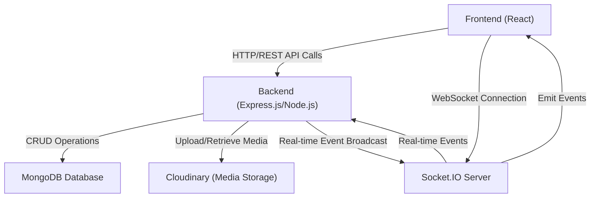
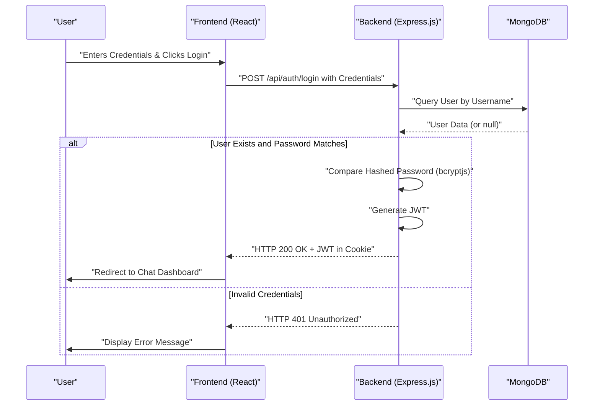

 # System Overview

This document provides a comprehensive, high-level overview of the MERN Chat Application. It introduces the application's purpose, its core features, and the underlying technologies that power it. The MERN Chat Application is designed to facilitate real-time communication between users, offering a dynamic and interactive messaging experience.

The project credits its foundation to a tutorial, providing a robust starting point for its development.

## Project Purpose and Core Functionalities

The MERN Chat Application aims to provide a reliable and efficient platform for users to communicate instantly. Its core functionalities revolve around real-time messaging, user authentication, and persistent data storage.

Key features include:

*   **Real-time Messaging:** Instantaneous exchange of messages between users using WebSockets.
*   **User Authentication and Authorization:** Secure sign-up, login, and session management.
*   **Profile Management:** Users can manage their profiles and view other user's basic information.
*   **Persistent Storage:** Messages and user data are stored in a NoSQL database.
*   **Scalable Architecture:** Designed with separate frontend and backend components for better maintainability and scalability.

## Technology Stack

The application leverages the MERN stack, a popular choice for building robust web applications. Each component plays a crucial role:

*   **MongoDB:** A NoSQL database for flexible and scalable data storage.
*   **Express.js:** A minimalist web framework for Node.js, forming the backend API.
*   **React:** A JavaScript library for building dynamic and interactive user interfaces.
*   **Node.js:** A JavaScript runtime environment, serving as the backend server.

The project's `package.json` files illustrate the dependencies used across the application:

```json
// package.json (root)
{
  "name": "chatapp",
  "version": "1.0.0",
  "main": "index.js",
  "scripts": {
    "build" : "npm install --prefix backend && npm install --prefix frontend && npm run build --prefix frontend",
    "start" : "npm run start --prefix backend"
  },
  "keywords": [],
  "author": "",
  "license": "ISC",
  "description": ""
}
```
This root `package.json` defines top-level scripts for building and starting the entire application, coordinating installations and builds for both frontend and backend. [View on GitHub](https://github.com/shinymack/Chat-App-MERN/blob/main/package.json)

### Backend Dependencies (`backend/package.json`)

The backend is built with Express.js and integrates several key libraries for authentication, data handling, and real-time communication:

```json
// backend/package.json (partial)
{
  "name": "backend",
  "version": "1.0.0",
  "main": "src/index.js",
  "scripts": {
    "dev": "nodemon src/index.js",
    "start": "node src/index.js"
  },
  "dependencies": {
    "bcryptjs": "^2.4.3",
    "cloudinary": "^2.5.1",
    "cookie-parser": "^1.4.7",
    "dotenv": "^16.4.7",
    "express": "^4.21.2",
    "express-session": "^1.18.1",
    "jsonwebtoken": "^9.0.2",
    "mongoose": "^8.9.5",
    "passport": "^0.7.0",
    "passport-google-oauth20": "^2.0.0",
    "socket.io": "^4.8.1"
  },
  "devDependencies": {
    "nodemon": "^3.1.9"
  }
}
```
Key backend dependencies include `express` for the API, `mongoose` for MongoDB interaction, `bcryptjs` and `jsonwebtoken` for secure authentication, and `socket.io` for real-time capabilities. `nodemon` is used for development. [View on GitHub](https://github.com/shinymack/Chat-App-MERN/blob/main/backend/package.json)

### Frontend Dependencies (`frontend/package.json`)

The frontend, built with React, uses various libraries for UI components, state management, and API interaction:

```json
// frontend/package.json (partial)
{
  "name": "frontend",
  "private": true,
  "version": "0.0.0",
  "type": "module",
  "scripts": {
    "dev": "vite",
    "build": "vite build",
    "lint": "eslint .",
    "preview": "vite preview",
    "mobile": "vite --host"
  },
  "dependencies": {
    "axios": "^1.7.9",
    "cors": "^2.8.5",
    "lucide-react": "^0.471.1",
    "react": "^18.3.1",
    "react-dom": "^18.3.1",
    "react-hot-toast": "^2.5.1",
    "react-icons": "^5.5.0",
    "react-router-dom": "^7.1.1",
    "socket.io-client": "^4.8.1",
    "zustand": "^5.0.3"
  },
  "devDependencies": {
    "@vitejs/plugin-react": "^4.3.4",
    "autoprefixer": "^10.4.20",
    "daisyui": "^4.12.23",
    "eslint": "^9.17.0",
    "postcss": "^8.5.0",
    "tailwindcss": "^3.4.17",
    "vite": "^6.3.5"
  }
}
```
Notable frontend dependencies include `react` and `react-dom` for UI, `axios` for HTTP requests, `react-router-dom` for navigation, `socket.io-client` for real-time communication, and `zustand` for state management. `tailwindcss` and `daisyui` are used for styling. [View on GitHub](https://github.com/shinymack/Chat-App-MERN/blob/main/frontend/package.json)

## High-Level System Architecture

The MERN Chat Application follows a client-server architecture. The frontend, a React application, communicates with the backend, an Express.js API, which in turn interacts with a MongoDB database. Real-time communication is facilitated by Socket.IO.





This diagram illustrates the primary components of the system: the React frontend interacts with the Express backend for API calls and establishes a WebSocket connection with the Socket.IO server for real-time features. The backend manages data persistence via MongoDB and handles media storage with Cloudinary.

## Workflow Example: User Authentication

User authentication is a critical workflow in the application. It involves several steps, from a user initiating a login request to the backend validating credentials and issuing a JSON Web Token (JWT).





This sequence diagram details the user login flow, showing how the frontend sends credentials to the backend, which then validates them against the MongoDB database, generates a JWT for successful logins, and returns it to the frontend via an HTTP cookie.

## Key Integration Points

The MERN Chat Application relies on several key integration points to ensure seamless functionality:

*   **API Endpoints:** The frontend communicates with the backend exclusively through a set of defined RESTful API endpoints. This contract ensures clear separation of concerns and predictable data exchange. For example, user registration and login are handled via specific `POST` requests to `/api/auth/signup` and `/api/auth/login`.
*   **WebSocket Connections:** Socket.IO forms the backbone of real-time communication. The frontend establishes a WebSocket connection with the backend after successful authentication, allowing for instant message delivery and presence updates without continuous polling. This is managed by `socket.io-client` on the frontend and `socket.io` on the backend.
*   **Database Interactions:** Mongoose, an ODM (Object Data Modeling) library, provides a robust interface between the Express.js backend and the MongoDB database. It simplifies data validation, query building, and schema management.
*   **Authentication Flow:** JWTs (JSON Web Tokens) are used for stateless authentication. Upon successful login, the backend issues a JWT, which is stored securely (e.g., in an HTTP-only cookie). This token is then sent with subsequent requests to the backend for authentication and authorization.
*   **Environment Variables:** Sensitive information like database connection strings, JWT secrets, and Cloudinary API keys are managed using `dotenv` on the backend. This practice ensures that credentials are not hardcoded and can be easily managed across different environments.

Next: [Backend Architecture and API](./2_backend-architecture-api.mdx)