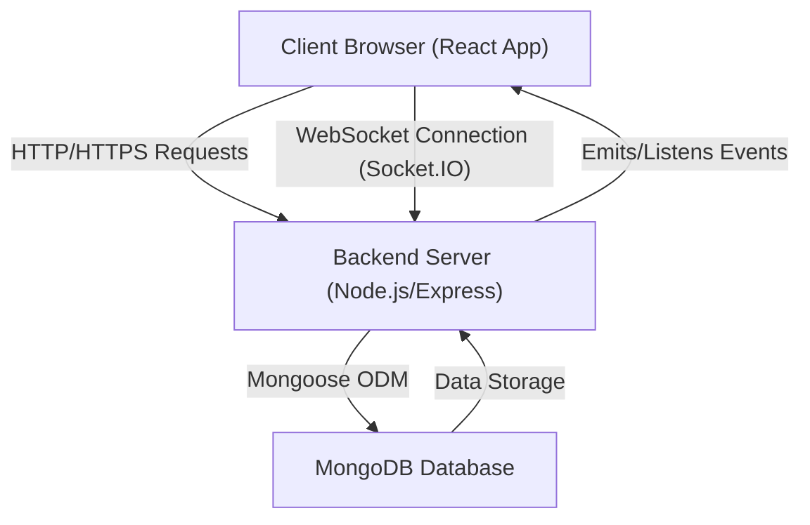

 # System Overview

Welcome to the documentation for the Chat-App-MERN project! This document provides a high-level overview of the application, outlining its purpose, core technologies, and fundamental architecture. The Chat-App-MERN is a real-time messaging application built using the MERN stack, demonstrating a modern approach to web development with a focus on robust backend services, interactive frontend experiences, and efficient data management.

The project aims to showcase the integration of MongoDB for data storage, Express.js for a flexible backend API, React for a dynamic user interface, and Node.js for scalable server-side operations. It also leverages Socket.IO for real-time communication, a critical component for any chat application.

## Project Purpose and Features

The Chat-App-MERN project serves as a comprehensive example of building a full-stack, real-time chat application. Key features include:

*   **User Authentication:** Secure user registration and login functionalities.
*   **Real-time Messaging:** Instantaneous message sending and receiving between users using WebSockets.
*   **Conversation Management:** Ability to create and view individual or group conversations.
*   **Scalable Architecture:** Designed with the MERN stack principles, allowing for modularity and scalability.

This project is inspired by and credits the tutorial available at [https://youtu.be/ntKkVrQqBYY](https://youtu.be/ntKkVrQqBYY?si=qz02jMCQ80RT1jaH).

## Core Technologies (MERN Stack)

The application is built upon the widely adopted MERN stack, complemented by essential libraries for real-time functionality.

### **MongoDB**
<p>A NoSQL database that stores data in flexible, JSON-like documents. It's well-suited for applications that need to handle large volumes of unstructured data with high performance.</p>
<p>For this project, MongoDB Atlas is typically used as a cloud-hosted database solution, simplifying database management.</p>

### **Express.js**
<p>A fast, unopinionated, minimalist web framework for Node.js. It's used to build the backend API, handling routing, middleware, and server-side logic.</p>
<p>Express powers the RESTful API endpoints for user authentication, message handling, and conversation management.</p>

### **React**
<p>A JavaScript library for building user interfaces, particularly single-page applications. React's component-based architecture allows for the creation of reusable UI elements and an efficient, reactive user experience.</p>
<p>The frontend of the Chat-App-MERN is entirely built with React, providing a dynamic and intuitive interface for users.</p>

### **Node.js**
<p>A JavaScript runtime built on Chrome's V8 JavaScript engine. Node.js allows for the execution of JavaScript code outside of a web browser, making it possible to build scalable backend services.</p>
<p>It provides the server environment for Express.js and Socket.IO, enabling non-blocking, event-driven operations.</p>

### **Socket.IO**
<p>A library that enables real-time, bidirectional, event-based communication between web clients and servers. It uses WebSockets whenever possible, and falls back to other techniques if not.</p>
<p>Socket.IO is crucial for the instant message delivery and real-time updates in the chat application.</p>

### **Overall System Architecture**

The following diagram illustrates the high-level interaction between the different components of the Chat-App-MERN application.





<br />

## Project Structure and Setup

The project follows a standard MERN stack organization, typically separating the frontend and backend into distinct directories. The `package.json` file in the root directory manages the overall project and defines scripts for building and starting the application, coordinating both frontend and backend operations.

### **Root `package.json`**

This file orchestrates the setup and execution of the entire application.

```json
{
  "name": "chatapp",
  "version": "1.0.0",
  "main": "index.js",
  "scripts": {
    "build" : "npm install --prefix backend && npm install --prefix frontend && npm run build --prefix frontend",
    "start" : "npm run start --prefix backend"
  },
  "keywords": [],
  "author": "",
  "license": "ISC",
  "description": ""
}
```
<p>
    The `scripts` section defines two crucial commands:
    <ul>
        <li>`build`: This script is responsible for setting up both the backend and frontend dependencies and then building the frontend for deployment.
            <br />[View on GitHub](https://github.com/shinymack/Chat-App-MERN/blob/main/package.json#L7)
        </li>
        <li>`start`: This script initiates the backend server, which then serves the frontend (if built) and handles API requests and WebSocket connections.
            <br />[View on GitHub](https://github.com/shinymack/Chat-App-MERN/blob/main/package.json#L8)
        </li>
    </ul>
</p>

### **`package-lock.json`**

The `package-lock.json` ensures that all dependency versions are locked down, providing consistent installations across different environments.

```json
{
  "name": "chatapp",
  "version": "1.0.0",
  "lockfileVersion": 3,
  "requires": true,
  "packages": {
    "": {
      "name": "chatapp",
      "version": "1.0.0",
      "license": "ISC"
    }
  }
}
```
<p>
    This file indicates the specific versions of all installed packages and their dependencies, making sure builds are reproducible.
    <br />[View on GitHub](https://github.com/shinymack/Chat-App-MERN/blob/main/package-lock.json#L1)
</p>

### **`README.md` (Root)**

The top-level `README.md` file provides a brief introduction and credits for the project.

```markdown
## MERN Chatapp

credits : https://youtu.be/ntKkVrQqBYY?si=qz02jMCrQ80RT1jaH
```
<p>
    This snippet from the `README.md` highlights the project title and acknowledges the tutorial it's based on.
    <br />[View on GitHub](https://github.com/shinymack/Chat-App-MERN/blob/main/README.md#L1)
</p>

## Key Integration Points

The core functionality of the Chat-App-MERN relies heavily on the seamless integration between its MERN components and Socket.IO.

1.  **Client-Server API Communication:** The React frontend communicates with the Express backend using standard HTTP requests for initial data fetching, user authentication (login/register), and other non-real-time operations. This typically involves RESTful API calls.
2.  **Real-time WebSocket Communication:** After a user logs in, the React frontend establishes a WebSocket connection with the Node.js/Express server via Socket.IO. This persistent connection is then used for sending and receiving chat messages instantly.
3.  **Database Interactions:** The Express backend uses Mongoose (an ODM for MongoDB) to interact with the MongoDB database. All user data, chat messages, and conversation details are stored and retrieved through these backend interactions.
4.  **Build and Deployment Workflow:** The root `package.json` scripts (`build`, `start`) are designed to streamline the deployment process. The `build` script ensures that both frontend and backend dependencies are installed and the React application is compiled into static assets. The `start` script then launches the Node.js server, which is typically configured to serve these static frontend assets while also providing the API and WebSocket services.

### **Build and Start Process Flow**

This diagram illustrates how the `build` and `start` scripts manage the setup and execution of the application.


```mermaid
graph TD
    A["`npm run build` (Root Script)"] -->|"Installs Backend Deps"| B["Backend `node_modules`"]
    A -->|"Installs Frontend Deps"| C["Frontend `node_modules`"]
    A -->|"Builds Frontend App"| D["Frontend Build Output (e.g., `dist` or `build`)"]
    D -.->|"Served by"| E["`npm run start` (Root Script)"]
    E -->|"Starts Backend Server"| F["Backend (Node.js/Express) Running"]
    F -->|"Handles API Requests"| G["Client (Browser)"]
    F -->|"Manages Real-time Sockets"| G
```


<br />

Next: [Backend Architecture](./2_backend-architecture.mdx)