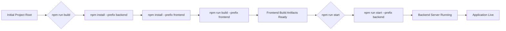

 # Introduction and Setup

This document provides a comprehensive introduction to the MERN Chat Application project, detailing its core components, architectural design, and the necessary steps to get it up and running on your local machine. Developed following a popular tutorial, this project serves as an excellent example of a full-stack MERN application.

## Project Overview

The MERN Chat Application is a real-time messaging platform built using the MERN stack: **M**ongoDB, **E**xpress.js, **R**eact.js, and **N**ode.js. It's designed to demonstrate full-stack integration, including user authentication, real-time communication via WebSockets (likely Socket.IO), and persistent data storage. The project is credited to a [YouTube tutorial](https://youtu.be/ntKkVrQqBYY?si=qz02jMCQ80jaH) that guides developers through building such an application from scratch.

### Core Technologies

The application leverages a modern web development stack to deliver a robust and scalable chat experience:

*   **Frontend:**
    *   **React:** A declarative, component-based JavaScript library for building user interfaces.
    *   **Vite:** A fast, opinionated build tool that significantly improves the frontend development experience, offering rapid hot module replacement (HMR).
    *   Plugins like [`@vitejs/plugin-react`](https://github.com/vitejs/vite-plugin-react/blob/main/packages/plugin-react/README.md) are used for Fast Refresh.
*   **Backend:**
    *   **Node.js:** A JavaScript runtime environment for server-side logic.
    *   **Express.js:** A minimal and flexible Node.js web application framework that provides a robust set of features for web and mobile applications.
    *   **MongoDB:** A NoSQL database that stores data in flexible, JSON-like documents.
*   **Real-time Communication:**
    *   Likely uses **Socket.IO** (inferred from common chat app patterns) for real-time bidirectional communication between the web client and server, enabling instant message delivery.

## Project Structure

The project is structured with a monorepo-like approach, where both the `frontend` and `backend` components reside within the same root directory. This simplifies dependency management and build processes for the entire application.

```bash
.
├── backend/                  # Node.js/Express.js server, MongoDB models, routes, controllers
├── frontend/                 # React.js application with Vite build system
├── package.json              # Root project dependencies and build/start scripts
├── package-lock.json         # Locked dependencies for the root project
├── README.md                 # Project-level overview and credits
└── ... (other config files)
```

The root `package.json` orchestrates the setup and execution of both parts of the application.

### Frontend Initialization

The `frontend` directory contains a standard React project initialized with Vite. Its `README.md` outlines the basic setup provided by Vite for React development.

```markdown
# React + Vite

This template provides a minimal setup to get React working in Vite with HMR and some ESLint rules.

Currently, two official plugins are available:

- [@vitejs/plugin-react](https://github.com/vitejs/vite-plugin-react/blob/main/packages/plugin-react/README.md) uses [Babel](https://babeljs.io/) for Fast Refresh
- [@vitejs/plugin-react-swc](https://github.com/vitejs/vite-plugin-react-swc) uses [SWC](https://swc.rs/) for Fast Refresh
```
[View `frontend/README.md` on GitHub](https://github.com/shinymack/Chat-App-MERN/blob/main/frontend/README.md)

## Initial Setup and Execution

To get the Chat-App-MERN project running locally, you primarily interact with the root `package.json` scripts. These scripts automate the installation of dependencies for both the frontend and backend, and handle the build process for the frontend before starting the backend server.

### Root `package.json` Scripts

The `package.json` file at the project root defines the main scripts for building and starting the application.

```json
{
  "name": "chatapp",
  "version": "1.0.0",
  "main": "index.js",
  "scripts": {
    "build" : "npm install --prefix backend && npm install --prefix frontend && npm run build --prefix frontend",
    "start" : "npm run start --prefix backend"
  },
  "keywords": [],
  "author": "",
  "license": "ISC",
  "description": ""
}
```
[View `package.json` on GitHub](https://github.com/shinymack/Chat-App-MERN/blob/main/package.json)

*   **`npm run build`**: This script performs a sequential installation of dependencies for both `backend` and `frontend` directories, and then triggers the frontend build process.
    *   `npm install --prefix backend`: Installs all Node.js dependencies for the backend server.
    *   `npm install --prefix frontend`: Installs all React and frontend-related dependencies.
    *   `npm run build --prefix frontend`: Executes the build command within the `frontend` directory, creating optimized static assets for the React application.
*   **`npm run start`**: This script is responsible for starting the backend server.
    *   `npm run start --prefix backend`: Executes the start command defined in the `backend/package.json`, which typically launches the Node.js/Express server.

### Step-by-Step Guide

Follow these steps to set up and run the application:

1.  **Clone the Repository:**
    First, clone the project repository to your local machine:
    ```bash
    git clone https://github.com/shinymack/Chat-App-MERN.git
    cd Chat-App-MERN
    ```

2.  **Install Global Dependencies (if needed):**
    Ensure you have Node.js and npm installed. You might also need `npx` for certain operations.

3.  **Run the Build Script:**
    This command will install all necessary dependencies for both the frontend and backend, and then build the React application for production.
    ```bash
    npm run build
    ```
    This step effectively runs:
    ```bash
    npm install --prefix backend
    npm install --prefix frontend
    npm run build --prefix frontend
    ```

4.  **Start the Application:**
    Once the build is complete, you can start the backend server, which will then serve the built frontend assets.
    ```bash
    npm run start
    ```
    This step effectively runs:
    ```bash
    npm run start --prefix backend
    ```

After these steps, the backend server should be running, and you should be able to access the chat application in your web browser, typically at `http://localhost:5000` (or whatever port the backend is configured to use).

## Architectural Overview

The application follows a client-server architecture, typical of MERN stack applications. The frontend (React) communicates with the backend (Express/Node.js) via RESTful APIs and WebSockets for real-time features. The backend, in turn, interacts with the MongoDB database for data persistence.


```mermaid
graph TD
    A["User"] --> B["Frontend (React/Vite)"]
    B --> C["Backend (Node.js/Express.js)"]
    C --> D["Database (MongoDB)"]
    B -- "REST API Calls" --> C
    B -- "WebSocket Communication" -->|"Real-time Chat"| C
    C -- "Data Storage/Retrieval" --> D
```


This diagram illustrates the flow of interaction from the user, through the React frontend, to the Node.js/Express.js backend, and finally to the MongoDB database. Real-time features are enabled via WebSocket communication between the frontend and backend.

## Key Integration Points

The `package.json` scripts are the central integration point for managing the monorepo-style project. They ensure that both the frontend and backend environments are correctly set up and executed.





This flow outlines the automated steps performed by the root-level `build` and `start` scripts. The `build` script ensures that all necessary dependencies are installed for both components and that the frontend is compiled into static assets. The `start` script then activates the backend server, which typically serves these frontend assets and handles all API and WebSocket traffic. This streamlined process simplifies the deployment and local development setup.