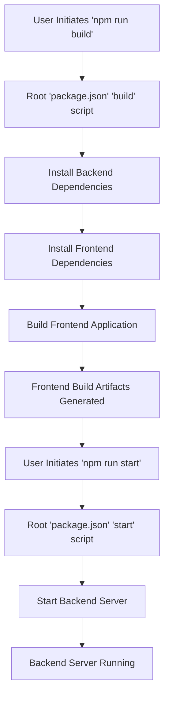
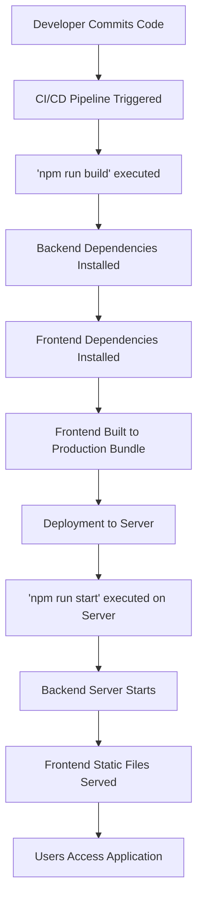

 # Introduction and Setup

This document provides a comprehensive overview and initial setup guide for the MERN Chatapp project. This application leverages the power of the MERN stack (MongoDB, Express.js, React, Node.js) to deliver a real-time chat experience. The project is based on a tutorial by [Code With Duru](https://youtu.be/ntKkVrQqBYY?si=qz02jMCQ80jaH).

## Project Overview

The MERN Chatapp is a full-stack application designed for real-time communication. It features a React-based frontend providing a dynamic user interface, an Express.js and Node.js backend for API handling and business logic, and MongoDB for persistent data storage.

### Core Technologies

*   **MongoDB**: NoSQL database for flexible data storage.
*   **Express.js**: Web application framework for Node.js, handling routing and API endpoints.
*   **React**: Frontend library for building interactive user interfaces.
*   **Node.js**: JavaScript runtime environment for the backend.
*   **Vite**: Fast development build tool for the frontend.

## Getting Started

To set up the MERN Chatapp project locally, follow these steps. This guide assumes you have Node.js and npm (or Yarn) installed on your system.

### Initial Project Structure

The project is structured with a `backend` directory (not explicitly shown in the provided `package.json` but inferred from `npm install --prefix backend`) and a `frontend` directory. The root `package.json` orchestrates the build and start processes for both.

### Frontend Initialization

The frontend is built with React and Vite, offering a streamlined development experience. It comes with standard configurations for development and build processes.

```jsx
// frontend/README.md - Excerpt
# React + Vite

This template provides a minimal setup to get React working in Vite with HMR and some ESLint rules.

Currently, two official plugins are available:

- [@vitejs/plugin-react](https://github.com/vitejs/vite-plugin-react/blob/main/packages/plugin-react/README.md) uses [Babel](https://babeljs.io/) for Fast Refresh
- [@vitejs/plugin-react-swc](https://github.com/vitejs/plugin-react-swc) uses [SWC](https://swc.rs/) for Fast Refresh
```
[View on GitHub](https://github.com/shinymack/Chat-App-MERN/blob/main/frontend/README.md)

### Root `package.json` Scripts

The main `package.json` located in the project root defines scripts to manage both the backend and frontend components.

```json
// package.json - Project root
{
  "name": "chatapp",
  "version": "1.0.0",
  "main": "index.js",
  "scripts": {
    "build" : "npm install --prefix backend && npm install --prefix frontend && npm run build --prefix frontend",
    "start" : "npm run start --prefix backend"
  },
  "keywords": [],
  "author": "",
  "license": "ISC",
  "description": ""
}
```
[View on GitHub](https://github.com/shinymack/Chat-App-MERN/blob/main/package.json)

The `build` script handles the installation of dependencies for both `backend` and `frontend` directories, and then triggers the `build` script within the `frontend` directory.
The `start` script initiates the backend application.

### Understanding `package-lock.json`

The `package-lock.json` ensures consistent dependency installations across different environments by locking the exact versions of all packages in the dependency tree.

```json
// package-lock.json - Project root
{
  "name": "chatapp",
  "version": "1.0.0",
  "lockfileVersion": 3,
  "requires": true,
  "packages": {
    "": {
      "name": "chatapp",
      "version": "1.0.0",
      "license": "ISC"
    }
  }
}
```
[View on GitHub](https://github.com/shinymack/Chat-App-MERN/blob/main/package-lock.json)

This file indicates that the root project `chatapp` itself has no direct dependencies listed in its `package.json`, as dependency management is delegated to the `backend` and `frontend` sub-projects via the `npm install --prefix` commands.

### Installation and Build Steps

To prepare the project for development and deployment, execute the following command in the project's root directory:

```bash
npm run build
```

This single command performs several critical steps:

1.  **Installs Backend Dependencies**: `npm install --prefix backend`
    *   This command navigates into the `backend` directory and installs all dependencies listed in its `package.json`.
2.  **Installs Frontend Dependencies**: `npm install --prefix frontend`
    *   Similarly, this installs all packages required for the React application in the `frontend` directory.
3.  **Builds Frontend Application**: `npm run build --prefix frontend`
    *   This executes the `build` script defined in the `frontend/package.json`, typically bundling the React application for production.

### Starting the Application

After a successful build, you can start the backend server using the following command:

```bash
npm run start
```

This command executes `npm run start --prefix backend`, which will typically run the Node.js server, making the API available for the frontend.

### Project Flow Overview

Here's a high-level view of the interaction between the root project scripts and its sub-projects:





## Key Integration Points

The project design relies heavily on npm's ability to run scripts in sub-directories using the `--prefix` flag. This allows for a monorepo-like structure where the root `package.json` acts as an orchestrator for the `backend` and `frontend` components.

### Build Process Orchestration

The `build` script is a crucial integration point. It ensures that both the backend and frontend are set up correctly and the frontend is ready for deployment.

```bash
# Script from root package.json
npm install --prefix backend && npm install --prefix frontend && npm run build --prefix frontend
```
This sequence ensures that all dependencies are satisfied before attempting to build the frontend. The `&&` operator guarantees that each step must succeed before the next one is executed.

### Runtime Integration

The `start` script focuses solely on bringing up the backend. It's implied that once the backend is running, the frontend (after being built and possibly served by a separate web server or integrated into the backend serving static files) will communicate with it.

```bash
# Script from root package.json
npm run start --prefix backend
```

This demonstrates a clean separation of concerns: the root script handles the lifecycle of its sub-components without delving into their internal implementation details.

### Application Deployment Flow

When deploying the application, the `npm run build` command would typically be executed in the CI/CD pipeline, followed by `npm run start` to launch the application. The frontend's build artifacts (e.g., a `dist` folder) would then be served, potentially by the backend's Express server or a dedicated static file server.





This structured approach ensures that the project is maintainable and scalable, allowing for independent development within the `backend` and `frontend` directories while providing unified control from the root.