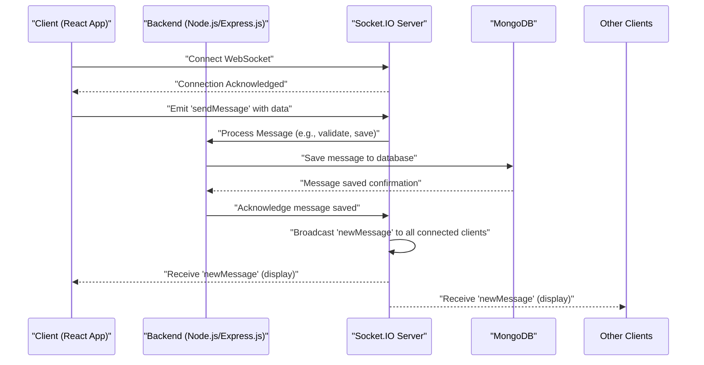

 # Introduction and Setup

The Chat-App-MERN project is a full-stack real-time chat application built using the MERN (MongoDB, Express.js, React, Node.js) stack. It aims to provide a robust platform for user interaction through real-time messaging, incorporating features like user authentication, persistent data storage, and potentially multimedia sharing via Cloudinary.

This document serves as a high-level overview, guiding you through the project's architecture, core technologies, and initial setup instructions to get the application running in your local development environment.

## Project Purpose and Features

The primary purpose of the Chat-App-MERN application is to demonstrate a modern, scalable approach to building real-time communication platforms. Key features and capabilities include:

*   **Real-time Messaging**: Instantaneous message exchange between users powered by Socket.IO.
*   **User Authentication**: Secure user registration and login, likely supporting both traditional email/password and third-party authentication (e.g., Google OAuth20).
*   **User Management**: Profiles, potentially including avatar uploads using Cloudinary.
*   **Persistent Storage**: Message history and user data managed by MongoDB.
*   **Scalable Backend**: Express.js and Node.js provide a robust API layer.
*   **Responsive Frontend**: A dynamic user interface built with React.

This project is inspired by and credits [this tutorial](https://youtu.be/ntKkVrQqBYY?si=sc0mKkVrQqBYY).

## Core Technologies and Stack

The Chat-App-MERN project leverages a comprehensive set of technologies across its frontend and backend components.

### Backend (Node.js & Express.js)

The backend is built with Node.js and Express.js, providing the RESTful API and handling WebSocket connections for real-time communication.

*   **Express.js**: Web framework for handling HTTP requests and routing.
*   **MongoDB**: NoSQL database for storing user data, messages, and other application-related information.
*   **Mongoose**: ODM (Object Data Modeling) library for MongoDB, simplifying data interaction.
*   **Socket.IO**: Enables real-time, bidirectional communication between web clients and the server.
*   **Authentication**: `bcryptjs` for password hashing, `jsonwebtoken` for token-based authentication, `passport` and `passport-google-oauth20` for Google OAuth integration.
*   **Cloudinary**: For cloud-based image and video management, likely used for user avatars or media sharing.
*   **dotenv**: Environment variable management.
*   **cookie-parser**: Parses Cookie header and populates `req.cookies`.
*   **nodemon**: Development tool for automatic server restarts on file changes.

### Frontend (React)

While specific frontend files are not provided in this context, the `package.json` scripts indicate a frontend component, which is typically built with React in a MERN stack.

### Overall System Architecture

The application follows a client-server architecture, typical of MERN applications, with a clear separation of concerns between the frontend UI and the backend API and real-time services.


```mermaid
graph TD
    A["Frontend (React.js)"]
    B["Backend (Node.js/Express.js)"]
    C["MongoDB Database"]
    D["Socket.IO Server"]
    E["Cloudinary Service"]
    F["Authentication (Passport.js)"]

    A --> B: "HTTP API Requests"
    A --> D: "WebSocket Connection"
    B --> C: "Database Operations"
    B --> E: "Media Upload/Storage"
    B --> F: "User Authentication"
    F --> C: "User Data Storage"
    D -.-> A: "Real-time Updates"
```


The diagram illustrates how the frontend interacts with the backend for API calls and with the Socket.IO server for real-time features. The backend, in turn, manages data persistence with MongoDB, handles user authentication, and integrates with Cloudinary for media assets.

## Initial Setup Instructions

To get the Chat-App-MERN project up and running locally, follow these steps.

### Prerequisites

Before proceeding, ensure you have the following installed on your system:

*   **Node.js**: Version 14 or higher (LTS recommended).
*   **npm**: Node Package Manager (comes with Node.js).
*   **MongoDB**: A running instance (local or cloud-hosted).
*   **Git**: For cloning the repository.

### 1. Clone the Repository

Start by cloning the project repository from GitHub:

```bash
git clone https://github.com/shinymack/Chat-App-MERN.git
cd Chat-App-MERN
```

### 2. Install Dependencies

The project uses a monorepo-like structure where the root `package.json` orchestrates the installation and building of both frontend and backend dependencies. The `build` script is designed to handle this:

```json
// Root package.json
{
  "name": "chatapp",
  "version": "1.0.0",
  "main": "index.js",
  "scripts": {
    "build" : "npm install --prefix backend && npm install --prefix frontend && npm run build --prefix frontend",
    "start" : "npm run start --prefix backend"
  },
  // ...
}
```
[View on GitHub](https://github.com/shinymack/Chat-App-MERN/blob/main/package.json#L5-L9)

Execute the `build` script from the root directory:

```bash
npm run build
```

This command performs the following actions:
*   `npm install --prefix backend`: Installs all dependencies listed in `backend/package.json`.
*   `npm install --prefix frontend`: Installs all dependencies for the frontend (assuming a `frontend` directory with its own `package.json`).
*   `npm run build --prefix frontend`: Executes the `build` script within the `frontend` directory, which typically compiles the React application into static assets.

### 3. Configure Environment Variables

The backend relies on environment variables for sensitive information like database connection strings, JWT secrets, and Cloudinary credentials. Create a `.env` file in the `backend/` directory based on an example (if provided in the repository) or the expected variables.

Common variables you might need:

*   `MONGO_URI=mongodb://localhost:27017/chatapp`
*   `JWT_SECRET=your_jwt_secret_key`
*   `CLOUDINARY_CLOUD_NAME=your_cloud_name`
*   `CLOUDINARY_API_KEY=your_api_key`
*   `CLOUDINARY_API_SECRET=your_api_secret`
*   `GOOGLE_CLIENT_ID=your_google_client_id`
*   `GOOGLE_CLIENT_SECRET=your_google_client_secret`

The `dotenv` package handles loading these variables:

```json
// backend/package.json dependencies
{
  "dependencies": {
    // ...
    "dotenv": "^16.4.7",
    // ...
  }
}
```
[View on GitHub](https://github.com/shinymack/Chat-App-MERN/blob/main/backend/package.json#L17)

### 4. Start the Application

After installing dependencies and configuring environment variables, you can start the backend server. The root `package.json` provides a convenient `start` script:

```bash
npm start
```

This command executes `npm run start --prefix backend`, which, according to `backend/package.json`, runs `node src/index.js` in a production environment:

```json
// backend/package.json scripts
{
  "scripts": {
    "dev": "nodemon src/index.js",
    "start": "node src/index.js"
  },
  // ...
}
```
[View on GitHub](https://github.com/shinymack/Chat-App-MERN/blob/main/backend/package.json#L5-L8)

For development with automatic restarts, you can navigate into the `backend` directory and run:

```bash
cd backend
npm run dev
```

This uses `nodemon` to watch for file changes and restart the server, which is very useful during development.

## Key Integration Points

Understanding how different parts of the application interact is crucial for further development or debugging.

### Real-time Communication Flow

The core of the chat application is its real-time messaging capability, orchestrated by Socket.IO.





1.  **Client Connects**: The React frontend establishes a WebSocket connection with the Socket.IO server.
2.  **Send Message**: A user types a message and clicks send, emitting a `'sendMessage'` event to the server.
3.  **Server Processing**: The Socket.IO server on the backend receives the message, potentially passes it to an Express route handler or a dedicated Socket.IO handler to validate, process, and persist it.
4.  **Database Storage**: The message is saved to MongoDB.
5.  **Broadcast**: Once saved, the Socket.IO server broadcasts a `'newMessage'` event to all relevant connected clients (e.g., clients in the same chat room), containing the new message data.
6.  **Client Update**: Receiving clients update their UI to display the new message in real-time.

This sequence ensures messages are both instantly delivered and persistently stored.

### Authentication Strategy

The backend's `passport` and `passport-google-oauth20` dependencies suggest a robust authentication system that supports both local (username/password) and third-party (Google OAuth) login mechanisms. `jsonwebtoken` would then be used to manage session tokens after successful authentication.

### Database Schema (High-Level)

While specific schemas are not provided, typical chat applications involve at least two core models in MongoDB:

*   **User Model**: Stores user details (username, email, password hash, avatar URL, Google ID if applicable).
*   **Message Model**: Stores message content, sender ID, receiver/chat room ID, timestamp.

Additional models for `Conversation` or `ChatRoom` would link users and their messages within specific contexts. These models are defined using Mongoose schemas in the backend.