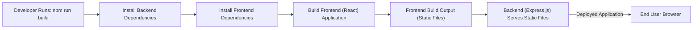

 # Introduction and Project Setup

This document provides a comprehensive overview of the `Chat-App-MERN` project, detailing its purpose, core technologies, and initial setup procedures. The project aims to deliver a real-time chat application built with the MERN (MongoDB, Express.js, React, Node.js) stack, demonstrating fundamental full-stack development principles including user authentication, real-time communication via WebSockets, and database management.

The provided source code serves as a practical example for understanding how these technologies integrate to form a cohesive, interactive web application.

## Project Overview and Core Features

The `Chat-App-MERN` is a full-stack application designed to facilitate real-time messaging between users. It leverages modern web technologies to provide a responsive and interactive user experience.

**Key Features:**

*   **User Authentication:** Secure user registration and login functionality.
*   **Real-time Messaging:** Instant message delivery between users using WebSockets.
*   **User Management:** Ability to view and manage active chat participants.
*   **Scalable Architecture:** A modular MERN stack design allowing for future expansion.

This project is a valuable resource for developers looking to understand the mechanics of MERN stack applications, particularly those involving real-time communication.

## Core Technologies

The `Chat-App-MERN` project is built upon the following technologies:

*   **MongoDB:** A NoSQL database for flexible data storage.
*   **Express.js:** A robust web application framework for Node.js, forming the backend API.
*   **React:** A JavaScript library for building user interfaces, handling the frontend.
*   **Node.js:** A JavaScript runtime environment, powering the backend.
*   **Socket.io:** A library enabling real-time, bidirectional, event-based communication.

Understanding the interaction between these components is crucial for comprehending the application's overall functionality.

## Project Structure and Setup

The project is structured into `backend` and `frontend` directories, each containing its own `package.json` for managing dependencies. This clear separation promotes modularity and maintainability.

### Initial Setup Steps

To get the `Chat-App-MERN` project up and running locally, you'll need to perform a few initial setup steps. These involve installing dependencies for both the frontend and backend parts of the application.

1.  **Clone the Repository:**
    First, clone the project repository to your local machine:
    ```bash
    git clone https://github.com/shinymack/Chat-App-MERN.git
    cd Chat-App-MERN
    ```

2.  **Install Dependencies:**
    The project's root `package.json` includes a convenient `build` script that handles installing dependencies for both backend and frontend, and then builds the frontend.

    ```bash
    npm run build
    ```
    This command executes: `npm install --prefix backend && npm install --prefix frontend && npm run build --prefix frontend`. Let's break down what each part does:
    *   `npm install --prefix backend`: Navigates into the `backend` directory and installs its specific dependencies.
    *   `npm install --prefix frontend`: Navigates into the `frontend` directory and installs its specific dependencies.
    *   `npm run build --prefix frontend`: Navigates into the `frontend` directory and executes its `build` script, typically compiling the React application for production.

3.  **Start the Backend Server:**
    Once dependencies are installed and the frontend is built, you can start the backend server. The root `package.json` also provides a `start` script for this.

    ```bash
    npm start
    ```
    This command executes: `npm run start --prefix backend`, which starts the Node.js server defined in the `backend` directory.

4.  **Environment Variables:**
    Ensure you have an `.env` file in your `backend` directory with necessary environment variables, such as `MONGO_DB_URI` for your MongoDB connection string and `JWT_SECRET` for authentication. A `.env.example` file is usually provided in the backend for reference.

### `package.json` Analysis

The `package.json` file at the root of the project defines core metadata and scripts for managing the application.

```json
{
  "name": "chatapp",
  "version": "1.0.0",
  "main": "index.js",
  "scripts": {
    "build" : "npm install --prefix backend && npm install --prefix frontend && npm run build --prefix frontend",
    "start" : "npm run start --prefix backend"
  },
  "keywords": [],
  "author": "",
  "license": "ISC",
  "description": ""
}
```
[View on GitHub](https://github.com/shinymack/Chat-App-MERN/blob/main/package.json)

*   **`name`: "chatapp"**: The name of the project.
*   **`version`: "1.0.0"**: The current version of the project.
*   **`main`: "index.js"**: Specifies the entry point of the application, although in this context, it's less critical as scripts handle starting specific parts.
*   **`scripts`**: This object defines command-line scripts.
    *   **`build`**: This script orchestrates the setup process. It first installs dependencies for both the `backend` and `frontend` sub-projects and then runs the `build` script defined within the `frontend`'s `package.json`. This is a common pattern for MERN apps to prepare the entire application for deployment or local development.
    *   **`start`**: This script starts the backend server by executing the `start` script defined in the `backend`'s `package.json`. This implies the backend is the primary entry point for serving the application.

This root `package.json` centralizes the build and start commands, making it easier to manage the entire monorepo-style project from a single entry point.

### `package-lock.json` Analysis

The `package-lock.json` file records the exact version of every dependency (and its dependencies) that was installed. This ensures that anyone installing the project will get the exact same dependency tree, preventing potential version conflicts and ensuring consistent builds across different environments.

```json
{
  "name": "chatapp",
  "version": "1.0.0",
  "lockfileVersion": 3,
  "requires": true,
  "packages": {
    "": {
      "name": "chatapp",
      "version": "1.0.0",
      "license": "ISC"
    }
  }
}
```
[View on GitHub](https://github.com/shinymack/Chat-App-MERN/blob/main/package-lock.json)

*   **`name`: "chatapp"**, **`version`: "1.0.0"**: Matches the root `package.json`.
*   **`lockfileVersion`: 3**: Indicates the version of the lockfile format. `v3` is the latest and offers improved performance and security.
*   **`requires`: true**: This field typically indicates that the `requires` array should be present in the `package.json`, but in `package-lock.json` it often signals historical context or default behavior.
*   **`packages`**: This section contains detailed information about each installed package.
    *   `"": {...}`: This refers to the root project itself. The `package-lock.json` for the main project often only lists its own details if it doesn't have direct dependencies in its `package.json`. The actual lock files for `backend` and `frontend` would be located within those respective directories and would contain extensive lists of their specific dependencies.

### `README.md` Initial Content

The `README.md` file provides initial documentation for the project.

```markdown
## MERN Chatapp

credits : https://youtu.be/ntKkVrQqBYY?si=qz02jMCQ80RT1jaH
```
[View on GitHub](https://github.com/shinymack/Chat-App-MERN/blob/main/README.md)

*   **`## MERN Chatapp`**: The main title of the project.
*   **`credits : https://youtu.be/ntKkVrQqBYY?si=qz02jMCQ80RT1jaH`**: An important attribution, indicating that this project might be based on or inspired by a tutorial. This is a crucial piece of information for understanding the project's origins and potentially finding more in-depth explanations of its various components.

## Application Architecture Flow

Understanding how the different parts of the MERN stack interact is fundamental. The following diagram illustrates the typical request-response and real-time communication flow in the `Chat-App-MERN`.


```mermaid
graph TD
    A["Frontend (React App)"] -- "1. HTTP Request (Login/Register)" --> B["Backend (Express.js/Node.js)"]
    B -- "2. Auth Check & Data Processing" --> C["MongoDB Database"]
    C -- "3. Store/Retrieve Data" --> B
    B -- "4. HTTP Response (Token/User Data)" --> A
    A -- "5. Establish WebSocket Connection" --> B|"Socket.IO Server"|
    A -- "6. Emit 'sendMessage' Event" --> B
    B -- "7. Process Message & Emit 'newMessage' Event" --> A
    B -- "8. Store Message" --> C
```


This diagram illustrates:
1.  **Frontend to Backend HTTP Request:** User actions like login or registration initiate standard HTTP requests from the React frontend to the Express.js backend.
2.  **Backend Processing:** The backend handles authentication, validation, and business logic.
3.  **Database Interaction:** Data is stored in or retrieved from MongoDB by the backend.
4.  **Backend to Frontend HTTP Response:** The backend sends back an HTTP response, typically containing a JWT token for authentication or user-specific data.
5.  **WebSocket Connection:** After successful authentication, the frontend establishes a persistent WebSocket connection (using Socket.IO) with the backend for real-time communication.
6.  **Real-time Event Emission:** When a user sends a message, the frontend emits a `sendMessage` event over the WebSocket.
7.  **Backend Real-time Processing:** The backend receives the message, processes it (e.g., adds timestamps, validates sender), and then broadcasts a `newMessage` event to all relevant connected clients.
8.  **Real-time Database Storage:** Messages are also persisted in the MongoDB database for historical record.

## Key Integration Points

The successful operation of the `Chat-App-MERN` hinges on several critical integration points between its components.

### Frontend-Backend Communication

The interaction between the React frontend and the Express.js backend occurs in two primary ways:

1.  **RESTful API Calls:** For initial data fetching, user authentication, and profile management, the frontend makes standard HTTP requests (GET, POST, PUT, DELETE) to specific API endpoints exposed by the backend. Libraries like `axios` are commonly used for this.
    ```javascript
    // Example: Frontend login request (conceptual snippet)
    // frontend/src/services/authService.js
    import axios from 'axios';

    const API_URL = 'http://localhost:5000/api/auth/'; // Example backend API URL

    const login = async (username, password) => {
      const response = await axios.post(API_URL + 'login', { username, password });
      if (response.data.token) {
        localStorage.setItem('user', JSON.stringify(response.data));
      }
      return response.data;
    };

    export default { login };
    ```
    This snippet demonstrates a typical POST request to a login endpoint. The backend would then handle authentication and return a token.

2.  **WebSocket (Socket.IO) Communication:** For real-time messaging, Socket.IO is the backbone. After a user logs in, the frontend establishes a WebSocket connection, allowing bidirectional event-based communication.
    ```javascript
    // Example: Frontend Socket.IO connection and event handling (conceptual snippet)
    // frontend/src/context/SocketContext.jsx
    import React, { createContext, useContext, useEffect, useState } from "react";
    import io from "socket.io-client";

    const SocketContext = createContext();

    export const SocketProvider = ({ children }) => {
      const [socket, setSocket] = useState(null);

      useEffect(() => {
        const newSocket = io("http://localhost:5000", { // Connect to backend Socket.IO server
          query: {
            userId: "someUserIdFromAuth", // Pass user ID after authentication
          },
        });
        setSocket(newSocket);

        return () => newSocket.close(); // Clean up on component unmount
      }, []);

      return (
        <SocketContext.Provider value={socket}>
          {children}
        </SocketContext.Provider>
      );
    };
    ```
    [View on GitHub - Potential File](https://github.com/shinymack/Chat-App-MERN/blob/main/frontend/src/context/SocketContext.jsx) (Actual path might vary)

    This setup ensures that once a user is authenticated, they can participate in real-time chat without needing to constantly poll the server.

### Backend-Database Interaction

The Express.js backend interacts with the MongoDB database using an Object Data Modeling (ODM) library like Mongoose. Mongoose simplifies database operations by providing a schema-based solution to model application data.

```javascript
// Example: Backend user model (conceptual snippet)
// backend/models/user.model.js
import mongoose from 'mongoose';

const userSchema = new mongoose.Schema({
  username: {
    type: String,
    required: true,
    unique: true
  },
  password: {
    type: String,
    required: true
  },
  profilePic: {
    type: String,
    default: ""
  }
}, { timestamps: true });

const User = mongoose.model('User', userSchema);
export default User;
```
[View on GitHub - Potential File](https://github.com/shinymack/Chat-App-MERN/blob/main/backend/models/user.model.js) (Actual path might vary)

This schema defines the structure for `User` documents in the MongoDB collection, including validation rules (`required: true`, `unique: true`). The `timestamps: true` option automatically adds `createdAt` and `updatedAt` fields.

```javascript
// Example: Backend message controller saving a message (conceptual snippet)
// backend/controllers/message.controller.js
import Conversation from '../models/conversation.model.js';
import Message from '../models/message.model.js';
import { getReceiverSocketId, io } from '../socket/socket.js';

export const sendMessage = async (req, res) => {
  try {
    const { message } = req.body;
    const { id: receiverId } = req.params;
    const senderId = req.user._id;

    let conversation = await Conversation.findOne({
      participants: { $all: [senderId, receiverId] },
    });

    if (!conversation) {
      conversation = await Conversation.create({
        participants: [senderId, receiverId],
      });
    }

    const newMessage = new Message({
      senderId,
      receiverId,
      message,
    });

    if (newMessage) {
      conversation.messages.push(newMessage._id);
    }

    // This will run in parallel
    await Promise.all([conversation.save(), newMessage.save()]);

    // SOCKET.IO functionality will go here
    const receiverSocketId = getReceiverSocketId(receiverId);
    if (receiverSocketId) {
      // io.to(<socket_id>).emit() used to send events to specific client
      io.to(receiverSocketId).emit("newMessage", newMessage);
    }

    res.status(201).json(newMessage);
  } catch (error) {
    console.log("Error in sendMessage controller: ", error.message);
    res.status(500).json({ error: "Internal server error" });
  }
};
```
[View on GitHub - Potential File](https://github.com/shinymack/Chat-App-MERN/blob/main/backend/controllers/message.controller.js) (Actual path might vary)

This snippet demonstrates a message being saved. It finds or creates a conversation, adds the new message to it, saves both the conversation and message to MongoDB, and then uses Socket.IO to emit the new message in real-time to the receiver.

### Build and Deployment Process

The `build` script in the root `package.json` is crucial for preparing the application. It ensures that all dependencies are installed and the React frontend is compiled into static assets. These static assets can then be served by the Node.js backend or a separate web server (like Nginx).





This flow illustrates how the build process prepares the application for deployment. The `npm run build` command orchestrates the installation of dependencies and the compilation of the React frontend into static HTML, CSS, and JavaScript files. These static files are then typically served by the Express.js backend when the application is deployed, providing a single point of entry for the end-user.

This project provides a solid foundation for understanding the full lifecycle of a MERN stack application, from initial setup to real-time communication.