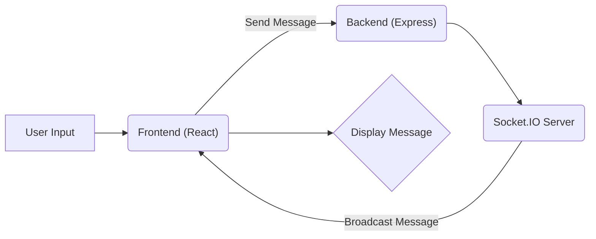
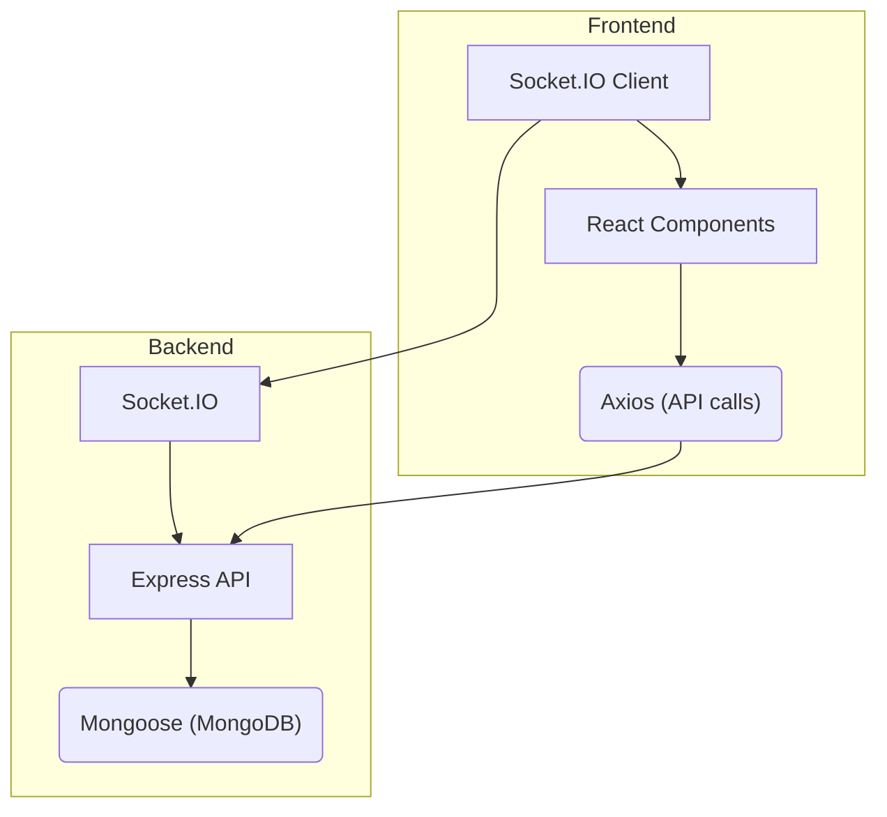

# Project Overview

The Chat-App-MERN project is a full-stack web application built using the MERN stack (MongoDB, Express.js, React.js, and Node.js). It provides real-time chat functionality, allowing users to communicate with each other in a seamless and efficient manner. This project serves as a practical example of how to build a modern web application using popular JavaScript technologies. The project's structure is divided into two main parts: the backend, which handles data storage and API endpoints, and the frontend, which provides the user interface and interacts with the backend.

## Key Features

*   **Real-time Chat:** Enables instant messaging between users using Socket.IO.
*   **User Authentication:** Secure user registration and login using bcryptjs and JWT.
*   **Database Integration:** Utilizes MongoDB for storing user data and chat messages.
*   **RESTful API:** Backend exposes RESTful API endpoints for frontend interaction.
*   **Modern UI:** Implemented with React and styled using Tailwind CSS and DaisyUI.

## Technology Stack

| Technology   | Description                                                                   |
| :----------- | :---------------------------------------------------------------------------- |
| MongoDB      | NoSQL database for storing user data and chat messages.                        |
| Express.js   | Web application framework for building the backend API.                       |
| React.js     | JavaScript library for building the user interface.                           |
| Node.js      | JavaScript runtime environment for running the backend server.                |
| Socket.IO    | Library for enabling real-time, bidirectional communication between clients and server. |
| bcryptjs     | Library for hashing passwords securely.                                        |
| JSON Web Token (JWT) | Standard for securely transmitting information between parties as a JSON object. |
| Tailwind CSS | Utility-first CSS framework for styling the frontend.                        |
| DaisyUI      | Component library for Tailwind CSS, providing pre-built UI elements.          |

## Backend Structure

The backend is built using Node.js and Express.js, providing RESTful API endpoints for user authentication, message handling, and real-time communication. It uses MongoDB as the database.

```json title="backend/package.json"
{
  "name": "backend",
  "version": "1.0.0",
  "main": "src/index.js",
  "scripts": {
    "dev": "nodemon src/index.js",
    "start": "node src/index.js"
  },
  "dependencies": {
    "bcryptjs": "^2.4.3",
    "cloudinary": "^2.5.1",
    "cookie-parser": "^1.4.7",
    "dotenv": "^16.4.7",
    "express": "^4.21.2",
    "express-session": "^1.18.1",
    "jsonwebtoken": "^9.0.2",
    "mongoose": "^8.9.5",
    "passport": "^0.7.0",
    "passport-google-oauth20": "^2.0.0",
    "socket.io": "^4.8.1"
  },
  "devDependencies": {
    "nodemon": "^3.1.9"
  }
}
```

[View on GitHub](https://github.com/shinymack/Chat-App-MERN/blob/main/backend/package.json)

This `package.json` file defines the dependencies and scripts for the backend application. It includes libraries like `express`, `mongoose`, `bcryptjs`, `jsonwebtoken`, and `socket.io`, which are essential for building the backend functionality. The `dev` script uses `nodemon` to automatically restart the server during development.

## Frontend Structure

The frontend is built using React.js, providing a user-friendly interface for interacting with the chat application. It uses Axios for making HTTP requests to the backend and Socket.IO for real-time communication.

```json title="frontend/package.json"
{
  "name": "frontend",
  "private": true,
  "version": "0.0.0",
  "type": "module",
  "scripts": {
    "dev": "vite",
    "build": "vite build",
    "lint": "eslint ."
  },
  "dependencies": {
    "axios": "^1.7.9",
    "cors": "^2.8.5",
    "lucide-react": "^0.471.1",
    "react": "^18.3.1",
    "react-dom": "^18.3.1",
    "react-hot-toast": "^2.5.1",
    "react-icons": "^5.5.0",
    "react-router-dom": "^7.1.1",
    "socket.io-client": "^4.8.1",
    "zustand": "^5.0.3"
  },
  "devDependencies": {
    "@vitejs/plugin-react": "^4.3.4",
    "autoprefixer": "^10.4.20",
    "daisyui": "^4.12.23",
    "eslint": "^9.17.0",
    "postcss": "^8.5.0",
    "tailwindcss": "^3.4.17",
    "vite": "^6.3.5"
  }
}
```

[View on GitHub](https://github.com/shinymack/Chat-App-MERN/blob/main/frontend/package.json)

This `package.json` file defines the dependencies and scripts for the frontend application. It includes libraries like `react`, `react-dom`, `axios`, `socket.io-client`, `tailwindcss`, and `daisyui`. The `dev` script uses `vite` to start the development server, providing hot module replacement for a better development experience.

## Project Setup

The root `package.json` provides scripts to install dependencies for both the frontend and backend, and to start the backend server.

```json title="package.json"
{
  "name": "chatapp",
  "version": "1.0.0",
  "main": "index.js",
  "scripts": {
    "build" : "npm install --prefix backend && npm install --prefix frontend && npm run build --prefix frontend",
    "start" : "npm run start --prefix backend"
  },
  "keywords": [],
  "author": "",
  "license": "ISC",
  "description": ""
}
```

[View on GitHub](https://github.com/shinymack/Chat-App-MERN/blob/main/package.json)

This file helps streamline the setup and deployment process by providing convenient commands to install the necessary dependencies and start the backend server.

## Authentication Flow

The backend handles user authentication using bcryptjs for password hashing and JWT for creating secure tokens.

```javascript title="Backend Authentication Route"
// Example: Backend route for user login (conceptual)
app.post('/api/login', async (req, res) => {
  const { email, password } = req.body;
  const user = await User.findOne({ email });

  if (!user) {
    return res.status(400).json({ message: 'Invalid credentials' });
  }

  const isPasswordValid = await bcrypt.compare(password, user.password);

  if (!isPasswordValid) {
    return res.status(400).json({ message: 'Invalid credentials' });
  }

  const token = jwt.sign({ userId: user._id }, process.env.JWT_SECRET, {
    expiresIn: '1h',
  });

  res.json({ token });
});
```

[View on GitHub](https://github.com/shinymack/Chat-App-MERN/blob/main/backend/src/index.js) This snippet is a conceptual example; refer to the actual authentication routes in the `backend/src/routes` directory.

This example demonstrates how user credentials are verified and a JWT token is generated upon successful login. The token is then sent back to the client for subsequent authenticated requests.

## Real-time Communication with Socket.IO

Socket.IO is used to enable real-time communication between users. The server listens for incoming connections and emits events to connected clients.

```javascript title="Backend Socket.IO Setup"
// Example: Backend Socket.IO setup (conceptual)
import { Server } from "socket.io";

const io = new Server(server, {
  cors: {
    origin: "http://localhost:5173", // Replace with your frontend URL
    methods: ["GET", "POST"]
  }
});

io.on('connection', (socket) => {
  console.log('A user connected');

  socket.on('disconnect', () => {
    console.log('A user disconnected');
  });

  socket.on('chat message', (msg) => {
    io.emit('chat message', msg); // Broadcast to all connected clients
  });
});

```

[View on GitHub](https://github.com/shinymack/Chat-App-MERN/blob/main/backend/src/index.js) This snippet is a conceptual example; refer to the actual Socket.IO setup in the `backend/src/index.js`

This example shows how the Socket.IO server is initialized and how it handles new connections and incoming messages.  The `io.emit` function broadcasts the message to all connected clients, enabling real-time chat functionality.

## Frontend Message Handling

On the frontend, Socket.IO is used to connect to the server and listen for incoming messages.

```javascript title="Frontend Socket.IO Connection"
// Example: Frontend Socket.IO connection (conceptual)
import { io } from 'socket.io-client';

const socket = io('http://localhost:3000'); // Replace with your backend URL

socket.on('connect', () => {
  console.log('Connected to server');
});

socket.on('chat message', (msg) => {
  // Update the chat messages in the UI
  setMessages(prevMessages => [...prevMessages, msg]);
});
```

[View on GitHub](https://github.com/shinymack/Chat-App-MERN/blob/main/frontend/src/App.jsx) This snippet is a conceptual example; refer to the actual Socket.IO connection in the `frontend/src/App.jsx` or related components.

This example shows how the frontend connects to the Socket.IO server and listens for incoming messages. When a new message is received, it is added to the list of messages displayed in the UI.





## Key Integration Points

The Chat-App-MERN project integrates several key technologies to provide real-time chat functionality. The frontend interacts with the backend through RESTful API endpoints for user authentication and data retrieval. Socket.IO is used for real-time communication, allowing users to send and receive messages instantly. The backend uses MongoDB to store user data and chat messages. Understanding these integration points is crucial for maintaining and extending the project.




