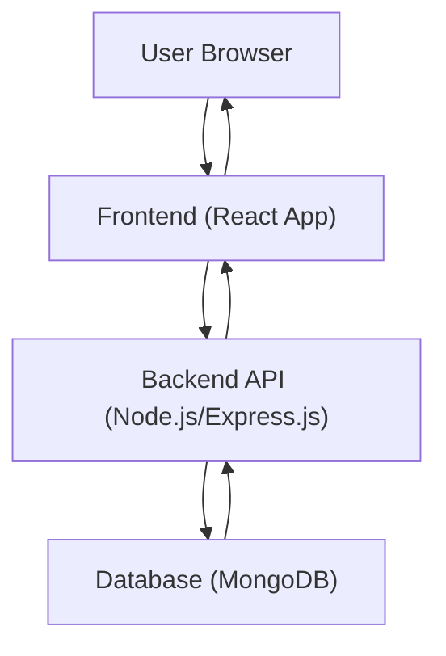

# Project Overview

This project, "MERN Chatapp," is a real-time chat application built using the MERN stack (MongoDB, Express.js, React, and Node.js). It provides a foundation for users to connect and communicate instantaneously. The project leverages modern web development technologies to deliver a dynamic and responsive user experience.

## Core Technologies

The application is composed of two main parts: a backend powered by Node.js and Express.js, and a frontend built with React.

### Backend

The backend handles server-side logic, API endpoints, and database interactions.

### Frontend

The frontend is a Single Page Application (SPA) developed using React and Vite, a fast build tool. The frontend README indicates the use of Vite with official plugins for React development.

```bash
# Example of Vite plugin configuration mentioned in frontend README
# (This is conceptual as the specific plugin isn't provided)
# vite.config.js
import { defineConfig } from 'vite';
import react from '@vitejs/plugin-react';

export default defineConfig({
  plugins: [react()],
});
```

## Project Structure and Scripts

The `package.json` file outlines the project's structure and provides scripts for managing dependencies and running the application.

```json
{
  "name": "chatapp",
  "version": "1.0.0",
  "main": "index.js",
  "scripts": {
    "build" : "npm install --prefix backend && npm install --prefix frontend && npm run build --prefix frontend",
    "start" : "npm run start --prefix backend"
  },
  "keywords": [],
  "author": "",
  "license": "ISC",
  "description": ""
}
```

The `build` script handles dependency installation for both the backend and frontend, followed by building the frontend application. The `start` script is responsible for initiating the backend server.

## Architecture Overview

The MERN Chatapp follows a typical client-server architecture. The frontend (React) communicates with the backend (Node.js/Express.js) via API calls. The backend, in turn, interacts with a MongoDB database for data persistence.





## Key Takeaways

*   **MERN Stack:** The project utilizes MongoDB, Express.js, React, and Node.js for a full-stack JavaScript solution.
*   **Real-time Communication:** Designed for instant messaging.
*   **Vite for Frontend:** Leverages Vite for a fast and efficient React development experience.
*   **Monorepo Structure (Implied):** The `package.json` scripts suggest separate `backend` and `frontend` directories managed within a single repository.