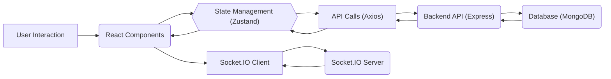
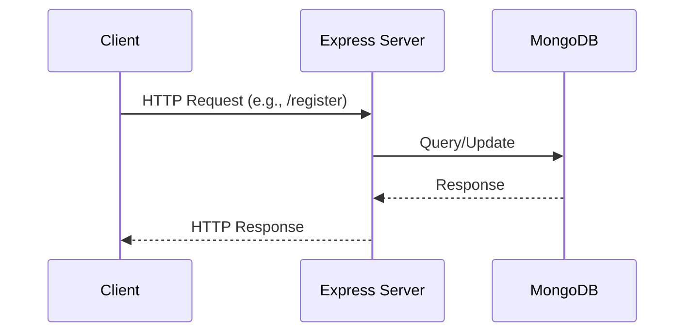

# Project Overview

The Chat-App-MERN project is a real-time chat application built using the MERN stack (MongoDB, Express.js, React.js, and Node.js). This project allows users to communicate with each other through text messages in real-time. The frontend is built with React and utilizes Socket.IO for real-time communication, while the backend, built with Node.js and Express, handles user authentication and message persistence using MongoDB.

## Key Features

*   **Real-time Messaging:** Users can send and receive messages instantly.
*   **User Authentication:** Secure user registration and login.
*   **Database Integration:** Messages are stored in a MongoDB database.
*   **Modern UI:** A responsive and intuitive user interface built with React and Tailwind CSS.
*   **Cross-Platform Compatibility:** Accessible on various devices.

## Technology Stack

| Technology   | Description                                         |
| :----------- | :-------------------------------------------------- |
| MongoDB      | NoSQL database for storing messages and user data. |
| Express.js   | Backend framework for creating APIs.                |
| React.js     | Frontend library for building the user interface.   |
| Node.js      | JavaScript runtime environment for the backend.     |
| Socket.IO    | Library for enabling real-time communication.      |
| Tailwind CSS | CSS framework for styling the frontend.            |

## Project Structure

The project is structured into two main directories: `frontend` and `backend`.

*   `frontend`: Contains the React application.
*   `backend`: Contains the Node.js and Express server.

```
Chat-App-MERN/
├── backend/
│   ├── ...
├── frontend/
│   ├── ...
├── README.md
├── package.json
```

## Setting up the project

To get started with the project, follow these steps:

1.  Clone the repository:

```bash
git clone <repository_url>
cd Chat-App-MERN
```
[View on GitHub](https://github.com/shinymack/Chat-App-MERN/blob/main/)

2.  Install dependencies for both the backend and frontend:

```bash
npm install --prefix backend
npm install --prefix frontend
```

3.  Configure environment variables:
    *   Create a `.env` file in the `backend` directory.
    *   Add the following variables:

```plaintext
PORT=5000
MONGO_URI=<your_mongodb_connection_string>
JWT_SECRET=<your_jwt_secret>
```
[View on GitHub](https://github.com/shinymack/Chat-App-MERN/blob/main/)

4.  Start the backend server:

```bash
npm run start --prefix backend
```

5.  Start the frontend development server:

```bash
npm run dev --prefix frontend
```

## Code Snippets and Explanations

### 1. Backend: Creating a user registration endpoint

The code snippet below demonstrates how to create a user registration endpoint using Express.js and MongoDB.

```javascript
// backend/routes/userRoutes.js
import express from 'express';
import asyncHandler from 'express-async-handler';
import User from '../models/userModel.js';
import generateToken from '../utils/generateToken.js';

const router = express.Router();

router.post(
  '/register',
  asyncHandler(async (req, res) => {
    const { name, email, password } = req.body;

    const userExists = await User.findOne({ email });

    if (userExists) {
      res.status(400);
      throw new Error('User already exists');
    }

    const user = await User.create({
      name,
      email,
      password,
    });

    if (user) {
      res.status(201).json({
        _id: user._id,
        name: user.name,
        email: user.email,
        token: generateToken(user._id),
      });
    } else {
      res.status(400);
      throw new Error('Invalid user data');
    }
  })
);

export default router;
```

This code defines a POST route `/register` that handles user registration. It checks if the user already exists, creates a new user in the database, and returns a token upon successful registration.
[View on GitHub](https://github.com/shinymack/Chat-App-MERN/blob/main/backend/routes/userRoutes.js)

### 2. Frontend: Handling user registration

This snippet shows how the frontend handles user registration using `axios` to make a POST request to the backend.

```javascript
// frontend/src/pages/RegisterPage.jsx
import React, { useState } from 'react';
import axios from 'axios';

const RegisterPage = () => {
  const [name, setName] = useState('');
  const [email, setEmail] = useState('');
  const [password, setPassword] = useState('');

  const handleSubmit = async (e) => {
    e.preventDefault();
    try {
      const config = {
        headers: {
          'Content-Type': 'application/json',
        },
      };
      const { data } = await axios.post(
        '/api/users/register',
        { name, email, password },
        config
      );
      localStorage.setItem('userInfo', JSON.stringify(data));
      window.location.href = '/chats';
    } catch (error) {
      console.error('Registration failed:', error.response.data.message);
    }
  };

  return (
    <form onSubmit={handleSubmit}>
      <input
        type="text"
        placeholder="Name"
        value={name}
        onChange={(e) => setName(e.target.value)}
      />
      <input
        type="email"
        placeholder="Email"
        value={email}
        onChange={(e) => setEmail(e.target.value)}
      />
      <input
        type="password"
        placeholder="Password"
        value={password}
        onChange={(e) => setPassword(e.target.value)}
      />
      <button type="submit">Register</button>
    </form>
  );
};

export default RegisterPage;
```

This component defines a registration form and handles form submission. It sends the user's data to the backend and stores the returned token in local storage.
[View on GitHub](https://github.com/shinymack/Chat-App-MERN/blob/main/frontend/src/pages/RegisterPage.jsx)

### 3. Socket.IO Integration

The following code snippet shows how Socket.IO is used on the frontend to establish a real-time connection with the server.

```javascript
// frontend/src/components/ChatBox.jsx
import { useEffect } from 'react';
import io from 'socket.io-client';

const ChatBox = () => {
  useEffect(() => {
    const socket = io('http://localhost:5000'); // Replace with your backend URL

    socket.on('connect', () => {
      console.log('Connected to socket');
    });

    socket.on('message', (message) => {
      console.log('Received message:', message);
      // Handle the received message
    });

    return () => {
      socket.disconnect();
    };
  }, []);

  return (
    <div>
      {/* Chat messages will be displayed here */}
    </div>
  );
};

export default ChatBox;
```

This component establishes a connection with the Socket.IO server upon mounting and listens for incoming messages. It also handles disconnection when the component unmounts.
[View on GitHub](https://github.com/shinymack/Chat-App-MERN/blob/main/frontend/src/components/ChatBox.jsx)

### 4. Backend: Socket.IO Setup
This shows how Socket.IO is set up on the backend.

```javascript
// backend/server.js
import express from 'express';
import http from 'http';
import { Server } from 'socket.io';

const app = express();
const server = http.createServer(app);
const io = new Server(server, {
  cors: {
    origin: "http://localhost:5173",
    methods: ["GET", "POST"]
  }
});

io.on('connection', (socket) => {
  console.log('A user connected');

  socket.on('disconnect', () => {
    console.log('A user disconnected');
  });

  socket.on('message', (message) => {
    console.log('Message received: ', message);
    io.emit('message', message); // Broadcast the message to all connected clients
  });
});

const PORT = process.env.PORT || 5000;
server.listen(PORT, () => {
  console.log(`Server listening on port ${PORT}`);
});
```

This snippet initializes a Socket.IO server that listens for connections and messages. When a new connection is established, it logs a message to the console. When a message is received, it broadcasts the message to all connected clients.
[View on GitHub](https://github.com/shinymack/Chat-App-MERN/blob/main/backend/server.js)

### 5. Frontend Package.json scripts

```json
// frontend/package.json
 "scripts": {
    "dev": "vite",
    "build": "vite build",
    "lint": "eslint .",
    "preview": "vite preview",
    "mobile": "vite --host"
  },
```

These are the scripts defined in the frontend's `package.json` for running common development tasks. `dev` starts the vite development server, `build` builds the application for production, `lint` runs the linter, `preview` serves the built application, and `mobile` runs the development server accessible from a mobile device.
[View on GitHub](https://github.com/shinymack/Chat-App-MERN/blob/main/frontend/package.json)

### 6. Backend Package.json scripts
```json
// package.json
"scripts": {
    "build" : "npm install --prefix backend && npm install --prefix frontend && npm run build --prefix frontend",
    "start" : "npm run start --prefix backend"
  },
```

These are the scripts defined in the project's root `package.json`. The `build` script installs dependencies for both the backend and frontend, and then builds the frontend application. The `start` script starts the backend server.
[View on GitHub](https://github.com/shinymack/Chat-App-MERN/blob/main/package.json)

## Mermaid Diagrams

### Frontend Component Interaction





### Backend Request Flow





## Key Integration Points

The Chat-App-MERN project showcases several key integration points within the MERN stack. The frontend interacts with the backend through API calls using `axios`. User authentication tokens are managed using JSON Web Tokens (JWT), and real-time communication is facilitated by Socket.IO. Messages are stored in a MongoDB database, providing persistence.

**Best Practices:**

*   **Error Handling:** Implement comprehensive error handling on both the frontend and backend.
*   **Security:** Secure API endpoints using authentication and authorization mechanisms.
*   **Code Organization:** Maintain a clean and modular codebase for better maintainability.
*   **Environment Variables:** Use environment variables for sensitive information and configuration settings.
*   **Data Validation:** Validate user inputs on both the frontend and backend to prevent errors and security vulnerabilities.
```