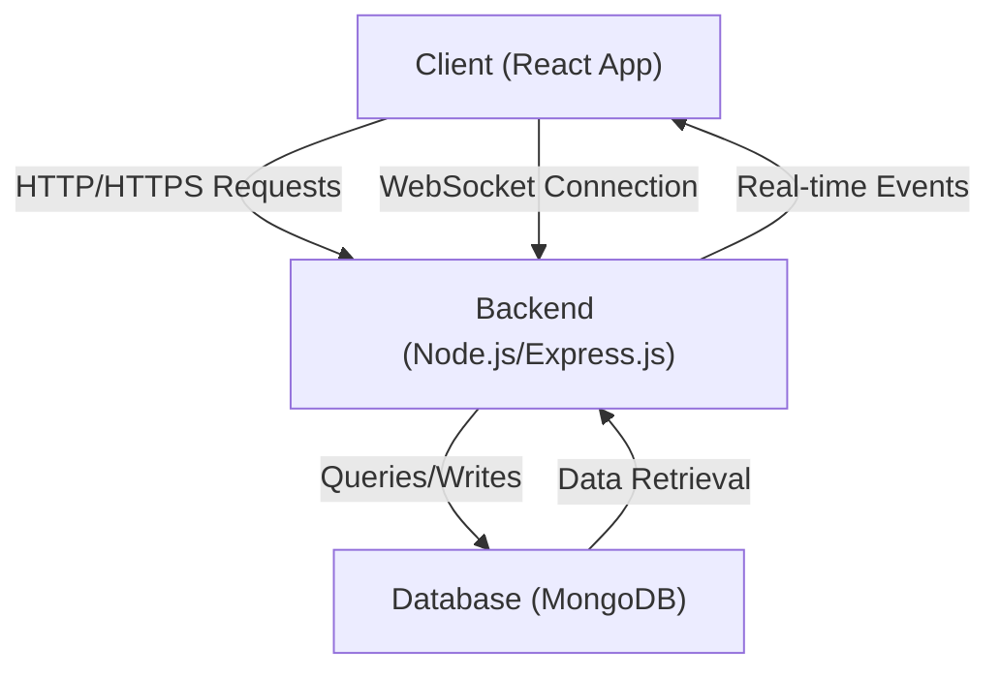
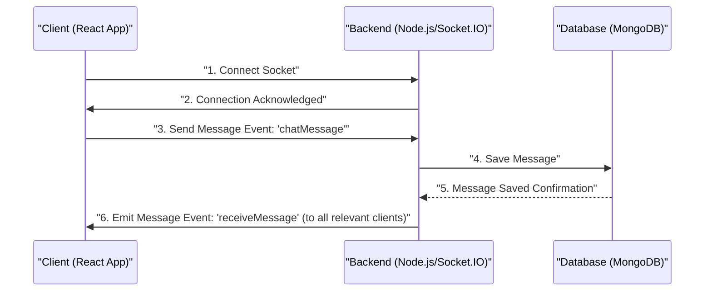

 # System Overview

The MERN Chatapp is a real-time messaging application built using the MERN (MongoDB, Express.js, React, Node.js) stack. This project serves as a comprehensive example of how to integrate these powerful technologies to create a dynamic, full-stack web application with instant communication capabilities. It leverages modern web development practices to provide a seamless user experience, allowing users to connect, exchange messages, and interact in real-time.

The core purpose of this application is to demonstrate the synergy between a robust backend API, a scalable database, and an interactive frontend, all orchestrated to handle real-time data flow typical of modern chat platforms. The architecture is designed for clarity and maintainability, making it an excellent resource for understanding full-stack development.

## Project Structure and Core Technologies

The project is structured into distinct frontend and backend components, facilitating a clear separation of concerns and enabling independent development and deployment of each part. This modular approach is a hallmark of modern application design.

At its heart, the MERN Chatapp relies on:

*   **MongoDB**: A NoSQL database that stores user data, chat messages, and other application-specific information. Its flexible schema allows for rapid iteration and scalability.
*   **Express.js**: A minimalist web framework for Node.js, forming the backbone of the backend API. It handles routing, middleware, and orchestrates server-side logic, including user authentication and message processing.
*   **React**: A declarative, component-based JavaScript library for building user interfaces. It powers the interactive frontend, managing the display of chat rooms, messages, and user interactions.
*   **Node.js**: A JavaScript runtime built on Chrome's V8 JavaScript engine, enabling the execution of JavaScript on the server side. It provides the environment for Express.js and handles asynchronous operations, making the server efficient and non-blocking.

Together, these technologies create a powerful and efficient ecosystem for developing feature-rich web applications. The project also implicitly leverages **Socket.IO** for real-time, bidirectional communication, which is crucial for instant message delivery and status updates within the chat application.

### Build and Deployment Mechanism

The `package.json` file outlines the scripts necessary to set up and run the application, demonstrating a common approach for monorepo-style MERN projects. The `build` script ensures that both frontend and backend dependencies are installed and the frontend is compiled, while the `start` script initiates the backend server.

```json
{
  "name": "chatapp",
  "version": "1.0.0",
  "main": "index.js",
  "scripts": {
    "build": "npm install --prefix backend && npm install --prefix frontend && npm run build --prefix frontend",
    "start": "npm run start --prefix backend"
  },
  "keywords": [],
  "author": "",
  "license": "ISC",
  "description": ""
}
```
[View on GitHub](https://github.com/shinymack/Chat-App-MERN/blob/main/package.json)

The `build` script executes:
1.  `npm install --prefix backend`: Installs all dependencies required by the backend server.
2.  `npm install --prefix frontend`: Installs all dependencies required by the React frontend.
3.  `npm run build --prefix frontend`: Builds the React frontend application into static assets ready for deployment.

The `start` script then runs `npm run start --prefix backend`, which typically initiates the Node.js Express server to serve the API and potentially the compiled frontend assets.

## Architectural Flow

The MERN Chatapp follows a client-server architecture, with the React frontend acting as the client and the Node.js/Express.js backend as the server. MongoDB serves as the persistent data store. Real-time communication is facilitated through WebSockets, typically managed by Socket.IO.





This diagram illustrates the primary communication channels:
*   The `Client (React App)` initiates HTTP/HTTPS requests to the `Backend (Node.js/Express.js)` for actions like user authentication, fetching historical messages, or managing profiles.
*   A `WebSocket Connection` is established between the client and backend for real-time features, enabling instant message delivery and live updates.
*   The `Backend` interacts with the `Database (MongoDB)` to store and retrieve application data, such as user information and chat message history.
*   Real-time events generated by the `Backend` (e.g., a new message, user online status change) are pushed to the `Client` via the WebSocket connection.

## Key Integration Points

Effective communication and data flow between the different components are crucial for a real-time chat application.

### Frontend-Backend Communication
The React frontend interacts with the Express.js backend for various functionalities:

*   **Authentication**: Users log in or register via HTTP POST requests to the backend. The backend validates credentials, interacts with MongoDB, and typically returns a JSON Web Token (JWT) for subsequent authenticated requests.

    ```javascript
    // Example (conceptual): Frontend auth service snippet
    async function loginUser(credentials) {
      const response = await fetch('/api/auth/login', {
        method: 'POST',
        headers: { 'Content-Type': 'application/json' },
        body: JSON.stringify(credentials)
      });
      if (!response.ok) throw new Error('Login failed');
      return response.json(); // Contains token
    }
    ```
    [View on GitHub (Conceptual)](https://github.com/shinymack/Chat-App-MERN/blob/main/frontend/src/services/authService.js) (Example path, actual file may vary)

*   **Fetching Data**: The frontend makes HTTP GET requests to retrieve chat history, lists of available users or chat rooms, and user profiles.

    ```javascript
    // Example (conceptual): Frontend chat service snippet
    async function getChatHistory(chatRoomId) {
      const token = localStorage.getItem('jwt');
      const response = await fetch(`/api/chats/${chatRoomId}/messages`, {
        headers: { 'Authorization': `Bearer ${token}` }
      });
      if (!response.ok) throw new Error('Failed to fetch messages');
      return response.json();
    }
    ```
    [View on GitHub (Conceptual)](https://github.com/shinymack/Chat-App-MERN/blob/main/frontend/src/services/chatService.js) (Example path, actual file may vary)

### Backend-Database Interaction
The Express.js backend handles all interactions with MongoDB using a Mongoose ORM (Object Relational Mapper) or direct MongoDB drivers.

*   **User Management**: Storing new user registrations, retrieving user profiles, and updating user information.

    ```javascript
    // Example (conceptual): Backend user model snippet
    import mongoose from 'mongoose';

    const userSchema = new mongoose.Schema({
      username: { type: String, required: true, unique: true },
      email: { type: String, required: true, unique: true },
      password: { type: String, required: true },
      createdAt: { type: Date, default: Date.now }
    });

    const User = mongoose.model('User', userSchema);
    export default User;
    ```
    [View on GitHub (Conceptual)](https://github.com/shinymack/Chat-App-MERN/blob/main/backend/models/userModel.js) (Example path, actual file may vary)

*   **Message Storage**: Saving new chat messages into the database, associating them with users and chat rooms.

    ```javascript
    // Example (conceptual): Backend message controller snippet
    import Message from '../models/messageModel.js';

    export const sendMessage = async (req, res) => {
      try {
        const { senderId, receiverId, message } = req.body;
        const newMessage = new Message({ sender: senderId, receiver: receiverId, content: message });
        await newMessage.save();
        // Emit via Socket.IO here
        res.status(201).json(newMessage);
      } catch (error) {
        res.status(500).json({ error: error.message });
      }
    };
    ```
    [View on GitHub (Conceptual)](https://github.com/shinymack/Chat-App-MERN/blob/main/backend/controllers/messageController.js) (Example path, actual file may vary)

### Real-time Communication (Socket.IO)
Socket.IO plays a pivotal role in enabling instant messaging and updates without requiring the client to constantly poll the server.





This sequence details a typical message flow:
1.  The `Client` establishes a WebSocket connection with the `Backend`.
2.  The `Backend` acknowledges the connection.
3.  A `Client` sends a message to the `Backend` via a `chatMessage` event.
4.  The `Backend` saves the message to the `Database`.
5.  The `Database` confirms the save operation.
6.  The `Backend` then broadcasts the `receiveMessage` event, containing the new message, to all clients participating in that chat, ensuring real-time updates across all connected users.

## Conclusion

The MERN Chatapp project provides a robust foundation for understanding full-stack web development with real-time capabilities. By carefully integrating MongoDB for data persistence, Express.js for API logic, React for an interactive user interface, and Node.js for server-side execution, coupled with Socket.IO for real-time communication, the application achieves its goal of demonstrating a modern chat platform. The build and start scripts in `package.json` streamline the development and deployment process, making this project an excellent template for future MERN applications.