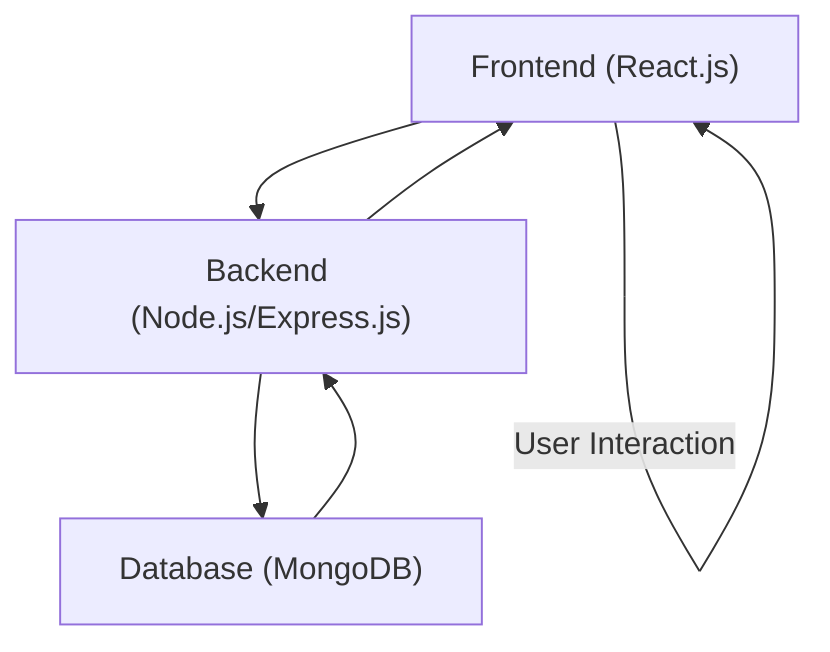
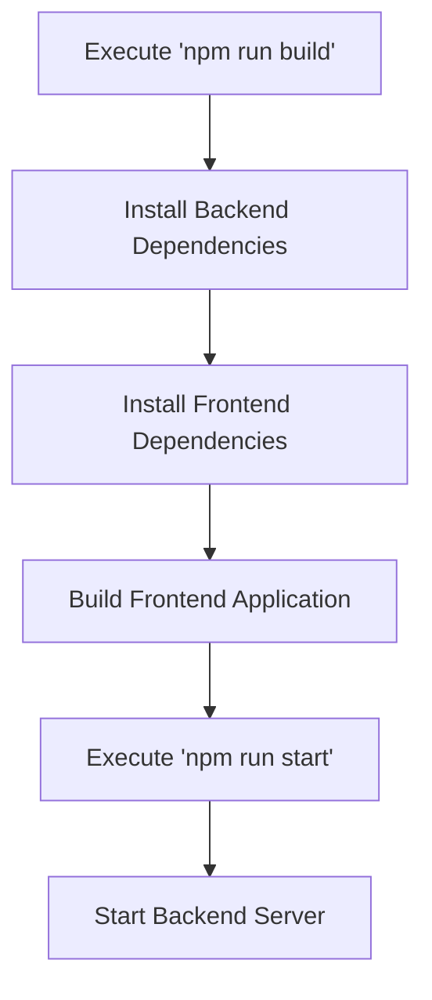

 # System Overview

The Chat-App-MERN project is a full-stack, real-time chat application built using the MERN (MongoDB, Express.js, React.js, Node.js) stack. It provides a platform for users to communicate, featuring user authentication, message exchange, and potentially group chat functionalities. This document offers a high-level introduction to the project's architecture, core technologies, and operational aspects derived from the initial project files.

The project's foundational structure, as indicated by its `package.json` and `package-lock.json`, outlines a typical MERN setup with separate `backend` and `frontend` components, each managed by `npm`. This modular approach allows for independent development and deployment of the server-side API and the client-side user interface. The `README.md` further credits a tutorial, suggesting a structured learning approach was followed during its inception.

## Project Purpose and Goals

The primary goal of the Chat-App-MERN project is to demonstrate the capabilities of the MERN stack in building a dynamic, interactive web application. Key aspects include:

*   **Real-time Communication:** Implementing instant messaging features using technologies like WebSockets (though not explicitly visible in `package.json`, it's a common MERN chat app component).
*   **User Management:** Handling user registration, login, and session management.
*   **Data Persistence:** Storing chat messages and user data using a NoSQL database (MongoDB).
*   **Scalable Architecture:** Structuring the application into distinct frontend and backend services for better maintainability and potential scalability.

## Core Technologies

The project leverages a robust set of modern web technologies, categorized by their role in the MERN stack:

### MongoDB (Database)
As part of the MERN acronym, MongoDB is the chosen database. It's a document-oriented NoSQL database known for its flexibility and scalability, making it suitable for storing chat messages, user profiles, and other application data in a JSON-like format.

### Express.js (Backend Framework)
Express.js is a minimal and flexible Node.js web application framework that provides a robust set of features for web and mobile applications. It handles routing, middleware, and API endpoints for the backend server.

### React.js (Frontend Library)
React.js is a declarative, efficient, and flexible JavaScript library for building user interfaces. It's used to construct the interactive client-side of the chat application, managing UI components and user interactions.

### Node.js (Backend Runtime)
Node.js is a JavaScript runtime built on Chrome's V8 JavaScript engine. It allows JavaScript to be used for server-side development, powering the Express.js application and handling backend logic and API requests.

The interaction between these components can be visualized as follows:





## Project Structure and Build Process

The project is structured with distinct `backend` and `frontend` directories, a common pattern for MERN applications. This separation allows for independent development, dependency management, and deployment strategies for each part of the application.

### `package.json`

The `package.json` file is the heart of any Node.js project, defining metadata, scripts, and dependencies. In this project, it primarily outlines the `chatapp`'s basic information and crucial build/start scripts.

```json
{
  "name": "chatapp",
  "version": "1.0.0",
  "main": "index.js",
  "scripts": {
    "build" : "npm install --prefix backend && npm install --prefix frontend && npm run build --prefix frontend",
    "start" : "npm run start --prefix backend"
  },
  "keywords": [],
  "author": "",
  "license": "ISC",
  "description": ""
}
```
**Explanation:** This snippet from `package.json` defines the core scripts for building and starting the application.
-   The `"build"` script first installs dependencies for both the `backend` and `frontend` directories using `npm install --prefix`. It then executes the `build` script defined within the `frontend`'s `package.json` to compile the React application.
-   The `"start"` script initiates the backend server by running the `start` script defined within the `backend`'s `package.json`.
These scripts highlight the monorepo-like management of the separate frontend and backend components from the root.

[View on GitHub](https://github.com/shinymack/Chat-App-MERN/blob/main/package.json#L4-L9)

### `package-lock.json`

The `package-lock.json` file records the exact dependency tree that was generated. This ensures that subsequent installations of the project (e.g., by other developers or on a production server) will use the exact same versions of dependencies, preventing potential compatibility issues.

```json
{
  "name": "chatapp",
  "version": "1.0.0",
  "lockfileVersion": 3,
  "requires": true,
  "packages": {
    "": {
      "name": "chatapp",
      "version": "1.0.0",
      "license": "ISC"
    }
  }
}
```
**Explanation:** This initial `package-lock.json` shows only the root `chatapp` project information. Since no direct dependencies are listed in the root `package.json` (dependencies are managed within `backend` and `frontend` subdirectories), this file reflects that minimal state. As development progresses and dependencies are installed within the subdirectories, their respective `package-lock.json` files would contain detailed dependency trees.

[View on GitHub](https://github.com/shinymack/Chat-App-MERN/blob/main/package-lock.json#L1-L12)

### `README.md`

The `README.md` provides an initial overview and context for the project.

```markdown
## MERN Chatapp

credits : https://youtu.be/ntKkVrQqBYY?si=qz02jMCQ80RT1jaH
```
**Explanation:** This snippet from `README.md` provides the project title and, importantly, credits a YouTube tutorial. This indicates that the project likely originated from following a guided walkthrough, which is common for learning new stacks. The presence of this credit suggests the project aims to replicate or extend functionalities demonstrated in the tutorial.

[View on GitHub](https://github.com/shinymack/Chat-App-MERN/blob/main/README.md#L1-L3)

### Build and Start Workflow

The defined scripts in `package.json` describe a clear workflow for setting up and running the application:

1.  **Dependency Installation:** First, all necessary packages for both the `backend` and `frontend` are installed. This ensures that all required libraries and frameworks are in place.
2.  **Frontend Build:** The React application is then built, typically compiling JSX into JavaScript, optimizing assets, and preparing the static files for deployment.
3.  **Backend Start:** Finally, the Node.js/Express.js backend server is started, which will then serve the API and potentially the static frontend files.

This sequence can be visualized as a flowchart:





## Key Integration Points

The core integration points in the Chat-App-MERN project revolve around how the frontend communicates with the backend, and how the backend interacts with the database.

*   **Frontend-Backend API Communication:** The React frontend will make HTTP requests (e.g., using `fetch` or Axios) to the Express.js backend for operations such as user authentication (login, registration), fetching message history, sending new messages, and managing user profiles.
*   **Real-time Communication (WebSockets):** For a chat application, real-time message exchange is crucial. This typically involves a WebSocket library (like Socket.IO) on both the frontend and backend. The frontend opens a WebSocket connection to the backend, allowing for instant, bi-directional communication without constant polling.
*   **Backend-Database Interaction:** The Express.js backend uses an ODM (Object Data Modeling) library like Mongoose to connect to MongoDB. Mongoose simplifies data schema definition, validation, and interaction, allowing the backend to save new messages, retrieve user data, and perform complex queries.
*   **Environment Variables:** Best practices suggest using environment variables (e.g., `.env` files) to manage sensitive information like database connection strings, API keys, and port numbers. This keeps credentials out of the codebase and allows for easy configuration across different deployment environments.

By adhering to these integration patterns, the Chat-App-MERN project can establish a robust and efficient communication flow between its various components, delivering a seamless real-time chat experience.