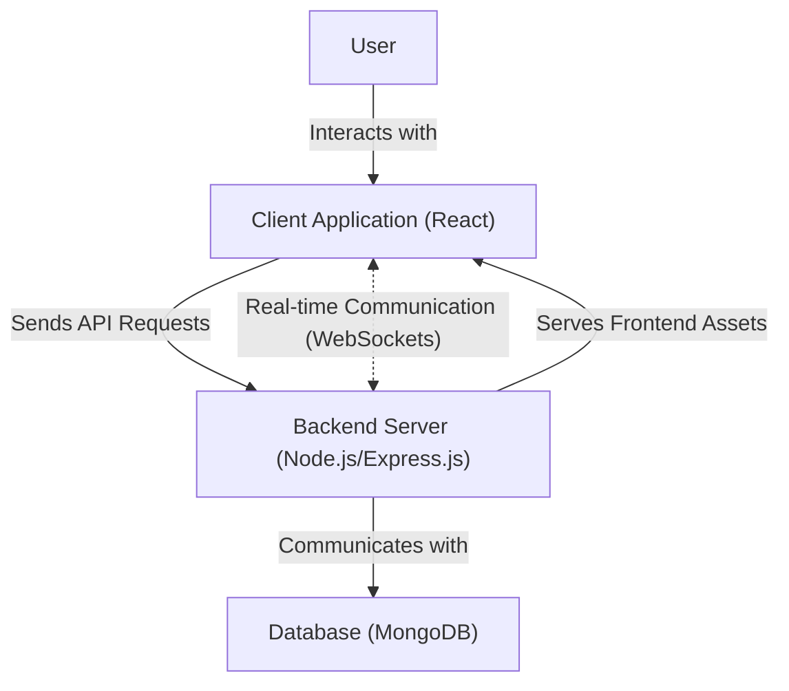
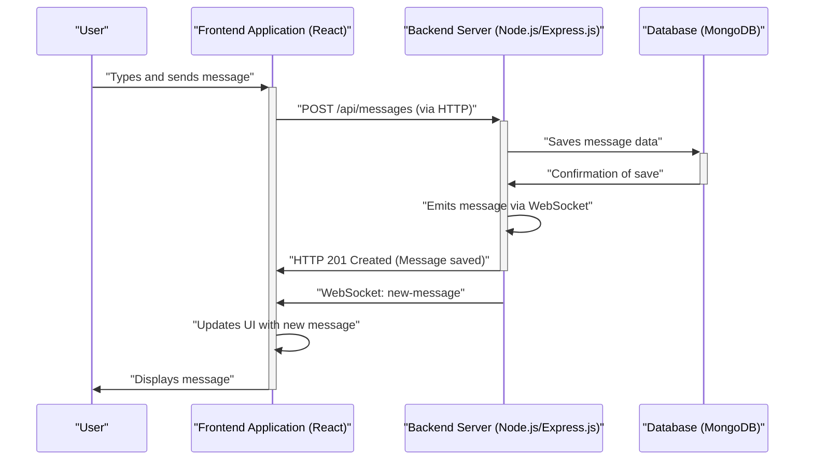

 # System Overview

This document provides a comprehensive, high-level overview of the MERN Chat Application. This application is a real-time messaging platform designed to facilitate instant communication between users, built using the robust MERN stack.

The MERN stack (MongoDB, Express.js, React, Node.js) forms the backbone of this application, providing a modern, scalable, and efficient architecture for web development. Our goal is to outline the application's core purpose, its primary functionalities, and the technical architecture that underpins its operations.

## Purpose and Core Functionalities

The MERN Chat Application aims to deliver a seamless and interactive messaging experience. Its primary purpose is to enable users to communicate in real-time within a secure and user-friendly environment.

Key functionalities include:

*   **User Authentication and Authorization:** Secure sign-up and login processes to manage user access.
*   **Real-time Messaging:** Instantaneous exchange of text messages between users.
*   **Private and Group Chats:** Support for one-on-one conversations and multi-user group discussions.
*   **Persistent Chat History:** Storage and retrieval of past conversations.
*   **User Presence Indicators:** Displaying the online/offline status of users.
*   **Scalable Backend:** An API-driven backend capable of handling multiple concurrent connections.
*   **Responsive Frontend:** A user interface designed to work across various devices.

## Application Architecture

The MERN Chat Application leverages a classic three-tier architecture: frontend, backend, and database. This separation of concerns ensures maintainability, scalability, and modularity.

### MERN Stack Components

The MERN stack comprises the following technologies:

*   **MongoDB:** A NoSQL database used for storing chat messages, user profiles, and other application data. Its flexible document model is well-suited for handling the diverse data requirements of a chat application.
*   **Express.js:** A minimal and flexible Node.js web application framework that provides a robust set of features for web and mobile applications. It forms the foundation for the application's backend API.
*   **React:** A JavaScript library for building user interfaces. It is used to develop the interactive and dynamic frontend of the chat application, providing a rich user experience.
*   **Node.js:** A JavaScript runtime built on Chrome's V8 JavaScript engine. It allows for building fast and scalable network applications, driving the server-side logic and API.

The following diagram illustrates the high-level architecture:





## Project Setup and Scripts

The project's `package.json` file defines essential metadata and scripts for building and starting the application. It highlights the separation of frontend and backend concerns within a unified project structure.

### `package.json` Overview

The `package.json` file outlines the project's name, version, and, critically, the scripts used for development and deployment. The `build` and `start` scripts demonstrate how the frontend and backend are managed.

```json
{
  "name": "chatapp",
  "version": "1.0.0",
  "main": "index.js",
  "scripts": {
    "build" : "npm install --prefix backend && npm install --prefix frontend && npm run build --prefix frontend",
    "start" : "npm run start --prefix backend"
  },
  "keywords": [],
  "author": "",
  "license": "ISC",
  "description": ""
}
```
[View `package.json` on GitHub](https://github.com/shinymack/Chat-App-MERN/blob/main/package.json)

The `scripts` section defines two primary commands:

*   **`build`**: This script first installs dependencies for both the `backend` and `frontend` directories, and then triggers the build process for the frontend. This ensures all necessary components are ready for deployment.
*   **`start`**: This script initiates the backend server. The frontend is typically served as static assets by the backend after it has been built.

### Backend Dependency Installation

The first part of the `build` script focuses on the backend:
```bash
npm install --prefix backend
```
This command navigates into the `backend` directory and installs all Node.js dependencies specified in its `package.json`. These dependencies typically include `express`, `mongoose` (for MongoDB interaction), `socket.io` (for real-time communication), and other server-side utilities.

### Frontend Dependency Installation

Following the backend, the `build` script handles the frontend:
```bash
npm install --prefix frontend
```
Similarly, this command installs all React-related dependencies, such as `react`, `react-dom`, `react-scripts`, and any UI libraries or state management tools, as defined in the frontend's `package.json`.

### Frontend Build Process

After installing dependencies, the frontend application is built:
```bash
npm run build --prefix frontend
```
This command executes the `build` script located within the `frontend`'s `package.json`. For a React application, this typically compiles the React source code into optimized static files (HTML, CSS, JavaScript) that can be served by the backend server.

### Starting the Backend Server

The `start` script is straightforward:
```bash
npm run start --prefix backend
```
This command runs the `start` script defined in the `backend`'s `package.json`, which usually points to the main server entry file (e.g., `index.js` or `server.js`). This launches the Node.js/Express.js server, making the API endpoints available and often serving the built frontend assets.

## Core Interaction Flow

Understanding the flow of a typical chat message provides insight into the interplay between the MERN stack components.





1.  **User Interaction:** A user types a message and clicks "Send" in the Frontend Application.
2.  **Frontend to Backend (HTTP):** The Frontend Application sends an HTTP POST request to the Backend Server's `/api/messages` endpoint, containing the message content, sender ID, and recipient/chat ID.
3.  **Backend to Database:** The Backend Server receives the message, processes it, and then saves it into the MongoDB database.
4.  **Database Confirmation:** MongoDB confirms the successful storage of the message to the Backend Server.
5.  **Real-time Emission (WebSocket):** The Backend Server, upon successfully saving the message, uses WebSocket technology (e.g., Socket.IO) to immediately broadcast the new message to all relevant connected clients (e.g., users in the same chat room).
6.  **Backend to Frontend (HTTP Response):** The Backend Server also sends an HTTP 201 Created response back to the originating Frontend Application, acknowledging that the message was saved.
7.  **Frontend Updates (WebSocket):** Other Frontend Applications (and potentially the originating one, if designed to listen to its own messages via WebSocket) receive the `new-message` event via WebSocket.
8.  **UI Update:** Each Frontend Application that receives the WebSocket event updates its UI to display the new message in real-time.
9.  **User View:** The message appears almost instantly on the screens of all participants in the chat.

## Relevant Files

The initial exploration of the project involved reviewing key configuration files:

*   **`README.md`**: Provides a general overview and quick start guide for the project. In this case, it indicates the project name and credits.
    ```markdown
    ## MERN Chatapp

    credits : https://youtu.be/ntKkVrQqBYY?si=qz02jMCq80RT1jaH
    ```
    [View `README.md` on GitHub](https://github.com/shinymack/Chat-App-MERN/blob/main/README.md)

*   **`package.json`**: As detailed above, this file lists project metadata, scripts, and direct dependencies (implicitly for the root project, though frontend/backend have their own).
    ```json
    {
      "name": "chatapp",
      "version": "1.0.0",
      "main": "index.js",
      "scripts": {
        "build" : "npm install --prefix backend && npm install --prefix frontend && npm run build --prefix frontend",
        "start" : "npm run start --prefix backend"
      },
      "keywords": [],
      "author": "",
      "license": "ISC",
      "description": ""
    }
    ```
    [View `package.json` on GitHub](https://github.com/shinymack/Chat-App-MERN/blob/main/package.json)

*   **`package-lock.json`**: This file is automatically generated for any operations where npm modifies either the `node_modules` tree or `package.json`. It describes the exact dependency tree that was generated, ensuring that subsequent installs produce identical results.
    ```json
    {
      "name": "chatapp",
      "version": "1.0.0",
      "lockfileVersion": 3,
      "requires": true,
      "packages": {
        "": {
          "name": "chatapp",
          "version": "1.0.0",
          "license": "ISC"
        }
      }
    }
    ```
    [View `package-lock.json` on GitHub](https://github.com/shinymack/Chat-App-MERN/blob/main/package-lock.json)

## Key Integration Points

The MERN Chat Application emphasizes several critical integration points that ensure its functionality and robustness:

*   **Client-Server Communication:** The React frontend interacts with the Node.js/Express.js backend primarily via RESTful API calls for data fetching, user authentication, and initial message sending.
*   **Real-time Layer:** WebSocket (e.g., Socket.IO) provides the real-time communication channel between the backend and all connected clients, crucial for instant message delivery and presence updates. This bypasses the traditional request-response cycle for dynamic updates.
*   **Backend-Database Interaction:** Express.js uses an ODM (Object Data Modeling) library like Mongoose to interact with MongoDB. This simplifies data schema definition and query operations, translating JavaScript objects into database documents and vice-versa.
*   **Build Pipeline:** The `npm run build` script orchestrates the compilation of both frontend and backend assets. The frontend build outputs static files which are then often served by the Node.js/Express.js backend, simplifying deployment.
*   **Environment Configuration:** Secure handling of sensitive information (e.g., database connection strings, API keys) through environment variables is paramount. These are typically loaded by the backend (e.g., using `dotenv`) and kept out of version control.

Best practices for this system involve ensuring robust error handling across all layers, implementing comprehensive authentication and authorization checks, optimizing database queries, and utilizing efficient real-time communication patterns to minimize latency and ensure a smooth user experience.