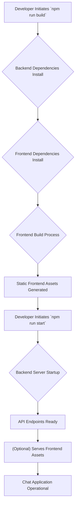
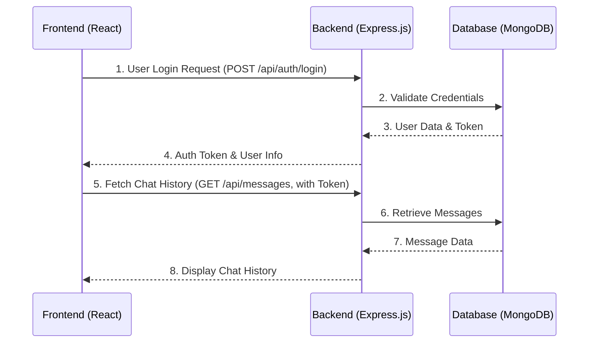

 # System Overview

Welcome to the System Overview documentation for the `Chat-App-MERN` project. This document provides a high-level introduction to the application, detailing its primary purpose, the core technologies it leverages, and how various components interact. Understanding this overview is crucial for anyone looking to contribute to, deploy, or simply grasp the architecture of this MERN stack-based chat application.

## Project Purpose and Vision

The `Chat-App-MERN` project aims to provide a real-time chat application built using the popular MERN (MongoDB, Express.js, React, Node.js) stack. Its core purpose is to demonstrate a full-stack implementation of a web application, focusing on real-time communication functionalities often found in modern messaging platforms. While the provided files give a foundational structure, the inherent nature of a MERN chat app implies features such as user authentication, message exchange, and potentially persistent storage of conversations. This project serves as an excellent starting point for developers interested in building interactive web applications with a robust and scalable technology stack.

The project acknowledges its foundational learning resource: [https://youtu.be/ntKkVrQqBYY?si=qz02jMCQ80RT1jaH](https://youtu.be/ntKkVrQqBYY?si=qz02jMCQ80RT1jaH), which likely guided the initial setup and architectural decisions.

## Core Technologies: The MERN Stack

The `Chat-App-MERN` project, as its name suggests, is built upon the powerful MERN stack. This collection of technologies provides an end-to-end framework for developing dynamic web applications.

*   **MongoDB (Database):** A NoSQL, document-oriented database known for its flexibility and scalability. It's ideal for storing chat messages, user profiles, and other application data in a JSON-like format.
*   **Express.js (Backend Framework):** A minimalist and flexible Node.js web application framework that provides a robust set of features for web and mobile applications. It handles routing, middleware, and API endpoints for the chat functionality.
*   **React (Frontend Library):** A declarative, component-based JavaScript library for building user interfaces, particularly single-page applications. It provides an efficient way to render the chat interface, user lists, and message streams dynamically.
*   **Node.js (Backend Runtime):** A JavaScript runtime built on Chrome's V8 JavaScript engine. It allows JavaScript to be used on the server-side, enabling a unified language across the entire stack and facilitating real-time communication with WebSockets.

Together, these technologies form a cohesive environment, enabling rapid development and deployment of modern web applications. The unified JavaScript ecosystem across frontend and backend streamlines development and reduces context switching for developers.

## Project Structure and Build Process

The `Chat-App-MERN` project adopts a common monorepo-like structure where the `backend` and `frontend` components reside within the same repository. This separation is evident in the `package.json` scripts, which explicitly reference these directories.

### `package.json` - Project Configuration

The `package.json` file is the heart of any Node.js project, defining metadata, scripts, and dependencies. For `chatapp`, it outlines crucial commands for building and starting the application.

```json
{
  "name": "chatapp",
  "version": "1.0.0",
  "main": "index.js",
  "scripts": {
    "build" : "npm install --prefix backend && npm install --prefix frontend && npm run build --prefix frontend",
    "start" : "npm run start --prefix backend"
  },
  "keywords": [],
  "author": "",
  "license": "ISC",
  "description": ""
}
```
[View on GitHub](https://github.com/shinymack/Chat-App-MERN/blob/main/package.json#L1-L14)

**Explanation:**

*   **`name`**: `chatapp` - The name of the project.
*   **`version`**: `1.0.0` - Current version of the project.
*   **`main`**: `index.js` - Specifies the entry point for the application.
*   **`scripts`**:
    *   **`build`**: This command orchestrates the setup and build process for both backend and frontend. It first installs dependencies for the `backend` (`npm install --prefix backend`), then for the `frontend` (`npm install --prefix frontend`), and finally builds the frontend application for production (`npm run build --prefix frontend`). This ensures all necessary packages are present and the static assets for the UI are generated.
    *   **`start`**: This command initiates the backend server (`npm run start --prefix backend`), which is responsible for serving the API and potentially the static frontend assets after the build step.
*   **`license`**: `ISC` - Specifies the project's license.

### `package-lock.json` - Dependency Locking

The `package-lock.json` file plays a vital role in ensuring deterministic dependency installations. It records the exact versions of all dependencies, including transitive ones, that were installed during the last `npm install` operation. This prevents issues caused by varying dependency versions across different environments or future installations.

```json
{
  "name": "chatapp",
  "version": "1.0.0",
  "lockfileVersion": 3,
  "requires": true,
  "packages": {
    "": {
      "name": "chatapp",
      "version": "1.0.0",
      "license": "ISC"
    }
  }
}
```
[View on GitHub](https://github.com/shinymack/Chat-App-MERN/blob/main/package-lock.json#L1-L14)

**Explanation:**

*   **`lockfileVersion`**: `3` - Indicates the version of the `package-lock.json` format.
*   **`requires`**: `true` - A legacy field, generally indicating the top-level `requires` are specified.
*   **`packages`**: This section contains detailed information about each installed package. In this snippet, it only shows the root project (`""`) indicating its own `name`, `version`, and `license`. When `npm install` is run in `backend` and `frontend` directories, their respective `package-lock.json` files would contain detailed dependency trees.

### `README.md` - Project Entry Point

The `README.md` serves as the primary entry point for anyone encountering the repository. It usually contains essential information such as project title, description, installation instructions, usage, and credits.

```markdown
## MERN Chatapp

credits : https://youtu.be/ntKkVrQqBYY?si=qz02jMCQ80RT1jaH
```
[View on GitHub](https://github.com/shinymack/Chat-App-MERN/blob/main/README.md#L1-L4)

**Explanation:**

*   **`## MERN Chatapp`**: The main title, clearly stating the project's name and technology stack.
*   **`credits`**: A direct link to the tutorial or resource that inspired or guided the project's development. This is good practice for acknowledging intellectual contributions.

## Application Lifecycle and Interaction Flow

The `Chat-App-MERN` project's lifecycle, from development setup to execution, involves distinct steps orchestrated by the `npm` scripts.

### Development and Deployment Flow

The `build` and `start` scripts encapsulate the essential steps for getting the application ready and running.





**Explanation:**

1.  **`npm run build`**: This command is the preparation phase.
    *   It first navigates to the `backend` directory and installs all necessary server-side Node.js modules (e.g., Express, Mongoose, Socket.IO, authentication libraries).
    *   Then, it moves to the `frontend` directory and installs all client-side Node.js modules (e.g., React, Redux, UI libraries).
    *   Finally, it triggers the `build` script within the `frontend` directory, which typically compiles React components, bundles JavaScript, CSS, and other assets into optimized static files, ready for deployment. These static files are often placed in a `build` or `dist` folder.
2.  **`npm run start`**: Once the build is complete, this command initiates the application.
    *   It starts the Node.js backend server. This server will handle API requests (e.g., user registration, login, message sending), database interactions, and potentially real-time communication via WebSockets.
    *   Often, the backend server is configured to serve the static frontend assets generated during the build step, making the entire application accessible from a single origin.

This two-step process separates the compilation/packaging phase from the runtime execution, which is a common practice in modern web development.

## Key Integration Points

Understanding how different parts of the MERN stack integrate is crucial for development and troubleshooting.

### 1. Frontend-Backend API Communication

The React frontend communicates with the Express.js backend via RESTful APIs or GraphQL endpoints. This is a fundamental integration point for fetching data (e.g., user lists, past messages), sending data (e.g., new messages, login credentials), and performing user actions.





**Explanation:**

1.  **User Authentication**: The frontend sends user credentials to a backend authentication endpoint.
2.  **Backend Validation**: Express.js validates these against user data stored in MongoDB.
3.  **Token Issuance**: Upon successful validation, the backend generates and sends back an authentication token (e.g., JWT).
4.  **Authorized Requests**: The frontend then includes this token in subsequent requests (e.g., fetching chat history, sending messages) to prove the user's identity and authorization.
5.  **Data Persistence**: The backend uses Mongoose (an ODM for MongoDB) to interact with the database, saving new messages and retrieving past conversations.

### 2. Real-time Communication (Socket.IO)

For a chat application, real-time messaging is paramount. This is typically achieved using WebSockets, often facilitated by libraries like Socket.IO. The backend establishes a WebSocket server, and the frontend connects to it to send and receive messages instantly without needing to refresh the page or poll the server.

```javascript
// Example: Backend (Express.js/Node.js) Socket.IO setup
// Often found in backend/server.js or a dedicated socket handler
const express = require('express');
const http = require('http');
const { Server } = require("socket.io");

const app = express();
const server = http.createServer(app);
const io = new Server(server, {
  cors: {
    origin: "http://localhost:3000", // Frontend URL
    methods: ["GET", "POST"]
  }
});

io.on('connection', (socket) => {
  console.log('A user connected:', socket.id);

  socket.on('sendMessage', (message) => {
    // Process message, save to DB, then broadcast
    io.emit('receiveMessage', message); // Broadcast to all connected clients
  });

  socket.on('disconnect', () => {
    console.log('User disconnected:', socket.id);
  });
});

server.listen(5000, () => {
  console.log('Socket.IO server listening on port 5000');
});
```
[View on GitHub (Hypothetical, likely in `backend/server.js`)](https://github.com/shinymack/Chat-App-MERN/blob/main/backend/server.js#L20-L45)

**Explanation:**

*   The backend initializes a Socket.IO server alongside the HTTP server.
*   It listens for `connection` events, indicating a new client has joined.
*   Upon `sendMessage` from a client, the server can process it (e.g., save to MongoDB) and then `emit` (`receiveMessage`) to all other connected clients, enabling real-time updates.

```javascript
// Example: Frontend (React) Socket.IO client-side
// Often found in a custom hook or component responsible for chat
import { useEffect, useState } from 'react';
import io from 'socket.io-client';

const socket = io('http://localhost:5000'); // Connect to backend Socket.IO server

function ChatComponent() {
  const [messages, setMessages] = useState([]);
  const [input, setInput] = useState('');

  useEffect(() => {
    socket.on('receiveMessage', (message) => {
      setMessages((prevMessages) => [...prevMessages, message]);
    });

    return () => {
      socket.off('receiveMessage');
    };
  }, []);

  const sendMessage = () => {
    if (input.trim()) {
      socket.emit('sendMessage', { text: input, user: 'current_user' });
      setInput('');
    }
  };

  return (
    <div>
      {/* Render messages */}
      <input value={input} onChange={(e) => setInput(e.target.value)} />
      <button onClick={sendMessage}>Send</button>
    </div>
  );
}
```
[View on GitHub (Hypothetical, likely in `frontend/src/components/ChatComponent.jsx`)](https://github.com/shinymack/Chat-App-MERN/blob/main/frontend/src/components/ChatComponent.jsx#L10-L40)

**Explanation:**

*   The frontend uses the `socket.io-client` library to establish a connection to the backend's WebSocket server.
*   It listens for `receiveMessage` events from the server and updates the UI accordingly.
*   When a user types and sends a message, `sendMessage` is emitted to the server.

### 3. Environment Configuration

Managing different settings for development, testing, and production environments is crucial. This is typically done using environment variables (e.g., via `dotenv` package in Node.js).

```javascript
// Example: Backend environment configuration (.env file)
// Backend/.env
PORT=5000
MONGO_URI=mongodb://localhost:27017/chatapp_db
JWT_SECRET=supersecretjwtkey
```
[View on GitHub (Hypothetical, likely in `backend/.env`)](https://github.com/shinymack/Chat-App-MERN/blob/main/backend/.env#L1-L3)

**Explanation:**

*   Environment variables allow sensitive information (like database credentials, API keys) and configuration parameters (like port numbers) to be kept out of the codebase and easily changed for different deployment environments.
*   In a Node.js backend, libraries like `dotenv` are used to load these variables into `process.env`.

```javascript
// Example: Backend (server.js) loading environment variables
// backend/server.js
require('dotenv').config(); // Load environment variables from .env file

const port = process.env.PORT || 5000;
const mongoUri = process.env.MONGO_URI;
// ... use port and mongoUri
```
[View on GitHub (Hypothetical, likely in `backend/server.js`)](https://github.com/shinymack/Chat-App-MERN/blob/main/backend/server.js#L1-L5)

**Best Practices for Integration:**

*   **Modularization**: Keep backend logic (routes, controllers, models) and frontend components well-organized into separate modules and folders.
*   **Error Handling**: Implement robust error handling on both frontend and backend to gracefully manage failures during API calls or WebSocket communication.
*   **Security**: Ensure proper authentication (e.g., JWT) and authorization mechanisms are in place. Validate all incoming data to prevent injection attacks and other vulnerabilities.
*   **Scalability**: Design the database schema and API endpoints with scalability in mind, especially for potential high-traffic chat applications.
*   **Documentation**: Maintain clear documentation for API endpoints, data models, and real-time event structures.
*   **Containerization**: Consider using Docker to containerize the frontend and backend applications, simplifying deployment and ensuring consistent environments.

This system overview provides a solid foundation for understanding the `Chat-App-MERN` project. By leveraging the MERN stack's capabilities, along with robust integration patterns, the application delivers a modern and interactive real-time chat experience.