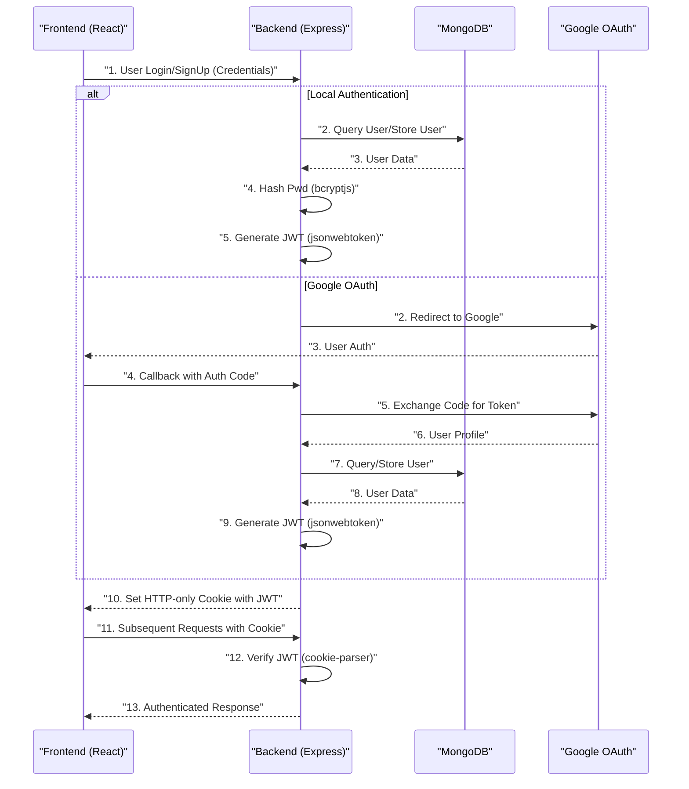
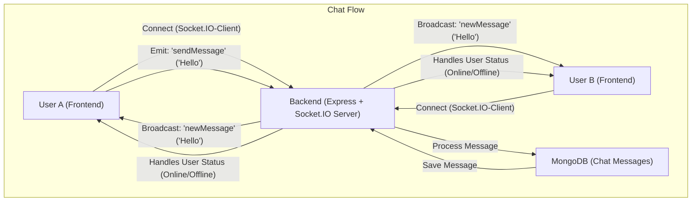

 # System Overview

The Chat-App-MERN project is a real-time messaging application built using the MERN stack (MongoDB, Express.js, React, Node.js). It aims to provide users with a seamless and interactive platform for instant communication, featuring user authentication, real-time chat functionalities, and multimedia support. This document provides a high-level overview of the system's architecture, key technologies, and how its various components integrate to deliver a cohesive user experience.

The application leverages a modern, component-based frontend framework (React) for dynamic user interfaces and a robust backend (Express.js, Node.js) for API handling, data persistence, and real-time communication via WebSockets. MongoDB serves as the flexible NoSQL database, storing user profiles, chat messages, and conversation data.

## Project Purpose and Features

The primary purpose of this project is to demonstrate a full-stack MERN application with real-time capabilities. Key features include:

*   **User Authentication and Authorization:** Secure sign-up, login, and session management using JWT (JSON Web Tokens) and OAuth with Google.
*   **Real-time Messaging:** Instantaneous message exchange between users leveraging Socket.IO.
*   **One-on-One and Group Chats:** Supports direct messaging and potentially group conversations (though not explicitly detailed, the `socket.io` infrastructure supports this).
*   **User Profile Management:** Users can manage their profiles, including avatar uploads via Cloudinary.
*   **Responsive User Interface:** Built with React and styled using Tailwind CSS and DaisyUI for an adaptable design across devices.

## Core Technology Stack

The Chat-App-MERN project is built upon a robust and popular set of technologies, categorized by their role in the application architecture.

### Frontend Technologies

The frontend is a single-page application developed with React, providing a dynamic and responsive user interface.

*   **React:** A JavaScript library for building user interfaces.
*   **Vite:** A fast build tool for modern web projects, used for development and bundling.
*   **Zustand:** A small, fast, and scalable state-management solution.
*   **Axios:** A promise-based HTTP client for making API requests to the backend.
*   **Socket.IO Client:** Enables real-time, bidirectional communication with the backend.
*   **React Router DOM:** Declarative routing for React applications.
*   **Tailwind CSS & DaisyUI:** Utility-first CSS framework and a component library built on top of Tailwind CSS for styling.

A snippet from the `frontend/package.json` illustrates the core dependencies:

```json
{
  "name": "frontend",
  "private": true,
  "version": "0.0.0",
  "type": "module",
  "scripts": {
    "dev": "vite",
    "build": "vite build",
    "lint": "eslint .",
    "preview": "vite preview",
    "mobile": "vite --host"
  },
  "dependencies": {
    "axios": "^1.7.9",
    "cors": "^2.8.5",
    "lucide-react": "^0.471.1",
    "react": "^18.3.1",
    "react-dom": "^18.3.1",
    "react-hot-toast": "^2.5.1",
    "react-icons": "^5.5.0",
    "react-router-dom": "^7.1.1",
    "socket.io-client": "^4.8.1",
    "zustand": "^5.0.3"
  },
  "devDependencies": {
    "@eslint/js": "^9.17.0",
    "@types/react": "^18.3.18",
    "@types/react-dom": "^18.3.5",
    "@vitejs/plugin-react": "^4.3.4",
    "autoprefixer": "^10.4.20",
    "daisyui": "^4.12.23",
    "eslint": "^9.17.0",
    "eslint-plugin-react": "^7.37.2",
    "eslint-plugin-react-hooks": "^5.0.0",
    "eslint-plugin-react-refresh": "^0.4.16",
    "globals": "^15.14.0",
    "postcss": "^8.5.0",
    "tailwindcss": "^3.4.17",
    "vite": "^6.3.5"
  }
}
```
[View `frontend/package.json` on GitHub](https://github.com/shinymack/Chat-App-MERN/blob/main/frontend/package.json)

### Backend Technologies

The backend is built with Node.js and Express.js, providing RESTful APIs and managing real-time communication.

*   **Node.js & Express.js:** JavaScript runtime and web application framework for building APIs.
*   **MongoDB & Mongoose:** NoSQL database for data storage and an ODM (Object Data Modeling) library for MongoDB.
*   **Socket.IO:** Enables real-time, event-based bidirectional communication between the web client and server.
*   **bcryptjs & jsonwebtoken:** For hashing passwords and generating/verifying JWTs for authentication.
*   **Cloudinary:** Cloud-based image and video management service, used for storing user avatars and media.
*   **Passport.js & passport-google-oauth20:** Middleware for authentication, supporting various strategies, including Google OAuth 2.0.
*   **dotenv:** Loads environment variables from a `.env` file.
*   **cookie-parser:** Parses incoming request cookies.

A snippet from the `backend/package.json` outlines the backend dependencies:

```json
{
  "name": "backend",
  "version": "1.0.0",
  "main": "src/index.js",
  "scripts": {
    "dev": "nodemon src/index.js",
    "start": "node src/index.js"
  },
  "author": "",
  "type": "module",
  "license": "ISC",
  "description": "",
  "dependencies": {
    "bcryptjs": "^2.4.3",
    "cloudinary": "^2.5.1",
    "cookie-parser": "^1.4.7",
    "dotenv": "^16.4.7",
    "express": "^4.21.2",
    "express-session": "^1.18.1",
    "jsonwebtoken": "^9.0.2",
    "mongoose": "^8.9.5",
    "passport": "^0.7.0",
    "passport-google-oauth20": "^2.0.0",
    "socket.io": "^4.8.1"
  },
  "devDependencies": {
    "nodemon": "^3.1.9"
  }
}
```
[View `backend/package.json` on GitHub](https://github.com/shinymack/Chat-App-MERN/blob/main/backend/package.json)

### Root Project Configuration

The root `package.json` orchestrates the build and start processes for both frontend and backend sub-projects.

```json
{
  "name": "chatapp",
  "version": "1.0.0",
  "main": "index.js",
  "scripts": {
    "build" : "npm install --prefix backend && npm install --prefix frontend && npm run build --prefix frontend",
    "start" : "npm run start --prefix backend"
  },
  "keywords": [],
  "author": "",
  "license": "ISC",
  "description": ""
}
```
[View `package.json` on GitHub](https://github.com/shinymack/Chat-App-MERN/blob/main/package.json)

The `build` script ensures that dependencies for both the backend and frontend are installed, and then the frontend production build is generated. The `start` script initiates the backend server.

## System Architecture

The application follows a client-server architecture, typical for MERN stack applications. The frontend (React) communicates with the backend (Express.js) through RESTful API calls for initial data fetching and authentication, and via WebSockets for real-time messaging.


```mermaid
graph TD
    A["Frontend (React.js)"]
    B["Backend (Express.js)"]
    C["MongoDB Database"]
    D["Cloudinary (Media Storage)"]
    E["User Authentication (JWT/OAuth)"]
    F["Socket.IO Server"]
    G["Socket.IO Client"]

    A -- "HTTP/REST API Requests" --> B
    B -- "Queries/Writes" --> C
    B -- "Uploads/Retrievals" --> D
    B -- "Authentication Logic" --> E
    A -- "Sends/Receives Events" --> G
    G -- "Real-time Communication" --> F
    F -- "Real-time Events" --> B
    B -.-> C: "Stores Chat Data"
    B -.-> E: "Authenticates Users"
    F -.-> B: "Handles Socket Events"
```


In this architecture:
*   The **Frontend (React.js)** is the user interface, responsible for rendering UI components, handling user input, and displaying real-time updates. It communicates with the backend via HTTP requests and the Socket.IO client.
*   The **Backend (Express.js)** handles business logic, API routing, user authentication, and interacts with the database and external services. It also hosts the Socket.IO server.
*   **MongoDB Database** stores persistent data such as user profiles, chat messages, and conversation metadata.
*   **Cloudinary** is an external service used for storing media files, primarily user avatars and potentially shared images in chats.
*   **User Authentication (JWT/OAuth)** manages user identity, session management, and access control. This typically involves `bcryptjs` for password hashing, `jsonwebtoken` for token creation/validation, and `passport-google-oauth20` for social login.
*   **Socket.IO Server** (part of the backend) and **Socket.IO Client** (part of the frontend) establish a persistent, bidirectional connection for real-time features like instant messaging.

## Key Integration Points

Understanding how different parts of the system interact is crucial for development and maintenance.

### 1. User Authentication Flow

The authentication process integrates multiple components:

*   **Frontend (React)**: Collects user credentials (username/password or initiates OAuth) and sends them to the backend.
*   **Backend (Express.js)**:
    *   Receives credentials.
    *   If local login, uses `bcryptjs` to compare hashed passwords and `jsonwebtoken` to issue a JWT.
    *   If Google OAuth, redirects to Google for authentication and uses `passport-google-oauth20` to verify the user and create/retrieve user records.
    *   Sets an HTTP-only cookie containing the JWT.
*   **Database (MongoDB)**: Stores user details, including hashed passwords and potentially OAuth provider IDs.





### 2. Real-time Chat Messaging

The core real-time functionality relies on Socket.IO:

*   **Frontend (React)**: Uses `socket.io-client` to establish a persistent connection with the backend. It emits messages and listens for incoming messages.
*   **Backend (Express.js + Socket.IO Server)**:
    *   `socket.io` listens for new connections and incoming chat events.
    *   When a message is received, the backend validates the user, processes the message (e.g., stores it in MongoDB), and then broadcasts it to relevant users (e.g., all users in a specific chat room).
    *   Mongoose saves message data to the MongoDB database.





### 3. Media Upload (Avatars)

User avatar uploads are handled by Cloudinary:

*   **Frontend (React)**: Allows users to select an image file.
*   **Backend (Express.js)**: Receives the image file.
    *   Uploads the image to Cloudinary using the `cloudinary` SDK.
    *   Receives a secure URL from Cloudinary.
    *   Saves this URL to the user's profile in MongoDB.
*   **Cloudinary**: Stores the image and provides a public URL for access.
*   **MongoDB**: Stores the Cloudinary URL in the user document.

This MERN chat application effectively integrates these technologies to deliver a full-fledged, real-time messaging experience, showcasing a common pattern for modern web application development.