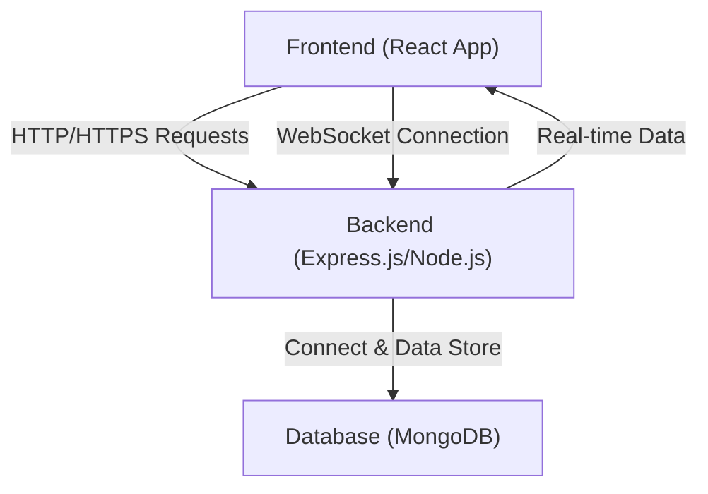
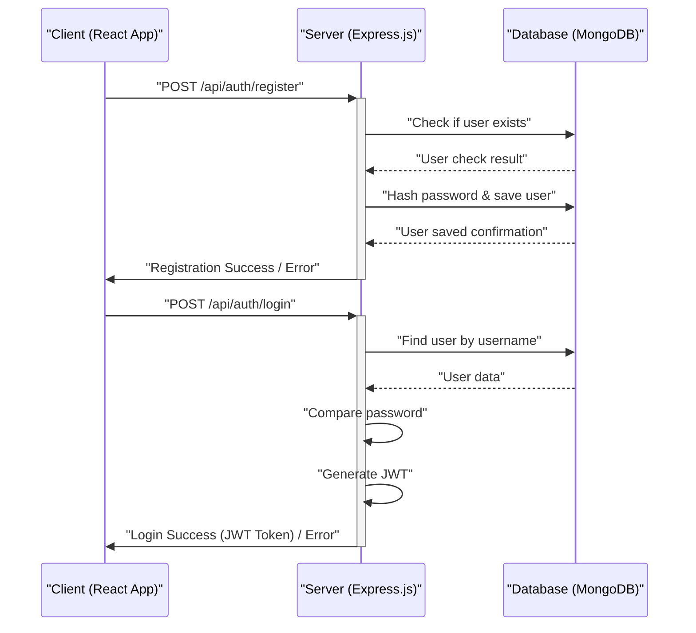

 # System Overview

The Chat-App-MERN project is a demonstration of a real-time chat application built using the MERN (MongoDB, Express.js, React, Node.js) stack. This document provides a high-level overview of its architecture, core technologies, and key operational aspects, serving as an initial guide for understanding its structure and purpose. The application is designed to showcase fundamental MERN stack integration, enabling users to register, log in, and engage in real-time messaging.

This project is inspired by the tutorial available on YouTube, crediting [https://youtu.be/ntKkVrQqBYY?si=qz02jMCQ80RT1jaH](https://youtu.be/ntKkVrQqBYY?si=qz02jMCQ80RT1jaH).

## Project Purpose and Goals

The primary goal of the Chat-App-MERN project is to illustrate a complete full-stack application development workflow using modern JavaScript technologies. It aims to demonstrate:

*   **Real-time Communication:** Implementation of WebSockets for instant message delivery.
*   **User Authentication & Authorization:** Secure user registration, login, and session management.
*   **Modular Architecture:** Separation of concerns between frontend and backend components.
*   **Database Integration:** Seamless interaction with MongoDB for persistent data storage.
*   **Development Workflow:** Scripting for development and deployment, including dependency management.

## Core Technologies and Stack

The application leverages the power of the MERN stack, renowned for its flexibility and JavaScript-centric development environment. Each component plays a distinct role:

*   **MongoDB (Database):** A NoSQL database used for storing user profiles, chat messages, and other application data. Its document-oriented nature allows for flexible schema design, ideal for rapidly evolving applications like chat services.
*   **Express.js (Backend Framework):** A fast, unopinionated, minimalist web framework for Node.js. It handles API routing, middleware integration, and serves as the backbone for the server-side logic, managing requests and responses.
*   **React (Frontend Library):** A declarative, component-based JavaScript library for building user interfaces. It is responsible for rendering the chat interface, user authentication forms, and managing client-side state efficiently.
*   **Node.js (Runtime Environment):** A JavaScript runtime built on Chrome's V8 JavaScript engine. It powers the Express.js backend, enabling server-side JavaScript execution and providing a unified language across the entire stack.

Beyond the core MERN components, the project also incorporates other crucial technologies for enhanced functionality and development experience:

*   **Socket.IO:** A library that enables real-time, bidirectional, and event-based communication between the web client and server. This is fundamental for the chat application's instantaneous messaging capabilities.
*   **bcryptjs:** Used for hashing passwords securely before storing them in the database, protecting user credentials.
*   **jsonwebtoken (JWT):** Employed for creating and verifying authentication tokens, ensuring secure access to protected routes and resources.
*   **Nodemon:** A utility that automatically restarts the Node.js server whenever file changes are detected, streamlining the development process.

## Project Structure Overview

The project typically adopts a monorepo-like structure, separating frontend and backend concerns into distinct directories. This enhances modularity and allows for independent development and deployment of each part.

```
chatapp/
├── backend/
│   ├── controllers/
│   ├── middleware/
│   ├── models/
│   ├── routes/
│   ├── server.js
│   ├── package.json
│   └── ...
├── frontend/
│   ├── public/
│   ├── src/
│   │   ├── components/
│   │   ├── pages/
│   │   ├── App.js
│   │   ├── index.js
│   │   └── ...
│   ├── package.json
│   └── ...
├── package.json
├── README.md
└── ...
```

This structure is inferred from common MERN practices and the `package.json` scripts, which indicate separate `backend` and `frontend` prefixes for npm commands.

## Installation and Build Process

The `package.json` at the root of the project defines high-level scripts to manage the installation and build processes for both frontend and backend components.

```json
{
  "name": "chatapp",
  "version": "1.0.0",
  "main": "index.js",
  "scripts": {
    "build" : "npm install --prefix backend && npm install --prefix frontend && npm run build --prefix frontend",
    "start" : "npm run start --prefix backend"
  },
  "keywords": [],
  "author": "",
  "license": "ISC",
  "description": ""
}
```
[View on GitHub](https://github.com/shinymack/Chat-App-MERN/blob/main/package.json#L5-L9)

### `build` Script
The `build` script orchestrates the setup and compilation of the entire application:
1.  `npm install --prefix backend`: Installs all dependencies required by the backend server.
2.  `npm install --prefix frontend`: Installs all dependencies for the React frontend application.
3.  `npm run build --prefix frontend`: Executes the build command defined within the `frontend/package.json`, typically compiling the React application into static assets for deployment.

This snippet demonstrates a robust way to manage dependencies and build processes across a monorepo-style project.

### `start` Script
The `start` script is designed to initiate the backend server:
```json
    "start" : "npm run start --prefix backend"
```
[View on GitHub](https://github.com/shinymack/Chat-App-MERN/blob/main/package.json#L7)

This command tells npm to navigate into the `backend` directory and run its `start` script. This usually kicks off the Node.js server, often using `nodemon` in development or `node server.js` in production.

## System Architecture

The Chat-App-MERN system follows a client-server architecture, typical of web applications, with an emphasis on real-time communication.





**Explanation:**
*   The **Frontend (React App)** is the user interface, responsible for rendering the chat rooms, user lists, and input fields. It interacts with the backend for all data operations.
*   The **Backend (Express.js/Node.js)** serves as the API layer and the WebSocket server. It handles user authentication, message storage, and broadcasting real-time messages to connected clients.
*   The **Database (MongoDB)** stores all persistent data, including user accounts, chat message history, and potentially chat room configurations.

## Package Management and Dependencies

The `package-lock.json` file at the root level indicates a straightforward package management setup for the main project, while deeper dependencies are handled within the `backend` and `frontend` subdirectories.

```json
{
  "name": "chatapp",
  "version": "1.0.0",
  "lockfileVersion": 3,
  "requires": true,
  "packages": {
    "": {
      "name": "chatapp",
      "version": "1.0.0",
      "license": "ISC"
    }
  }
}
```
[View on GitHub](https://github.com/shinymack/Chat-App-MERN/blob/main/package-lock.json#L1-L12)

This `package-lock.json` primarily describes the root-level project itself and its direct dependencies, if any, for scripts like `build` and `start`. The actual transitive dependencies for the backend and frontend are managed by their respective `package-lock.json` files within those subdirectories. This modular approach ensures that each part of the application maintains its own isolated dependency tree, reducing conflicts.

## Key Integration Points

The core of the Chat-App-MERN application's functionality lies in the seamless integration between its frontend and backend components, particularly concerning authentication and real-time messaging.

### 1. User Authentication Flow

User authentication is a critical integration point, ensuring that only legitimate users can access chat functionalities.





**Insights on Flow:**
*   **Registration:** The client sends user details to the backend. The backend validates the input, hashes the password for security, and stores the new user in MongoDB.
*   **Login:** The client sends credentials. The backend retrieves the user from MongoDB, verifies the password, and if successful, issues a JSON Web Token (JWT). This JWT is then sent back to the client, which stores it (e.g., in local storage) for subsequent authenticated requests.
*   **Best Practice:** Always hash passwords before storing them. JWTs provide a stateless way to manage user sessions, making the backend more scalable.

### 2. Real-time Messaging with Socket.IO

Real-time chat is achieved through a persistent WebSocket connection, managed by Socket.IO. This allows instant message exchange without constant polling.

**Frontend (React) Socket.IO Integration (Conceptual):**
```javascript
// frontend/src/context/SocketContext.jsx (Example)
import { createContext, useContext, useEffect, useState } from 'react';
import io from 'socket.io-client';

const SocketContext = createContext();

export const SocketProvider = ({ children }) => {
    const [socket, setSocket] = useState(null);

    useEffect(() => {
        const newSocket = io('http://localhost:5000', {
            // Optional: Include JWT for authentication if required by backend
            query: { token: localStorage.getItem('jwtToken') }
        });
        setSocket(newSocket);

        return () => newSocket.close(); // Clean up on unmount
    }, []);

    return (
        <SocketContext.Provider value={socket}>
            {children}
        </SocketContext.Provider>
    );
};
```
This conceptual snippet illustrates how a React context can manage the Socket.IO connection, ensuring it's available throughout the application. The token in the query parameter is a common way to authenticate WebSocket connections.

**Backend (Node.js/Express) Socket.IO Integration (Conceptual):**
```javascript
// backend/server.js (Example)
import express from 'express';
import { Server } from 'socket.io';
import http from 'http';
// ... other imports

const app = express();
const server = http.createServer(app);
const io = new Server(server, {
    cors: {
        origin: ["http://localhost:3000"], // Allow frontend origin
        methods: ["GET", "POST"]
    }
});

io.on('connection', (socket) => {
    console.log('A user connected:', socket.id);

    // Example: Join a chat room
    socket.on('joinRoom', (roomId) => {
        socket.join(roomId);
        console.log(`User ${socket.id} joined room ${roomId}`);
    });

    // Example: Handle new message
    socket.on('sendMessage', (messageData) => {
        // Save message to DB (async operation)
        // Broadcast message to all users in the room
        io.to(messageData.roomId).emit('newMessage', messageData);
    });

    socket.on('disconnect', () => {
        console.log('User disconnected:', socket.id);
    });
});

server.listen(5000, () => console.log('Server running on port 5000'));
```
This conceptual backend snippet shows how Socket.IO is initialized with the HTTP server. It handles `connection`, `joinRoom`, `sendMessage`, and `disconnect` events. When a message is received, it's typically saved to the database and then broadcast to other clients in the relevant room.

**Best Practices:**
*   **Authentication for Sockets:** Authenticate WebSocket connections using JWTs to ensure only authorized users can send and receive messages.
*   **Room-based Messaging:** Use Socket.IO rooms to efficiently manage message broadcasting to specific groups of users (e.g., in a particular chat channel).
*   **Error Handling:** Implement robust error handling for both HTTP requests and WebSocket events.

By clearly separating concerns and defining clear communication protocols between the client, server, and database, the Chat-App-MERN project provides a solid foundation for building scalable and interactive real-time applications.