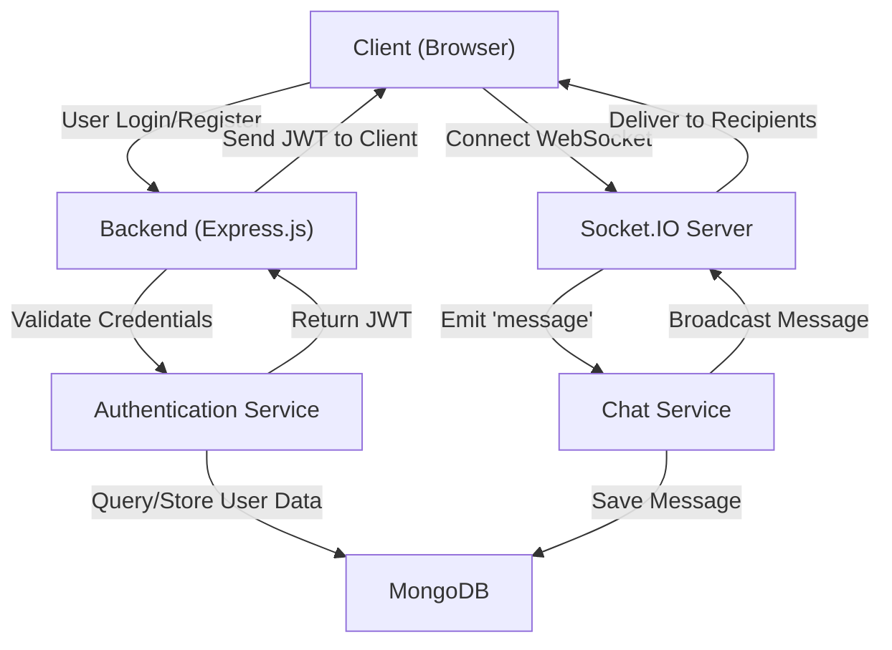
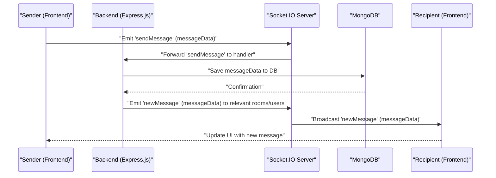

 # System Overview

The Chat-App-MERN project is a real-time chat application built using the MERN (MongoDB, Express.js, React, Node.js) stack. It provides a platform for users to communicate with each other, featuring user authentication, message exchange, and potentially other social functionalities. This document provides a high-level introduction to the project's architecture, core technologies, and key components.

The project is structured as a monorepo, with distinct `backend` and `frontend` directories, coordinated by a root `package.json` for overall build and start scripts. This separation facilitates independent development and deployment of the two primary components while ensuring a cohesive development experience.

## Core Purpose

The primary purpose of this application is to enable real-time communication between authenticated users. It demonstrates a practical application of the MERN stack combined with WebSockets for instant message delivery, offering a foundation for more complex communication platforms. The project's structure also serves as a good reference for setting up full-stack MERN applications.

## Technology Stack

The Chat-App-MERN project leverages a robust set of technologies, typical of modern web application development. The choice of technologies emphasizes performance, scalability, and ease of development.

| Category    | Technology        | Role                                                     |
| :---------- | :---------------- | :------------------------------------------------------- |
| **Backend** | Node.js           | Runtime environment for server-side logic.               |
|             | Express.js        | Web application framework for routing and middleware.    |
|             | MongoDB           | NoSQL database for storing user data, messages, etc.     |
|             | Mongoose          | ODM (Object Data Modeling) for MongoDB interactions.     |
|             | Socket.IO         | Real-time, bidirectional event-based communication.      |
|             | JWT               | Secure user authentication and authorization.            |
|             | Cloudinary        | Cloud-based image and video management.                  |
| **Frontend**| React             | JavaScript library for building user interfaces.         |
|             | Vite              | Next-generation frontend tooling for fast development.   |
|             | Axios             | Promise-based HTTP client for API requests.              |
|             | Zustand           | Small, fast, and scalable state-management solution.     |
|             | Socket.IO Client  | Client-side library for real-time communication.         |
|             | Tailwind CSS      | Utility-first CSS framework for styling.                 |
|             | DaisyUI           | Tailwind CSS component library for UI elements.          |

### Root Project Configuration

The project's root `package.json` defines scripts for managing both the frontend and backend components from a central location. This setup is particularly useful for CI/CD pipelines and simplified local development workflows.

```json
{
  "name": "chatapp",
  "version": "1.0.0",
  "main": "index.js",
  "scripts": {
    "build" : "npm install --prefix backend && npm install --prefix frontend && npm run build --prefix frontend",
    "start" : "npm run start --prefix backend"
  },
  "keywords": [],
  "author": "",
  "license": "ISC",
  "description": ""
}
```
*   **Explanation**: The `build` script first installs dependencies for both `backend` and `frontend`, then triggers the frontend build process. The `start` script initiates the backend server. This ensures that the application can be deployed or run with a single command after cloning.
*   [View on GitHub](https://github.com/shinymack/Chat-App-MERN/blob/main/package.json#L5-L8)

## Backend Architecture

The backend is built with Node.js and Express.js, providing a RESTful API for client interactions and integrating Socket.IO for real-time messaging. MongoDB, accessed via Mongoose, serves as the primary data store.

### Key Backend Dependencies

The `backend/package.json` outlines the core technologies and development tools used on the server side.

```json
{
  "name": "backend",
  "version": "1.0.0",
  "main": "src/index.js",
  "scripts": {
    "dev": "nodemon src/index.js",
    "start": "node src/index.js"
  },
  "dependencies": {
    "bcryptjs": "^2.4.3",
    "cloudinary": "^2.5.1",
    "cookie-parser": "^1.4.7",
    "dotenv": "^16.4.7",
    "express": "^4.21.2",
    "express-session": "^1.18.1",
    "jsonwebtoken": "^9.0.2",
    "mongoose": "^8.9.5",
    "passport": "^0.7.0",
    "passport-google-oauth20": "^2.0.0",
    "socket.io": "^4.8.1"
  },
  "devDependencies": {
    "nodemon": "^3.1.9"
  }
}
```
*   **Explanation**:
    *   `bcryptjs`: For hashing passwords to ensure security.
    *   `cloudinary`: For managing and storing user profile pictures or shared media.
    *   `cookie-parser`: Middleware to parse cookies attached to the client request object.
    *   `dotenv`: To load environment variables from a `.env` file.
    *   `express`: The web framework.
    *   `jsonwebtoken`: For creating and verifying JSON Web Tokens for authentication.
    *   `mongoose`: ODM for MongoDB.
    *   `passport` & `passport-google-oauth20`: For implementing flexible authentication strategies, including Google OAuth.
    *   `socket.io`: Enables real-time, bidirectional communication between web clients and the server.
    *   `nodemon` (dev dependency): Automatically restarts the Node.js application when file changes are detected.
*   [View on GitHub](https://github.com/shinymack/Chat-App-MERN/blob/main/backend/package.json#L5-L30)

### Backend Flow (Simplified)

The following diagram illustrates a simplified interaction flow for user authentication and real-time messaging on the backend.





## Frontend Architecture

The frontend is built using React, providing a dynamic and responsive user interface. It interacts with the backend via RESTful API calls and maintains a persistent WebSocket connection for real-time updates. Vite powers the development and build process, offering fast refresh and optimized builds.

### Key Frontend Dependencies

The `frontend/package.json` highlights the libraries and tools shaping the user experience.

```json
{
  "name": "frontend",
  "private": true,
  "version": "0.0.0",
  "type": "module",
  "scripts": {
    "dev": "vite",
    "build": "vite build",
    "lint": "eslint .",
    "preview": "vite preview",
    "mobile": "vite --host"
  },
  "dependencies": {
    "axios": "^1.7.9",
    "cors": "^2.8.5",
    "lucide-react": "^0.471.1",
    "react": "^18.3.1",
    "react-dom": "^18.3.1",
    "react-hot-toast": "^2.5.1",
    "react-icons": "^5.5.0",
    "react-router-dom": "^7.1.1",
    "socket.io-client": "^4.8.1",
    "zustand": "^5.0.3"
  },
  "devDependencies": {
    "@vitejs/plugin-react": "^4.3.4",
    "autoprefixer": "^10.4.20",
    "daisyui": "^4.12.23",
    "eslint": "^9.17.0",
    "postcss": "^8.5.0",
    "tailwindcss": "^3.4.17",
    "vite": "^6.3.5"
  }
}
```
*   **Explanation**:
    *   `axios`: HTTP client for making API requests to the backend.
    *   `lucide-react`, `react-icons`: Icon libraries for UI elements.
    *   `react`, `react-dom`: Core React libraries for building components and managing the DOM.
    *   `react-hot-toast`: Library for displaying notifications and toasts.
    *   `react-router-dom`: For client-side routing and navigation.
    *   `socket.io-client`: The client-side library for establishing and managing WebSocket connections with the Socket.IO server.
    *   `zustand`: A lightweight state management solution for the frontend.
    *   `vite` (dev dependency): Fast build tool for React projects.
    *   `tailwindcss`, `autoprefixer`, `postcss`, `daisyui` (dev dependencies): For modern CSS styling and component frameworks.
*   [View on GitHub](https://github.com/shinymack/Chat-App-MERN/blob/main/frontend/package.json#L7-L40)

### Frontend Build Script with Vite

Vite is known for its speed and efficiency. The `build` script for the frontend leverages Vite to bundle the application for production.

```json
  "scripts": {
    "dev": "vite",
    "build": "vite build",
    "lint": "eslint .",
    "preview": "vite preview",
    "mobile": "vite --host"
  },
```
*   **Explanation**: The `build` command `vite build` optimizes and bundles the React application, preparing it for deployment. `dev` starts the development server, and `mobile` allows accessing the dev server from other devices on the network.
*   [View on GitHub](https://github.com/shinymack/Chat-App-MERN/blob/main/frontend/package.json#L7-L12)

## Key Integration Points

The successful operation of the Chat-App-MERN relies on several critical integration points between its components.

1.  **Client-Server API Communication**: The frontend uses `axios` to make RESTful API calls to the Express.js backend for user registration, login, fetching user profiles, and initial message loading. Authentication is managed via JWTs transmitted in HTTP headers or cookies.
2.  **Real-time Communication (Socket.IO)**: After successful authentication, the frontend establishes a persistent WebSocket connection with the Socket.IO server. This connection is vital for real-time features like instant message delivery, online status updates, and typing indicators.
    *   The `socket.io-client` in the frontend connects to the `socket.io` server in the backend, enabling a full-duplex communication channel.
3.  **Database Interaction**: The Express.js backend interacts with MongoDB via Mongoose for all data persistence needs, including user accounts, chat messages, and potentially chat room configurations.
4.  **Environment Variables (`dotenv`)**: Both frontend (during build, if needed, or via `process.env`) and backend utilize `dotenv` to manage sensitive information (e.g., database URIs, API keys, JWT secrets) and configuration settings, ensuring portability and security.
5.  **Authentication Workflow**: `jsonwebtoken`, `bcryptjs`, and `passport` on the backend work in conjunction to provide secure user authentication. The frontend stores and sends the received JWTs with subsequent requests to maintain the user's session.
6.  **Image Uploads (Cloudinary)**: When users upload profile pictures or media, the backend acts as an intermediary, handling the upload to `Cloudinary` and storing the resulting image URLs in MongoDB.

### Data Flow for a New Message

Here’s a simplified sequence illustrating how a new message travels from a sender to recipients:


