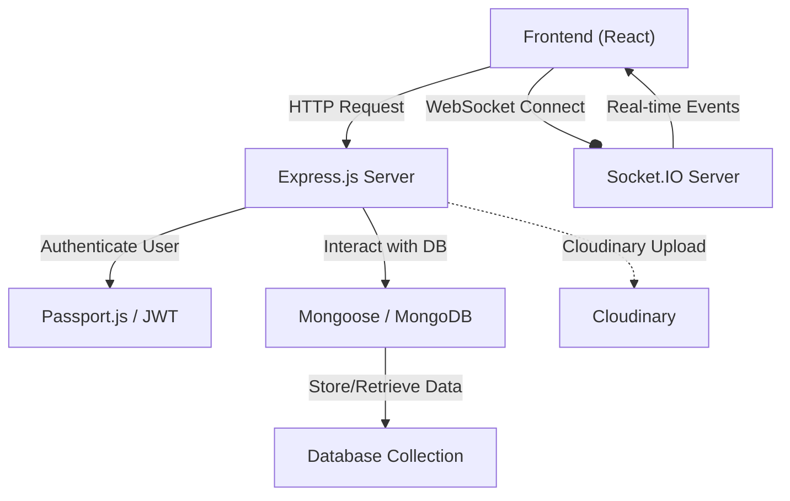
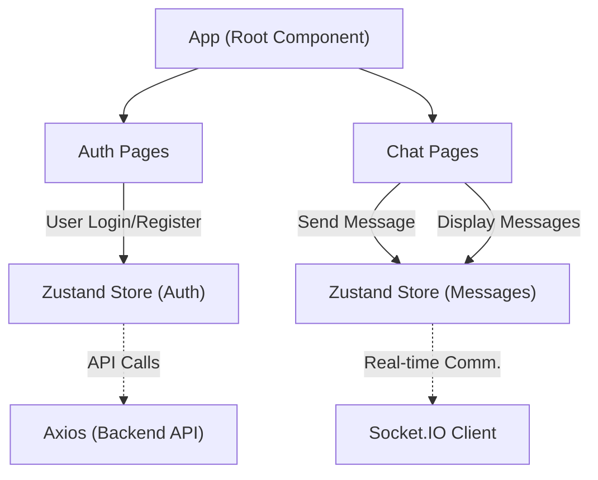

 # System Overview

The Chat-App-MERN project is a real-time chat application built using the MERN (MongoDB, Express.js, React.js, Node.js) stack. It provides a platform for users to communicate instantly, leveraging modern web technologies for a dynamic and responsive user experience. The application demonstrates a full-stack approach, encompassing user authentication, persistent data storage, and real-time communication capabilities.

The project is structured into distinct `frontend` and `backend` services, orchestrated by a root `package.json` for streamlined development and deployment. This modular design promotes separation of concerns and allows for independent development and scaling of each component.

## Core Technologies

The Chat-App-MERN application is built upon a robust set of modern web technologies, forming a classic MERN stack architecture with real-time capabilities.

### Backend Stack

The backend is powered by Node.js and Express.js, providing a RESTful API and WebSocket server for real-time interactions. MongoDB is used as the NoSQL database for flexible and scalable data storage.

<div className="overflow-x-auto">
<table className="table">
  <thead>
    <tr>
      <th>Category</th>
      <th>Technology</th>
      <th>Purpose</th>
    </tr>
  </thead>
  <tbody>
    <tr>
      <td>**Runtime**</td>
      <td>Node.js</td>
      <td>Server-side JavaScript execution environment.</td>
    </tr>
    <tr>
      <td>**Web Framework**</td>
      <td>Express.js</td>
      <td>Fast, unopinionated, minimalist web framework for Node.js.</td>
    </tr>
    <tr>
      <td>**Database**</td>
      <td>MongoDB</td>
      <td>NoSQL database for storing user, message, and conversation data.</td>
    </tr>
    <tr>
      <td>**ORM/ODM**</td>
      <td>Mongoose</td>
      <td>Object Data Modeling (ODM) library for MongoDB and Node.js.</td>
    </tr>
    <tr>
      <td>**Real-time Communication**</td>
      <td>Socket.IO</td>
      <td>Enables real-time, bidirectional event-based communication.</td>
    </tr>
    <tr>
      <td>**Authentication**</td>
      <td>`bcryptjs`</td>
      <td>Password hashing for secure user authentication.</td>
    </tr>
    <tr>
      <td></td>
      <td>`jsonwebtoken`</td>
      <td>Generates JSON Web Tokens (JWT) for stateless authentication.</td>
    </tr>
    <tr>
      <td></td>
      <td>`passport`, `passport-google-oauth20`</td>
      <td>Authentication middleware for Node.js, supporting Google OAuth.</td>
    </tr>
    <tr>
      <td>**Middleware**</td>
      <td>`cookie-parser`</td>
      <td>Parses cookies attached to the client request object.</td>
    </tr>
    <tr>
      <td></td>
      <td>`express-session`</td>
      <td>Session management middleware for Express.</td>
    </tr>
    <tr>
      <td>**Environment Variables**</td>
      <td>`dotenv`</td>
      <td>Loads environment variables from a `.env` file.</td>
    </tr>
    <tr>
      <td>**Cloud Storage**</td>
      <td>`cloudinary`</td>
      <td>Manages cloud-based image and video uploads (e.g., user avatars).</td>
    </tr>
  </tbody>
</table>
</div>

### Frontend Stack

The frontend is built with React.js, offering a declarative and component-based approach to building user interfaces. It consumes APIs from the backend and utilizes Socket.IO Client for real-time updates.

<div className="overflow-x-auto">
<table className="table">
  <thead>
    <tr>
      <th>Category</th>
      <th>Technology</th>
      <th>Purpose</th>
    </tr>
  </thead>
  <tbody>
    <tr>
      <td>**UI Library**</td>
      <td>React</td>
      <td>JavaScript library for building user interfaces.</td>
    </tr>
    <tr>
      <td>**Build Tool**</td>
      <td>Vite</td>
      <td>Next-generation frontend tooling for fast development.</td>
    </tr>
    <tr>
      <td>**Routing**</td>
      <td>`react-router-dom`</td>
      <td>Declarative routing for React applications.</td>
    </tr>
    <tr>
      <td>**State Management**</td>
      <td>Zustand</td>
      <td>Lightweight and flexible state management solution.</td>
    </tr>
    <tr>
      <td>**API Client**</td>
      <td>Axios</td>
      <td>Promise-based HTTP client for making API requests.</td>
    </tr>
    <tr>
      <td>**Real-time Communication**</td>
      <td>`socket.io-client`</td>
      <td>Client-side library for establishing WebSocket connections.</td>
    </tr>
    <tr>
      <td>**UI Components**</td>
      <td>DaisyUI</td>
      <td>Tailwind CSS component library for rapid UI development.</td>
    </tr>
    <tr>
      <td></td>
      <td>Tailwind CSS</td>
      <td>Utility-first CSS framework for styling.</td>
    </tr>
    <tr>
      <td>**Icons**</td>
      <td>`lucide-react`, `react-icons`</td>
      <td>Collections of popular SVG icons for React projects.</td>
    </tr>
    <tr>
      <td>**Notifications**</td>
      <td>`react-hot-toast`</td>
      <td>Lightweight and customizable toast notifications.</td>
    </tr>
  </tbody>
</table>
</div>

### Development Tools

Essential tools are integrated to streamline the development workflow for both frontend and backend.

*   **`nodemon`**: Automatically restarts the Node.js server on file changes (backend development).
*   **`eslint`**: Linter for identifying and reporting on patterns in JavaScript code.
*   **`prettier` (implied with `eslint` setup)**: Code formatter to ensure consistent code style.
*   **`autoprefixer`, `postcss`**: Tools for processing CSS, adding vendor prefixes, etc. (frontend development).

## Project Structure

The project employs a simple monorepo-like structure with separate directories for the frontend and backend, managed by a root `package.json`.

```
/Chat-App-MERN
├── backend/
│   ├── src/
│   ├── .env
│   ├── package.json
│   └── ...
├── frontend/
│   ├── src/
│   ├── public/
│   ├── index.html
│   ├── package.json
│   └── ...
├── package.json
├── README.md
└── ...
```

The root `package.json` acts as an orchestrator, allowing developers to build and start both parts of the application with simple commands.

```json
// package.json at project root
{
  "name": "chatapp",
  "version": "1.0.0",
  "main": "index.js",
  "scripts": {
    "build": "npm install --prefix backend && npm install --prefix frontend && npm run build --prefix frontend",
    "start": "npm run start --prefix backend"
  },
  "keywords": [],
  "author": "",
  "license": "ISC",
  "description": ""
}
```
This snippet from [package.json](https://github.com/shinymack/Chat-App-MERN/blob/main/package.json) demonstrates how a single command can trigger a cascading build and start process across the project's sub-modules.

## Backend Overview

The `backend` directory contains the server-side logic, API endpoints, and database interactions. It uses Express.js to handle HTTP requests, Mongoose to interact with MongoDB, and Socket.IO for real-time messaging.

### Dependencies

```json
// backend/package.json
{
  "name": "backend",
  "version": "1.0.0",
  "main": "src/index.js",
  "scripts": {
    "dev": "nodemon src/index.js",
    "start": "node src/index.js"
  },
  "dependencies": {
    "bcryptjs": "^2.4.3",
    "cloudinary": "^2.5.1",
    "cookie-parser": "^1.4.7",
    "express": "^4.21.2",
    "express-session": "^1.18.1",
    "jsonwebtoken": "^9.0.2",
    "mongoose": "^8.9.5",
    "passport": "^0.7.0",
    "socket.io": "^4.8.1"
  },
  "devDependencies": {
    "nodemon": "^3.1.9"
  }
}
```
This excerpt from [backend/package.json](https://github.com/shinymack/Chat-App-MERN/blob/main/backend/package.json) highlights the core backend dependencies for authentication, real-time features, and data management.

### Data Flow (Simplified)





This diagram illustrates the primary data flow paths for both RESTful API interactions and real-time communication between the frontend and backend.

## Frontend Overview

The `frontend` directory houses the React application, which provides the user interface for the chat application. It consumes the RESTful APIs and listens for real-time events from the backend.

### Dependencies

```json
// frontend/package.json
{
  "name": "frontend",
  "private": true,
  "version": "0.0.0",
  "type": "module",
  "scripts": {
    "dev": "vite",
    "build": "vite build",
    "lint": "eslint .",
    "preview": "vite preview"
  },
  "dependencies": {
    "axios": "^1.7.9",
    "lucide-react": "^0.471.1",
    "react": "^18.3.1",
    "react-dom": "^18.3.1",
    "react-hot-toast": "^2.5.1",
    "react-icons": "^5.5.0",
    "react-router-dom": "^7.1.1",
    "socket.io-client": "^4.8.1",
    "zustand": "^5.0.3"
  },
  "devDependencies": {
    "@vitejs/plugin-react": "^4.3.4",
    "autoprefixer": "^10.4.20",
    "daisyui": "^4.12.23",
    "eslint": "^9.17.0",
    "postcss": "^8.5.0",
    "tailwindcss": "^3.4.17",
    "vite": "^6.3.5"
  }
}
```
This excerpt from [frontend/package.json](https://github.com/shinymack/Chat-App-MERN/blob/main/frontend/package.json) details the crucial frontend libraries, including React, state management with Zustand, and real-time client.

### Component Interaction (Simplified)





This flowchart illustrates a simplified view of how different React components interact with local state management (Zustand) and external services (Axios, Socket.IO Client) to handle authentication and messaging.

## Key Integration Points

### Authentication Flow

The application supports robust user authentication, including local email/password and Google OAuth.
1.  **User Registration/Login (Frontend)**: User inputs credentials or initiates Google OAuth.
2.  **API Request (Frontend to Backend)**: `axios` sends credentials to the backend or redirects for OAuth.
3.  **Authentication (Backend)**: `passport` middleware processes credentials, `bcryptjs` for password hashing, `jsonwebtoken` for generating JWTs for session management. For Google OAuth, `passport-google-oauth20` handles the flow.
4.  **Session Management**: `cookie-parser` and `express-session` are used to manage user sessions.
5.  **Response (Backend to Frontend)**: On success, a token or session information is sent back, allowing the frontend to store user state (e.g., in Zustand).

### Real-time Messaging

Core to a chat application, real-time messaging is handled efficiently using Socket.IO.
1.  **Connection (Frontend)**: `socket.io-client` establishes a WebSocket connection to the backend.
2.  **Message Sending (Frontend)**: When a user sends a message, the frontend emits a `sendMessage` event via Socket.IO.
3.  **Message Processing (Backend)**: The `socket.io` server receives the event, saves the message to MongoDB via Mongoose, and then emits a `newMessage` event to all relevant connected clients (e.g., users in the same conversation).
4.  **Message Reception (Frontend)**: Connected clients listen for `newMessage` events and update their UI (via Zustand) to display the new message instantly.

### Media Uploads (Avatars, etc.)

User profile pictures or other media are managed using Cloudinary.
1.  **File Selection (Frontend)**: User selects an image.
2.  **Upload Request (Frontend to Backend)**: The frontend sends the image file to a designated backend API endpoint.
3.  **Cloudinary Upload (Backend)**: The backend uses the `cloudinary` SDK to upload the image to Cloudinary, receiving a secure URL in return.
4.  **Database Update (Backend)**: The secure Cloudinary URL is stored in MongoDB (e.g., associated with the user's profile).
5.  **URL Storage (Backend to Frontend)**: The backend sends the secure URL back to the frontend, which can then display the image.

## Best Practices

*   **Environment Variables**: Sensitive information like database credentials and API keys are stored in `.env` files and accessed via `dotenv`, ensuring they are not hardcoded in the codebase and are excluded from version control.
*   **Modular Codebase**: The clear separation into `backend` and `frontend` directories, along with organized internal structures (e.g., `src` folders, separate routes, controllers, models), promotes maintainability and scalability.
*   **Error Handling**: Although not explicitly detailed in `package.json`, robust error handling strategies should be implemented across both the frontend (e.g., displaying toast notifications via `react-hot-toast`) and backend (e.g., centralized error middleware in Express).
*   **Security**: Use of `bcryptjs` for password hashing, `jsonwebtoken` for secure API authentication, and `helmet` (though not listed, a common Express security middleware) are crucial for protecting user data and preventing common web vulnerabilities.
*   **Modern Tooling**: Leveraging Vite for frontend builds provides a fast development experience with features like Hot Module Replacement (HMR) and optimized production builds. `nodemon` ensures efficient backend development by automatically restarting the server on file changes.