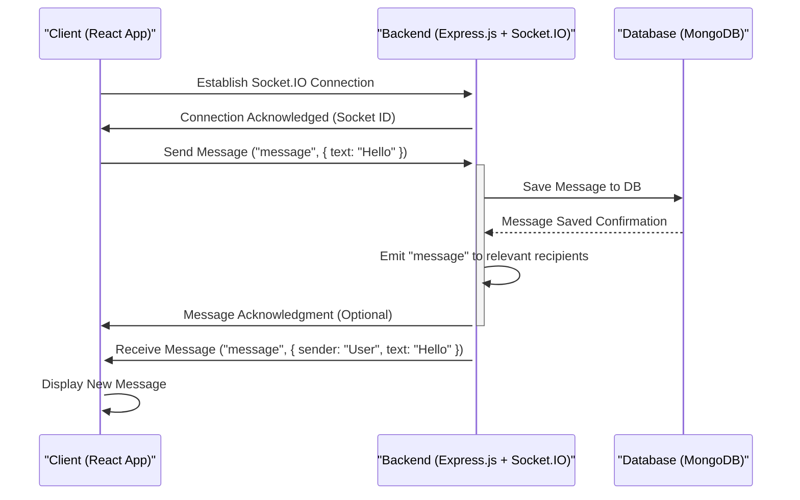

 # System Overview

The Chat-App-MERN project is a real-time messaging application built using the MERN stack (MongoDB, Express.js, React, Node.js). It provides a foundational architecture for creating interactive chat experiences, demonstrating key principles of full-stack web development, authentication, and real-time communication.

## Core Purpose and Features

The primary goal of this project is to showcase a functional, real-time chat application. It's designed to facilitate instant messaging between users, featuring a robust backend infrastructure and a dynamic frontend user interface.

Key features and architectural considerations include:

*   **Real-time Messaging:** Utilizes WebSockets via Socket.IO to enable instant message delivery between connected clients.
*   **User Authentication:** Implements secure user registration and login mechanisms, likely involving JWT (JSON Web Tokens) and potentially OAuth with Google for external authentication. Password hashing with `bcryptjs` ensures security.
*   **User Management:** Handles user profiles, including unique usernames and potentially profile pictures managed through services like Cloudinary.
*   **Scalable Architecture:** Built upon the MERN stack, offering a component-based frontend and a modular backend, making it extendable for future enhancements.
*   **Monolithic Deployment Structure:** The project's build scripts suggest a combined deployment approach where both frontend and backend assets are managed within a single repository, simplifying development and deployment workflows for smaller to medium-sized applications.

## Technology Stack

The Chat-App-MERN project leverages a modern, full-stack JavaScript ecosystem:

*   **MongoDB:** A NoSQL database used for storing application data, including user profiles, chat messages, and conversations. Its flexible document-based structure is ideal for chat data.
*   **Express.js:** A fast, opinionated, minimalist web framework for Node.js. It forms the backbone of the backend API, handling routing, middleware, and request/response cycles.
*   **React:** A declarative, efficient, and flexible JavaScript library for building user interfaces. It powers the frontend of the chat application, providing a dynamic and responsive user experience.
*   **Node.js:** A JavaScript runtime built on Chrome's V8 JavaScript engine. It provides the server-side environment for Express.js and enables the execution of JavaScript outside the browser.

Beyond the core MERN stack, several crucial libraries and tools are integrated to deliver specific functionalities:

*   **Socket.IO:** A library for real-time, bidirectional, event-based communication. It allows for persistent connections between the client and server, essential for instant message delivery.
*   **JSON Web Tokens (JWT):** Used for secure transmission of information between parties as a JSON object, primarily for user authentication and authorization.
*   **`bcryptjs`:** A library to hash passwords, ensuring they are stored securely in the database.
*   **`cloudinary`:** A cloud-based image and video management service, likely used for storing user profile pictures or shared media within chats.
*   **`passport` and `passport-google-oauth20`:** Middleware for Node.js that simplifies authentication. This specific strategy indicates support for Google OAuth for easy sign-ins.
*   **`cookie-parser`:** Middleware to parse cookies attached to the client request object.
*   **`dotenv`:** A zero-dependency module that loads environment variables from a `.env` file into `process.env`.

The primary dependencies for the backend are visible in the `backend/package.json` file:

```json
{
  "name": "backend",
  "version": "1.0.0",
  "main": "src/index.js",
  "scripts": {
    "dev": "nodemon src/index.js",
    "start": "node src/index.js"
  },
  "dependencies": {
    "bcryptjs": "^2.4.3",
    "cloudinary": "^2.5.1",
    "cookie-parser": "^1.4.7",
    "dotenv": "^16.4.7",
    "express": "^4.21.2",
    "express-session": "^1.18.1",
    "jsonwebtoken": "^9.0.2",
    "mongoose": "^8.9.5",
    "passport": "^0.7.0",
    "passport-google-oauth20": "^2.0.0",
    "socket.io": "^4.8.1"
  },
  "devDependencies": {
    "nodemon": "^3.1.9"
  }
}
```
This snippet highlights the essential packages for server operation, including `socket.io` for real-time features and `jsonwebtoken` for secure session management.
[View on GitHub](https://github.com/shinymack/Chat-App-MERN/blob/main/backend/package.json)

## Project Structure and Build Process

The project is structured to manage both frontend and backend components within a single repository, leveraging the npm `scripts` definitions in the root `package.json` for orchestration.

The root `package.json` defines commands to set up and run the entire application:

```json
{
  "name": "chatapp",
  "version": "1.0.0",
  "main": "index.js",
  "scripts": {
    "build" : "npm install --prefix backend && npm install --prefix frontend && npm run build --prefix frontend",
    "start" : "npm run start --prefix backend"
  },
  "keywords": [],
  "author": "",
  "license": "ISC",
  "description": ""
}
```
[View on GitHub](https://github.com/shinymack/Chat-App-MERN/blob/main/package.json)

*   **`build` Script:** This command performs a sequential setup:
    1.  `npm install --prefix backend`: Installs all dependencies required for the Express.js server.
    2.  `npm install --prefix frontend`: Installs all dependencies for the React client application (assuming a `frontend` directory with its own `package.json`).
    3.  `npm run build --prefix frontend`: Executes the build script defined within the frontend's `package.json`, typically compiling React source code into static assets for deployment.
*   **`start` Script:** This command initiates the backend server:
    1.  `npm run start --prefix backend`: Runs the start script specified in the `backend/package.json`, which typically launches the Node.js server (e.g., `node src/index.js`).

This setup allows for a streamlined development and deployment workflow, where a single command can prepare and launch the entire application.

## System Architecture

The Chat-App-MERN project follows a client-server architecture with a clear separation of concerns, typical of MERN stack applications.


```mermaid
graph TD
    A["Client (React App)"] -->|HTTP/REST API Requests| B["Backend (Express.js)"]
    A -->|WebSocket Connection (Socket.IO)| B
    B -->|Database Operations (Mongoose)| C["Database (MongoDB)"]
    D["Cloud Storage (Cloudinary)"] -.->|Image/Media Upload & Retrieval| B
    B -->|Authentication/Authorization| E["JWT & Passport.js"]
```


*This diagram illustrates the primary components and their communication flows within the Chat-App-MERN system. The Client (React App) interacts with the Backend (Express.js) for both standard API requests and real-time communication via WebSockets. The Backend persists data in MongoDB and handles auxiliary services like Cloudinary for storage and JWT/Passport.js for authentication.*

## Key Integration Points

### Real-time Communication with Socket.IO

The most critical integration for a chat application is real-time communication. This project uses Socket.IO, which wraps WebSockets, to enable instant message exchange.





*This sequence diagram details the process of sending a message in the chat application. The Client initiates a Socket.IO connection. When a message is sent, the Backend receives it, saves it to the Database, and then broadcasts it to other connected clients in real-time. This highlights the event-driven nature of Socket.IO for interactive features.*

### Authentication and Authorization

User authentication is managed through `jsonwebtoken` and `cookie-parser` for handling session tokens, and `bcryptjs` for secure password storage. The inclusion of `passport` and `passport-google-oauth20` also suggests that users can authenticate using their Google accounts, providing a convenient and secure login option. When a user logs in, the backend typically issues a JWT that the frontend stores (e.g., in an HTTP-only cookie or local storage) and sends with subsequent requests to prove identity.

### API Endpoints

The Express.js backend exposes a set of RESTful API endpoints for various operations such as:

*   **User Management:** Registering new users, logging in, fetching user profiles.
*   **Conversation Management:** Creating new conversations, listing user's conversations.
*   **Message Management:** Sending messages (via Socket.IO and potentially REST for initial history fetching), retrieving message history.
*   **Media Uploads:** Interacting with Cloudinary for profile pictures or shared media.

These endpoints serve as the communication bridge for initial data loading and non-real-time operations, complementing the real-time capabilities provided by Socket.IO. The frontend consumes these APIs to display data and trigger actions.