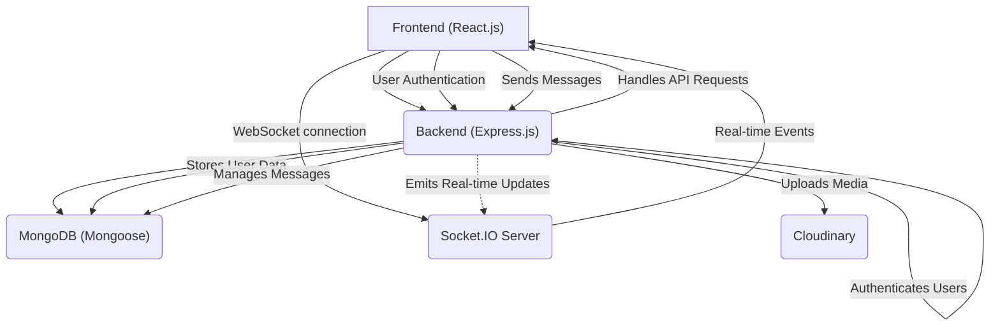
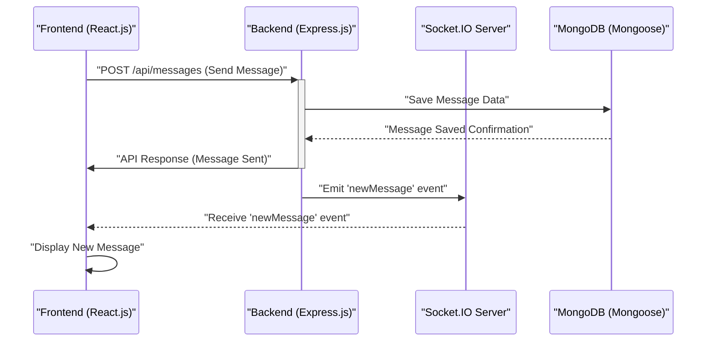

 # System Overview

Welcome to the System Overview of our MERN stack chat application. This document provides a high-level introduction to the application's architecture, core components, and the technologies that power its real-time communication capabilities. Built with modern web development practices, this application demonstrates a robust and scalable approach to building interactive chat platforms.

The primary purpose of this application is to facilitate instant messaging between users, supporting features such as user authentication, message exchange, and potentially direct or group conversations. It leverages the power of the MERN stack for full-stack development, ensuring a seamless experience from the database to the user interface.

## Core Functionalities

The chat application offers a range of essential features designed to provide a comprehensive messaging experience:

*   **User Authentication & Authorization**: Secure user registration and login, often including social login integration.
*   **Real-time Messaging**: Instant delivery of messages using WebSockets.
*   **User Management**: Profiles, status updates, and potentially contact lists.
*   **Persistent Storage**: Messages and user data are stored reliably in a database.
*   **Responsive UI**: A user interface that works across various devices.
*   **Cloud Storage for Media**: Support for storing and serving user-uploaded content like profile pictures.

## Technology Stack

The application is built upon the robust MERN stack, an acronym for MongoDB, Express.js, React.js, and Node.js. Each component plays a crucial role in the system's architecture.

### Backend Technologies (Node.js & Express.js)

The backend is developed with Node.js and the Express.js framework, providing a powerful and efficient environment for API development. It handles all server-side logic, database interactions, and real-time communication.

| Category        | Key Dependencies                                                              | Purpose                                                               |
| :-------------- | :---------------------------------------------------------------------------- | :-------------------------------------------------------------------- |
| **Server**      | `express`, `express-session`, `socket.io`                                     | Web server, session management, real-time communication               |
| **Database**    | `mongoose`                                                                    | MongoDB object data modeling (ODM)                                    |
| **Authentication** | `bcryptjs`, `jsonwebtoken`, `cookie-parser`, `passport`, `passport-google-oauth20` | Password hashing, JWTs, cookie handling, OAuth 2.0 (Google)           |
| **Cloud Storage** | `cloudinary`                                                                  | Cloud-based image and video management                                |
| **Utilities**   | `dotenv`, `nodemon` (dev)                                                     | Environment variables, automatic server restarts during development   |

A snippet from the backend's `package.json` reveals the core dependencies:

```json
// backend/package.json
{
  "name": "backend",
  "version": "1.0.0",
  "main": "src/index.js",
  "scripts": {
    "dev": "nodemon src/index.js",
    "start": "node src/index.js"
  },
  "dependencies": {
    "bcryptjs": "^2.4.3",
    "cloudinary": "^2.5.1",
    "cookie-parser": "^1.4.7",
    "dotenv": "^16.4.7",
    "express": "^4.21.2",
    "express-session": "^1.18.1",
    "jsonwebtoken": "^9.0.2",
    "mongoose": "^8.9.5",
    "passport": "^0.7.0",
    "passport-google-oauth20": "^2.0.0",
    "socket.io": "^4.8.1"
  },
  "devDependencies": {
    "nodemon": "^3.1.9"
  }
}
```
[View `backend/package.json` on GitHub](https://github.com/shinymack/Chat-App-MERN/blob/main/backend/package.json)

The `nodemon` script is particularly useful for development, automatically restarting the server whenever code changes are detected, as shown in the `scripts` section.

### Frontend Technologies (React.js)

The frontend is a single-page application built with React.js, providing a dynamic and interactive user interface. It consumes APIs from the backend and manages real-time interactions with the `socket.io-client`.

| Category        | Key Dependencies                                                              | Purpose                                                                   |
| :-------------- | :---------------------------------------------------------------------------- | :------------------------------------------------------------------------ |
| **Framework**   | `react`, `react-dom`                                                          | Core React library for building UI components                             |
| **Routing**     | `react-router-dom`                                                            | Client-side routing for navigation                                        |
| **State Mgmt**  | `zustand`                                                                     | Lightweight state management library                                      |
| **API Client**  | `axios`                                                                       | Promise-based HTTP client for making API requests                         |
| **Real-time**   | `socket.io-client`                                                            | Client-side library for WebSocket communication with `socket.io` server   |
| **UI/UX**       | `lucide-react`, `react-icons`, `react-hot-toast`, `daisyui` (dev), `tailwindcss` (dev) | Icon libraries, toast notifications, UI component library, CSS framework |
| **Dev Tools**   | `vite`, `@vitejs/plugin-react` (dev)                                          | Fast build tool for modern web projects                                   |

Here's a look at the frontend's `package.json` for its dependencies:

```json
// frontend/package.json
{
  "name": "frontend",
  "private": true,
  "version": "0.0.0",
  "type": "module",
  "scripts": {
    "dev": "vite",
    "build": "vite build",
    "lint": "eslint .",
    "preview": "vite preview",
    "mobile": "vite --host"
  },
  "dependencies": {
    "axios": "^1.7.9",
    "cors": "^2.8.5",
    "lucide-react": "^0.471.1",
    "react": "^18.3.1",
    "react-dom": "^18.3.1",
    "react-hot-toast": "^2.5.1",
    "react-icons": "^5.5.0",
    "react-router-dom": "^7.1.1",
    "socket.io-client": "^4.8.1",
    "zustand": "^5.0.3"
  },
  "devDependencies": {
    "@eslint/js": "^9.17.0",
    "@types/react": "^18.3.18",
    "@types/react-dom": "^18.3.5",
    "@vitejs/plugin-react": "^4.3.4",
    "autoprefixer": "^10.4.20",
    "daisyui": "^4.12.23",
    "eslint": "^9.17.0",
    "eslint-plugin-react": "^7.37.2",
    "eslint-plugin-react-hooks": "^5.0.0",
    "eslint-plugin-react-refresh": "^0.4.16",
    "globals": "^15.14.0",
    "postcss": "^8.5.0",
    "tailwindcss": "^3.4.17",
    "vite": "^6.3.5"
  }
}
```
[View `frontend/package.json` on GitHub](https://github.com/shinymack/Chat-App-MERN/blob/main/frontend/package.json)

The `vite` scripts (`dev`, `build`, `preview`) provide a rapid development experience for the React application.

### Root `package.json`

The root `package.json` acts as an orchestrator, defining scripts to manage both frontend and backend operations, particularly for building and starting the entire application.

```json
// package.json
{
  "name": "chatapp",
  "version": "1.0.0",
  "main": "index.js",
  "scripts": {
    "build" : "npm install --prefix backend && npm install --prefix frontend && npm run build --prefix frontend",
    "start" : "npm run start --prefix backend"
  },
  "keywords": [],
  "author": "",
  "license": "ISC",
  "description": ""
}
```
[View `package.json` on GitHub](https://github.com/shinymack/Chat-App-MERN/blob/main/package.json)

The `build` script ensures that both the backend and frontend dependencies are installed, and then the frontend is built for production. The `start` script initiates the backend server.

## High-Level System Architecture

The MERN stack chat application follows a client-server architecture, where the React frontend communicates with the Node.js/Express backend. Real-time communication is facilitated by Socket.IO.





This diagram illustrates the primary flow: The frontend (A) interacts with the backend (B) for standard API requests (e.g., authentication, message history). The backend then interacts with MongoDB (C) for data persistence and Cloudinary (E) for media storage. For real-time features, the frontend (A) establishes a WebSocket connection with the Socket.IO server (D), which is typically integrated with or part of the backend (B). The backend can then emit real-time updates through Socket.IO (D) back to the connected clients (A).

## Data Flow for a Message Exchange

When a user sends a message, a specific sequence of events and interactions occurs across the system components to ensure the message is delivered, stored, and displayed in real-time.





This sequence details how a message travels: The Frontend (F) sends the message via an API call to the Backend (B). The Backend (B) saves it to MongoDB (M) and then emits a real-time event through the Socket.IO Server (D) to all relevant clients (F), ensuring instant updates without page refreshes.

## Key Integration Points

The integration points within this MERN stack application are critical for its functionality and responsiveness:

*   **API Endpoints (Frontend ↔ Backend)**: RESTful APIs form the backbone of communication for non-real-time operations, such as user registration, login, fetching user profiles, and retrieving message history. `axios` is typically used on the frontend to make these requests.
*   **WebSocket Connections (Frontend ↔ Socket.IO Server)**: This is crucial for real-time features. The `socket.io-client` on the frontend maintains a persistent connection with the `socket.io` server on the backend. This allows for instant delivery of messages, typing indicators, and online status updates.
*   **Database Interactions (Backend ↔ MongoDB)**: Mongoose acts as an ODM layer, simplifying interactions with MongoDB. It maps application data to database documents and handles validation and queries.
*   **Authentication Flow**: The backend integrates `jsonwebtoken` and `cookie-parser` for secure, stateless authentication using JSON Web Tokens (JWTs). These tokens are often stored in HTTP-only cookies on the client side, mitigating XSS attacks. `passport-google-oauth20` enables seamless Google login.
*   **Cloud Storage Integration (Backend ↔ Cloudinary)**: For managing media files (like profile pictures or shared images), `cloudinary` is integrated on the backend. When a file is uploaded, the backend handles the secure transfer to Cloudinary, and stores the resulting URL in MongoDB.

Best practices for these integrations include thorough input validation on the backend, robust error handling across both client and server, and securing API endpoints with proper authentication and authorization checks. For real-time data, careful event structuring and rate limiting on Socket.IO can prevent abuse and ensure stable performance.

Next: [Backend Architecture](./2_backend-architecture.mdx)