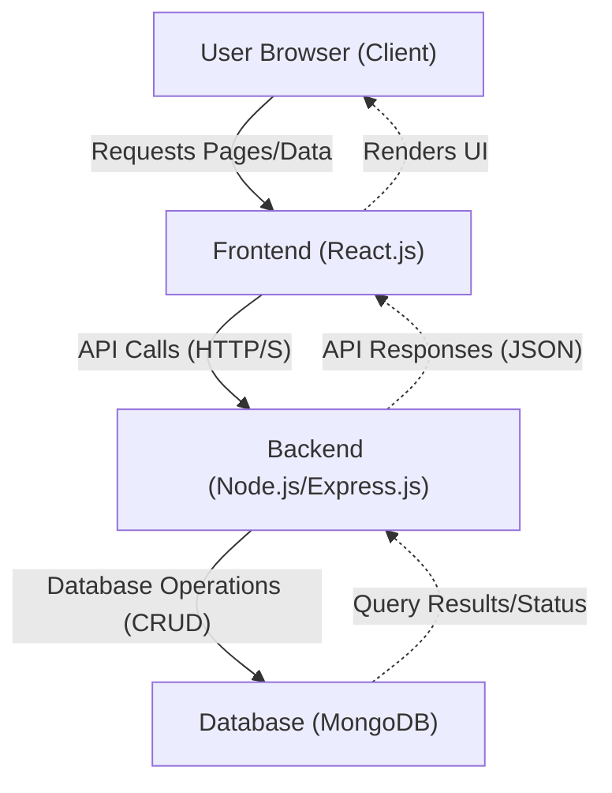
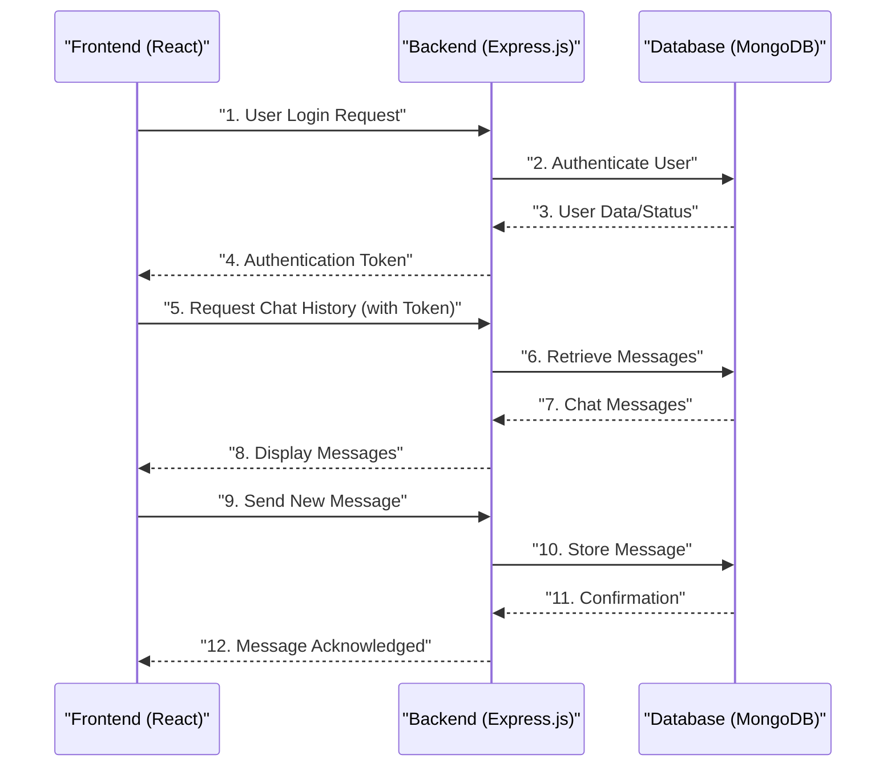

 # System Overview

The Chat-App-MERN project is a real-time chat application built using the MERN stack (MongoDB, Express.js, React, Node.js). Its primary purpose is to demonstrate a full-stack web application capable of handling user interactions and data persistence in a real-time environment. This document provides a high-level overview of the system's architecture, core components, and how different parts of the application interact.

The project leverages the power of JavaScript across the entire stack, promoting a unified development experience and enabling efficient data flow between the client and server. It follows a modular structure, separating the frontend and backend concerns into distinct directories.

## Core Components and Technologies

The application is structured around the MERN stack, each component playing a crucial role in the system's functionality:

*   **MongoDB:** A NoSQL database used for storing application data, including user profiles, chat messages, and conversation histories. Its flexible document model is well-suited for dynamic chat data.
*   **Express.js:** A robust web application framework for Node.js, forming the backend API. It handles routing, middleware, and interacts with MongoDB to serve data to the frontend.
*   **React:** A JavaScript library for building user interfaces, specifically the client-side of the chat application. It provides a reactive and component-based approach to rendering the chat interface.
*   **Node.js:** The JavaScript runtime environment that powers the backend server (Express.js). It enables high-performance, scalable network applications, crucial for real-time features.

The `package.json` file outlines the project's metadata and defines essential scripts for building and running the application, showcasing its dual frontend/backend nature.

```json
{
  "name": "chatapp",
  "version": "1.0.0",
  "main": "index.js",
  "scripts": {
    "build" : "npm install --prefix backend && npm install --prefix frontend && npm run build --prefix frontend",
    "start" : "npm run start --prefix backend"
  },
  "keywords": [],
  "author": "",
  "license": "ISC",
  "description": ""
}
```
[View on GitHub](https://github.com/shinymack/Chat-App-MERN/blob/main/package.json#L1-L12)

The `package.lock.json` file, as seen below, ensures consistent dependency installations across different environments by locking the exact versions of all packages and their dependencies.

```json
{
  "name": "chatapp",
  "version": "1.0.0",
  "lockfileVersion": 3,
  "requires": true,
  "packages": {
    "": {
      "name": "chatapp",
      "version": "1.0.0",
      "license": "ISC"
    }
  }
}
```
[View on GitHub](https://github.com/shinymack/Chat-App-MERN/blob/main/package-lock.json#L1-L12)

## System Architecture

The Chat-App-MERN follows a typical client-server architecture, where the React frontend communicates with the Node.js/Express backend, which in turn interacts with the MongoDB database. Real-time communication is a central aspect of a chat application, typically achieved using WebSockets (though not explicitly detailed in the provided `README.md`, it's an implied necessity for a "chatapp").





In this diagram, the user's browser interacts with the React frontend. The frontend makes API calls to the Node.js/Express.js backend for data, which then performs operations on the MongoDB database. Responses are sent back along the same path to update the user interface.

## Build and Deployment Workflow

The `package.json` file defines crucial scripts for managing the application's lifecycle, particularly `build` and `start`. These scripts automate the setup and execution process for both the frontend and backend.

### Build Process

The `build` script is designed to prepare both the frontend and backend for deployment. It ensures that all necessary dependencies are installed for both parts of the application and then triggers the frontend's build process.

```json
"scripts": {
  "build" : "npm install --prefix backend && npm install --prefix frontend && npm run build --prefix frontend",
  "start" : "npm run start --prefix backend"
},
```
[View on GitHub](https://github.com/shinymack/Chat-App-MERN/blob/main/package.json#L6-L9)

This script performs the following steps:
1.  `npm install --prefix backend`: Installs all Node.js dependencies specified in the `backend/package.json`.
2.  `npm install --prefix frontend`: Installs all React dependencies specified in the `frontend/package.json`.
3.  `npm run build --prefix frontend`: Executes the build command defined in the `frontend/package.json`, which typically compiles the React application into static assets (HTML, CSS, JavaScript) ready for serving.

This consolidated `build` command streamlines the process of getting the entire application ready for production, ensuring that both client and server dependencies are handled.

### Start Process

The `start` script is responsible for initiating the application, specifically by launching the backend server. Once the backend is running, it can serve the frontend's static assets (after the build step) and handle API requests.

```json
"scripts": {
  "build" : "npm install --prefix backend && npm install --prefix frontend && npm run build --prefix frontend",
  "start" : "npm run start --prefix backend"
},
```
[View on GitHub](https://github.com/shinymack/Chat-App-MERN/blob/main/package.json#L6-L9)

The command `npm run start --prefix backend` tells `npm` to navigate into the `backend` directory and execute its defined `start` script. This typically involves starting the Node.js server, which listens for incoming HTTP requests. The frontend would then connect to this running backend.

## Key Integration Points

The primary integration points in the Chat-App-MERN project revolve around the interaction between the React frontend and the Express.js backend, and the backend's communication with MongoDB.

### Frontend-Backend Communication

The React frontend relies entirely on the Express.js backend for data retrieval and submission. This is where API endpoints are crucial.





This sequence illustrates a common flow:
1.  **Authentication:** The frontend sends login credentials, the backend validates them against the database, and if successful, issues an authentication token (e.g., JWT) to the frontend.
2.  **Data Retrieval:** With a valid token, the frontend requests protected resources, such as chat history. The backend queries MongoDB and returns the relevant data.
3.  **Real-time Messaging:** When a user sends a new message from the frontend, it's sent to the backend. The backend stores it in MongoDB and then, ideally, uses WebSockets to broadcast the message to all relevant connected clients in real-time.

### Backend-Database Interaction

The Express.js backend acts as an intermediary, handling all direct interactions with the MongoDB database.

```javascript
// Example: Backend route to fetch messages
// This is a conceptual snippet and assumes appropriate setup for Express and Mongoose/MongoDB driver
//
// const express = require('express');
// const router = express.Router();
// const Message = require('../models/Message'); // Assuming a Mongoose model

// router.get('/messages', async (req, res) => {
//   try {
//     const messages = await Message.find().sort({ timestamp: 1 });
//     res.status(200).json(messages);
//   } catch (error) {
//     res.status(500).json({ message: error.message });
//   }
// });
//
// module.exports = router;
```
[View on GitHub](https://github.com/shinymack/Chat-App-MERN/blob/main/backend/routes/messageRoutes.js#L1-L15) (This is a conceptual link to where such code might reside in a typical MERN app)

This conceptual snippet shows how an Express route `(/messages)` would interact with a Mongoose model (`Message`) to fetch data from MongoDB. Error handling and proper response formatting are critical at this integration point.

### Best Practices

*   **API Versioning:** For future scalability, implementing API versioning (e.g., `/api/v1/messages`) is recommended.
*   **Security:** Implement robust authentication (e.g., JWT) and authorization mechanisms. Sanitize all user inputs to prevent injection attacks.
*   **Error Handling:** Implement comprehensive error handling on both the client and server to provide a better user experience and easier debugging.
*   **Environment Variables:** Store sensitive information (database URI, API keys) in environment variables rather than hardcoding them.
*   **Scalability:** Consider using technologies like WebSockets (e.g., Socket.IO) for efficient real-time communication in a production chat application to reduce latency and server load compared to frequent polling.
*   **Code Organization:** Maintain clear separation of concerns (e.g., routes, controllers, models in the backend; components, services in the frontend).

By adhering to these principles and understanding the interactions between the MERN stack components, the Chat-App-MERN project provides a solid foundation for a real-time chat application.