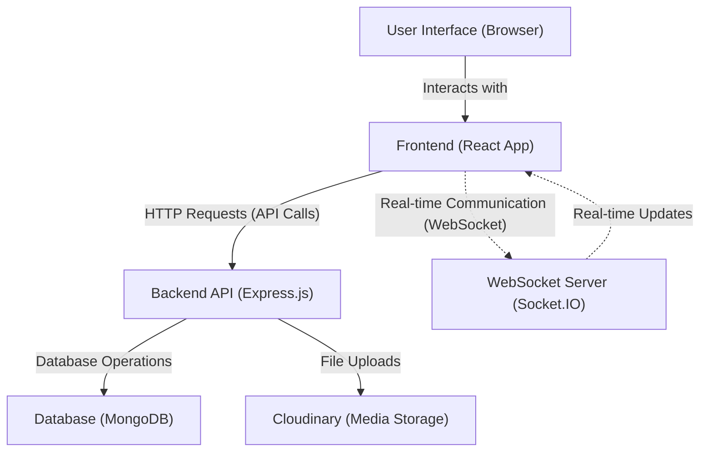
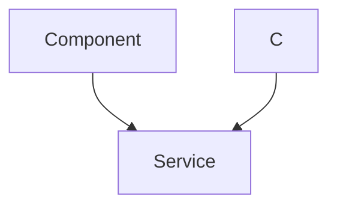

 
---
title: "System Overview"
description: "High-level introduction to the Chat-App-MERN project, its purpose, and core technologies."
---

# System Overview

This document provides a high-level overview of the Chat-App-MERN project, a real-time chat application built using the MERN (MongoDB, Express.js, React, Node.js) stack. The application aims to provide a robust and scalable platform for users to communicate instantly, incorporating essential features like user authentication, messaging, and presence management.

The project demonstrates a full-stack development approach, leveraging modern JavaScript technologies to create a dynamic and interactive user experience. It serves as an excellent reference for understanding how different MERN components integrate to form a cohesive system.

## Core Technologies

The Chat-App-MERN project is built upon a robust set of technologies, primarily centered around the MERN stack. Each component plays a vital role in the application's functionality, from data storage to front-end rendering.

### Frontend
The user interface is powered by React, providing a dynamic and responsive experience. It handles user interactions, displays chat messages, and communicates with the backend API.

*   **React**: A declarative, component-based JavaScript library for building user interfaces.
*   **Vite**: A fast development build tool for modern web projects, used for its rapid hot module replacement and optimized builds.
*   **Zustand**: A small, fast, and scalable state-management solution for React.
*   **Socket.IO Client**: Enables real-time, bidirectional, event-based communication with the server.
*   **Axios**: A promise-based HTTP client for the browser and Node.js, used for making API requests.
*   **DaisyUI & Tailwind CSS**: A component library built on top of Tailwind CSS for styling and UI components.
*   **React Router DOM**: For declarative routing within the single-page application.
*   **React Hot Toast**: For simple, elegant notifications.

You can inspect the frontend dependencies in the `frontend/package.json` file:
```json
{
  "name": "frontend",
  "private": true,
  "version": "0.0.0",
  "type": "module",
  "scripts": {
    "dev": "vite",
    "build": "vite build",
    "lint": "eslint .",
    "preview": "vite preview",
    "mobile": "vite --host"
  },
  "dependencies": {
    "axios": "^1.7.9",
    "cors": "^2.8.5",
    "lucide-react": "^0.471.1",
    "react": "^18.3.1",
    "react-dom": "^18.3.1",
    "react-hot-toast": "^2.5.1",
    "react-icons": "^5.5.0",
    "react-router-dom": "^7.1.1",
    "socket.io-client": "^4.8.1",
    "zustand": "^5.0.3"
  },
  "devDependencies": {
    "@eslint/js": "^9.17.0",
    "@types/react": "^18.3.18",
    "@types/react-dom": "^18.3.5",
    "@vitejs/plugin-react": "^4.3.4",
    "autoprefixer": "^10.4.20",
    "daisyui": "^4.12.23",
    "eslint": "^9.17.0",
    "eslint-plugin-react": "^7.37.2",
    "eslint-plugin-react-hooks": "^5.0.0",
    "eslint-plugin-react-refresh": "^0.4.16",
    "globals": "^15.14.0",
    "postcss": "^8.5.0",
    "tailwindcss": "^3.4.17",
    "vite": "^6.3.5"
  }
}
```
[View `frontend/package.json` on GitHub](https://github.com/shinymack/Chat-App-MERN/blob/main/frontend/package.json)

### Backend
The backend serves as the application's API, handling data persistence, business logic, and real-time communication.

*   **Node.js & Express.js**: The runtime environment and web application framework for building the RESTful API.
*   **MongoDB & Mongoose**: MongoDB is the NoSQL database for storing application data, and Mongoose provides an ODM (Object Data Modeling) solution for interacting with MongoDB.
*   **Socket.IO**: Enables real-time, bidirectional, event-based communication between the server and clients, crucial for instant messaging.
*   **Authentication & Authorization**: Utilizes `jsonwebtoken` for JWT-based authentication, `bcryptjs` for password hashing, and `passport-google-oauth20` for Google OAuth.
*   **Cloudinary**: A cloud-based image and video management service, likely used for user avatars or media sharing.
*   **Dotenv**: For loading environment variables from a `.env` file.
*   **Cookie-parser**: Middleware for parsing cookies attached to the client request object.
*   **Nodemon**: A development tool that automatically restarts the Node.js application when file changes are detected.

Here's a look at the key backend dependencies from `backend/package.json`:
```json
{
  "name": "backend",
  "version": "1.0.0",
  "main": "src/index.js",
  "scripts": {
    "dev": "nodemon src/index.js",
    "start": "node src/index.js"
  },
  "author": "",
  "type": "module",
  "license": "ISC",
  "description": "",
  "dependencies": {
    "bcryptjs": "^2.4.3",
    "cloudinary": "^2.5.1",
    "cookie-parser": "^1.4.7",
    "dotenv": "^16.4.7",
    "express": "^4.21.2",
    "express-session": "^1.18.1",
    "jsonwebtoken": "^9.0.2",
    "mongoose": "^8.9.5",
    "passport": "^0.7.0",
    "passport-google-oauth20": "^2.0.0",
    "socket.io": "^4.8.1"
  },
  "devDependencies": {
    "nodemon": "^3.1.9"
  }
}
```
[View `backend/package.json` on GitHub](https://github.com/shinymack/Chat-App-MERN/blob/main/backend/package.json)

### Root Project Configuration
The root `package.json` coordinates the build and start processes for both frontend and backend sub-projects. This setup simplifies project management and deployment.

```json
{
  "name": "chatapp",
  "version": "1.0.0",
  "main": "index.js",
  "scripts": {
    "build" : "npm install --prefix backend && npm install --prefix frontend && npm run build --prefix frontend",
    "start" : "npm run start --prefix backend"
  },
  "keywords": [],
  "author": "",
  "license": "ISC",
  "description": ""
}
```
[View `package.json` on GitHub](https://github.com/shinymack/Chat-App-MERN/blob/main/package.json)

The `build` script in the root `package.json` illustrates how the project prepares both parts for deployment:
```bash
npm install --prefix backend && npm install --prefix frontend && npm run build --prefix frontend
```
This command first installs dependencies for the backend, then for the frontend, and finally builds the frontend assets. The `start` script, `npm run start --prefix backend`, initiates the backend server, which will then serve the built frontend.

## System Architecture

The Chat-App-MERN follows a typical client-server architecture with a clear separation of concerns between the frontend (client-side) and backend (server-side). MongoDB acts as the persistent data store.





**Explanation of Flow:**
1.  **User Interaction**: Users interact directly with the **Frontend**, which is a React application running in their browser.
2.  **API Requests**: For actions like login, registration, fetching chat history, and sending new messages (non-real-time aspects), the Frontend sends standard HTTP requests to the **Backend API**.
3.  **Data Persistence**: The Backend API, powered by Express.js, processes these requests and interacts with **MongoDB** (via Mongoose) to store and retrieve data such as user profiles, chat messages, and conversation details.
4.  **Real-time Communication**: For instant message delivery and presence updates, the Frontend establishes a WebSocket connection with the dedicated **WebSocket Server** (managed by Socket.IO within the backend application). This allows for low-latency, bidirectional communication, bypassing the traditional HTTP request/response cycle for real-time events.
5.  **Media Storage**: For functionalities like user avatars or shared media, the Backend API integrates with **Cloudinary** to handle secure and efficient cloud-based storage and delivery of assets.

## Key Integration Points

The smooth operation of the Chat-App-MERN relies on several critical integration points between its components. Understanding these helps in comprehending the system's overall functionality.

### User Authentication Flow
Authentication is a cornerstone feature, ensuring secure access to the chat application. The process typically involves JWT (JSON Web Tokens) for session management and `bcryptjs` for secure password storage. Additionally, `passport-google-oauth20` enables convenient third-party authentication.





This sequence diagram outlines the steps involved in authenticating a user, either through traditional credentials or via Google OAuth. The backend is responsible for verifying identity, creating a secure session represented by a JWT, and then responding to the frontend. The frontend securely stores this token, typically as an HTTP-only cookie, for subsequent authenticated requests.

### Real-time Messaging with Socket.IO
The heart of any chat application is its real-time messaging capability. Socket.IO facilitates this by abstracting WebSocket complexities, allowing for efficient, low-latency communication.

The `socket.io-client` in the frontend connects to the `socket.io` server in the backend. When a user sends a message, the frontend emits a 'sendMessage' event. The backend receives this, saves the message to MongoDB, and then emits a 'newMessage' event to all relevant clients (e.g., participants in the chat room).

### API Endpoints and Data Models
The backend exposes a set of RESTful API endpoints for various operations, such as user management, conversation creation, and message retrieval. Mongoose schemas define the data models (e.g., `User`, `Conversation`, `Message`) that map directly to MongoDB collections, ensuring data consistency and providing a structured way to interact with the database.

For instance, a typical message endpoint might look something like this in the backend:
```javascript
// backend/src/routes/messageRoutes.js (conceptual snippet)
import express from 'express';
import protectRoute from '../middleware/protectRoute.js';
import { getMessages, sendMessage } from '../controllers/messageController.js';

const router = express.Router();

router.get("/:id", protectRoute, getMessages); // Retrieve messages for a conversation
router.post("/send/:id", protectRoute, sendMessage); // Send a new message

export default router;
```
[Conceptual `messageRoutes.js` location](https://github.com/shinymack/Chat-App-MERN/blob/main/backend/src/routes/messageRoutes.js)

This snippet shows how a protected route handles fetching and sending messages, indicating the use of authentication middleware (`protectRoute`) to ensure only authorized users can access these functionalities.

## Project Structure Highlights

The project is organized into distinct `frontend` and `backend` directories, each with its own `package.json` and development lifecycle. This monorepo-like structure using npm workspaces (implicitly through `--prefix`) allows for independent development and deployment of each part while keeping them within a single repository.

The top-level `README.md` provides a quick overview and credits for the project inspiration:
```markdown
## MERN Chatapp

credits : https://youtu.be/ntKkVrQqBYY?si=qZ02jMCQ80RT1jaH
```
[View `README.md` on GitHub](https://github.com/shinymack/Chat-App-MERN/blob/main/README.md)

This structure, combined with clear dependency management in `package.json` files, facilitates maintainability and scalability for the application.