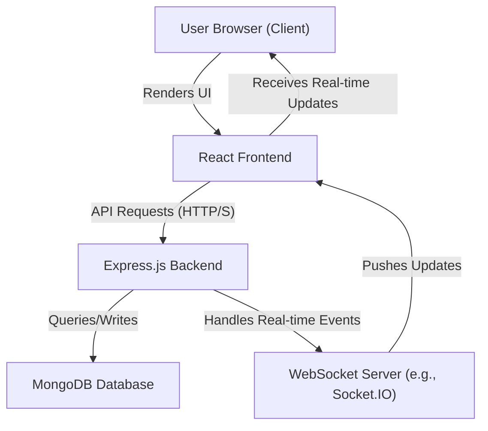

 # System Overview

The Chat-App-MERN project is a full-stack real-time chat application built using the MERN (MongoDB, Express.js, React, Node.js) stack. It provides users with a platform to communicate through direct messages and potentially group chats, leveraging modern web technologies for a responsive and interactive experience. This document provides a high-level overview of the system's architecture, core components, and how they interact.

## Purpose and Features

The primary purpose of the Chat-App-MERN is to demonstrate a functional chat application, built from scratch following a popular tutorial. It showcases the integration of various MERN stack components to handle user authentication, message persistence, and real-time communication.

Key features implied by the stack and common chat app requirements include:
*   User Registration and Authentication
*   Real-time Messaging
*   Database Persistence for Messages and User Data
*   Responsive User Interface

## Core Technologies

The application is built on the robust MERN stack, a popular choice for full-stack JavaScript development.

*   **MongoDB**: A NoSQL database used for storing application data, including user profiles and chat messages.
*   **Express.js**: A minimalist web framework for Node.js, forming the backend API for handling requests and business logic.
*   **React**: A JavaScript library for building user interfaces, powering the frontend of the chat application. The project utilizes [Vite](https://vitejs.dev/) for a fast development experience.
*   **Node.js**: A JavaScript runtime environment that executes server-side code, allowing Express.js to run.

The frontend specifically uses **React with Vite**, configured for fast refresh through plugins like [@vitejs/plugin-react](https://github.com/vitejs/vite-plugin-react/blob/main/packages/plugin-react/README.md) or [@vitejs/plugin-react-swc](https://github.com/vitejs/vite-plugin-react-swc).

## Project Structure and Build Process

The project adopts a structure where the frontend and backend components reside in separate directories within the root, often referred to as a monorepo-like setup. This separation allows for independent development and deployment of each part.

The `package.json` file at the root level orchestrates the build and start processes for both components:

```json
{
  "name": "chatapp",
  "version": "1.0.0",
  "main": "index.js",
  "scripts": {
    "build" : "npm install --prefix backend && npm install --prefix frontend && npm run build --prefix frontend",
    "start" : "npm run start --prefix backend"
  },
  "keywords": [],
  "author": "",
  "license": "ISC",
  "description": ""
}
```
[View package.json on GitHub](https://github.com/shinymack/Chat-App-MERN/blob/main/package.json)

The `build` script first installs dependencies for both `backend` and `frontend`, then triggers the frontend's build process. The `start` script initiates the backend server.

### Frontend Development Setup

The `frontend` directory uses a standard React with Vite setup. Its `README.md` outlines the core tools:

```markdown
# React + Vite

This template provides a minimal setup to get React working in Vite with HMR and some ESLint rules.

Currently, two official plugins are available:

- [@vitejs/plugin-react](https://github.com/vitejs/vite-plugin-react/blob/main/packages/plugin-react/README.md) uses [Babel](https://babeljs.io/) for Fast Refresh
- [@vitejs/plugin-react-swc](https://swc.rs/) uses [SWC](https://swc.rs/) for Fast Refresh
```
[View frontend/README.md on GitHub](https://github.com/shinymack/Chat-App-MERN/blob/main/frontend/README.md)

This indicates a focus on performance and developer experience, utilizing Vite's Hot Module Replacement (HMR) and choice between Babel or SWC for faster refresh times during development.

## Architectural Overview

The application follows a client-server architecture. The React frontend serves as the client, making API requests to the Express.js backend. The backend handles business logic, interacts with the MongoDB database, and potentially facilitates real-time communication via WebSockets (a common feature for chat applications, though not explicitly detailed in the provided files, it's a staple of MERN chat apps).





## Key Integration Points

The core functionality relies on seamless communication between the frontend and backend, and the backend's efficient interaction with the database.

1.  **Client-Server API Communication**: The React frontend sends HTTP requests (GET, POST, PUT, DELETE) to the Express.js backend for operations such as user authentication, fetching chat history, sending messages, and managing user profiles.
2.  **Backend-Database Interaction**: Express.js uses an ODM (Object Data Modeling) library like Mongoose (common with MongoDB) to interact with the MongoDB database. This involves defining schemas, performing CRUD (Create, Read, Update, Delete) operations, and managing data integrity.
3.  **Real-time Communication**: For a chat application, real-time message exchange is crucial. This is typically handled by a WebSocket library (e.g., Socket.IO) integrated with both the Express.js backend and the React frontend. The backend acts as a WebSocket server, broadcasting messages to connected clients, and the frontend listens for these incoming messages to update the UI instantly.

### Build Script Insight

The main `package.json`'s `build` script demonstrates a crucial integration strategy for deployment:

```bash
npm install --prefix backend && npm install --prefix frontend && npm run build --prefix frontend
```
[View package.json build script on GitHub](https://github.com/shinymack/Chat-App-MERN/blob/main/package.json#L5)

This sequence ensures that:
*   All backend dependencies are installed.
*   All frontend dependencies are installed.
*   The frontend application is built into static assets, typically placed in a `build` or `dist` folder within the `frontend` directory. These static assets can then be served by the backend or a separate static file server.

### Application Start

Similarly, the `start` script points directly to the backend:

```bash
npm run start --prefix backend
```
[View package.json start script on GitHub](https://github.com/shinymack/Chat-App-MERN/blob/main/package.json#L6)

This implies that the backend server is responsible for:
1.  Running its own services (API endpoints, database connections).
2.  Potentially serving the static frontend assets (after they have been built).

## High-Level Data Flow for Messaging

A typical message flow would involve the user typing a message in the React frontend, which then sends it to the Express.js backend. The backend saves the message to MongoDB and then uses the WebSocket server to broadcast it to other relevant clients (e.g., all users in a chat room, or just the recipient in a direct message).


```mermaid
graph TD
    A["User sends message (React)"]
    B["Frontend API Call"]
    C["Express.js Backend (Controller)"]
    D["MongoDB (Save Message)"]
    E["Express.js Backend (WebSocket Emitter)"]
    F["WebSocket Server (Broadcast)"]
    G["Other Users' Frontend (React)"]
    H["Other Users' Browser"]

    A --> B|"POST /api/messages"|
    B --> C
    C --> D|"Save to 'messages' collection"|
    D --> C
    C --> E|"Emit 'newMessage' event"|
    E --> F
    F --> G|"Receive 'newMessage' event"|
    G --> H|"Update UI with new message"|
```