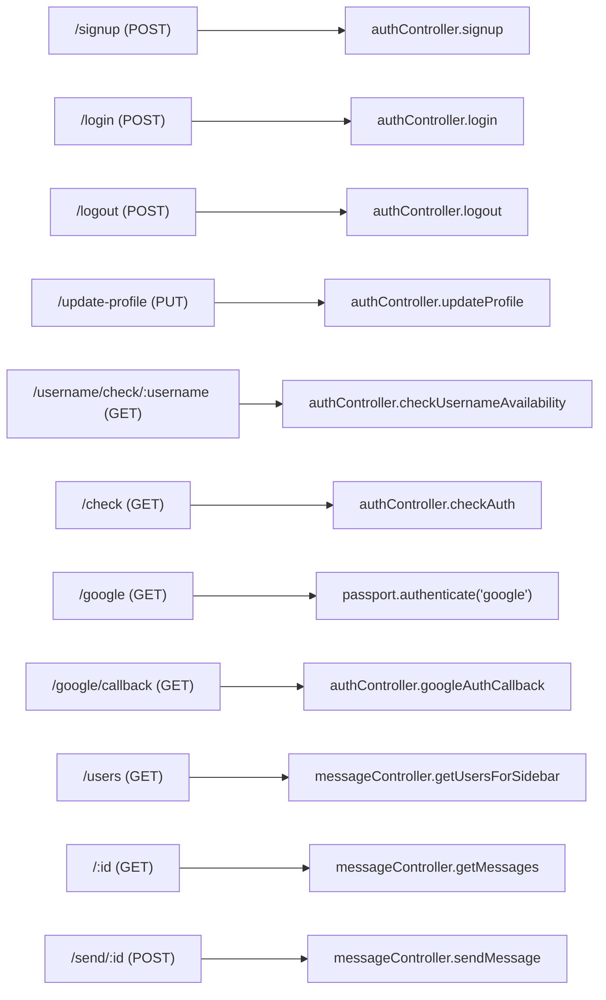
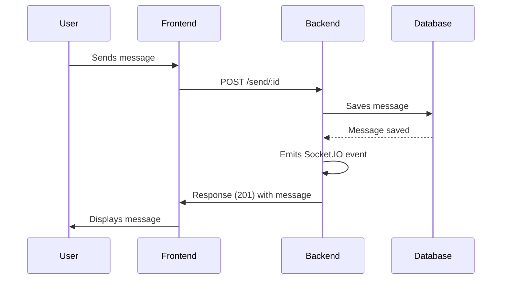

# API Endpoints and Controllers

This document outlines the API endpoints and their corresponding controllers in the `shinymack/Chat-App-MERN` project. It details how requests are handled for authentication and messaging features, providing insights into the backend logic.

## Authentication

The authentication flow manages user registration, login, logout, and profile updates. It uses JWT for secure session management.

### Signup

The `/signup` endpoint creates a new user account. It validates the input data and hashes the password before storing it in the database.

```javascript title="backend/src/controllers/auth.controller.js"
export const signup = async (req, res) => {
    const {username, email, password} = req.body;
    try {
        if(!username || !email || !password) {
            return res.status(400).json({message: "Please fill in all fields."});
        }
        // ... validation checks ...
        const salt = await bcrypt.genSalt(10);
        const hashedPassword = await bcrypt.hash(password, salt);

        const newUser = new User({
            username,
            email,
            password: hashedPassword,
            authProvider: 'email'
        });
        if(newUser){
            generateToken(newUser._id, res);
            await newUser.save();

            res.status(201).json({
                _id: newUser._id,
                username: newUser.username,
                email: newUser.email,   
                profilePic: newUser.profilePic,
                authProvider: newUser.authProvider
            });
        } else {
            res.status(400).json({message: "Invalid user data."});
        }
    } catch (error) {
        console.log("Error in signup controller", error.message)
        res.status(500).json({message: "Something went wrong."});
    }
};
```

This snippet demonstrates the signup controller, which handles user registration by validating user input, hashing the password, and saving the new user to the database. It also generates a JWT token upon successful registration.

[View on GitHub](https://github.com/shinymack/Chat-App-MERN/blob/main/backend/src/controllers/auth.controller.js)

### Login

The `/login` endpoint authenticates existing users. It checks if the provided email exists and verifies the password.

```javascript title="backend/src/controllers/auth.controller.js"
export const login = async (req, res) => {
    const {email, password} = req.body;
    try {
        const user = await User.findOne({email});

        if(!user) {
            return res.status(400).json({message: "Invalid credentials."});
        }

        const isPasswordCorrect = await bcrypt.compare(password, user.password);
        if(!isPasswordCorrect) {
            return res.status(400).json({message: "Invalid credentials."});
        }

        generateToken(user._id, res);
        res.status(200).json({
            _id: user._id,
            username: user.username,
            email: user.email,
            profilePic: user.profilePic,
            authProvider: user.authProvider,
        });
    } catch (error) {
        console.log("Error in login controller", error.message);
        res.status(500).json({message: "Something went wrong."});
    }
};
```

The login controller retrieves the user by email, checks the password, and generates a JWT token upon successful authentication.

[View on GitHub](https://github.com/shinymack/Chat-App-MERN/blob/main/backend/src/controllers/auth.controller.js)

### Logout

The `/logout` endpoint invalidates the user's session by clearing the JWT cookie.

```javascript title="backend/src/controllers/auth.controller.js"
export const logout = (req, res) => {
    try {
        res.cookie("jwt", "", {maxAge: 0});
        res.status(200).json({message: "Logged out successfully."})
    } catch(error) {
        console.log("Error in logout controller", error.message);
        res.status(500).json({message:"Internal Server Error"}); 
    }
};
```

This snippet clears the JWT cookie to log the user out.

[View on GitHub](https://github.com/shinymack/Chat-App-MERN/blob/main/backend/src/controllers/auth.controller.js)

### Update Profile

The `/update-profile` endpoint allows users to update their profile information, including profile picture and username.

```javascript title="backend/src/controllers/auth.controller.js"
export const updateProfile = async (req, res) => {
    try {
        const { profilePic, username } = req.body;
        const userId = req.user._id;
        let userToUpdate = await User.findById(userId);

        if (!userToUpdate) {
            return res.status(404).json({ message: "User not found." });
        }

        const fieldsToUpdate = {};
        let newUsername = username ? username.trim() : null;
        let usernameChanged = false;

        if (newUsername && newUsername !== userToUpdate.username) {
            if (newUsername.length < 3 || newUsername.length > 20) {
                return res.status(400).json({ message: "Username must be between 3 and 20 characters." });
            }
            const existingUserWithNewUsername = await User.findOne({ username: newUsername, _id: { $ne: userId } });
            if (existingUserWithNewUsername) {
                return res.status(400).json({ message: "This username is already taken by someone else." });
            }
            fieldsToUpdate.username = newUsername;
            usernameChanged = true;
        }

        if (profilePic) {
            const uploadResponse = await cloudinary.uploader.upload(profilePic);
            fieldsToUpdate.profilePic = uploadResponse.secure_url;
        }

        if (Object.keys(fieldsToUpdate).length === 0) {
            return res.status(400).json({ message: "No changes provided to update." });
        }

        const updatedUser = await User.findByIdAndUpdate(userId, { $set: fieldsToUpdate }, { new: true });

        if (!updatedUser) {
            return res.status(404).json({ message: "Failed to update user."});
        }

        generateToken(updatedUser._id, res);

        res.status(200).json(updatedUser);

    } catch (error) {
        console.error("Error in updateProfile controller", error.message);
        if (error.code === 11000 && error.keyValue && error.keyValue.username) {
            return res.status(400).json({ message: "This username is already taken." });
        }
        res.status(500).json({ message: "Internal Server Error while updating profile." });
    }
};
```

This controller updates the user's profile, including validation for the new username and uploading the profile picture to Cloudinary. A new JWT is generated after successful update.

[View on GitHub](https://github.com/shinymack/Chat-App-MERN/blob/main/backend/src/controllers/auth.controller.js)

### Check Username Availability

The `/username/check/:username` endpoint checks if a given username is available.

```javascript title="backend/src/controllers/auth.controller.js"
export const checkUsernameAvailability = async (req, res) => {
    try {
        const { username } = req.params;
        const currentUserId = req.user._id; 

        if (!username || username.trim().length < 3) {
            return res.status(400).json({ available: false, message: "Username must be at least 3 characters." });
        }
        if (username.trim().length > 20) {
            return res.status(400).json({ available: false, message: "Username cannot be more than 20 characters." });
        }
    
        if (req.user.username === username) {
            return res.status(200).json({ available: true, message: "This is your current username." });
        }

        const existingUser = await User.findOne({ username: username });

        if (existingUser) {
            return res.status(200).json({ available: false, message: "Username is already taken." });
        }

        res.status(200).json({ available: true, message: "Username is available." });

    } catch (error) {
        console.error("Error in checkUsernameAvailability:", error.message);
        res.status(500).json({ available: false, message: "Error checking username availability." });
    }
};
```

This controller checks if the username is available, validates the username length, and ensures the username doesn't already exist in the database.

[View on GitHub](https://github.com/shinymack/Chat-App-MERN/blob/main/backend/src/controllers/auth.controller.js)

### Google Authentication Callback

The `/google/callback` endpoint handles the callback after Google authentication.

```javascript title="backend/src/controllers/auth.controller.js"
export const googleAuthCallback = async (req, res) => {
 const frontendUrl = process.env.FRONTEND_URL || 'http://localhost:5173';

    try {
        if (!req.user) {
            return res.redirect(`${frontendUrl}/login?error=google_auth_failed`);
        }

        generateToken(req.user._id, res);

        res.redirect(frontendUrl);

    } catch (error) {
        console.error("Error in googleAuthCallback: ", error.message);
        res.redirect(`${frontendUrl}/login?error=google_auth_processing_error`);
    }
};
```

This controller generates a JWT token for the authenticated Google user and redirects them to the frontend.

[View on GitHub](https://github.com/shinymack/Chat-App-MERN/blob/main/backend/src/controllers/auth.controller.js)

## Messaging

The messaging flow handles retrieving users, fetching messages, and sending new messages. It uses Socket.IO for real-time updates.

### Get Users for Sidebar

The `/users` endpoint retrieves a list of users to display in the sidebar, excluding the logged-in user.

```javascript title="backend/src/controllers/message.controller.js"
export const getUsersForSidebar = async (req, res) => {
    try {
        const loggedInUserId = req.user._id;
        const filteredUsers = await User.find({
            _id: { $ne: loggedInUserId }}).select("-password");  
        res.status(200).json(filteredUsers);
    }
    catch (error) {
        console.log("Error in getUsersForSidebar: ", error);
        res.status(500).json({ error: "Internal Server Error" });
    }
};
```

This controller queries the database for users, excluding the current user, and returns the list.

[View on GitHub](https://github.com/shinymack/Chat-App-MERN/blob/main/backend/src/controllers/message.controller.js)

### Get Messages

The `/:id` endpoint retrieves messages between the logged-in user and a specific user.

```javascript title="backend/src/controllers/message.controller.js"
export const getMessages = async (req, res) => {
    try {
        const {id : userToChatId } = req.params;
        const myId = req.user._id;

        const messages = await Message.find({
            $or: [
                {senderId: myId, receiverId:userToChatId},
                {senderId: userToChatId, receiverId: myId}
            ]
        });
        res.status(200).json(messages);
    } catch (error) {
        console.log("Error in getMessages controller:  ", error);
        res.status(500).json({ error: "Internal Server Error" });
    }
};
```

This controller retrieves messages where either the logged-in user or the specified user is the sender or receiver.

[View on GitHub](https://github.com/shinymack/Chat-App-MERN/blob/main/backend/src/controllers/message.controller.js)

### Send Message

The `/send/:id` endpoint sends a new message from the logged-in user to a specified user.

```javascript title="backend/src/controllers/message.controller.js"
export const sendMessage = async (req, res) => {
    try {
        const { text, image } = req.body;
        const { id: receiverId } = req.params;
        const senderId = req.user._id;

        let imageUrl;
        if (image) {
            const uploadResponse = await cloudinary.uploader.upload(image);

            imageUrl = uploadResponse.secure_url;
        }
        const newMessage = new Message({
            senderId,
            receiverId,
            text,
            image: imageUrl,
        });

        await newMessage.save();

        const receiverSocketId = getReceiverSocketId(receiverId);

        if(receiverSocketId) {
            io.to(receiverSocketId).emit("newMessage", newMessage);
        }


        res.status(201).json(newMessage);   
        
    } catch (error) {
        console.log("Error in sendMessage controller:  ", error);
        res.status(500).json({ error: "Internal Server Error" });
    }
};
```

This controller creates a new message, uploads the image to Cloudinary if provided, saves the message to the database, and emits a Socket.IO event to notify the receiver.

[View on GitHub](https://github.com/shinymack/Chat-App-MERN/blob/main/backend/src/controllers/message.controller.js)

## API Route Diagram





This diagram illustrates the API routes and their corresponding controller functions.

## Key Integration Points

### Authentication Flow

The authentication flow is secured using JWTs. Upon successful signup or login, a JWT is generated and stored in a cookie. This cookie is then used to authenticate subsequent requests.

### Real-time Messaging

The real-time messaging functionality is implemented using Socket.IO. When a user sends a message, a Socket.IO event is emitted to notify the receiver, enabling instant updates.





This sequence diagram illustrates the flow of sending a message from the user to the database and back to the user's interface.

### Best Practices

*   **Input Validation:** Always validate user inputs to prevent errors and security vulnerabilities.
*   **Error Handling:** Implement proper error handling to provide informative error messages to the client.
*   **Security:** Use secure authentication mechanisms such as JWTs and bcrypt for password hashing.
*   **Real-time Updates:** Leverage Socket.IO for real-time updates to enhance the user experience.
```