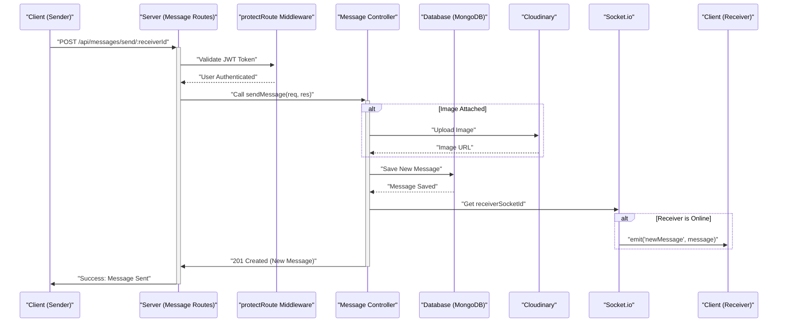

 # API Endpoints and Controllers

This section details the REST API endpoints implemented in the backend, focusing on authentication and messaging functionalities. It covers the purpose of each endpoint, the expected request/response structures, and the underlying controller logic that processes these requests. Understanding these components is crucial for comprehending how the application handles user interactions, manages data, and ensures secure communication.

## Authentication Endpoints and Controllers

The authentication module (`auth.route.js` and `auth.controller.js`) manages user registration, login, logout, profile updates, and authentication checks. It integrates with `bcryptjs` for password hashing, `jsonwebtoken` for token generation, `passport.js` for Google OAuth, and `cloudinary` for profile picture uploads.

### User Registration (`/api/auth/signup`)

This endpoint allows new users to create an account with a username, email, and password.

-   **Method**: `POST`
-   **URL**: `/api/auth/signup`
-   **Middleware**: None
-   **Controller**: `signup`

The `signup` controller handles input validation (username and password length, unique email/username), hashes the password, creates a new user record, and generates a JWT token upon successful registration.

```javascript
// backend/src/controllers/auth.controller.js
export const signup = async (req, res) => {
    const {username, email, password} = req.body;
    try {
        if(!username || !email || !password) {
            return res.status(400).json({message: "Please fill in all fields."});
        }
        // ... (username/password validation) ...
        const hashedPassword = await bcrypt.hash(password, salt);

        const newUser = new User({
            username, email, password: hashedPassword, authProvider: 'email'
        });
        if(newUser){
            generateToken(newUser._id, res); // Generate JWT and set cookie
            await newUser.save();
            res.status(201).json({_id: newUser._id, username: newUser.username, email: newUser.email, profilePic: newUser.profilePic, authProvider: newUser.authProvider});
        } else {
            res.status(400).json({message: "Invalid user data."});
        }
    } catch (error) {
        console.log("Error in signup controller", error.message)
        res.status(500).json({message: "Something went wrong."});
    }
};
```
[View on GitHub](https://github.com/shinymack/Chat-App-MERN/blob/main/backend/src/controllers/auth.controller.js#L7-L54)

### User Login (`/api/auth/login`)

Users can log in using their registered email and password.

-   **Method**: `POST`
-   **URL**: `/api/auth/login`
-   **Middleware**: None
-   **Controller**: `login`

The `login` controller verifies credentials, checks for Google OAuth users attempting email login, and generates a JWT token if authentication is successful.

```javascript
// backend/src/controllers/auth.controller.js
export const login = async (req, res) => {
    const {email, password} = req.body;
    try {
        const user = await User.findOne({email});
        if(!user) {
            return res.status(400).json({message: "Invalid credentials."});
        }
        if(user.authProvider === 'google' && !user.password){
            return res.status(400).json({ message: "Please sign in with Google." });
        }
        const isPasswordCorrect = await bcrypt.compare(password, user.password);
        if(!isPasswordCorrect) {
            return res.status(400).json({message: "Invalid credentials."});
        }
        generateToken(user._id, res);
        res.status(200).json({_id: user._id, username: user.username, email: user.email, profilePic: user.profilePic, authProvider: user.authProvider,});
    } catch (error) {
        console.log("Error in login controller", error.message);
        res.status(500).json({message: "Something went wrong."});
    }
};
```
[View on GitHub](https://github.com/shinymack/Chat-App-MERN/blob/main/backend/src/controllers/auth.controller.js#L56-L86)

### User Logout (`/api/auth/logout`)

This endpoint handles user logout by clearing the JWT cookie.

-   **Method**: `POST`
-   **URL**: `/api/auth/logout`
-   **Middleware**: None
-   **Controller**: `logout`

```javascript
// backend/src/controllers/auth.controller.js
export const logout = (req, res) => {
    try {
        res.cookie("jwt", "", {maxAge: 0});
        res.status(200).json({message: "Logged out successfully."})
    } catch(error) {
        console.log("Error in logout controller", error.message);
        res.status(500).json({message:"Internal Server Error"});
    }
};
```
[View on GitHub](https://github.com/shinymack/Chat-App-MERN/blob/main/backend/src/controllers/auth.controller.js#L88-L96)

### Check Authentication Status (`/api/auth/check`)

Verifies if a user is currently authenticated using the JWT token and returns user details.

-   **Method**: `GET`
-   **URL**: `/api/auth/check`
-   **Middleware**: `protectRoute` (ensures user is authenticated)
-   **Controller**: `checkAuth`

```javascript
// backend/src/routes/auth.route.js
router.get("/check", protectRoute, checkAuth)
```
[View on GitHub](https://github.com/shinymack/Chat-App-MERN/blob/main/backend/src/routes/auth.route.js#L18)

### Google OAuth Flow

The application supports signing in with Google using Passport.js.

-   **Initiate Google OAuth**:
    -   **Method**: `GET`
    -   **URL**: `/api/auth/google`
    -   **Middleware**: `passport.authenticate('google', { scope: ['profile', 'email'] })`
    -   **Description**: Redirects the user to Google for authentication.

-   **Google OAuth Callback**:
    -   **Method**: `GET`
    -   **URL**: `/api/auth/google/callback`
    -   **Middleware**: `passport.authenticate('google', { failureRedirect: 'http://localhost:5173/login', failureMessage: true })`
    -   **Controller**: `googleAuthCallback`
    -   **Description**: Handles the callback from Google, processes user data, generates a JWT, and redirects to the frontend.

### Profile Update (`/api/auth/update-profile`)

Allows an authenticated user to update their profile picture and/or username.

-   **Method**: `PUT`
-   **URL**: `/api/auth/update-profile`
-   **Middleware**: `protectRoute`
-   **Controller**: `updateProfile`

The `updateProfile` controller validates the new username for uniqueness and length, handles Cloudinary uploads for profile pictures, and updates the user record. A new JWT token is issued to reflect potential changes in user data.

```javascript
// backend/src/controllers/auth.controller.js
export const updateProfile = async (req, res) => {
    try {
        const { profilePic, username } = req.body;
        const userId = req.user._id;
        let userToUpdate = await User.findById(userId);

        if (!userToUpdate) { return res.status(404).json({ message: "User not found." }); }

        const fieldsToUpdate = {};
        let newUsername = username ? username.trim() : null;
        if (newUsername && newUsername !== userToUpdate.username) {
            // ... (username validation and uniqueness check) ...
            fieldsToUpdate.username = newUsername;
        }

        if (profilePic) {
            const uploadResponse = await cloudinary.uploader.upload(profilePic);
            fieldsToUpdate.profilePic = uploadResponse.secure_url;
        }

        if (Object.keys(fieldsToUpdate).length === 0) {
            return res.status(400).json({ message: "No changes provided to update." });
        }

        const updatedUser = await User.findByIdAndUpdate(userId, { $set: fieldsToUpdate }, { new: true });
        generateToken(updatedUser._id, res); // Refresh JWT
        res.status(200).json(updatedUser);
    } catch (error) {
        console.error("Error in updateProfile controller", error.message);
        res.status(500).json({ message: "Internal Server Error while updating profile." });
    }
};
```
[View on GitHub](https://github.com/shinymack/Chat-App-MERN/blob/main/backend/src/controllers/auth.controller.js#L173-L225)

### Username Availability Check (`/api/auth/username/check/:username`)

Checks if a given username is available or already taken.

-   **Method**: `GET`
-   **URL**: `/api/auth/username/check/:username`
-   **Middleware**: `protectRoute`
-   **Controller**: `checkUsernameAvailability`

```javascript
// backend/src/routes/auth.route.js
router.get("/username/check/:username", protectRoute, checkUsernameAvailability);
```
[View on GitHub](https://github.com/shinymack/Chat-App-MERN/blob/main/backend/src/routes/auth.route.js#L16)


```mermaid
sequenceDiagram
    participant C as "Client (Frontend)"
    participant S as "Server (Auth Routes)"
    participant A as "Auth Controller"
    participant D as "Database (MongoDB)"
    participant B as "bcryptjs"
    participant J as "JWT Utility"

    C->>+S: "POST /api/auth/signup"
    S->>+A: "Call signup(req, res)"
    A->>D: "Find user by email/username"
    D-->>A: "User check result"
    alt Input Validation Fails or User Exists
        A->>-S: "400 Bad Request"
        S->>-C: "Error: Invalid data or user exists"
    else User Data Valid and Unique
        A->>B: "Hash Password"
        B-->>A: "Hashed Password"
        A->>D: "Save New User (hashed password)"
        D-->>A: "New User Saved"
        A->>J: "Generate JWT Token (for newUser._id)"
        J-->>A: "JWT Token"
        A->>-S: "201 Created (User Data, JWT cookie)"
        S->>-C: "Success: New User Profile"
    end
```


## Messaging Endpoints and Controllers

The messaging module (`message.route.js` and `message.controller.js`) handles fetching users, retrieving messages for a chat, and sending new messages. It integrates with `cloudinary` for image uploads and `socket.io` for real-time communication.

### Get Users for Sidebar (`/api/messages/users`)

Retrieves a list of all users excluding the currently logged-in user, typically for populating a chat sidebar.

-   **Method**: `GET`
-   **URL**: `/api/messages/users`
-   **Middleware**: `protectRoute`
-   **Controller**: `getUsersForSidebar`

```javascript
// backend/src/controllers/message.controller.js
export const getUsersForSidebar = async (req, res) => {
    try {
        const loggedInUserId = req.user._id;
        const filteredUsers = await User.find({
            _id: { $ne: loggedInUserId }}).select("-password");
        res.status(200).json(filteredUsers);
    }
    catch (error) {
        console.log("Error in getUsersForSidebar: ", error);
        res.status(500).json({ error: "Internal Server Error" });
    }
};
```
[View on GitHub](https://github.com/shinymack/Chat-App-MERN/blob/main/backend/src/controllers/message.controller.js#L9-L19)

### Get Messages for a Conversation (`/api/messages/:id`)

Fetches all messages exchanged between the logged-in user and a specific `userToChatId`.

-   **Method**: `GET`
-   **URL**: `/api/messages/:id` (where `:id` is the receiver's user ID)
-   **Middleware**: `protectRoute`
-   **Controller**: `getMessages`

```javascript
// backend/src/controllers/message.controller.js
export const getMessages = async (req, res) => {
    try {
        const {id : userToChatId } = req.params;
        const myId = req.user._id;

        const messages = await Message.find({
            $or: [
                {senderId: myId, receiverId:userToChatId},
                {senderId: userToChatId, receiverId: myId}
            ]
        });
        res.status(200).json(messages);
    } catch (error) {
        console.log("Error in getMessages controller:  ", error);
        res.status(500).json({ error: "Internal Server Error" });
    }
};
```
[View on GitHub](https://github.com/shinymack/Chat-App-MERN/blob/main/backend/src/controllers/message.controller.js#L21-L37)

### Send Message (`/api/messages/send/:id`)

Allows the logged-in user to send a new message (text and/or image) to another user.

-   **Method**: `POST`
-   **URL**: `/api/messages/send/:id` (where `:id` is the receiver's user ID)
-   **Middleware**: `protectRoute`
-   **Controller**: `sendMessage`

The `sendMessage` controller handles image uploads to Cloudinary, saves the message to the database, and then uses `socket.io` to emit the new message in real-time to the receiver if they are online.

```javascript
// backend/src/controllers/message.controller.js
export const sendMessage = async (req, res) => {
    try {
        const { text, image } = req.body;
        const { id: receiverId } = req.params;
        const senderId = req.user._id;

        let imageUrl;
        if (image) {
            const uploadResponse = await cloudinary.uploader.upload(image);
            imageUrl = uploadResponse.secure_url;
        }
        const newMessage = new Message({
            senderId, receiverId, text, image: imageUrl,
        });

        await newMessage.save();

        const receiverSocketId = getReceiverSocketId(receiverId);
        if(receiverSocketId) {
            io.to(receiverSocketId).emit("newMessage", newMessage); // Real-time delivery
        }
        res.status(201).json(newMessage);
    } catch (error) {
        console.log("Error in sendMessage controller:  ", error);
        res.status(500).json({ error: "Internal Server Error" });
    }
};
```
[View on GitHub](https://github.com/shinymack/Chat-App-MERN/blob/main/backend/src/controllers/message.controller.js#L39-L69)





## Key Integration Points

The API design demonstrates several key architectural patterns and integrations:

*   **RESTful Design**: Endpoints are logically structured, using standard HTTP methods for CRUD operations (e.g., `POST` for create, `GET` for read, `PUT` for update).
*   **Authentication Middleware**: The `protectRoute` middleware is consistently used across protected endpoints to ensure that only authenticated users can access sensitive resources. This enhances security by centralizing authorization logic. [View `protectRoute` on GitHub](https://github.com/shinymack/Chat-App-MERN/blob/main/backend/src/middleware/auth.middleware.js)
*   **JWT for Session Management**: JSON Web Tokens are used for stateless authentication. Upon successful login or signup, a JWT is generated and stored as an `httpOnly` cookie, which is then used by the `protectRoute` middleware to verify user identity for subsequent requests.
*   **Password Hashing**: `bcryptjs` is employed for robust password hashing, ensuring that sensitive user credentials are never stored in plain text, greatly improving security.
*   **Cloudinary Integration**: For media management (profile pictures and message images), Cloudinary is used. This offloads storage and optimization of images to a dedicated service, reducing server load and improving media delivery.
*   **Real-time Communication with Socket.io**: The `sendMessage` controller leverages `socket.io` to push new messages to the receiver in real-time, providing an immediate chat experience without requiring the client to constantly poll the server. This is a critical component for any modern chat application.
*   **Modular Routing**: Routes are organized by feature (`auth.route.js`, `message.route.js`), promoting maintainability and clear separation of concerns. Each route file imports and uses its corresponding controller functions.
*   **Error Handling**: Controllers include `try-catch` blocks to gracefully handle errors during database operations or external service calls, returning appropriate HTTP status codes and error messages to the client.