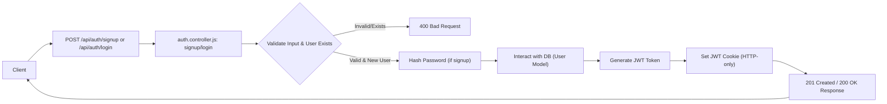
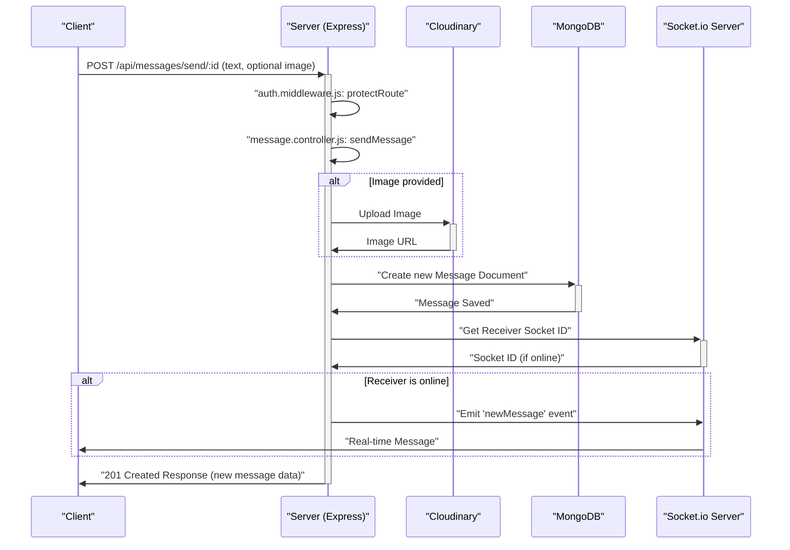

 # API Endpoints and Controllers

This document provides a comprehensive overview of the backend API endpoints and their corresponding controller logic. The backend, built with Node.js and Express, exposes RESTful APIs for user authentication, profile management, and real-time messaging. It integrates with MongoDB for data persistence, bcrypt for password hashing, Cloudinary for image storage, and Socket.IO for real-time communication.

The core functionalities are divided into two main categories: Authentication and Messaging. Each category details the endpoints, the associated controller functions, and relevant code snippets.

## Authentication Endpoints

The authentication module manages user registration, login, logout, session verification, profile updates, and integrates with Google OAuth for third-party authentication.

**Relevant Files:**
*   `backend/src/routes/auth.route.js`
*   `backend/src/controllers/auth.controller.js`

### User Registration (`signup`)

Allows new users to create an account by providing a username, email, and password. The system validates the input, checks for existing users, hashes the password, and generates a JWT token for session management.

**Endpoint:** `POST /api/auth/signup`

**Controller Logic:** `auth.controller.js - signup`

```javascript
// backend/src/controllers/auth.controller.js
// Lines 6-58
export const signup = async (req, res) => {
    const {username, email, password} = req.body;
    try {
        if(!username || !email || !password) {
            return res.status(400).json({message: "Please fill in all fields."});
        }
        // ... (username and password length validations) ...

        const user = await User.findOne({email});
        if (user) return res.status(400).json({message: "Email already exists."});
        
        const existingUserByUsername = await User.findOne({ username });
        if (existingUserByUsername) {
            return res.status(400).json({ message: "Username already exists. Please choose another." });
        }

        const salt = await bcrypt.genSalt(10);
        const hashedPassword = await bcrypt.hash(password, salt);

        const newUser = new User({
            username,
            email,
            password: hashedPassword,
            authProvider: 'email'
        });
        if(newUser){
            generateToken(newUser._id, res); // Generate JWT token
            await newUser.save();

            res.status(201).json({
                _id: newUser._id,
                username: newUser.username,
                email: newUser.email,   
                profilePic: newUser.profilePic,
                authProvider: newUser.authProvider
            });
        } else {
            res.status(400).json({message: "Invalid user data."});
        }
    } catch (error) {
        console.log("Error in signup controller", error.message)
        res.status(500).json({message: "Something went wrong."});
    }
};
```
[View on GitHub](https://github.com/shinymack/Chat-App-MERN/blob/main/backend/src/controllers/auth.controller.js#L6-L58)

### User Login (`login`)

Authenticates an existing user by verifying their email and password. Upon successful authentication, a JWT token is generated and set as an HTTP-only cookie.

**Endpoint:** `POST /api/auth/login`

**Controller Logic:** `auth.controller.js - login`

```javascript
// backend/src/controllers/auth.controller.js
// Lines 60-89
export const login = async (req, res) => {
    const {email, password} = req.body;
    try {
        const user = await User.findOne({email});

        if(!user) {
            return res.status(400).json({message: "Invalid credentials."});
        }

        if(user.authProvider === 'google' && !user.password){
            return res.status(400).json({ message: "Please sign in with Google." });
        }

        const isPasswordCorrect = await bcrypt.compare(password, user.password);
        if(!isPasswordCorrect) {
            return res.status(400).json({message: "Invalid credentials."});
        }

        generateToken(user._id, res); // Generate JWT token
        res.status(200).json({
            _id: user._id,
            username: user.username,
            email: user.email,
            profilePic: user.profilePic,
            authProvider: user.authProvider,
        });
    } catch (error) {
        console.log("Error in login controller", error.message);
        res.status(500).json({message: "Something went wrong."});
    }
};
```
[View on GitHub](https://github.com/shinymack/Chat-App-MERN/blob/main/backend/src/controllers/auth.controller.js#L60-L89)

### User Logout (`logout`)

Deauthenticates the current user by clearing the JWT token cookie.

**Endpoint:** `POST /api/auth/logout`

**Controller Logic:** `auth.controller.js - logout`

```javascript
// backend/src/controllers/auth.controller.js
// Lines 91-98
export const logout = (req, res) => {
    try {
        res.cookie("jwt", "", {maxAge: 0});
        res.status(200).json({message: "Logged out successfully."})
    } catch(error) {
        console.log("Error in logout controller", error.message);
        res.status(500).json({message:"Internal Server Error"}); 
    }
};
```
[View on GitHub](https://github.com/shinymack/Chat-App-MERN/blob/main/backend/src/controllers/auth.controller.js#L91-L98)

### Authentication Flow Diagram

The following diagram illustrates the typical user registration and login flow for email-based authentication.





### Google OAuth Callback (`googleAuthCallback`)

Handles the callback from Google after a user successfully authenticates via their Google account. It generates a JWT token and redirects the user to the frontend.

**Endpoints:**
*   `GET /api/auth/google` (Initiates Google OAuth)
*   `GET /api/auth/google/callback` (Google redirect URI)

**Controller Logic:** `auth.controller.js - googleAuthCallback`

```javascript
// backend/src/controllers/auth.controller.js
// Lines 117-133
export const googleAuthCallback = async (req, res) => {
 const frontendUrl = process.env.FRONTEND_URL || 'http://localhost:5173';

    try {
        if (!req.user) {
            return res.redirect(`${frontendUrl}/login?error=google_auth_failed`);
        }

        generateToken(req.user._id, res); // Generate JWT for Google-authenticated user

        res.redirect(frontendUrl); // Redirect to frontend

    } catch (error) {
        console.error("Error in googleAuthCallback: ", error.message);
        res.redirect(`${frontendUrl}/login?error=google_auth_processing_error`);
    }
};
```
[View on GitHub](https://github.com/shinymack/Chat-App-MERN/blob/main/backend/src/controllers/auth.controller.js#L117-L133)

### Profile Management

Authenticated users can manage their profiles, including checking username availability and updating their display name or profile picture.

*   **Check Authentication (`checkAuth`)**:
    *   **Endpoint:** `GET /api/auth/check`
    *   **Controller Logic:** `auth.controller.js - checkAuth`
    *   Verifies if a user is currently authenticated and returns their user data. Protected by `protectRoute` middleware.
    [View on GitHub](https://github.com/shinymack/Chat-App-MERN/blob/main/backend/src/controllers/auth.controller.js#L101-L114)

*   **Check Username Availability (`checkUsernameAvailability`)**:
    *   **Endpoint:** `GET /api/auth/username/check/:username`
    *   **Controller Logic:** `auth.controller.js - checkUsernameAvailability`
    *   Checks if a given username is available for use, considering validation rules and existing users. Protected by `protectRoute`.
    [View on GitHub](https://github.com/shinymack/Chat-App-MERN/blob/main/backend/src/controllers/auth.controller.js#L135-L177)

*   **Update User Profile (`updateProfile`)**:
    *   **Endpoint:** `PUT /api/auth/update-profile`
    *   **Controller Logic:** `auth.controller.js - updateProfile`
    *   Allows an authenticated user to update their username and/or profile picture. It handles image uploads to Cloudinary and validates username uniqueness. A new JWT token is issued to reflect potential changes in user data. Protected by `protectRoute`.

```javascript
// backend/src/controllers/auth.controller.js
// Lines 182-243
export const updateProfile = async (req, res) => {
    try {
        const { profilePic, username } = req.body;
        const userId = req.user._id;
        let userToUpdate = await User.findById(userId);

        if (!userToUpdate) {
            return res.status(404).json({ message: "User not found." });
        }

        const fieldsToUpdate = {};
        let newUsername = username ? username.trim() : null;
        
        // Handle username update logic (validation, uniqueness check)
        if (newUsername && newUsername !== userToUpdate.username) {
            // ... username validation and existing user check ...
            const existingUserWithNewUsername = await User.findOne({ username: newUsername, _id: { $ne: userId } });
            if (existingUserWithNewUsername) {
                return res.status(400).json({ message: "This username is already taken by someone else." });
            }
            fieldsToUpdate.username = newUsername;
        }

        // Handle profile picture update (Cloudinary upload)
        if (profilePic) {
            const uploadResponse = await cloudinary.uploader.upload(profilePic);
            fieldsToUpdate.profilePic = uploadResponse.secure_url;
        }

        if (Object.keys(fieldsToUpdate).length === 0) {
            return res.status(400).json({ message: "No changes provided to update." });
        }

        const updatedUser = await User.findByIdAndUpdate(userId, { $set: fieldsToUpdate }, { new: true });
        if (!updatedUser) {
            return res.status(404).json({ message: "Failed to update user."});
        }

        generateToken(updatedUser._id, res); // Refresh JWT cookie
        res.status(200).json(updatedUser);

    } catch (error) {
        console.error("Error in updateProfile controller", error.message);
        res.status(500).json({ message: "Internal Server Error while updating profile." });
    }
};
```
[View on GitHub](https://github.com/shinymack/Chat-App-MERN/blob/main/backend/src/controllers/auth.controller.js#L182-L243)

## Messaging Endpoints

The messaging module facilitates real-time chat between users, including fetching user lists, retrieving message history, and sending new messages with optional image attachments.

**Relevant Files:**
*   `backend/src/routes/message.route.js`
*   `backend/src/controllers/message.controller.js`

### Get Users for Sidebar (`getUsersForSidebar`)

Retrieves a list of all users in the system, excluding the currently logged-in user, typically used to populate a chat sidebar.

**Endpoint:** `GET /api/messages/users`

**Controller Logic:** `message.controller.js - getUsersForSidebar`

```javascript
// backend/src/controllers/message.controller.js
// Lines 7-16
export const getUsersForSidebar = async (req, res) => {
    try {
        const loggedInUserId = req.user._id;
        const filteredUsers = await User.find({
            _id: { $ne: loggedInUserId }}).select("-password");  
        res.status(200).json(filteredUsers);
    }
    catch (error) {
        console.log("Error in getUsersForSidebar: ", error);
        res.status(500).json({ error: "Internal Server Error" });
    }
};
```
[View on GitHub](https://github.com/shinymack/Chat-App-MERN/blob/main/backend/src/controllers/message.controller.js#L7-L16)

### Get Conversation Messages (`getMessages`)

Fetches all messages exchanged between the logged-in user and a specific chat partner (`userToChatId`).

**Endpoint:** `GET /api/messages/:id`

**Controller Logic:** `message.controller.js - getMessages`

```javascript
// backend/src/controllers/message.controller.js
// Lines 18-31
export const getMessages = async (req, res) => {
    try {
        const {id : userToChatId } = req.params;
        const myId = req.user._id;

        const messages = await Message.find({
            $or: [
                {senderId: myId, receiverId:userToChatId},
                {senderId: userToChatId, receiverId: myId}
            ]
        });
        res.status(200).json(messages);
    } catch (error) {
        console.log("Error in getMessages controller:  ", error);
        res.status(500).json({ error: "Internal Server Error" });
    }
};
```
[View on GitHub](https://github.com/shinymack/Chat-App-MERN/blob/main/backend/src/controllers/message.controller.js#L18-L31)

### Send Message (`sendMessage`)

Enables an authenticated user to send a new message, which can include text and an optional image. Images are uploaded to Cloudinary, and messages are delivered in real-time using Socket.IO if the receiver is online.

**Endpoint:** `POST /api/messages/send/:id`

**Controller Logic:** `message.controller.js - sendMessage`

```javascript
// backend/src/controllers/message.controller.js
// Lines 33-64
export const sendMessage = async (req, res) => {
    try {
        const { text, image } = req.body;
        const { id: receiverId } = req.params;
        const senderId = req.user._id;

        let imageUrl;
        if (image) {
            const uploadResponse = await cloudinary.uploader.upload(image); // Upload image to Cloudinary
            imageUrl = uploadResponse.secure_url;
        }
        const newMessage = new Message({
            senderId,
            receiverId,
            text,
            image: imageUrl,
        });

        await newMessage.save();

        const receiverSocketId = getReceiverSocketId(receiverId);

        if(receiverSocketId) {
            io.to(receiverSocketId).emit("newMessage", newMessage); // Emit real-time message via Socket.IO
        }

        res.status(201).json(newMessage);   
        
    } catch (error) {
        console.log("Error in sendMessage controller:  ", error);
        res.status(500).json({ error: "Internal Server Error" });
    }
};
```
[View on GitHub](https://github.com/shinymack/Chat-App-MERN/blob/main/backend/src/controllers/message.controller.js#L33-L64)

### Message Sending Flow

This sequence diagram illustrates the process of sending a message, highlighting the interaction between the client, server, Cloudinary, database, and the Socket.IO server for real-time delivery.





## Key Integration Points

*   **Middleware (`protectRoute`)**: The `protectRoute` middleware is crucial for securing endpoints. It ensures that only authenticated users can access specific routes by verifying the JWT token present in the request cookie. This is applied to all sensitive endpoints in both authentication and messaging routes.
*   **JWT Token Management**: User sessions are managed using JSON Web Tokens (JWTs). These tokens are generated upon successful login/signup and set as HTTP-only cookies, providing a secure and stateless way to maintain user sessions. The `generateToken` utility abstracts this process.
*   **Cloudinary Integration**: For handling image uploads (e.g., profile pictures, message images), Cloudinary is integrated as an external cloud storage and image manipulation service. This offloads storage and processing from the backend server.
*   **Real-time Communication (Socket.IO)**: The messaging module leverages Socket.IO for real-time message delivery. When a new message is sent, the server checks if the receiver is online and, if so, emits the message directly to the receiver's connected socket, ensuring instant updates without polling.
*   **Input Validation and Error Handling**: Each controller includes robust input validation (e.g., checking for required fields, password length, username uniqueness) and comprehensive error handling. This ensures data integrity and provides meaningful feedback to the client in case of issues, enhancing the API's reliability.
*   **MongoDB for Data Persistence**: All user and message data is stored and retrieved from a MongoDB database, utilizing Mongoose for object data modeling.