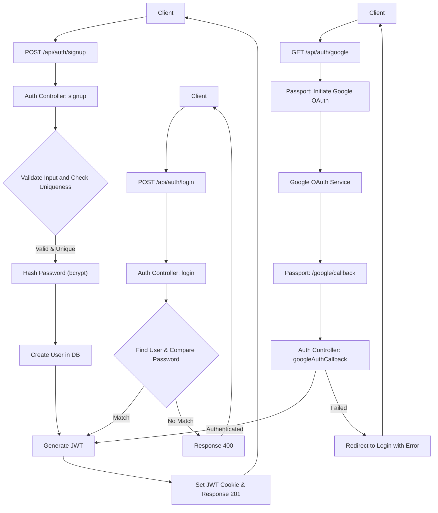
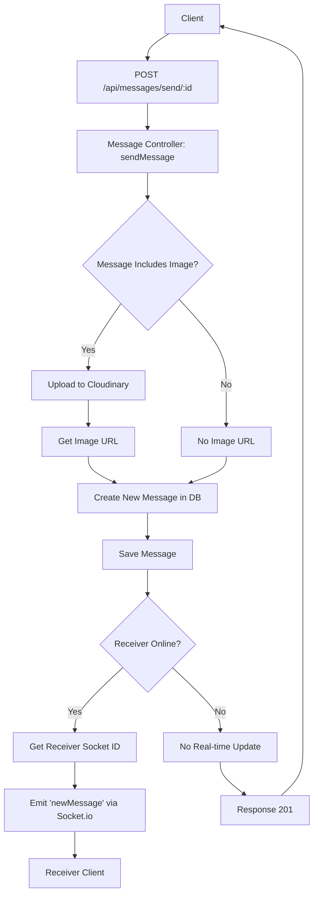

 # API Endpoints and Controllers

This document provides a comprehensive overview of the backend's RESTful API endpoints, detailing their routes, the controller logic responsible for handling requests, and the core functionalities they enable. The API is structured to manage user authentication, authorization, user profiles, and real-time messaging capabilities.

## 1. Authentication and User Management

The authentication module handles user registration, login, logout, session verification, and profile management, including integration with Google OAuth.

### 1.1 Auth Routes (`backend/src/routes/auth.route.js`)

This file defines the API routes for all authentication and user-related operations. It utilizes `express.Router` to group these routes and integrates `passport` for Google OAuth and `protectRoute` middleware for securing endpoints.

**Key Routes:**

*   `POST /api/auth/signup`: Registers a new user.
*   `POST /api/auth/login`: Authenticates an existing user.
*   `POST /api/auth/logout`: Invalidates the user session.
*   `PUT /api/auth/update-profile`: Updates the authenticated user's profile details.
*   `GET /api/auth/username/check/:username`: Checks the availability of a username.
*   `GET /api/auth/check`: Verifies the authentication status of the current user.
*   `GET /api/auth/google`: Initiates Google OAuth authentication flow.
*   `GET /api/auth/google/callback`: Handles the callback from Google OAuth.

<details>
<summary>View Code Snippet: `backend/src/routes/auth.route.js`</summary>

```javascript
// backend/src/routes/auth.route.js
import express from "express";
import passport from 'passport';
import { login, logout, signup, updateProfile, checkAuth, googleAuthCallback, checkUsernameAvailability } from "../controllers/auth.controller.js";
import { protectRoute } from "../middleware/auth.middleware.js";

const router = express.Router();

router.post("/signup", signup);
router.post("/login", login);
router.post("/logout", logout);
router.put("/update-profile", protectRoute, updateProfile);
router.get("/username/check/:username", protectRoute, checkUsernameAvailability);
router.get("/check", protectRoute, checkAuth);
router.get(
    '/google',
    passport.authenticate('google', { scope: ['profile', 'email'] })
);
router.get(
    '/google/callback',
    passport.authenticate('google', {
        failureRedirect: 'http://localhost:5173/login',
        failureMessage: true
    }),
    googleAuthCallback
);

export default router;
```

</details>

### 1.2 Auth Controllers (`backend/src/controllers/auth.controller.js`)

This file contains the core logic for handling authentication and user profile management. It interacts with the `User` model, `bcryptjs` for password hashing, `generateToken` for JWT management, and `cloudinary` for image uploads.

#### `signup` Controller

Handles new user registration. It validates input, checks for existing users, hashes passwords, creates a new user, generates a JWT token, and saves the user to the database.

*   **Request Body**: `username`, `email`, `password`
*   **Response**: `201 Created` with user data (excluding password) and a JWT cookie.
*   **Error Handling**: Returns `400 Bad Request` for invalid input or existing users, `500 Internal Server Error` for unexpected issues.

#### `login` Controller

Authenticates an existing user. It verifies credentials against stored user data and generates a JWT token upon successful login.

*   **Request Body**: `email`, `password`
*   **Response**: `200 OK` with user data (excluding password) and a JWT cookie.
*   **Error Handling**: Returns `400 Bad Request` for invalid credentials or incorrect auth provider, `500 Internal Server Error`.

#### `logout` Controller

Clears the JWT cookie, effectively logging out the user.

*   **Response**: `200 OK` with a success message.
*   **Error Handling**: Returns `500 Internal Server Error`.

#### `checkAuth` Controller

Verifies the current user's authentication status and returns their details if authenticated. This endpoint is protected by `protectRoute`.

*   **Response**: `200 OK` with authenticated user's details.
*   **Error Handling**: Returns `500 Internal Server Error`.

#### `googleAuthCallback` Controller

Completes the Google OAuth flow. After successful authentication by Passport, it generates a JWT token for the user and redirects them to the frontend.

*   **Response**: `302 Redirect` to frontend with JWT cookie.
*   **Error Handling**: Redirects to frontend login page with error parameters.

#### `checkUsernameAvailability` Controller

Checks if a given username is available for use, considering minimum/maximum length and if it's the current user's username. This endpoint is protected by `protectRoute`.

*   **Request Params**: `username`
*   **Response**: `200 OK` with `available` (boolean) and a `message`.
*   **Error Handling**: Returns `400 Bad Request` for invalid username length, `500 Internal Server Error`.

#### `updateProfile` Controller

Updates an authenticated user's profile, allowing changes to `username` and `profilePic`. It handles Cloudinary uploads for images and ensures username uniqueness. This endpoint is protected by `protectRoute`.

*   **Request Body**: `profilePic` (base64 string), `username`
*   **Response**: `200 OK` with updated user data and a refreshed JWT cookie.
*   **Error Handling**: Returns `400 Bad Request` for invalid input or duplicate usernames, `404 Not Found` if user doesn't exist, `500 Internal Server Error`.

<details>
<summary>View Code Snippet: `backend/src/controllers/auth.controller.js` (Partial `signup` example)</summary>

```javascript
// backend/src/controllers/auth.controller.js (Partial snippet)
import bcrypt from "bcryptjs";
import User from "../models/user.model.js";
import { generateToken } from "../lib/utils.js";
import cloudinary from "../lib/cloudinary.js"; // Used for updateProfile

export const signup = async (req, res) => {
    const { username, email, password } = req.body;
    try {
        if (!username || !email || !password) {
            return res.status(400).json({ message: "Please fill in all fields." });
        }
        // ... (other validations) ...
        const user = await User.findOne({ email });
        if (user) return res.status(400).json({ message: "Email already exists." });

        const existingUserByUsername = await User.findOne({ username });
        if (existingUserByUsername) {
            return res.status(400).json({ message: "Username already exists. Please choose another." });
        }

        const salt = await bcrypt.genSalt(10);
        const hashedPassword = await bcrypt.hash(password, salt);

        const newUser = new User({
            username,
            email,
            password: hashedPassword,
            authProvider: 'email'
        });

        if (newUser) {
            generateToken(newUser._id, res);
            await newUser.save();
            res.status(201).json({
                _id: newUser._id,
                username: newUser.username,
                email: newUser.email,
                profilePic: newUser.profilePic,
                authProvider: newUser.authProvider
            });
        } else {
            res.status(400).json({ message: "Invalid user data." });
        }
    } catch (error) {
        console.log("Error in signup controller", error.message);
        res.status(500).json({ message: "Something went wrong." });
    }
};

// ... (Other controllers like login, logout, updateProfile, etc.) ...
```

</details>

### Authentication Flow Diagram

The following diagram illustrates a simplified user authentication flow:





## 2. Messaging Endpoints and Controllers

The messaging module facilitates real-time communication between users, including fetching user lists, retrieving chat history, and sending new messages with optional image attachments.

### 2.1 Message Routes (`backend/src/routes/message.route.js`)

This file defines the API routes related to message functionalities. All message routes are secured using the `protectRoute` middleware to ensure only authenticated users can access them.

**Key Routes:**

*   `GET /api/messages/users`: Retrieves a list of users for the sidebar (all users except the logged-in one).
*   `GET /api/messages/:id`: Fetches messages between the authenticated user and a specific chat partner (`:id`).
*   `POST /api/messages/send/:id`: Sends a new message to a specific receiver (`:id`).

<details>
<summary>View Code Snippet: `backend/src/routes/message.route.js`</summary>

```javascript
// backend/src/routes/message.route.js
import express from "express";
import { protectRoute } from "../middleware/auth.middleware.js";
import { getUsersForSidebar, getMessages, sendMessage } from "../controllers/message.controller.js";

const router = express.Router();

router.get("/users", protectRoute, getUsersForSidebar);
router.get("/:id", protectRoute, getMessages);
router.post("/send/:id", protectRoute, sendMessage);

export default router;
```

</details>

### 2.2 Message Controllers (`backend/src/controllers/message.controller.js`)

This file contains the logic for handling message-related operations. It interacts with the `User` and `Message` models, `cloudinary` for image uploads, and `socket.io` for real-time message delivery.

#### `getUsersForSidebar` Controller

Retrieves a list of all users excluding the currently logged-in user. This is typically used to populate a chat sidebar.

*   **Response**: `200 OK` with an array of user objects (excluding passwords).
*   **Error Handling**: Returns `500 Internal Server Error`.

#### `getMessages` Controller

Fetches all messages exchanged between the authenticated user and a specified chat partner.

*   **Request Params**: `id` (receiver's user ID)
*   **Response**: `200 OK` with an array of message objects.
*   **Error Handling**: Returns `500 Internal Server Error`.

#### `sendMessage` Controller

Handles sending a new message. It can include plain text and/or an image. If an image is provided, it's uploaded to Cloudinary. After saving the message, it uses Socket.io to emit the new message in real-time to the receiver if they are online.

*   **Request Body**: `text` (optional), `image` (optional, base64 string)
*   **Request Params**: `id` (receiver's user ID)
*   **Response**: `201 Created` with the new message object.
*   **Real-time**: Emits "newMessage" event via Socket.io to the receiver.
*   **Error Handling**: Returns `500 Internal Server Error`.

<details>
<summary>View Code Snippet: `backend/src/controllers/message.controller.js` (Partial `sendMessage` example)</summary>

```javascript
// backend/src/controllers/message.controller.js (Partial snippet)
import User from "../models/user.model.js";
import Message from "../models/message.model.js";
import cloudinary from "../lib/cloudinary.js";
import { getReceiverSocketId, io } from "../lib/socket.js";

export const sendMessage = async (req, res) => {
    try {
        const { text, image } = req.body;
        const { id: receiverId } = req.params;
        const senderId = req.user._id;

        let imageUrl;
        if (image) {
            const uploadResponse = await cloudinary.uploader.upload(image);
            imageUrl = uploadResponse.secure_url;
        }

        const newMessage = new Message({
            senderId,
            receiverId,
            text,
            image: imageUrl,
        });

        await newMessage.save();

        const receiverSocketId = getReceiverSocketId(receiverId);
        if (receiverSocketId) {
            io.to(receiverSocketId).emit("newMessage", newMessage);
        }

        res.status(201).json(newMessage);
    } catch (error) {
        console.log("Error in sendMessage controller:  ", error.message);
        res.status(500).json({ error: "Internal Server Error" });
    }
};

// ... (Other controllers like getUsersForSidebar, getMessages) ...
```

</details>

### Message Sending Flow Diagram

This diagram illustrates the process of sending a message, including optional image upload and real-time delivery.





## 3. Key Integration Points

### Authentication and Authorization

*   **JWT-based Session Management**: User sessions are managed using JSON Web Tokens (JWTs) stored in HTTP-only cookies, providing stateless authentication.
*   **`protectRoute` Middleware**: This middleware ensures that only authenticated users can access protected routes by verifying the JWT. If the token is invalid or missing, it returns a 401 Unauthorized response.
*   **Password Security**: `bcryptjs` is used for robust password hashing, preventing plain-text password storage.
*   **Google OAuth Integration**: Passport.js simplifies integrating Google as an authentication provider, offering a seamless sign-in experience.

### Media Handling with Cloudinary

*   **Profile Picture Updates**: The `updateProfile` controller uses Cloudinary to manage user profile images, allowing users to upload new pictures which are then stored securely and delivered efficiently.
*   **Image Messages**: The `sendMessage` controller also leverages Cloudinary for handling image attachments within messages, centralizing media storage and delivery.

### Real-time Communication with Socket.io

*   **Instant Message Delivery**: The `sendMessage` controller utilizes Socket.io to provide real-time updates. When a message is sent, if the receiver is online, the message is instantly pushed to their client without needing a page refresh or polling.
*   **Scalability**: Socket.io's event-driven architecture makes it suitable for handling real-time features efficiently, reducing server load compared to traditional HTTP polling.

### Database Interactions

*   **Mongoose Models**: Both authentication and messaging controllers interact with MongoDB via Mongoose models (`User` and `Message`) for data persistence. This includes operations like finding users, creating new records, and updating documents.
*   **Efficient Queries**: Queries are optimized (e.g., `User.find({ _id: { $ne: loggedInUserId } }).select("-password")` for sidebar users) to retrieve necessary data while excluding sensitive information.

These endpoints and their corresponding controller logic form the backbone of the application's user management and communication features, providing a secure, efficient, and real-time experience.