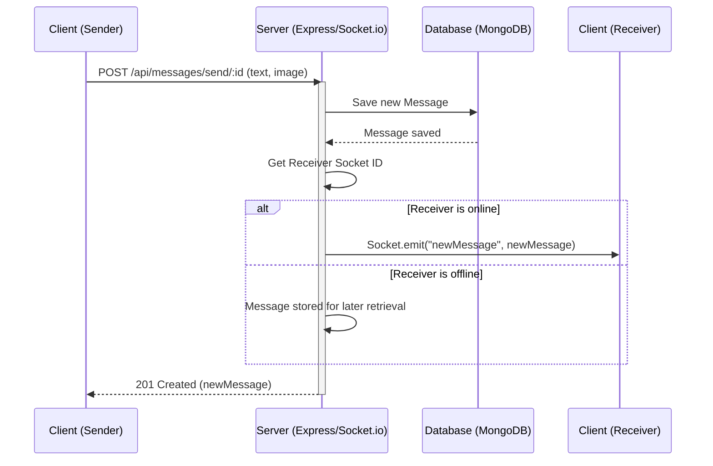

 # API Endpoints and Controllers

This document provides a comprehensive overview of the API endpoints implemented in the backend, detailing their purpose, the HTTP methods they support, and the corresponding controller functions that process requests. The backend API is segmented into modules such as `auth` for user authentication and `message` for real-time messaging functionalities.

---

## Authentication Endpoints (`backend/src/routes/auth.route.js`)

The authentication module manages all user-related operations, including registration, login, logout, session checking, profile updates, and Google OAuth integration. All routes in this module are defined in `backend/src/routes/auth.route.js`.

### User Registration

- **Endpoint**: `POST /api/auth/signup`
- **Controller**: `signup` in `auth.controller.js`
- **Description**: Allows new users to register by providing a username, email, and password. Performs validation checks for field presence, username length, and password strength, and ensures unique email and username. After successful registration, a JWT token is generated and set as an HTTP-only cookie.

**Code Snippet: Signup Controller Logic**

```javascript
// backend/src/controllers/auth.controller.js
export const signup = async (req, res) => {
    const {username, email, password} = req.body;
    try {
        // ... (validation and existing user checks) ...
        const salt = await bcrypt.genSalt(10);
        const hashedPassword = await bcrypt.hash(password, salt);

        const newUser = new User({
            username,
            email,
            password: hashedPassword,
            authProvider: 'email'
        });
        if(newUser){
            generateToken(newUser._id, res); // Generate and set JWT
            await newUser.save();

            res.status(201).json({
                _id: newUser._id,
                username: newUser.username,
                email: newUser.email,   
                profilePic: newUser.profilePic,
                authProvider: newUser.authProvider
            });
        } // ... (error handling) ...
    } catch (error) {
        console.log("Error in signup controller", error.message)
        res.status(500).json({message: "Something went wrong."});
    }
};
```
<div style={{textAlign: 'right'}}>
    [View on GitHub](https://github.com/shinymack/Chat-App-MERN/blob/main/backend/src/controllers/auth.controller.js#L7-L58)
</div>

### User Login

- **Endpoint**: `POST /api/auth/login`
- **Controller**: `login` in `auth.controller.js`
- **Description**: Authenticates an existing user using their email and password. It checks for valid credentials and non-Google OAuth users. Upon successful login, a JWT token is generated and sent as an HTTP-only cookie.

**Code Snippet: Login Controller Logic**

```javascript
// backend/src/controllers/auth.controller.js
export const login = async (req, res) => {
    const {email, password} = req.body;
    try {
        const user = await User.findOne({email});
        if(!user) {
            return res.status(400).json({message: "Invalid credentials."});
        }
        if(user.authProvider === 'google' && !user.password){
            return res.status(400).json({ message: "Please sign in with Google." });
        }
        const isPasswordCorrect = await bcrypt.compare(password, user.password);
        if(!isPasswordCorrect) {
            return res.status(400).json({message: "Invalid credentials."});
        }

        generateToken(user._id, res); // Generate and set JWT
        res.status(200).json({
            _id: user._id,
            username: user.username,
            email: user.email,
            profilePic: user.profilePic,
            authProvider: user.authProvider,
        });
    } catch (error) {
        console.log("Error in login controller", error.message);
        res.status(500).json({message: "Something went wrong."});
    }
};
```
<div style={{textAlign: 'right'}}>
    [View on GitHub](https://github.com/shinymack/Chat-App-MERN/blob/main/backend/src/controllers/auth.controller.js#L60-L95)
</div>

### User Logout

- **Endpoint**: `POST /api/auth/logout`
- **Controller**: `logout` in `auth.controller.js`
- **Description**: Clears the JWT cookie, effectively logging out the user.

### User Profile Update

- **Endpoint**: `PUT /api/auth/update-profile`
- **Middleware**: `protectRoute` (requires authentication)
- **Controller**: `updateProfile` in `auth.controller.js`
- **Description**: Allows an authenticated user to update their profile picture and/or username. If a new profile picture is provided, it's uploaded to Cloudinary. Username changes are validated for uniqueness and length. A new JWT token is issued upon successful update to reflect any changes in user data embedded in the token.

### Username Availability Check

- **Endpoint**: `GET /api/auth/username/check/:username`
- **Middleware**: `protectRoute` (requires authentication)
- **Controller**: `checkUsernameAvailability` in `auth.controller.js`
- **Description**: Checks if a given username is available. This is useful for client-side validation during registration or profile updates. It handles checks for existing usernames, minimum/maximum length, and allows the current user to keep their own username.

**Code Snippet: Username Availability Logic**

```javascript
// backend/src/controllers/auth.controller.js
export const checkUsernameAvailability = async (req, res) => {
    try {
        const { username } = req.params;
        const currentUserId = req.user._id; 

        // ... (validation for username length) ...
    
        if (req.user.username === username) {
            return res.status(200).json({ available: true, message: "This is your current username." });
        }

        const existingUser = await User.findOne({ username: username });

        if (existingUser) {
            return res.status(200).json({ available: false, message: "Username is already taken." });
        }

        res.status(200).json({ available: true, message: "Username is available." });

    } catch (error) {
        console.error("Error in checkUsernameAvailability:", error.message);
        res.status(500).json({ available: false, message: "Error checking username availability." });
    }
};
```
<div style={{textAlign: 'right'}}>
    [View on GitHub](https://github.com/shinymack/Chat-App-MERN/blob/main/backend/src/controllers/auth.controller.js#L149-L186)
</div>

### Check Authentication Status

- **Endpoint**: `GET /api/auth/check`
- **Middleware**: `protectRoute` (requires authentication)
- **Controller**: `checkAuth` in `auth.controller.js`
- **Description**: Verifies if the user is currently authenticated by checking the presence and validity of the JWT cookie. If authenticated, it returns the user's details.

### Google OAuth Integration

- **Endpoint**: `GET /api/auth/google`
- **Middleware**: `passport.authenticate('google', { scope: ['profile', 'email'] })`
- **Description**: Initiates the Google OAuth flow, redirecting the user to Google's authentication page.

- **Endpoint**: `GET /api/auth/google/callback`
- **Middleware**: `passport.authenticate('google', { failureRedirect: 'http://localhost:5173/login', failureMessage: true })`
- **Controller**: `googleAuthCallback` in `auth.controller.js`
- **Description**: This is the callback URL Google redirects to after the user authenticates. Passport.js handles the user data processing. Upon success, `googleAuthCallback` generates a JWT token for the user and redirects to the frontend homepage.

---

## Messaging Endpoints (`backend/src/routes/message.route.js`)

The messaging module handles all functionalities related to message exchange and retrieving user lists for chats. All routes are defined in `backend/src/routes/message.route.js` and are protected, requiring user authentication.

### Get Users for Sidebar

- **Endpoint**: `GET /api/messages/users`
- **Middleware**: `protectRoute` (requires authentication)
- **Controller**: `getUsersForSidebar` in `message.controller.js`
- **Description**: Retrieves a list of all users in the system, excluding the currently logged-in user. This list is typically used to populate a chat sidebar where users can select who to message.

**Code Snippet: Get Users for Sidebar**

```javascript
// backend/src/controllers/message.controller.js
export const getUsersForSidebar = async (req, res) => {
    try {
        const loggedInUserId = req.user._id;
        const filteredUsers = await User.find({
            _id: { $ne: loggedInUserId }}).select("-password");  
        res.status(200).json(filteredUsers);
    }
    catch (error) {
        console.log("Error in getUsersForSidebar: ", error);
        res.status(500).json({ error: "Internal Server Error" });
    }
};
```
<div style={{textAlign: 'right'}}>
    [View on GitHub](https://github.com/shinymack/Chat-App-MERN/blob/main/backend/src/controllers/message.controller.js#L12-L21)
</div>

### Get Messages Between Two Users

- **Endpoint**: `GET /api/messages/:id`
- **Middleware**: `protectRoute` (requires authentication)
- **Controller**: `getMessages` in `message.controller.js`
- **Description**: Fetches all messages exchanged between the authenticated user and a specific `userToChatId`. Messages are retrieved regardless of who was the sender or receiver in the conversation.

### Send Message

- **Endpoint**: `POST /api/messages/send/:id`
- **Middleware**: `protectRoute` (requires authentication)
- **Controller**: `sendMessage` in `message.controller.js`
- **Description**: Sends a new message from the authenticated user to the specified `receiverId`. Messages can include text and/or an image. If an image is provided, it's uploaded to Cloudinary. After saving the message to the database, it attempts to send the message in real-time to the receiver via WebSockets using `io.to(receiverSocketId).emit("newMessage", newMessage)`.

**Code Snippet: Send Message Controller Logic**

```javascript
// backend/src/controllers/message.controller.js
export const sendMessage = async (req, res) => {
    try {
        const { text, image } = req.body;
        const { id: receiverId } = req.params;
        const senderId = req.user._id;

        let imageUrl;
        if (image) {
            const uploadResponse = await cloudinary.uploader.upload(image);
            imageUrl = uploadResponse.secure_url;
        }
        const newMessage = new Message({
            senderId,
            receiverId,
            text,
            image: imageUrl,
        });

        await newMessage.save();

        const receiverSocketId = getReceiverSocketId(receiverId);

        if(receiverSocketId) {
            io.to(receiverSocketId).emit("newMessage", newMessage); // Real-time delivery
        }

        res.status(201).json(newMessage);   
        
    } catch (error) {
        console.log("Error in sendMessage controller:  ", error);
        res.status(500).json({ error: "Internal Server Error" });
    }
};
```
<div style={{textAlign: 'right'}}>
    [View on GitHub](https://github.com/shinymack/Chat-App-MERN/blob/main/backend/src/controllers/message.controller.js#L42-L73)
</div>

---

## Key Integration Points

### Authentication Flow

The authentication process involves several steps, from user input to token generation and subsequent protection of routes.


```mermaid
graph TD
    A["Client"] --> B(Login/Signup Request)
    B --> C["Auth Routes (Express)"]
    C --> D{"Controller Logic (auth.controller.js)"}
    D -- Validate input --> E{Database (MongoDB)}
    D -- Hash password / Check credentials --> E
    E --> F{Generate JWT}
    F --> G["Set JWT Cookie (HTTP-only)"]
    G --> H["Response (Success/Error)"]
    H --> A
```


### Real-time Messaging with WebSockets

The `sendMessage` controller demonstrates a crucial integration between the REST API and WebSocket for real-time communication.





This sequence highlights how a single API call triggers both persistent storage and immediate real-time delivery if the receiver is online. The `getReceiverSocketId` utility and `io.to().emit()` calls are central to this functionality.

---