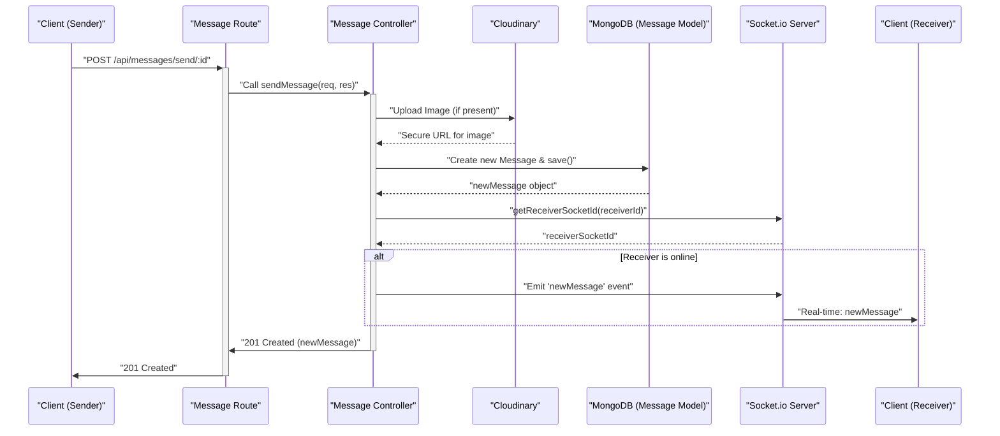

 # API Endpoints and Controllers

This section provides a detailed overview of the REST API endpoints and their corresponding controller implementations within the backend. The API is structured to handle various functionalities, including user authentication, profile management, and real-time messaging, ensuring a robust and secure interaction between the client and server.

## Authentication System (`auth` module)

The authentication system manages user registration, login, logout, session verification, and profile updates. It integrates `bcryptjs` for password hashing, `jsonwebtoken` for token generation, and `passport` for Google OAuth.

**Relevant Files:**
- `backend/src/routes/auth.route.js`: Defines the API routes for authentication.
- `backend/src/controllers/auth.controller.js`: Contains the business logic for authentication operations.

### User Registration (`/api/auth/signup`)

The `signup` controller handles new user registration. It performs input validation, checks for existing users, hashes passwords, creates a new user record, and generates a JWT token for the session.

**Endpoint:** `POST /api/auth/signup`
**Request Body:** `{ "username": "string", "email": "string", "password": "string" }`

```javascript
// backend/src/controllers/auth.controller.js
export const signup = async (req, res) => {
    const {username, email, password} = req.body;
    try {
        if(!username || !email || !password) {
            return res.status(400).json({message: "Please fill in all fields."});
        }
        // ... (validation for username and password length) ...
        const user = await User.findOne({email});
        if (user) return res.status(400).json({message: "Email already exists."});
        
        const existingUserByUsername = await User.findOne({ username });
        if (existingUserByUsername) {
            return res.status(400).json({ message: "Username already exists. Please choose another." });
        }

        const salt = await bcrypt.genSalt(10);
        const hashedPassword = await bcrypt.hash(password, salt);

        const newUser = new User({
            username,
            email,
            password: hashedPassword,
            authProvider: 'email'
        });
        if(newUser){
            generateToken(newUser._id, res); // Generates and sets JWT cookie
            await newUser.save();

            res.status(201).json({
                _id: newUser._id,
                username: newUser.username,
                email: newUser.email,   
                profilePic: newUser.profilePic,
                authProvider: newUser.authProvider
            });
        } else {
            res.status(400).json({message: "Invalid user data."});
        }
    } catch (error) {
        console.log("Error in signup controller", error.message)
        res.status(500).json({message: "Something went wrong."});
    }
};
```
[View on GitHub](https://github.com/shinymack/Chat-App-MERN/blob/main/backend/src/controllers/auth.controller.js#L1-L60)

### User Login (`/api/auth/login`)

The `login` controller authenticates users. It verifies the provided email and password, handling cases for both email/password and Google authenticated users, then generates a JWT token upon successful login.

**Endpoint:** `POST /api/auth/login`
**Request Body:** `{ "email": "string", "password": "string" }`

```javascript
// backend/src/controllers/auth.controller.js
export const login = async (req, res) => {
    const {email, password} = req.body;
    try {
        const user = await User.findOne({email});

        if(!user) {
            return res.status(400).json({message: "Invalid credentials."});
        }

        if(user.authProvider === 'google' && !user.password){
            return res.status(400).json({ message: "Please sign in with Google." });
        }

        const isPasswordCorrect = await bcrypt.compare(password, user.password);
        if(!isPasswordCorrect) {
            return res.status(400).json({message: "Invalid credentials."});
        }

        generateToken(user._id, res);
        res.status(200).json({
            _id: user._id,
            username: user.username,
            email: user.email,
            profilePic: user.profilePic,
            authProvider: user.authProvider,
        });
    } catch (error) {
        console.log("Error in login controller", error.message);
        res.status(500).json({message: "Something went wrong."});
    }
};
```
[View on GitHub](https://github.com/shinymack/Chat-App-MERN/blob/main/backend/src/controllers/auth.controller.js#L62-L96)

### User Logout (`/api/auth/logout`)

The `logout` controller clears the JWT cookie, effectively ending the user's session.

**Endpoint:** `POST /api/auth/logout`

### Check Authentication Status (`/api/auth/check`)

This protected route verifies the user's authentication status using the JWT token and returns the user's details if authenticated.

**Endpoint:** `GET /api/auth/check`

```javascript
// backend/src/routes/auth.route.js
router.post("/logout", logout); // Logout route
router.get("/check", protectRoute, checkAuth); // Check authentication status
```
[View on GitHub](https://github.com/shinymack/Chat-App-MERN/blob/main/backend/src/routes/auth.route.js#L14-L15)

### Google OAuth Integration

The application supports signing in with Google using `passport-google-oauth20`. The `/google` route initiates the OAuth flow, and the `/google/callback` route handles the response from Google.

**Endpoints:**
- `GET /api/auth/google`: Initiates Google OAuth.
- `GET /api/auth/google/callback`: Handles Google's callback.

```javascript
// backend/src/routes/auth.route.js
router.get(
    '/google',
    passport.authenticate('google', { scope: ['profile', 'email'] })
);
router.get(
    '/google/callback',
    passport.authenticate('google', {
        failureRedirect: 'http://localhost:5173/login', 
        failureMessage: true 
    }),
    googleAuthCallback 
);
```
[View on GitHub](https://github.com/shinymack/Chat-App-MERN/blob/main/backend/src/routes/auth.route.js#L17-L28)

### Profile Management (`/api/auth/update-profile`)

The `updateProfile` controller allows authenticated users to update their profile picture and username. It validates the new username for uniqueness and length, and integrates with Cloudinary for image uploads. A new JWT token is issued if changes are successful to reflect any updated user information.

**Endpoint:** `PUT /api/auth/update-profile`
**Request Body:** `{ "profilePic": "base64_string_optional", "username": "string_optional" }`

```javascript
// backend/src/controllers/auth.controller.js
export const updateProfile = async (req, res) => {
    try {
        const { profilePic, username } = req.body; 
        const userId = req.user._id;
        let userToUpdate = await User.findById(userId);

        if (!userToUpdate) {
            return res.status(404).json({ message: "User not found." });
        }

        const fieldsToUpdate = {};
        let newUsername = username ? username.trim() : null;

        if (newUsername && newUsername !== userToUpdate.username) {
            if (newUsername.length < 3 || newUsername.length > 20) {
                return res.status(400).json({ message: "Username must be between 3 and 20 characters." });
            }
            const existingUserWithNewUsername = await User.findOne({ username: newUsername, _id: { $ne: userId } });
            if (existingUserWithNewUsername) {
                return res.status(400).json({ message: "This username is already taken by someone else." });
            }
            fieldsToUpdate.username = newUsername;
        }

        if (profilePic) {
            const uploadResponse = await cloudinary.uploader.upload(profilePic);
            fieldsToUpdate.profilePic = uploadResponse.secure_url;
        }

        if (Object.keys(fieldsToUpdate).length === 0) {
            return res.status(400).json({ message: "No changes provided to update." });
        }

        const updatedUser = await User.findByIdAndUpdate(userId, { $set: fieldsToUpdate }, { new: true });
        generateToken(updatedUser._id, res); // Refresh token
        res.status(200).json(updatedUser);

    } catch (error) {
        console.error("Error in updateProfile controller", error.message);
        res.status(500).json({ message: "Internal Server Error while updating profile." });
    }
};
```
[View on GitHub](https://github.com/shinymack/Chat-App-MERN/blob/main/backend/src/controllers/auth.controller.js#L173-L228)

### Username Availability Check (`/api/auth/username/check/:username`)

This controller allows checking if a username is available. It validates the username and checks against existing users, excluding the current user's own username.

**Endpoint:** `GET /api/auth/username/check/:username`

```javascript
// backend/src/routes/auth.route.js
router.get("/username/check/:username", protectRoute, checkUsernameAvailability);
```
[View on GitHub](https://github.com/shinymack/Chat-App-MERN/blob/main/backend/src/routes/auth.route.js#L12)

## Messaging System (`message` module)

The messaging system facilitates private conversations between users. It retrieves contact lists, fetches message history, and sends new messages, incorporating real-time updates via WebSockets.

**Relevant Files:**
- `backend/src/routes/message.route.js`: Defines the API routes for messaging.
- `backend/src/controllers/message.controller.js`: Contains the business logic for messaging operations.

### Get Users for Sidebar (`/api/messages/users`)

This protected route retrieves a list of all users excluding the currently logged-in user, typically used to populate a chat sidebar with available contacts.

**Endpoint:** `GET /api/messages/users`

```javascript
// backend/src/controllers/message.controller.js
export const getUsersForSidebar = async (req, res) => {
    try {
        const loggedInUserId = req.user._id;
        // Find all users except the logged-in user, and exclude password
        const filteredUsers = await User.find({
            _id: { $ne: loggedInUserId }}).select("-password");  
        res.status(200).json(filteredUsers);
    }
    catch (error) {
        console.log("Error in getUsersForSidebar: ", error);
        res.status(500).json({ error: "Internal Server Error" });
    }
};
```
[View on GitHub](https://github.com/shinymack/Chat-App-MERN/blob/main/backend/src/controllers/message.controller.js#L9-L21)

### Get Messages with a Specific User (`/api/messages/:id`)

This protected route fetches all messages exchanged between the logged-in user and a specified recipient, identified by `id`.

**Endpoint:** `GET /api/messages/:id`

```javascript
// backend/src/routes/message.route.js
router.get("/users", protectRoute, getUsersForSidebar); // Get all users for sidebar
router.get("/:id", protectRoute, getMessages); // Get messages with a specific user
```
[View on GitHub](https://github.com/shinymack/Chat-App-MERN/blob/main/backend/src/routes/message.route.js#L8-L9)

### Send Message (`/api/messages/send/:id`)

This protected route handles sending new messages. It supports both text and image messages (integrating Cloudinary for image uploads) and uses WebSockets to provide real-time updates to the receiver.

**Endpoint:** `POST /api/messages/send/:id`
**Request Body:** `{ "text": "string_optional", "image": "base64_string_optional" }`

```javascript
// backend/src/controllers/message.controller.js
export const sendMessage = async (req, res) => {
    try {
        const { text, image } = req.body;
        const { id: receiverId } = req.params;
        const senderId = req.user._id;

        let imageUrl;
        if (image) {
            const uploadResponse = await cloudinary.uploader.upload(image);
            imageUrl = uploadResponse.secure_url;
        }
        const newMessage = new Message({
            senderId,
            receiverId,
            text,
            image: imageUrl,
        });

        await newMessage.save();

        const receiverSocketId = getReceiverSocketId(receiverId);

        if(receiverSocketId) {
            io.to(receiverSocketId).emit("newMessage", newMessage); // Real-time message via Socket.io
        }

        res.status(201).json(newMessage);   
        
    } catch (error) {
        console.log("Error in sendMessage controller:  ", error);
        res.status(500).json({ error: "Internal Server Error" });
    }
};
```
[View on GitHub](https://github.com/shinymack/Chat-App-MERN/blob/main/backend/src/controllers/message.controller.js#L42-L73)

## Key Integration Points

### User Signup Flow

The following sequence diagram illustrates the steps involved when a new user signs up for the application, including validation, password hashing, and token generation.


```mermaid
sequenceDiagram
    participant C as "Client"
    participant A as "Auth Route"
    participant D as "Auth Controller"
    participant M as "MongoDB (User Model)"
    participant T as "Token Utility"

    C->>+A: "POST /api/auth/signup"
    A->>+D: "Call signup(req, res)"
    D->>D: "Validate Input (username, email, password)"
    alt Validation Failed
        D->>-A: "400 Bad Request (Validation Error)"
        A->>-C: "400 Bad Request"
    else Validation Passed
        D->>M: "Check if email exists"
        M-->>D: "Email existence result"
        D->>M: "Check if username exists"
        M-->>D: "Username existence result"
        D->>D: "Hash Password (bcryptjs)"
        D->>M: "Create newUser & save()"
        M-->>D: "newUser saved"
        D->>T: "generateToken(newUser._id, res)"
        T-->>D: "JWT Cookie Set"
        D->>-A: "201 Created (User Data)"
        A->>-C: "201 Created"
    end
```


### Sending a Message with Image

This diagram depicts the flow when an authenticated user sends a message that includes an image, highlighting the Cloudinary upload and real-time notification via WebSockets.


