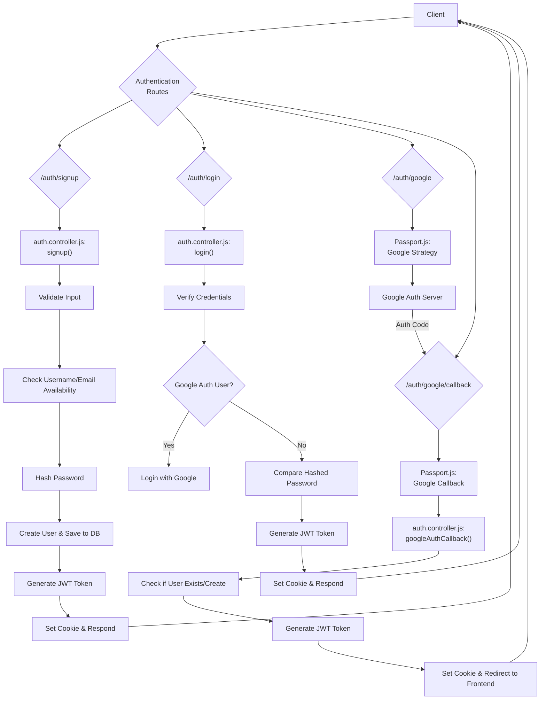
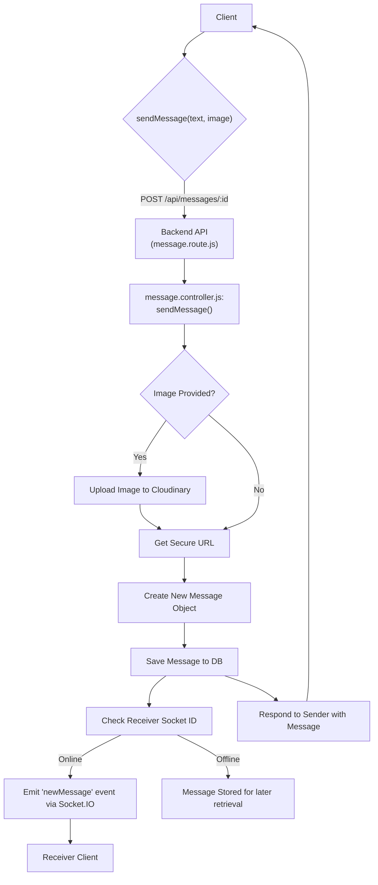

 # API Endpoints and Controllers

This document provides a comprehensive overview of the RESTful API endpoints, their defined routes, and the corresponding controller logic that handles incoming requests. The backend services are built around distinct functional areas: authentication, user interactions (friends), and real-time messaging.

## Authentication Endpoints

The authentication module manages user registration, login, session management (logout), profile updates, username availability checks, and Google OAuth integration.

### Routes

The core authentication routes are defined in `backend/src/routes/auth.route.js`. These routes map HTTP methods and paths to specific controller functions.

```javascript
// backend/src/routes/auth.route.js
import express from "express"
import passport from 'passport';
import { login, logout, signup, updateProfile, checkAuth, googleAuthCallback, checkUsernameAvailability} from  "../controllers/auth.controller.js"
import { protectRoute } from "../middleware/auth.middleware.js"
const router = express.Router();

router.post("/signup", signup);
router.post("/login", login);
router.post("/logout", logout);
router.put("/update-profile", protectRoute ,updateProfile)
router.get("/username/check/:username", protectRoute, checkUsernameAvailability);
router.get("/check", protectRoute, checkAuth)
router.get(
    '/google',
    passport.authenticate('google', { scope: ['profile', 'email'] })
);
router.get(
    '/google/callback',
    passport.authenticate('google', {
        failureRedirect: 'http://localhost:5173/login', 
        failureMessage: true 
    }),
    googleAuthCallback 
);
export default router;
```
[View on GitHub](https://github.com/shinymack/Chat-App-MERN/blob/main/backend/src/routes/auth.route.js)

### Controller Logic (`auth.controller.js`)

The `backend/src/controllers/auth.controller.js` file contains the logic for handling authentication-related requests.

#### User Registration (`signup`)

The `signup` controller handles new user registration. It validates input fields (username, email, password), checks for existing users, hashes the password using `bcryptjs`, creates a new user, generates a JWT token, and saves the user to the database.

```javascript
// backend/src/controllers/auth.controller.js (signup function)
export const signup = async (req, res) => {
    const {username, email, password} = req.body;
    try {
        if(!username || !email || !password) {
            return res.status(400).json({message: "Please fill in all fields."});
        }
        // ... (length validations)
        const user = await User.findOne({email});
        if (user) return res.status(400).json({message: "Email already exists."});
        
        const existingUserByUsername = await User.findOne({ username });
        if (existingUserByUsername) {
            return res.status(400).json({ message: "Username already exists. Please choose another." });
        }

        const salt = await bcrypt.genSalt(10);
        const hashedPassword = await bcrypt.hash(password, salt);

        const newUser = new User({
            username,
            email,
            password: hashedPassword,
            authProvider: 'email'
        });
        if(newUser){
            generateToken(newUser._id, res); // Generate JWT and set cookie
            await newUser.save();
            res.status(201).json({
                _id: newUser._id,
                username: newUser.username,
                email: newUser.email,   
                profilePic: newUser.profilePic,
                authProvider: newUser.authProvider
            });
        } else {
            res.status(400).json({message: "Invalid user data."});
        }
    } catch (error) {
        console.log("Error in signup controller", error.message)
        res.status(500).json({message: "Something went wrong."});
    }
};
```
[View on GitHub](https://github.com/shinymack/Chat-App-MERN/blob/main/backend/src/controllers/auth.controller.js#L7-L59)

#### User Login (`login`)

The `login` controller verifies user credentials, ensuring the email exists and the provided password matches the stored hashed password. It also handles cases for Google-authenticated users. Upon successful authentication, a JWT token is generated and sent.

#### Profile Update (`updateProfile`)

This controller allows authenticated users to update their profile picture and username. It integrates with Cloudinary for image uploads and performs validations for username uniqueness and format. A new JWT token is issued to reflect any changes.

```javascript
// backend/src/controllers/auth.controller.js (updateProfile function)
export const updateProfile = async (req, res) => {
    try {
        const { profilePic, username } = req.body;
        const userId = req.user._id;
        let userToUpdate = await User.findById(userId);

        if (!userToUpdate) {
            return res.status(404).json({ message: "User not found." });
        }

        const fieldsToUpdate = {};
        let newUsername = username ? username.trim() : null;

        if (newUsername && newUsername !== userToUpdate.username) {
            if (newUsername.length < 3 || newUsername.length > 20) {
                return res.status(400).json({ message: "Username must be between 3 and 20 characters." });
            }
            const existingUserWithNewUsername = await User.findOne({ username: newUsername, _id: { $ne: userId } });
            if (existingUserWithNewUsername) {
                return res.status(400).json({ message: "This username is already taken by someone else." });
            }
            fieldsToUpdate.username = newUsername;
        }

        if (profilePic) {
            const uploadResponse = await cloudinary.uploader.upload(profilePic);
            fieldsToUpdate.profilePic = uploadResponse.secure_url;
        }

        if (Object.keys(fieldsToUpdate).length === 0) {
            return res.status(400).json({ message: "No changes provided to update." });
        }

        const updatedUser = await User.findByIdAndUpdate(userId, { $set: fieldsToUpdate }, { new: true });

        generateToken(updatedUser._id, res); // Refresh token
        res.status(200).json(updatedUser);

    } catch (error) {
        console.error("Error in updateProfile controller", error.message);
        res.status(500).json({ message: "Internal Server Error while updating profile." });
    }
};
```
[View on GitHub](https://github.com/shinymack/Chat-App-MERN/blob/main/backend/src/controllers/auth.controller.js#L182-L239)

#### Google OAuth Callback (`googleAuthCallback`)

Handles the callback after Google authentication, generating a JWT token and redirecting the user to the frontend.

#### Username Availability Check (`checkUsernameAvailability`)

Allows users to check if a desired username is available, performing validations and database queries.

## Friend Management Endpoints

The friend management module facilitates friend requests, acceptance, rejection, removal, and retrieval of friend lists and pending requests. The controllers are located in `backend/src/controllers/friend.controller.js`.

### Controller Logic (`friend.controller.js`)

#### Sending a Friend Request (`sendFriendRequest`)

Users can send friend requests using an identifier (username or email). The controller verifies the existence of the recipient and prevents duplicate requests or requests to oneself.

```javascript
// backend/src/controllers/friend.controller.js (sendFriendRequest function)
export const sendFriendRequest = async (req, res) => {
    try {
        const { identifier } = req.body;
        const senderId = req.user._id;

        if (!identifier) {
            return res.status(400).json({ message: "Username or email is required." });
        }

        const receiver = await User.findOne({
            $or: [{ username: identifier }, { email: identifier }]
        });

        if (!receiver) {
            return res.status(404).json({ message: "User not found." });
        }
        
        const receiverId = receiver._id;

        if (senderId.toString() === receiverId.toString()) {
            return res.status(400).json({ message: "You cannot send a friend request to yourself." });
        }
        // ... (checks for existing friendships/requests)

        sender.sentRequests.push(receiverId);
        receiver.friendRequests.push(senderId);

        await sender.save();
        await receiver.save();

        res.status(200).json({ message: "Friend request sent successfully." });

    } catch (error) {
        console.error("Error in sendFriendRequest: ", error.message);
        res.status(500).json({ message: "Internal server error", error: error.message });
    }
};
```
[View on GitHub](https://github.com/shinymack/Chat-App-MERN/blob/main/backend/src/controllers/friend.controller.js#L10-L73)

#### Accepting a Friend Request (`acceptFriendRequest`)

Allows a user to accept a pending friend request. This moves the sender from the `friendRequests` array to the `friends` array for both users.

#### Rejecting a Friend Request (`rejectFriendRequest`)

Enables a user to reject a friend request, removing it from both the sender's `sentRequests` and the receiver's `friendRequests` arrays.

#### Removing a Friend (`removeFriend`)

Facilitates the removal of an existing friend, updating the `friends` array for both users involved.

## Messaging Endpoints

The messaging module handles the retrieval and sending of messages, supporting both text and image content. Real-time communication is integrated using WebSockets. The controllers are in `backend/src/controllers/message.controller.js`.

### Controller Logic (`message.controller.js`)

#### Getting Users for Sidebar (`getUsersForSidebar`)

Retrieves a list of all users, excluding the currently logged-in user, to display in the chat sidebar.

#### Getting Messages (`getMessages`)

Fetches all messages exchanged between the logged-in user and a specific chat partner (`userToChatId`).

#### Sending a Message (`sendMessage`)

Handles sending a new message, which can include text and/or an image. Images are uploaded to Cloudinary. After saving the message, it uses WebSockets (Socket.IO) to emit the new message in real-time to the receiver if they are online.

```javascript
// backend/src/controllers/message.controller.js (sendMessage function)
export const sendMessage = async (req, res) => {
    try {
        const { text, image } = req.body;
        const { id: receiverId } = req.params;
        const senderId = req.user._id;

        let imageUrl;
        if (image) {
            const uploadResponse = await cloudinary.uploader.upload(image);
            imageUrl = uploadResponse.secure_url;
        }
        const newMessage = new Message({
            senderId,
            receiverId,
            text,
            image: imageUrl,
        });

        await newMessage.save();

        const receiverSocketId = getReceiverSocketId(receiverId);

        if(receiverSocketId) {
            io.to(receiverSocketId).emit("newMessage", newMessage); // Real-time message
        }

        res.status(201).json(newMessage);   
        
    } catch (error) {
        console.log("Error in sendMessage controller:  ", error);
        res.status(500).json({ error: "Internal Server Error" });
    }
};
```
[View on GitHub](https://github.com/shinymack/Chat-App-MERN/blob/main/backend/src/controllers/message.controller.js#L42-L72)

## API Flow Diagram: User Authentication

This diagram illustrates the typical flow for user authentication, including both standard email/password and Google OAuth.





## API Flow Diagram: Message Sending with Real-time Updates

This diagram depicts the flow when a user sends a message, including the server-side processing and real-time delivery via WebSockets.





## Key Integration Points

-   **Authentication Middleware (`protectRoute`)**: All protected routes, such as `/update-profile`, `/username/check/:username`, and `/check`, rely on the `protectRoute` middleware to verify the JWT token from the cookie, ensuring that only authenticated users can access them.
-   **Cloudinary Integration**: Image uploads, specifically for profile pictures in `auth.controller.js` and message images in `message.controller.js`, are handled via the Cloudinary API. This offloads storage and serving of media assets.
-   **Socket.IO for Real-time Messaging**: The `sendMessage` controller in `message.controller.js` critically integrates with Socket.IO. After a message is saved to the database, `io.to(receiverSocketId).emit("newMessage", newMessage);` ensures that if the receiver is online, they receive the message instantly without needing to poll the server.
-   **Passport.js for Google OAuth**: Google authentication routes are managed by Passport.js, abstracting the OAuth 2.0 flow. The `googleAuthCallback` controller then handles the backend logic after Passport.js successfully authenticates the user.
-   **Database Interactions**: All controllers extensively interact with MongoDB via Mongoose models (`User`, `Message`) for data persistence, retrieval, and updates. This includes complex queries like `$or` for finding users by username or email, and `populate` for fetching related user data (friends, requests).

Next: [Data Models and Schema](./2.2_data-models-and-schema.mdx)