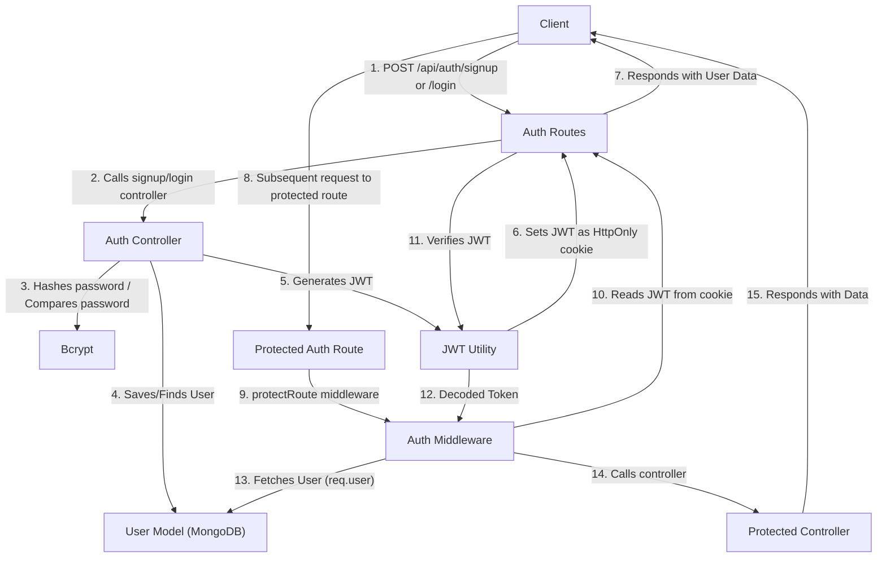
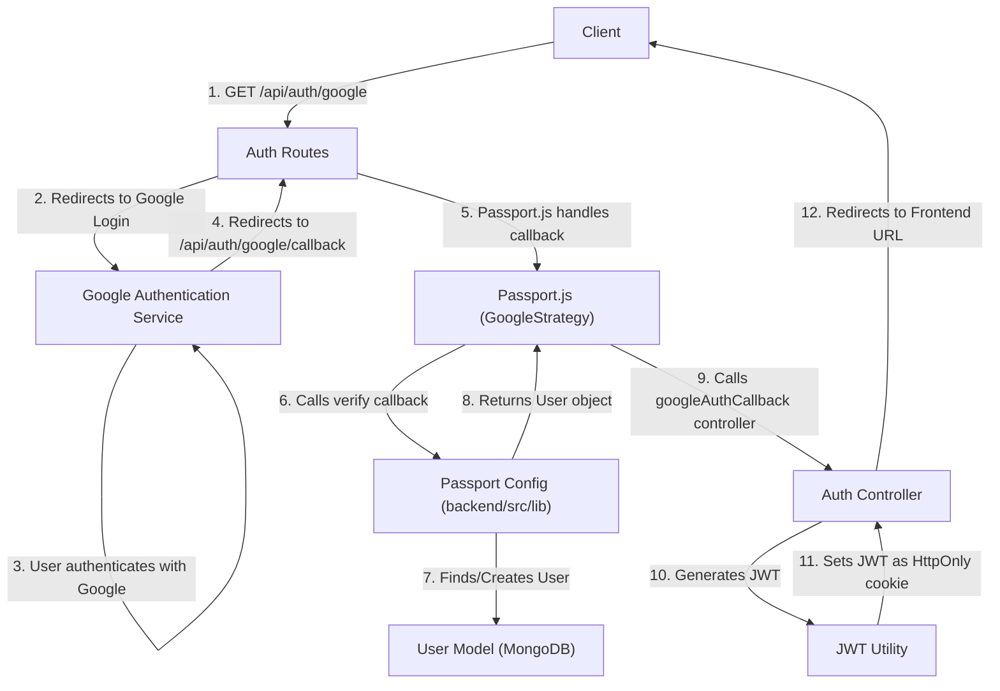

 # Authentication and Authorization

This section details the backend's comprehensive approach to user authentication, session management, and access control. It outlines how users sign up, log in, maintain authenticated sessions, and how their access to protected resources is managed. The system supports both traditional email/password authentication and Google OAuth.

## Core Authentication Mechanisms

The authentication system is primarily managed through several key files: `backend/src/controllers/auth.controller.js` for business logic, `backend/src/lib/passport.config.js` for OAuth configuration, `backend/src/middleware/auth.middleware.js` for route protection, and `backend/src/routes/auth.route.js` for defining API endpoints.

### User Registration (`signup`)

The `signup` controller handles new user registration. It performs validation checks for username, email, and password, ensures uniqueness, hashes the password using `bcryptjs`, and then creates a new user record. Upon successful registration, a JSON Web Token (JWT) is generated and set as an HTTP-only cookie to maintain the user's session.

<details>
<summary>Signup Controller Logic</summary>

```javascript
// backend/src/controllers/auth.controller.js
export const signup = async (req, res) => {
    const {username, email, password} = req.body;
    try {
        if(!username || !email || !password) {
            return res.status(400).json({message: "Please fill in all fields."});
        }
        // ... (validation checks for username and password length)
        const user = await User.findOne({email});
        if (user) return res.status(400).json({message: "Email already exists."});
        
        const existingUserByUsername = await User.findOne({ username });
        if (existingUserByUsername) {
            return res.status(400).json({ message: "Username already exists. Please choose another." });
        }

        const salt = await bcrypt.genSalt(10);
        const hashedPassword = await bcrypt.hash(password, salt);

        const newUser = new User({
            username,
            email,
            password: hashedPassword,
            authProvider: 'email'
        });
        if(newUser){
            generateToken(newUser._id, res); // Sets JWT cookie
            await newUser.save();

            res.status(201).json({
                _id: newUser._id,
                username: newUser.username,
                email: newUser.email,   
                profilePic: newUser.profilePic,
                authProvider: newUser.authProvider
            });
        } else {
            res.status(400).json({message: "Invalid user data."});
        }
    } catch (error) {
        console.log("Error in signup controller", error.message)
        res.status(500).json({message: "Something went wrong."});
    }
};
```
[View on GitHub](https://github.com/shinymack/Chat-App-MERN/blob/main/backend/src/controllers/auth.controller.js#L7-L58)
</details>

### User Login (`login`)

The `login` controller authenticates existing users. It checks for valid credentials (email and password), ensuring the password matches the stored hash. It also handles cases where a user might try to log in with an email/password for an account created via Google OAuth. On successful login, a JWT is generated and sent back to the client as an HTTP-only cookie.

<details>
<summary>Login Controller Logic</summary>

```javascript
// backend/src/controllers/auth.controller.js
export const login = async (req, res) => {
    const {email, password} = req.body;
    try {
        const user = await User.findOne({email});

        if(!user) {
            return res.status(400).json({message: "Invalid credentials."});
        }

        if(user.authProvider === 'google' && !user.password){
            return res.status(400).json({ message: "Please sign in with Google." });
        }

        const isPasswordCorrect = await bcrypt.compare(password, user.password);
        if(!isPasswordCorrect) {
            return res.status(400).json({message: "Invalid credentials."});
        }

        generateToken(user._id, res); // Sets JWT cookie
        res.status(200).json({
            _id: user._id,
            username: user.username,
            email: user.email,
            profilePic: user.profilePic,
            authProvider: user.authProvider,
        });
    } catch (error) {
        console.log("Error in login controller", error.message);
        res.status(500).json({message: "Something went wrong."});
    }
};
```
[View on GitHub](https://github.com/shinymack/Chat-App-MERN/blob/main/backend/src/controllers/auth.controller.js#L60-L95)
</details>

### Session Management (`logout`, `checkAuth`)

*   **`logout`**: This controller simply clears the `jwt` cookie by setting its `maxAge` to 0, effectively ending the user's session on the client side.
*   **`checkAuth`**: This endpoint, protected by `protectRoute`, allows the client to verify if a user is currently authenticated and retrieve their basic profile information without requiring credentials again.

### Profile Management (`updateProfile`, `checkUsernameAvailability`)

*   **`updateProfile`**: Allows authenticated users to update their profile information, such as their profile picture (using Cloudinary) and username. It includes validation for username uniqueness and length.
*   **`checkUsernameAvailability`**: An endpoint to check if a desired username is available, also protected to ensure only authenticated users can perform this check.

<details>
<summary>Update Profile Controller Logic</summary>

```javascript
// backend/src/controllers/auth.controller.js
export const updateProfile = async (req, res) => {
    try {
        const { profilePic, username } = req.body; 
        const userId = req.user._id;
        let userToUpdate = await User.findById(userId);

        if (!userToUpdate) {
            return res.status(404).json({ message: "User not found." });
        }

        const fieldsToUpdate = {};
        let newUsername = username ? username.trim() : null;
        let usernameChanged = false;

        // Handle username update
        if (newUsername && newUsername !== userToUpdate.username) {
            if (newUsername.length < 3 || newUsername.length > 20) {
                return res.status(400).json({ message: "Username must be between 3 and 20 characters." });
            }
            const existingUserWithNewUsername = await User.findOne({ username: newUsername, _id: { $ne: userId } });
            if (existingUserWithNewUsername) {
                return res.status(400).json({ message: "This username is already taken by someone else." });
            }
            fieldsToUpdate.username = newUsername;
            usernameChanged = true;
        }

        // Handle profile picture update
        if (profilePic) {
            const uploadResponse = await cloudinary.uploader.upload(profilePic);
            fieldsToUpdate.profilePic = uploadResponse.secure_url;
        }

        if (Object.keys(fieldsToUpdate).length === 0) {
            return res.status(400).json({ message: "No changes provided to update." });
        }

        const updatedUser = await User.findByIdAndUpdate(userId, { $set: fieldsToUpdate }, { new: true });
        generateToken(updatedUser._id, res); // Refresh JWT cookie
        res.status(200).json(updatedUser);

    } catch (error) {
        console.error("Error in updateProfile controller", error.message);
        res.status(500).json({ message: "Internal Server Error while updating profile." });
    }
};
```
[View on GitHub](https://github.com/shinymack/Chat-App-MERN/blob/main/backend/src/controllers/auth.controller.js#L210-L268)
</details>

### Route Protection (`protectRoute` middleware)

The `protectRoute` middleware is crucial for access control. It intercepts requests to protected routes, extracts the JWT from the cookies, verifies its authenticity and expiration, and then retrieves the associated user from the database. If the token is valid, the user object is attached to `req.user`, allowing subsequent controllers to access user information. If the token is invalid or missing, an unauthorized response is returned.

<details>
<summary>Protect Route Middleware</summary>

```javascript
// backend/src/middleware/auth.middleware.js
import jwt from "jsonwebtoken"
import User from "../models/user.model.js"

export const protectRoute = async (req, res, next) => {
    try {
        const token = req.cookies.jwt; // Get token from cookie
        if(!token){
            return res.status(401).json({message: "Unauthorized - No Token Provided"});
        }

        const decoded = jwt.verify(token, process.env.JWT_SECRET) // Verify token

        if(!decoded) {
            return res.status(401).json({message: "Unauthorized - Invalid Token"});
        }
        const user = await User.findById(decoded.userId).select("-password"); // Find user by ID

        if(!user) {
            return res.status(404).json({message: "User not found"});
        }
        req.user = user; // Attach user to request object

        next(); // Proceed to next middleware/controller
    } catch (error) {
        console.log("Error in protectRoute middleware", error.message);
        res.status(500).json({message: "Internal Server Error"});

    }
};
```
[View on GitHub](https://github.com/shinymack/Chat-App-MERN/blob/main/backend/src/middleware/auth.middleware.js#L4-L31)
</details>

### Authentication Flow (Email/Password)

Here's a simplified diagram illustrating the authentication flow for email/password users:





## Google OAuth Integration

The application integrates Google OAuth for seamless social login using `passport-google-oauth20`.

### Passport.js Configuration

The `passport.config.js` file sets up the Google Strategy:

*   It defines `clientID`, `clientSecret`, and `callbackURL` from environment variables.
*   The `verify` callback function handles user creation or retrieval from the database based on the Google profile. It ensures that if an email from Google already exists with a different `authProvider`, an error is returned to prevent account hijacking or unintended merges.
*   `serializeUser` and `deserializeUser` methods manage storing and retrieving user information in the session, typically just the user's MongoDB `_id`.

<details>
<summary>Passport Google Strategy Configuration</summary>

```javascript
// backend/src/lib/passport.config.js
import passport from 'passport';
import { Strategy as GoogleStrategy } from 'passport-google-oauth20';
import User from '../models/user.model.js'; 
import dotenv from 'dotenv';

dotenv.config(); 

export const configurePassport = () => {
    passport.use(new GoogleStrategy({
        clientID: process.env.GOOGLE_CLIENT_ID,
        clientSecret: process.env.GOOGLE_CLIENT_SECRET,
        callbackURL: process.env.GOOGLE_CALLBACK_URL,
        scope: ['profile', 'email'] 
    },
    async (accessToken, refreshToken, profile, done) => {
        try {
            let user = await User.findOne({ googleId: profile.id });

            if (user) {
                return done(null, user);
            } else {
                let username = profile.displayName.replace(/\s+/g, '').toLowerCase() || `user${Date.now()}`;
                // Logic to ensure unique username
                const existingUserByUsername = await User.findOne({ username });
                if (existingUserByUsername) {
                    username = `${username}${Date.now().toString().slice(-4)}`;
                }
                if (username.length > 20) username = username.substring(0,20);

                const newUser = new User({
                    googleId: profile.id,
                    email: profile.emails && profile.emails["0"] ? profile.emails["0"].value : null,
                    username: username,
                    authProvider: 'google',
                });

                if (!newUser.email) {
                    return done(new Error("Email not provided by Google. Cannot create account."), null);
                }

                // Check for existing email from non-Google provider
                const existingUserByEmail = await User.findOne({ email: newUser.email });
                if (existingUserByEmail && existingUserByEmail.authProvider !== 'google') {
                    return done(null, false, { message: `An account with email ${newUser.email} already exists. Please sign in using your original method.` });
                }

                await newUser.save();
                return done(null, newUser);
            }
        } catch (error) {
            return done(error, null);
        }
    }));

    passport.serializeUser((user, done) => { done(null, user.id); });
    passport.deserializeUser(async (id, done) => {
        try { const user = await User.findById(id); done(null, user); } 
        catch (error) { done(error, null); }
    });
};
```
[View on GitHub](https://github.com/shinymack/Chat-App-MERN/blob/main/backend/src/lib/passport.config.js#L4-L79)
</details>

### Google OAuth Endpoints (`auth.route.js`)

The authentication routes define endpoints for initiating and completing the Google OAuth flow:

*   `/api/auth/google`: Initiates the Google OAuth flow, redirecting the user to Google's authentication page.
*   `/api/auth/google/callback`: The callback URL where Google redirects the user after authentication. Passport.js processes the user data, and the `googleAuthCallback` controller then generates a JWT and redirects the user to the frontend.

<details>
<summary>Authentication Routes</summary>

```javascript
// backend/src/routes/auth.route.js
import express from "express"
import passport from 'passport';
import { login, logout, signup, updateProfile, checkAuth, googleAuthCallback, checkUsernameAvailability} from  "../controllers/auth.controller.js"
import { protectRoute } from "../middleware/auth.middleware.js"
const router = express.Router();

router.post("/signup", signup);
router.post("/login", login);
router.post("/logout", logout);
router.put("/update-profile", protectRoute ,updateProfile)
router.get("/username/check/:username", protectRoute, checkUsernameAvailability);
router.get("/check", protectRoute, checkAuth)

router.get(
    '/google',
    passport.authenticate('google', { scope: ['profile', 'email'] })
);
router.get(
    '/google/callback',
    passport.authenticate('google', {
        failureRedirect: 'http://localhost:5173/login', 
        failureMessage: true 
    }),
    googleAuthCallback 
);
export default router;
```
[View on GitHub](https://github.com/shinymack/Chat-App-MERN/blob/main/backend/src/routes/auth.route.js#L4-L29)
</details>

### Google OAuth Flow

This diagram illustrates the flow for Google OAuth authentication:





## Key Integration Points

*   **Centralized Authentication Logic**: All authentication-related business logic resides in `auth.controller.js`, ensuring a single source of truth for user management.
*   **Secure Session Management**: JWTs are used for stateless authentication and stored in HTTP-only cookies, mitigating XSS attacks. The `protectRoute` middleware enforces authentication across designated API endpoints.
*   **Flexible Authentication Options**: Supporting both traditional email/password and Google OAuth provides users with choice and convenience. The `authProvider` field in the user model helps differentiate account types.
*   **Idempotent User Creation/Retrieval for OAuth**: The Google Strategy's `verify` callback intelligently handles new user creation versus logging in existing users, and prevents creating duplicate accounts with the same email if it's already registered via another provider.
*   **Profile Updates and Username Availability**: Dedicated endpoints allow users to manage their profiles securely, including updating display names and profile pictures, with built-in validation.
*   **Error Handling**: Robust error handling is implemented across all controllers and middleware to provide informative feedback to the client while logging detailed errors on the server.