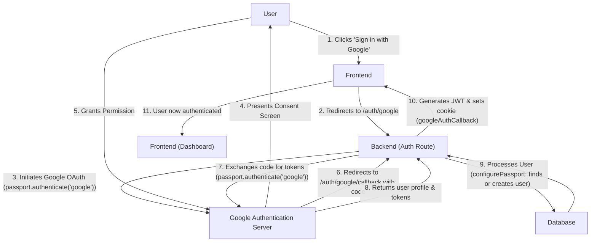

 # Authentication and Authorization

This document outlines the implementation details for user authentication, session management, and access control within the application. It covers both traditional email/password authentication and Google OAuth, along with middleware for protecting routes and managing user sessions.

## Core Authentication Flow

The application provides a robust authentication system allowing users to sign up, log in, and manage their profiles. This includes standard email/password methods and integration with Google for streamlined access. User sessions are managed using JWTs stored in HTTP-only cookies.

### User Registration (`signup`)

New users can register by providing a username, email, and password. The system includes validations for input fields and checks for unique usernames and emails to prevent duplicate accounts. Passwords are securely hashed using `bcryptjs` before being stored. Upon successful registration, a JSON Web Token (JWT) is generated and set as an HTTP-only cookie.

```javascript filename="backend/src/controllers/auth.controller.js" {10-18,34-39}
export const signup = async (req, res) => {
    const {username, email, password} = req.body;
    try {
        if(!username || !email || !password) {
            return res.status(400).json({message: "Please fill in all fields."});
        }
        if (username.length < 3 || username.length > 20) {
            return res.status(400).json({ message: "Username must be between 3 and 20 characters." });
        }
        if (password.length < 6) {
            return res.status(400).json({message: "Password must be at least 6 characters."});
        }
        const user = await User.findOne({email});
        if (user) return res.status(400).json({message: "Email already exists."});

        const existingUserByUsername = await User.findOne({ username });
        if (existingUserByUsername) {
            return res.status(400).json({ message: "Username already exists. Please choose another." });
        }

        const salt = await bcrypt.genSalt(10);
        const hashedPassword = await bcrypt.hash(password, salt);

        const newUser = new User({
            username,
            email,
            password: hashedPassword,
            authProvider: 'email'
        });
        if(newUser){
            generateToken(newUser._id, res); // Generate JWT and set cookie
            await newUser.save();

            res.status(201).json({
                _id: newUser._id,
                username: newUser.username,
                email: newUser.email,
                profilePic: newUser.profilePic,
                authProvider: newUser.authProvider
            });
        } else {
            res.status(400).json({message: "Invalid user data."});
        }
    } catch (error) {
        console.log("Error in signup controller", error.message)
        res.status(500).json({message: "Something went wrong."});
    }
};
```
[View `signup` function on GitHub](https://github.com/shinymack/Chat-App-MERN/blob/main/backend/src/controllers/auth.controller.js#L6-L50)

### User Login (`login`)

Existing users can log in with their email and password. The provided password is compared against the stored hash. If credentials are valid, a new JWT is issued and the user's details are returned. Users who originally signed up via Google are redirected to use Google login.

```javascript filename="backend/src/controllers/auth.controller.js" {57-61,63-65}
export const login = async (req, res) => {
    const {email, password} = req.body;
    try {
        const user = await User.findOne({email});

        if(!user) {
            return res.status(400).json({message: "Invalid credentials."});
        }

        if(user.authProvider === 'google' && !user.password){
            return res.status(400).json({ message: "Please sign in with Google." });
        }

        const isPasswordCorrect = await bcrypt.compare(password, user.password);
        if(!isPasswordCorrect) {
            return res.status(400).json({message: "Invalid credentials."});
        }

        generateToken(user._id, res); // Generate JWT and set cookie
        res.status(200).json({
            _id: user._id,
            username: user.username,
            email: user.email,
            profilePic: user.profilePic,
            authProvider: user.authProvider,
        });
    } catch (error) {
        console.log("Error in login controller", error.message);
        res.status(500).json({message: "Something went wrong."});
    }
};
```
[View `login` function on GitHub](https://github.com/shinymack/Chat-App-MERN/blob/main/backend/src/controllers/auth.controller.js#L52-L82)

### Logout (`logout`)

The logout process simply clears the JWT cookie, effectively ending the user's session.

```javascript filename="backend/src/controllers/auth.controller.js" {85-87}
export const logout = (req, res) => {
    try {
        res.cookie("jwt", "", {maxAge: 0});
        res.status(200).json({message: "Logged out successfully."})
    } catch(error) {
        console.log("Error in logout controller", error.message);
        res.status(500).json({message:"Internal Server Error"});
    }
};
```
[View `logout` function on GitHub](https://github.com/shinymack/Chat-App-MERN/blob/main/backend/src/controllers/auth.controller.js#L84-L91)

## Google OAuth Integration

The application leverages Passport.js for Google OAuth 2.0 authentication. This provides a secure and convenient way for users to sign in using their Google accounts.

### Passport Configuration

`passport.config.js` sets up the Google Strategy. It handles:
*   Redirecting users to Google for authentication.
*   Processing the callback from Google.
*   Checking if a user with the `googleId` already exists.
*   Creating a new user if one doesn't exist, carefully managing unique usernames and linking based on email.
*   Serializing and deserializing user information for session management.

```javascript filename="backend/src/lib/passport.config.js" {1-6,11-23}
import passport from 'passport';
import { Strategy as GoogleStrategy } from 'passport-google-oauth20';
import User from '../models/user.model.js';
import dotenv from 'dotenv';

dotenv.config();

export const configurePassport = () => {
    passport.use(new GoogleStrategy({
        clientID: process.env.GOOGLE_CLIENT_ID,
        clientSecret: process.env.GOOGLE_CLIENT_SECRET,
        callbackURL: process.env.GOOGLE_CALLBACK_URL,
        scope: ['profile', 'email']
    },
    async (accessToken, refreshToken, profile, done) => {
        try {
            let user = await User.findOne({ googleId: profile.id });

            if (user) {
                return done(null, user);
            } else {
                let username = profile.displayName.replace(/\s+/g, '').toLowerCase() || `user${Date.now()}`;

                const existingUserByUsername = await User.findOne({ username });
                if (existingUserByUsername) {
                    username = `${username}${Date.now().toString().slice(-4)}`;
                }
                if (username.length > 20) username = username.substring(0,20);

                const newUser = new User({
                    googleId: profile.id,
                    email: profile.emails && profile.emails[0] ? profile.emails[0].value : null,
                    username: username,
                    authProvider: 'google',
                });

                if (!newUser.email) {
                    return done(new Error("Email not provided by Google. Cannot create account."), null);
                }

                const existingUserByEmail = await User.findOne({ email: newUser.email });
                if (existingUserByEmail && existingUserByEmail.authProvider !== 'google') {
                    return done(null, false, { message: `An account with email ${newUser.email} already exists. Please sign in using your original method.` });
                }

                await newUser.save();
                return done(null, newUser);
            }
        } catch (error) {
            return done(error, null);
        }
    }));

    passport.serializeUser((user, done) => {
        done(null, user.id);
    });

    passport.deserializeUser(async (id, done) => {
        try {
            const user = await User.findById(id);
            done(null, user);
        } catch (error) {
            done(error, null);
        }
    });
};
```
[View `configurePassport` on GitHub](https://github.com/shinymack/Chat-App-MERN/blob/main/backend/src/lib/passport.config.js#L8-L70)

### Google Authentication Callback

The `googleAuthCallback` controller function handles the final step of Google OAuth. After Passport successfully authenticates the user, this function generates a JWT for the newly authenticated user and redirects them to the frontend.

```javascript filename="backend/src/controllers/auth.controller.js" {126-136}
export const googleAuthCallback = async (req, res) => {
 const frontendUrl = process.env.FRONTEND_URL || 'http://localhost:5173';

    try {
        if (!req.user) {
            return res.redirect(`${frontendUrl}/login?error=google_auth_failed`);
        }

        generateToken(req.user._id, res);

        res.redirect(frontendUrl);

    } catch (error) {
        console.error("Error in googleAuthCallback: ", error.message);
        res.redirect(`${frontendUrl}/login?error=google_auth_processing_error`);
    }
};
```
[View `googleAuthCallback` on GitHub](https://github.com/shinymack/Chat-App-MERN/blob/main/backend/src/controllers/auth.controller.js#L125-L139)

### Google Auth Flow
This diagram illustrates the Google OAuth 2.0 flow:





## Access Control and Middleware

Authorization is handled through a `protectRoute` middleware, which verifies the presence and validity of the JWT.

### `protectRoute` Middleware

The `protectRoute` middleware intercepts requests to protected routes. It extracts the JWT from the request cookies, verifies its authenticity and expiration, and then fetches the corresponding user from the database. If successful, the user object is attached to `req.user`, making it available to subsequent controllers. If the token is missing or invalid, the request is denied.

```javascript filename="backend/src/middleware/auth.middleware.js" {5-12,18-20}
import jwt from "jsonwebtoken"
import User from "../models/user.model.js"

export const protectRoute = async (req, res, next) => {
    try {
        const token = req.cookies.jwt;
        if(!token){
            return res.status(401).json({message: "Unauthorized - No Token Provided"});
        }

        const decoded = jwt.verify(token, process.env.JWT_SECRET)

        if(!decoded) {
            return res.status(401).json({message: "Unauthorized - Invalid Token"});
        }
        const user = await User.findById(decoded.userId).select("-password");

        if(!user) {
            return res.status(404).json({message: "User not found"});
        }
        req.user = user;

        next();
    } catch (error) {
        console.log("Error in protectRoute middleware", error.message);
        res.status(500).json({message: "Internal Server Error"});

    }

};
```
[View `protectRoute` on GitHub](https://github.com/shinymack/Chat-App-MERN/blob/main/backend/src/middleware/auth.middleware.js#L5-L29)

### Authentication Routes

All authentication-related endpoints are defined in `auth.route.js`. This file maps specific HTTP methods and paths to the corresponding controller functions, applying `protectRoute` where necessary.

```javascript filename="backend/src/routes/auth.route.js" {9-18}
import express from "express"
import passport from 'passport';
import { login, logout, signup, updateProfile, checkAuth, googleAuthCallback, checkUsernameAvailability} from  "../controllers/auth.controller.js"
import { protectRoute } from "../middleware/auth.middleware.js"
const router = express.Router();

router.post("/signup", signup);

router.post("/login", login);

router.post("/logout", logout);

router.put("/update-profile", protectRoute ,updateProfile)

router.get("/username/check/:username", protectRoute, checkUsernameAvailability);

router.get("/check", protectRoute, checkAuth)

router.get(
    '/google',
    passport.authenticate('google', { scope: ['profile', 'email'] })
);
router.get(
    '/google/callback',
    passport.authenticate('google', {
        failureRedirect: 'http://localhost:5173/login',
        failureMessage: true
    }),
    googleAuthCallback
);
export default router;
```
[View `auth.route.js` on GitHub](https://github.com/shinymack/Chat-App-MERN/blob/main/backend/src/routes/auth.route.js#L5-L31)

### Profile Management and Utility Endpoints

Authenticated users can update their profile information, specifically their username and profile picture. The system also provides an endpoint to check username availability and to retrieve the current user's authentication status.

```javascript filename="backend/src/controllers/auth.controller.js" {176-180,195-200}
export const updateProfile = async (req, res) => {
    try {
        const { profilePic, username } = req.body;
        const userId = req.user._id;
        let userToUpdate = await User.findById(userId);

        if (!userToUpdate) {
            return res.status(404).json({ message: "User not found." });
        }

        const fieldsToUpdate = {};
        let newUsername = username ? username.trim() : null;
        let usernameChanged = false;

        if (newUsername && newUsername !== userToUpdate.username) {
            if (newUsername.length < 3 || newUsername.length > 20) {
                return res.status(400).json({ message: "Username must be between 3 and 20 characters." });
            }

            const existingUserWithNewUsername = await User.findOne({ username: newUsername, _id: { $ne: userId } });
            if (existingUserWithNewUsername) {
                return res.status(400).json({ message: "This username is already taken by someone else." });
            }
            fieldsToUpdate.username = newUsername;
            usernameChanged = true;
        }

        if (profilePic) {
            const uploadResponse = await cloudinary.uploader.upload(profilePic);
            fieldsToUpdate.profilePic = uploadResponse.secure_url;
        }

        if (Object.keys(fieldsToUpdate).length === 0) {
            return res.status(400).json({ message: "No changes provided to update." });
        }

        const updatedUser = await User.findByIdAndUpdate(userId, { $set: fieldsToUpdate }, { new: true });

        if (!updatedUser) {
            return res.status(404).json({ message: "Failed to update user."});
        }

        generateToken(updatedUser._id, res);

        res.status(200).json(updatedUser);

    } catch (error) {
        console.error("Error in updateProfile controller", error.message);
        if (error.code === 11000 && error.keyValue && error.keyValue.username) {
            return res.status(400).json({ message: "This username is already taken." });
        }
        res.status(500).json({ message: "Internal Server Error while updating profile." });
    }
};
```
[View `updateProfile` function on GitHub](https://github.com/shinymack/Chat-App-MERN/blob/main/backend/src/controllers/auth.controller.js#L169-L225)

## Key Integration Points

### Session Management
*   **JWTs in HTTP-Only Cookies**: JWTs are used for session management. They are generated using `generateToken` (from `backend/src/lib/utils.js`, not included in the provided snippets) and set as HTTP-only cookies. This prevents client-side JavaScript from accessing the token, mitigating XSS attacks.
*   **Token Refresh**: The `generateToken` function is called after successful login, signup, and Google OAuth callback, ensuring a fresh token for the user. It is also called upon `updateProfile` to reflect any changes in user data that might be encoded in the token or to refresh its expiration.

### Error Handling
*   **Consistent Error Responses**: All authentication controllers return standardized JSON error messages with appropriate HTTP status codes (e.g., 400 for bad requests, 401 for unauthorized, 404 for not found, 500 for server errors).
*   **Detailed Logging**: Errors are consistently logged to the console (e.g., `console.log("Error in signup controller", error.message)`), aiding in debugging and monitoring.

### Data Security
*   **Password Hashing**: Passwords are never stored in plain text. `bcryptjs` is used to hash passwords with a salt, protecting against Rainbow Table attacks.
*   **Secure API Keys**: `process.env` is used to access sensitive credentials like `JWT_SECRET`, `GOOGLE_CLIENT_ID`, and `GOOGLE_CLIENT_SECRET`, keeping them out of the codebase.

### User Experience
*   **Username Availability Check**: An endpoint `/username/check/:username` allows the frontend to verify username uniqueness in real-time, improving the signup/profile update experience.
*   **Profile Update**: Users can update their username and profile picture. The `updateProfile` controller handles validation and ensures username uniqueness.
*   **Google OAuth Fallback**: Users trying to log in with email/password but originally signed up via Google are prompted to use the correct method. Similarly, if a Google account attempts to register with an email already used by an 'email' authenticated account, it provides an informative message.

This comprehensive approach to authentication and authorization ensures a secure, robust, and user-friendly experience across the application.