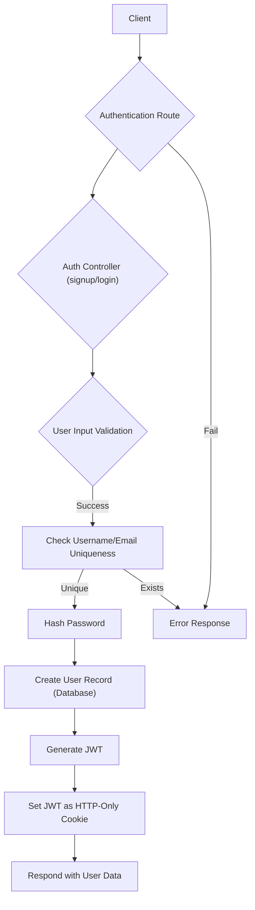

 
---
title: "Authentication and Authorization"
description: "Details on user authentication, session management, and access control mechanisms."
---

# Authentication and Authorization

This section provides a comprehensive overview of the authentication and authorization mechanisms implemented in the application. It covers user registration, login, logout, session management using JSON Web Tokens (JWTs), integration with Google OAuth, and secure route protection.

The system supports both traditional email/password authentication and Google-based authentication, ensuring a flexible and secure user experience.

## Core Authentication Flow (Email/Password)

The primary authentication flow for email and password users involves several steps, from registration to session management.

### User Registration (`signup`)

New users can register by providing a username, email, and password. The system performs robust validation to ensure data integrity and security, including checks for username/email uniqueness and password strength. Passwords are securely hashed using `bcryptjs` before storage. Upon successful registration, a JWT is generated and set as an HTTP-only cookie.

<details>
<summary>View `signup` Controller Snippet</summary>

```javascript
// backend/src/controllers/auth.controller.js
export const signup = async (req, res) => {
    const {username, email, password} = req.body;
    try {
        if(!username || !email || !password) {
            return res.status(400).json({message: "Please fill in all fields."});
        }
        // ... (username/password validation omitted for brevity) ...
        const user = await User.findOne({email});
        if (user) return res.status(400).json({message: "Email already exists."});
        
        const existingUserByUsername = await User.findOne({ username });
        if (existingUserByUsername) {
            return res.status(400).json({ message: "Username already exists. Please choose another." });
        }

        const salt = await bcrypt.genSalt(10);
        const hashedPassword = await bcrypt.hash(password, salt);

        const newUser = new User({
            username,
            email,
            password: hashedPassword,
            authProvider: 'email'
        });
        if(newUser){
            generateToken(newUser._id, res); // Generate JWT and set cookie
            await newUser.save();

            res.status(201).json({
                _id: newUser._id,
                username: newUser.username,
                email: newUser.email,   
                profilePic: newUser.profilePic,
                authProvider: newUser.authProvider
            });
        } else {
            res.status(400).json({message: "Invalid user data."});
        }
    } catch (error) {
        console.log("Error in signup controller", error.message)
        res.status(500).json({message: "Something went wrong."});
    }
};
```
</details>

[View `signup` controller on GitHub](https://github.com/shinymack/Chat-App-MERN/blob/main/backend/src/controllers/auth.controller.js#L7-L58)

### User Login (`login`)

The login process verifies user credentials against the stored hashed passwords. If the credentials are valid, a new JWT is issued and sent as an HTTP-only cookie. This ensures that even if the token is intercepted on the client-side, it cannot be directly accessed by JavaScript due to the `HttpOnly` flag.

<details>
<summary>View `login` Controller Snippet</summary>

```javascript
// backend/src/controllers/auth.controller.js
export const login = async (req, res) => {
    const {email, password} = req.body;
    try {
        const user = await User.findOne({email});

        if(!user) {
            return res.status(400).json({message: "Invalid credentials."});
        }

        if(user.authProvider === 'google' && !user.password){
            return res.status(400).json({ message: "Please sign in with Google." });
        }

        const isPasswordCorrect = await bcrypt.compare(password, user.password);
        if(!isPasswordCorrect) {
            return res.status(400).json({message: "Invalid credentials."});
        }

        generateToken(user._id, res); // Generate JWT and set cookie
        res.status(200).json({
            _id: user._id,
            username: user.username,
            email: user.email,
            profilePic: user.profilePic,
            authProvider: user.authProvider,
        });
    } catch (error) {
        console.log("Error in login controller", error.message);
        res.status(500).json({message: "Something went wrong."});
    }
};
```
</details>

[View `login` controller on GitHub](https://github.com/shinymack/Chat-App-MERN/blob/main/backend/src/controllers/auth.controller.js#L60-L95)

### Session Management

User sessions are managed through JWTs, which are generated upon successful login or signup and stored as HTTP-only cookies. These tokens contain the user's ID, allowing the server to identify the authenticated user on subsequent requests without requiring repeated login credentials.

### Authentication Flow Diagram





## Route Protection (`protectRoute` Middleware)

All protected routes are guarded by the `protectRoute` middleware. This middleware intercepts incoming requests, extracts the JWT from the HTTP-only cookie, verifies its authenticity, and decodes the user ID. If the token is valid, the corresponding user object is attached to the `req.user` object, making it accessible to subsequent controllers. If the token is missing or invalid, an unauthorized response is returned.

<details>
<summary>View `protectRoute` Middleware Snippet</summary>

```javascript
// backend/src/middleware/auth.middleware.js
import jwt from "jsonwebtoken"
import User from "../models/user.model.js"

export const protectRoute = async (req, res, next) => {
    try {
        const token = req.cookies.jwt;
        if(!token){
            return res.status(401).json({message: "Unauthorized - No Token Provided"});
        }

        const decoded = jwt.verify(token, process.env.JWT_SECRET)

        if(!decoded) {
            return res.status(401).json({message: "Unauthorized - Invalid Token"});
        }
        const user = await User.findById(decoded.userId).select("-password");

        if(!user) {
            return res.status(404).json({message: "User not found"});
        }
        req.user = user;

        next(); // Proceed to the next middleware/controller
    } catch (error) {
        console.log("Error in protectRoute middleware", error.message);
        res.status(500).json({message: "Internal Server Error"});
    }
};
```
</details>

[View `protectRoute` middleware on GitHub](https://github.com/shinymack/Chat-App-MERN/blob/main/backend/src/middleware/auth.middleware.js#L3-L28)

## Google OAuth Integration

The application integrates with Google for third-party authentication using `passport-google-oauth20` and `passport.js`. This allows users to sign up or log in using their Google accounts.

### Passport Configuration

Passport.js is configured with a GoogleStrategy. It handles the redirect to Google's authentication server, verifies the returned profile, and either finds an existing user or creates a new one based on the Google profile data. Special handling is included to manage unique usernames and prevent conflicts with existing email-based accounts.

<details>
<summary>View `passport.config.js` Snippet</summary>

```javascript
// backend/src/lib/passport.config.js
import passport from 'passport';
import { Strategy as GoogleStrategy } from 'passport-google-oauth20';
import User from '../models/user.model.js'; 
import dotenv from 'dotenv';

dotenv.config(); 

export const configurePassport = () => {
    passport.use(new GoogleStrategy({
        clientID: process.env.GOOGLE_CLIENT_ID,
        clientSecret: process.env.GOOGLE_CLIENT_SECRET,
        callbackURL: process.env.GOOGLE_CALLBACK_URL,
        scope: ['profile', 'email'] 
    },
    async (accessToken, refreshToken, profile, done) => {
        try {
            let user = await User.findOne({ googleId: profile.id });

            if (user) {
                return done(null, user);
            } else {
                let username = profile.displayName.replace(/\s+/g, '').toLowerCase() || `user${Date.now()}`;
                // ... (username uniqueness and email checks omitted for brevity) ...

                const newUser = new User({
                    googleId: profile.id,
                    email: profile.emails && profile.emails[0] ? profile.emails[0].value : null,
                    username: username,
                    authProvider: 'google',
                });

                if (!newUser.email) {
                    return done(new Error("Email not provided by Google. Cannot create account."), null);
                }
                // ... (existing email conflict check omitted) ...

                await newUser.save();
                return done(null, newUser);
            }
        } catch (error) {
            return done(error, null);
        }
    }));

    passport.serializeUser((user, done) => {
        done(null, user.id); 
    });

    passport.deserializeUser(async (id, done) => {
        try {
            const user = await User.findById(id);
            done(null, user); 
        } catch (error) {
            done(error, null);
        }
    });
};
```
</details>

[View `passport.config.js` on GitHub](https://github.com/shinymack/Chat-App-MERN/blob/main/backend/src/lib/passport.config.js#L5-L78)

### Google OAuth Flow Diagram


```mermaid
sequenceDiagram
    participant C as "Client (Browser)"
    participant BE as "Backend (Auth Route)"
    participant G as "Google OAuth Server"
    participant P as "Passport.js Middleware"
    participant UC as "Auth Controller (googleAuthCallback)"
    participant DB as "Database (User Model)"

    C->>+BE: GET /api/auth/google
    BE->>+P: passport.authenticate('google')
    P->>+G: Redirect to Google Login
    G ->>- C: Google Login Page
    C->>+G: User authenticates with Google
    G->>+BE: Redirect to /api/auth/google/callback with code
    BE->>+P: passport.authenticate('google', callback)
    P->>+G: Exchange code for tokens & profile
    G ->>- P: Tokens & User Profile
    P->>+DB: Find/Create User by googleId/email
    DB ->>- P: User Object
    P->>P: Serialize User ID
    P->>UC: Attach req.user, call next()
    UC->>UC: generateToken(req.user._id, res)
    UC ->>- C: Set JWT Cookie & Redirect to Frontend
    C->>BE: Subsequent Protected Requests (with JWT)
```


## User Profile Management

Authenticated users can update their profile information, specifically their username and profile picture. This process ensures data integrity and uniqueness for the username.

### Update Profile (`updateProfile`)

The `updateProfile` controller allows users to change their username and/or profile picture. Username changes are validated for length and uniqueness (excluding the current user's own username). Profile picture updates leverage Cloudinary for image storage. A new JWT is issued after an update to reflect any changes in user data.

<details>
<summary>View `updateProfile` Controller Snippet</summary>

```javascript
// backend/src/controllers/auth.controller.js
export const updateProfile = async (req, res) => {
    try {
        const { profilePic, username } = req.body;
        const userId = req.user._id;
        let userToUpdate = await User.findById(userId);

        if (!userToUpdate) {
            return res.status(404).json({ message: "User not found." });
        }

        const fieldsToUpdate = {};
        let newUsername = username ? username.trim() : null;

        if (newUsername && newUsername !== userToUpdate.username) {
            if (newUsername.length < 3 || newUsername.length > 20) {
                return res.status(400).json({ message: "Username must be between 3 and 20 characters." });
            }
            const existingUserWithNewUsername = await User.findOne({ username: newUsername, _id: { $ne: userId } });
            if (existingUserWithNewUsername) {
                return res.status(400).json({ message: "This username is already taken by someone else." });
            }
            fieldsToUpdate.username = newUsername;
        }

        if (profilePic) {
            const uploadResponse = await cloudinary.uploader.upload(profilePic);
            fieldsToUpdate.profilePic = uploadResponse.secure_url;
        }

        if (Object.keys(fieldsToUpdate).length === 0) {
            return res.status(400).json({ message: "No changes provided to update." });
        }

        const updatedUser = await User.findByIdAndUpdate(userId, { $set: fieldsToUpdate }, { new: true });
        generateToken(updatedUser._id, res); // Refresh JWT
        res.status(200).json(updatedUser);

    } catch (error) {
        console.error("Error in updateProfile controller", error.message);
        if (error.code === 11000 && error.keyValue && error.keyValue.username) {
            return res.status(400).json({ message: "This username is already taken." });
        }
        res.status(500).json({ message: "Internal Server Error while updating profile." });
    }
};
```
</details>

[View `updateProfile` controller on GitHub](https://github.com/shinymack/Chat-App-MERN/blob/main/backend/src/controllers/auth.controller.js#L182-L245)

## Routes

The `auth.route.js` file defines all API endpoints related to authentication and authorization.

<details>
<summary>View `auth.route.js` Snippet</summary>

```javascript
// backend/src/routes/auth.route.js
import express from "express"
import passport from 'passport';
import { login, logout, signup, updateProfile, checkAuth, googleAuthCallback, checkUsernameAvailability} from  "../controllers/auth.controller.js"
import { protectRoute } from "../middleware/auth.middleware.js"
const router = express.Router();

router.post("/signup", signup);

router.post("/login", login);

router.post("/logout", logout);

router.put("/update-profile", protectRoute ,updateProfile)

router.get("/username/check/:username", protectRoute, checkUsernameAvailability);

router.get("/check", protectRoute, checkAuth)

router.get(
    '/google',
    passport.authenticate('google', { scope: ['profile', 'email'] })
);
router.get(
    '/google/callback',
    passport.authenticate('google', {
        failureRedirect: 'http://localhost:5173/login', 
        failureMessage: true 
    }),
    googleAuthCallback 
);
export default router;
```
</details>

[View `auth.route.js` on GitHub](https://github.com/shinymack/Chat-App-MERN/blob/main/backend/src/routes/auth.route.js)

## Key Integration Points

*   **Middleware Stacking:** The `protectRoute` middleware is strategically placed before sensitive route handlers (`/update-profile`, `/username/check`, `/check`) to ensure that only authenticated users can access them.
*   **JWT Security:** JWTs are stored in HTTP-only cookies to mitigate Cross-Site Scripting (XSS) attacks by preventing client-side JavaScript from accessing the token.
*   **Passport.js for OAuth:** Passport.js streamlines the Google OAuth flow, abstracting away the complexities of token exchange and profile retrieval. It seamlessly integrates with the application's user model.
*   **Error Handling:** Robust error handling is implemented in all controllers and middleware to provide meaningful feedback to the client and log server-side issues.
*   **User Experience:** The `checkUsernameAvailability` endpoint allows the frontend to provide real-time feedback to users during registration or profile updates, improving usability.
```