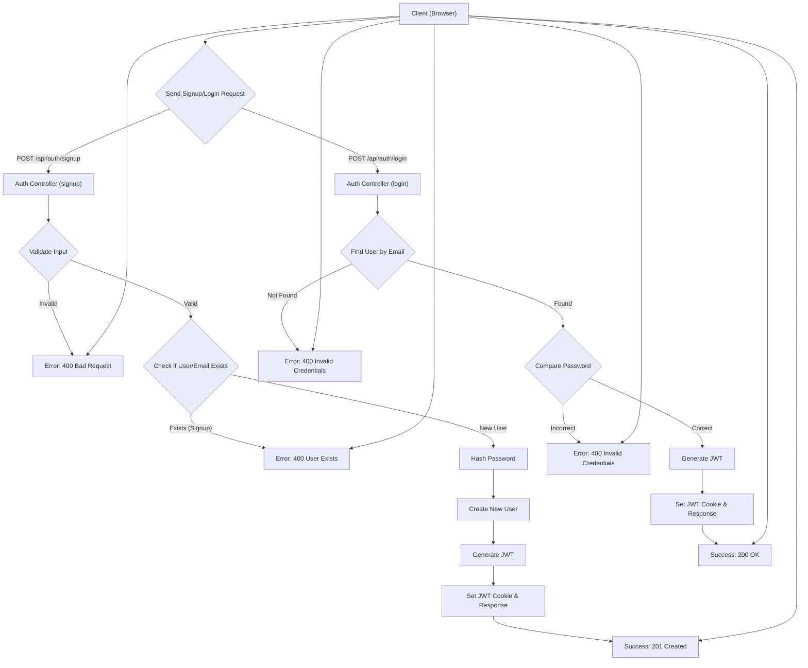
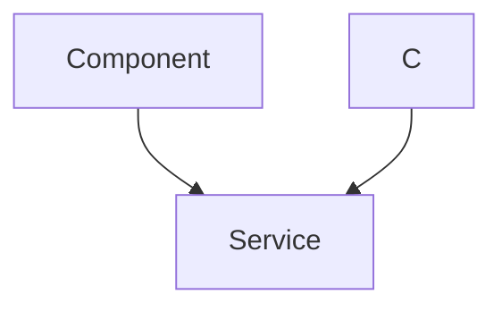

 # Authentication and User Management

This section outlines the core mechanisms for user authentication, authorization, and profile management within the application's backend. It covers traditional email/password authentication, Google OAuth integration using Passport.js, JWT-based session management, and user profile updates.

## Core Authentication Controllers

The `backend/src/controllers/auth.controller.js` file handles all primary authentication actions.

### User Registration (`signup`)

The `signup` controller facilitates new user registration with email and password. It includes robust validation for username and password length, checks for existing users by email and username, hashes passwords using `bcryptjs`, and issues a JSON Web Token (JWT) upon successful registration.

```javascript
// File: backend/src/controllers/auth.controller.js
export const signup = async (req, res) => {
    const {username, email, password} = req.body;
    try {
        // ... input validation ...
        const salt = await bcrypt.genSalt(10);
        const hashedPassword = await bcrypt.hash(password, salt);

        const newUser = new User({
            username,
            email,
            password: hashedPassword,
            authProvider: 'email'
        });
        if(newUser){
            generateToken(newUser._id, res); // Generate and set JWT cookie
            await newUser.save();

            res.status(201).json({
                _id: newUser._id,
                username: newUser.username,
                email: newUser.email,   
                profilePic: newUser.profilePic,
                authProvider: newUser.authProvider
            });
        } // ... error handling ...
    } // ... catch block ...
};
```
[View on GitHub](https://github.com/shinymack/Chat-App-MERN/blob/main/backend/src/controllers/auth.controller.js#L5-L48)

### User Login (`login`)

The `login` controller verifies user credentials for existing users. It checks for the user by email, handles cases for Google-authenticated users without a local password, compares provided password with the stored hash using `bcryptjs.compare()`, and issues a new JWT upon successful login.

```javascript
// File: backend/src/controllers/auth.controller.js
export const login = async (req, res) => {
    const {email, password} = req.body;
    try {
        const user = await User.findOne({email});
        if(!user) {
            return res.status(400).json({message: "Invalid credentials."});
        }
        if(user.authProvider === 'google' && !user.password){
            return res.status(400).json({ message: "Please sign in with Google." });
        }
        const isPasswordCorrect = await bcrypt.compare(password, user.password);
        if(!isPasswordCorrect) {
            return res.status(400).json({message: "Invalid credentials."});
        }
        generateToken(user._id, res); // Generate and set JWT cookie
        res.status(200).json({
            _id: user._id,
            username: user.username,
            email: user.email,
            profilePic: user.profilePic,
            authProvider: user.authProvider,
        });
    } // ... catch block ...
};
```
[View on GitHub](https://github.com/shinymack/Chat-App-MERN/blob/main/backend/src/controllers/auth.controller.js#L50-L80)

### User Logout (`logout`)

The `logout` controller invalidates the user's session by clearing the JWT cookie. This effectively logs the user out from the application.

```javascript
// File: backend/src/controllers/auth.controller.js
export const logout = (req, res) => {
    try {
        res.cookie("jwt", "", {maxAge: 0}); // Clear the JWT cookie
        res.status(200).json({message: "Logged out successfully."})
    } // ... catch block ...
};
```
[View on GitHub](https://github.com/shinymack/Chat-App-MERN/blob/main/backend/src/controllers/auth.controller.js#L82-L89)

### Check Authentication Status (`checkAuth`)

This endpoint allows the frontend to verify if a user is currently authenticated and retrieve their basic profile information. It leverages the `protectRoute` middleware (detailed below) to ensure the request comes from an authenticated user, then returns the `req.user` object.

```javascript
// File: backend/src/controllers/auth.controller.js
export const checkAuth = (req, res) => {
    try {
        res.status(200).json({ // req.user is populated by protectRoute middleware
            _id: req.user._id,
            username: req.user.username,
            email: req.user.email,
            profilePic: req.user.profilePic,
            authProvider: req.user.authProvider,
            createdAt: req.user.createdAt
        });
    } catch (error) {
        console.log("Error in checkAuth controller", error.message);
        res.status(500).json({message: "Internal Server Error"});
    }
};
```
[View on GitHub](https://github.com/shinymack/Chat-App-MERN/blob/main/backend/src/controllers/auth.controller.js#L92-L107)

### User Registration/Login Flow

The following diagram illustrates the basic flow for user registration and login using email and password.





### Google Authentication Callback (`googleAuthCallback`)

This controller is the callback endpoint for Google OAuth. After Google authenticates the user, it redirects back to this endpoint. Passport.js processes the user data, and if successful, a JWT is generated and a cookie is set before redirecting the user to the frontend.

```javascript
// File: backend/src/controllers/auth.controller.js
export const googleAuthCallback = async (req, res) => {
    const frontendUrl = process.env.FRONTEND_URL || 'http://localhost:5173';
    try {
        if (!req.user) { // req.user is set by Passport.js after successful auth
            return res.redirect(`${frontendUrl}/login?error=google_auth_failed`);
        }
        generateToken(req.user._id, res); // Generate and set JWT cookie
        res.redirect(frontendUrl); // Redirect to frontend on success
    } catch (error) {
        console.error("Error in googleAuthCallback: ", error.message);
        res.redirect(`${frontendUrl}/login?error=google_auth_processing_error`);
    }
};
```
[View on GitHub](https://github.com/shinymack/Chat-App-MERN/blob/main/backend/src/controllers/auth.controller.js#L110-L128)

### Username Availability Check (`checkUsernameAvailability`)

This endpoint allows clients to check if a desired username is available. It validates length constraints and checks against existing usernames in the database, excluding the current user's own username if they are authenticated.

```javascript
// File: backend/src/controllers/auth.controller.js
export const checkUsernameAvailability = async (req, res) => {
    try {
        const { username } = req.params;
        const currentUserId = req.user._id; 

        if (!username || username.trim().length < 3 || username.trim().length > 20) {
            return res.status(400).json({ available: false, message: "Username must be between 3 and 20 characters." });
        }
        
        if (req.user.username === username) { // If it's the current user's username
            return res.status(200).json({ available: true, message: "This is your current username." });
        }

        const existingUser = await User.findOne({ username: username });

        if (existingUser) {
            return res.status(200).json({ available: false, message: "Username is already taken." });
        }

        res.status(200).json({ available: true, message: "Username is available." });

    } catch (error) {
        console.error("Error in checkUsernameAvailability:", error.message);
        res.status(500).json({ available: false, message: "Error checking username availability." });
    }
};
```
[View on GitHub](https://github.com/shinymack/Chat-App-MERN/blob/main/backend/src/controllers/auth.controller.js#L130-L168)

### User Profile Update (`updateProfile`)

The `updateProfile` controller allows authenticated users to modify their `profilePic` and `username`. It handles Cloudinary uploads for new profile pictures and validates username changes to ensure uniqueness and adherence to length constraints. Upon successful update, a new JWT is issued to reflect any changes that might be included in the token payload.

```javascript
// File: backend/src/controllers/auth.controller.js
export const updateProfile = async (req, res) => {
    try {
        const { profilePic, username } = req.body;
        const userId = req.user._id;
        let userToUpdate = await User.findById(userId);

        if (!userToUpdate) { return res.status(404).json({ message: "User not found." }); }

        const fieldsToUpdate = {};
        let newUsername = username ? username.trim() : null;

        // Handle username update logic (validation, uniqueness check)
        if (newUsername && newUsername !== userToUpdate.username) {
            // ... username validation and uniqueness checks ...
            fieldsToUpdate.username = newUsername;
        }

        // Handle profile picture upload with Cloudinary
        if (profilePic) {
            const uploadResponse = await cloudinary.uploader.upload(profilePic);
            fieldsToUpdate.profilePic = uploadResponse.secure_url;
        }

        if (Object.keys(fieldsToUpdate).length === 0) {
            return res.status(400).json({ message: "No changes provided to update." });
        }

        const updatedUser = await User.findByIdAndUpdate(userId, { $set: fieldsToUpdate }, { new: true });
        generateToken(updatedUser._id, res); // Refresh JWT
        res.status(200).json(updatedUser);

    } catch (error) {
        console.error("Error in updateProfile controller", error.message);
        res.status(500).json({ message: "Internal Server Error while updating profile." });
    }
};
```
[View on GitHub](https://github.com/shinymack/Chat-App-MERN/blob/main/backend/src/controllers/auth.controller.js#L173-L226)

## Passport.js Configuration for Google OAuth

The `backend/src/lib/passport.config.js` file configures Passport.js for Google OAuth 2.0.

### Google Strategy Setup

The `configurePassport` function initializes the `GoogleStrategy`, providing client credentials and a callback URL. The strategy defines how to find or create a user in the database based on the Google profile. It ensures that users attempting to sign in with Google whose email already exists via `email` authentication are handled appropriately.

```javascript
// File: backend/src/lib/passport.config.js
import passport from 'passport';
import { Strategy as GoogleStrategy } from 'passport-google-oauth20';
import User from '../models/user.model.js'; 

export const configurePassport = () => {
    passport.use(new GoogleStrategy({
        clientID: process.env.GOOGLE_CLIENT_ID,
        clientSecret: process.env.GOOGLE_CLIENT_SECRET,
        callbackURL: process.env.GOOGLE_CALLBACK_URL,
        scope: ['profile', 'email'] 
    },
    async (accessToken, refreshToken, profile, done) => {
        try {
            let user = await User.findOne({ googleId: profile.id });
            if (user) { return done(null, user); } 
            else {
                let username = profile.displayName.replace(/\s+/g, '').toLowerCase() || `user${Date.now()}`;
                // ... username uniqueness logic ...

                const newUser = new User({
                    googleId: profile.id,
                    email: profile.emails && profile.emails[0] ? profile.emails[0].value : null,
                    username: username,
                    authProvider: 'google',
                });
                // ... email validation and existing user check ...
                await newUser.save();
                return done(null, newUser);
            }
        } catch (error) { return done(error, null); }
    }));
    // ... serializeUser and deserializeUser ...
};
```
[View on GitHub](https://github.com/shinymack/Chat-App-MERN/blob/main/backend/src/lib/passport.config.js#L8-L63)

### Serialization and Deserialization

Passport.js uses `serializeUser` and `deserializeUser` to manage user sessions.
- `serializeUser`: Stores a minimal amount of user information (typically the user ID) in the session.
- `deserializeUser`: Retrieves the full user object from the database using the stored ID for each subsequent request, attaching it to `req.user`.

```javascript
// File: backend/src/lib/passport.config.js
    // Serialize user to store in session (just the user ID)
    passport.serializeUser((user, done) => {
        done(null, user.id); // user.id is the _id from MongoDB
    });

    // Deserialize user from session (fetch user from DB using the ID)
    passport.deserializeUser(async (id, done) => {
        try {
            const user = await User.findById(id);
            done(null, user); // This user object is attached to req.user
        } catch (error) {
            done(error, null);
        }
    });
};
```
[View on GitHub](https://github.com/shinymack/Chat-App-MERN/blob/main/backend/src/lib/passport.config.js#L66-L80)

### Google OAuth Flow

The interaction sequence for Google authentication:





## Authentication Middleware

The `backend/src/middleware/auth.middleware.js` file contains middleware for protecting routes.

### `protectRoute` Middleware

The `protectRoute` middleware is essential for authorization. It intercepts requests, extracts the JWT from HTTP-only cookies, verifies its authenticity using `jsonwebtoken`, and then finds the corresponding user in the database. If successful, it attaches the user object to `req.user`, making user information available to subsequent controllers. If verification fails or the token is missing/invalid, it prevents access to the route.

```javascript
// File: backend/src/middleware/auth.middleware.js
import jwt from "jsonwebtoken"
import User from "../models/user.model.js"

export const protectRoute = async (req, res, next) => {
    try {
        const token = req.cookies.jwt; // Get JWT from cookie
        if(!token){
            return res.status(401).json({message: "Unauthorized - No Token Provided"});
        }

        const decoded = jwt.verify(token, process.env.JWT_SECRET) // Verify token

        if(!decoded) {
            return res.status(401).json({message: "Unauthorized - Invalid Token"});
        }
        const user = await User.findById(decoded.userId).select("-password"); // Find user by ID

        if(!user) {
            return res.status(404).json({message: "User not found"});
        }
        req.user = user; // Attach user object to request

        next(); // Proceed to next middleware/controller
    } catch (error) {
        console.log("Error in protectRoute middleware", error.message);
        res.status(500).json({message: "Internal Server Error"});
    }
};
```
[View on GitHub](https://github.com/shinymack/Chat-App-MERN/blob/main/backend/src/middleware/auth.middleware.js#L4-L29)

## User Model

The `backend/src/models/user.model.js` defines the schema for user data storage.

### User Schema and Pre-save Hook

The `userSchema` defines fields like `email`, `username`, `password`, `profilePic`, `authProvider`, and `googleId`. The `authProvider` enum (`'email'`, `'google'`) is crucial for distinguishing authentication methods. A `pre('save')` hook ensures that:
1. If a user is authenticating via Google, their `password` field is set to `undefined` (or removed if it existed).
2. For new email signups, a `password` is explicitly required.

This design accommodates both traditional email/password and third-party OAuth logins gracefully. `googleId` is made `unique` and `sparse` to allow users without a Google ID.

```javascript
// File: backend/src/models/user.model.js
import mongoose from "mongoose"

const  userSchema = new mongoose.Schema(
    {
        email: { type: String, required: true, unique: true },
        username: { /* ... validation ... */ },
        password: { type: String, minlength: 6 },
        profilePic: { type: String, default: "" },
        // ... friend-related fields ...
        authProvider: { // Specifies auth method (email or Google)
            type: String,
            enum: ['email', 'google'],
            default: 'email'
        },
        googleId: { // Stores Google's unique user ID for OAuth
            type: String,
            unique: true,
            sparse: true // Allows null values, but requires uniqueness if present
        },
    },
    { timestamps: true } 
);

userSchema.pre('save', async function(next) {
    if (this.authProvider === 'google' && !this.isModified('password')) {
        this.password = undefined; // Do not save password for Google users
    }
    if (this.authProvider === 'email' && !this.password && this.isNew) {
        return next(new Error('Password is required for email signup.'));
    }
    next();
});

const User = mongoose.model("User", userSchema);

export default User;
```
[View on GitHub](https://github.com/shinymack/Chat-App-MERN/blob/main/backend/src/models/user.model.js#L3-L73)

## Key Integration Points

-   **JWT for Session Management**: Instead of traditional sessions, JWTs are used to maintain user sessions. Upon login or signup, a JWT containing the user's ID is generated and stored as an HTTP-only cookie on the client. This token is then sent with every subsequent request and verified by the `protectRoute` middleware. This approach is stateless on the server, enhancing scalability.
-   **Passport.js for Third-Party OAuth**: The application integrates Google OAuth using Passport.js. This allows users to sign up or log in using their Google accounts, simplifying the authentication process and reducing friction. Passport handles the complex OAuth flow, abstracting it into a clean middleware.
-   **Unified User Model**: The `User` model is designed to accommodate both email/password users and Google OAuth users. The `authProvider` field explicitly tracks the authentication method, and the `googleId` field (unique and sparse) stores the identifier for Google users. The pre-save hook in the Mongoose schema ensures that password hashing logic is bypassed for Google-authenticated users and enforced for email/password users.
-   **`req.user` for Authorization**: The `protectRoute` middleware effectively acts as an authorization gate. By attaching the authenticated `User` object to `req.user`, subsequent controllers can easily access user-specific data (like `_id`, `username`, `email`) for authorization checks and personalized responses without repeatedly querying the database.
-   **Cloudinary for Profile Pictures**: The `updateProfile` controller demonstrates integration with Cloudinary for handling image uploads, allowing users to update their profile pictures. The URL of the uploaded image is then stored in the `profilePic` field of the `User` model.
-   **Error Handling and User Feedback**: All authentication and profile management controllers include robust error handling, returning descriptive error messages and appropriate HTTP status codes (e.g., 400 for bad requests, 401 for unauthorized, 404 for not found, 500 for server errors), which is crucial for a good user experience and frontend integration.