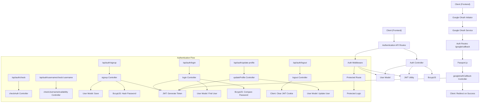
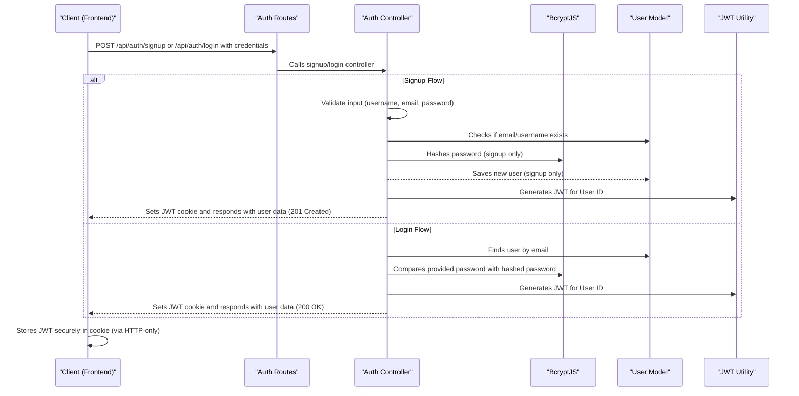

 # Authentication and User Management

This section details the core components responsible for managing user authentication, authorization, and profile information within the backend of the application. It outlines the processes for user registration, login, logout, session management, and profile updates, including integration with Google OAuth.

## Core Concepts

The authentication system is built around several key principles:

*   **Token-based Authentication:** JSON Web Tokens (JWT) are used for secure session management after a user logs in.
*   **Password Hashing:** `bcryptjs` is utilized to securely hash and compare user passwords, preventing plain-text storage.
*   **Middleware Protection:** Routes requiring authentication are protected by middleware that verifies the JWT.
*   **Provider Agnostic:** Supports both traditional email/password authentication and Google OAuth.

## Architecture and Flow

The authentication process involves several components working in tandem, including controllers for business logic, models for data persistence, middleware for request interception, and routes for endpoint definition.





### `backend/src/controllers/auth.controller.js`

This file contains the primary business logic for all authentication and user management operations.

*   **`signup`**: Handles new user registration, including input validation, password hashing, checking for existing users, and generating a JWT.

    ```javascript
    export const signup = async (req, res) => {
        const {username, email, password} = req.body;
        try {
            // ... validation logic ...
            const salt = await bcrypt.genSalt(10);
            const hashedPassword = await bcrypt.hash(password, salt);

            const newUser = new User({
                username,
                email,
                password: hashedPassword,
                authProvider: 'email'
            });
            if(newUser){
                generateToken(newUser._id, res); // Sets JWT cookie
                await newUser.save();
                res.status(201).json({ /* user data */ });
            } else {
                res.status(400).json({message: "Invalid user data."});
            }
        } catch (error) {
            console.log("Error in signup controller", error.message)
            res.status(500).json({message: "Something went wrong."});
        }
    };
    ```

    [View on GitHub](https://github.com/shinymack/Chat-App-MERN/blob/main/backend/src/controllers/auth.controller.js#L7-L58)

*   **`login`**: Authenticates an existing user by verifying their credentials and generating a JWT upon successful login. It also handles specific cases for Google authenticated users.

    ```javascript
    export const login = async (req, res) => {
        const {email, password} = req.body;
        try {
            const user = await User.findOne({email});
            if(!user) return res.status(400).json({message: "Invalid credentials."});

            // Handle Google auth users attempting password login
            if(user.authProvider === 'google' && !user.password){
                return res.status(400).json({ message: "Please sign in with Google." });
            }

            const isPasswordCorrect = await bcrypt.compare(password, user.password);
            if(!isPasswordCorrect) return res.status(400).json({message: "Invalid credentials."});

            generateToken(user._id, res); // Sets JWT cookie
            res.status(200).json({ /* user data */ });
        } catch (error) {
            console.log("Error in login controller", error.message);
            res.status(500).json({message: "Something went wrong."});
        }
    };
    ```

    [View on GitHub](https://github.com/shinymack/Chat-App-MERN/blob/main/backend/src/controllers/auth.controller.js#L60-L89)

*   **`logout`**: Clears the JWT cookie, effectively logging out the user.

*   **`checkAuth`**: Verifies the current user's authentication status using the `protectRoute` middleware and returns user details if authenticated.

*   **`googleAuthCallback`**: This is the callback endpoint for Google OAuth. After Google authenticates the user, Passport.js processes the profile, and this controller generates a JWT for the user and redirects them to the frontend.

*   **`checkUsernameAvailability`**: Allows clients to check if a desired username is available, preventing duplicates and ensuring unique user identities.

*   **`updateProfile`**: Handles updating user profile details, such as the `profilePic` and `username`. It manages Cloudinary integration for image uploads and ensures username uniqueness.

    ```javascript
    export const updateProfile = async (req, res) => {
        try {
            const { profilePic, username } = req.body;
            const userId = req.user._id;
            let userToUpdate = await User.findById(userId);

            // ... username and profile picture update logic ...

            const updatedUser = await User.findByIdAndUpdate(userId, { $set: fieldsToUpdate }, { new: true });
            generateToken(updatedUser._id, res); // Refresh JWT cookie
            res.status(200).json(updatedUser);

        } catch (error) {
            console.error("Error in updateProfile controller", error.message);
            res.status(500).json({ message: "Internal Server Error while updating profile." });
        }
    };
    ```

    [View on GitHub](https://github.com/shinymack/Chat-App-MERN/blob/main/backend/src/controllers/auth.controller.js#L182-L248)

### `backend/src/middleware/auth.middleware.js`

This file defines the `protectRoute` middleware, essential for securing authenticated endpoints.

*   **`protectRoute`**:
    1.  Extracts the JWT from the request cookies.
    2.  Verifies the token's validity using `jwt.verify`.
    3.  Decodes the user ID from the token.
    4.  Fetches the corresponding user from the database.
    5.  Attaches the user object to `req.user` for subsequent route handlers.
    6.  Calls `next()` to proceed to the next middleware or route handler.
    7.  Returns `401 Unauthorized` for missing or invalid tokens, and `404 Not Found` if the user doesn't exist.

    ```javascript
    import jwt from "jsonwebtoken"
    import User from "../models/user.model.js"

    export const protectRoute = async (req, res, next) => {
        try {
            const token = req.cookies.jwt;
            if(!token){
                return res.status(401).json({message: "Unauthorized - No Token Provided"});
            }

            const decoded = jwt.verify(token, process.env.JWT_SECRET)

            if(!decoded) {
                return res.status(401).json({message: "Unauthorized - Invalid Token"});
            }
            const user = await User.findById(decoded.userId).select("-password");

            if(!user) {
                return res.status(404).json({message: "User not found"});
            }
            req.user = user; // Attach user to request object

            next();
        } catch (error) {
            console.log("Error in protectRoute middleware", error.message);
            res.status(500).json({message: "Internal Server Error"});
        }
    };
    ```

    [View on GitHub](https://github.com/shinymack/Chat-App-MERN/blob/main/backend/src/middleware/auth.middleware.js#L4-L31)

### `backend/src/models/user.model.js`

This Mongoose schema defines the structure and validation rules for user documents in the database.

*   **Schema Fields**:
    *   `email`: Unique and required.
    *   `username`: Unique, required, trimmed, with min/max length constraints.
    *   `password`: Minimum length of 6 characters. Not required for `google` authProvider.
    *   `profilePic`: URL for the user's profile picture.
    *   `friends`, `friendRequests`, `sentRequests`: Arrays of `ObjectId` references to other `User` documents, managing social connections.
    *   `authProvider`: Enum `['email', 'google']`, indicates how the user registered.
    *   `googleId`: Unique identifier for Google authenticated users, with a sparse index to allow null values.

*   **Pre-save Hook**: Automatically sets `password` to `undefined` for Google-authenticated users if the password isn't being modified. It also enforces password requirement for email signups.

    ```javascript
    import mongoose from "mongoose"

    const  userSchema = new mongoose.Schema(
        {
            email: {
                type: String,
                required: true,
                unique: true
            },
            username: {
                type: String,
                required: [true, "Username is required"],
                unique: true,
                trim: true,
                minlength: [3, "Username must be at least 3 characters long"],
                maxlength: [20, "Username cannot be more than 20 characters long"]
            },
            password: {
                type: String,
                minlength: 6,
            },
            // ... other fields (profilePic, friends, friendRequests, sentRequests) ...
            authProvider: {
                type: String,
                enum: ['email', 'google'],
                default: 'email'
            },
            googleId: {
                type: String,
                unique: true,
                sparse: true
            },
        },
        {
            timestamps: true
        }
    );

    userSchema.pre('save', async function(next) {
        if (this.authProvider === 'google' && !this.isModified('password')) {
            this.password = undefined; // Don't save password for Google users
        }
        if (this.authProvider === 'email' && !this.password && this.isNew) {
            return next(new Error('Password is required for email signup.'));
        }
        next();
    });

    const User = mongoose.model("User", userSchema);

    export default User;
    ```

    [View on GitHub](https://github.com/shinymack/Chat-App-MERN/blob/main/backend/src/models/user.model.js#L4-L86)

### `backend/src/routes/auth.route.js`

This file defines the API endpoints for authentication and user management, mapping them to the respective controller functions and middleware.

*   `POST /api/auth/signup`: User registration.
*   `POST /api/auth/login`: User login.
*   `POST /api/auth/logout`: User logout.
*   `PUT /api/auth/update-profile`: Update user profile (protected route).
*   `GET /api/auth/username/check/:username`: Check username availability (protected route).
*   `GET /api/auth/check`: Check current user's authentication status (protected route).
*   `GET /api/auth/google`: Initiates Google OAuth flow.
*   `GET /api/auth/google/callback`: Google OAuth callback endpoint, handled by Passport.js and `googleAuthCallback` controller.

    ```javascript
    import express from "express"
    import passport from 'passport';
    import { login, logout, signup, updateProfile, checkAuth, googleAuthCallback, checkUsernameAvailability} from  "../controllers/auth.controller.js"
    import { protectRoute } from "../middleware/auth.middleware.js"
    const router = express.Router();

    router.post("/signup", signup);
    router.post("/login", login);
    router.post("/logout", logout);
    router.put("/update-profile", protectRoute ,updateProfile)
    router.get("/username/check/:username", protectRoute, checkUsernameAvailability);
    router.get("/check", protectRoute, checkAuth)

    router.get(
        '/google',
        passport.authenticate('google', { scope: ['profile', 'email'] })
    );
    router.get(
        '/google/callback',
        passport.authenticate('google', {
            failureRedirect: 'http://localhost:5173/login',
            failureMessage: true
        }),
        googleAuthCallback
    );
    export default router;
    ```

    [View on GitHub](https://github.com/shinymack/Chat-App-MERN/blob/main/backend/src/routes/auth.route.js#L4-L35)

## Key Integration Points

### User Authentication Flow (Email/Password)





### Route Protection

All routes that require a user to be logged in leverage the `protectRoute` middleware. This ensures that only authenticated requests can access sensitive data or perform privileged operations. The JWT stored in an HTTP-only cookie makes this process transparent and secure for the client.

### Google OAuth Integration

The application integrates with Google for third-party authentication using Passport.js. This simplifies the user experience by allowing users to sign up or log in without needing to create a new password for the application. The `googleAuthCallback` controller ensures that once Google authenticates the user, a local JWT is generated, maintaining consistent session management across all authentication methods.

### Profile Management

The `updateProfile` endpoint allows users to modify their profile picture and username. This functionality includes validation for the new username to maintain uniqueness and integration with Cloudinary for handling image uploads, ensuring efficient storage and delivery of media assets. A new JWT is issued upon successful profile update to reflect any changes in the user's data that might be embedded in the token (though typically only `_id` is embedded).