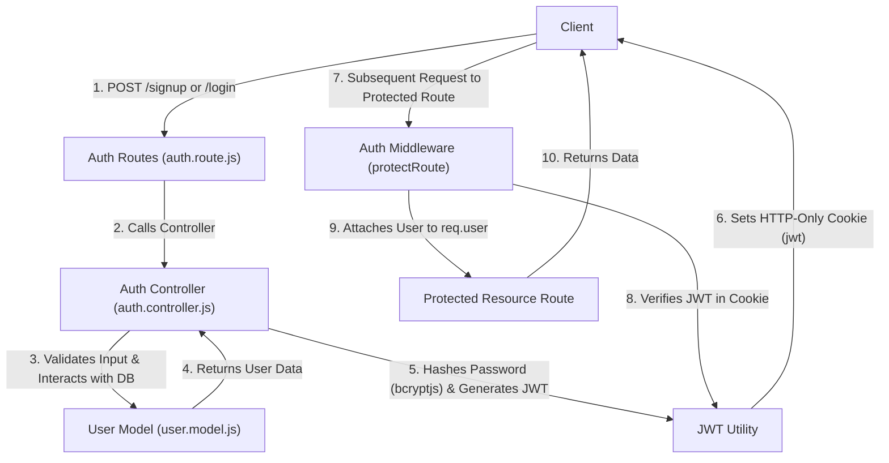
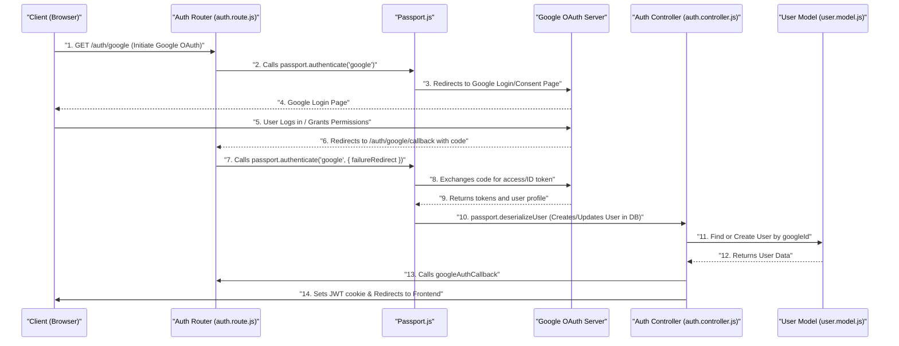

 # Authentication and User Management

This document details the authentication and user management mechanisms within the application, focusing on how users register, log in, manage their profiles, and how their access is protected. It covers both traditional email/password authentication and Google OAuth.

## User Model and Schema

The core of user management is defined by the `User` Mongoose model. This schema outlines the data structure for each user, including fields for credentials, profile information, and relationships for social features like friending.

The user model is critical for defining what user data is stored and how it's validated. It includes fields for `email`, `username`, `password`, `profilePic`, and `authProvider` to distinguish between email-based and Google authenticated users.

```javascript
// backend/src/models/user.model.js
import mongoose from "mongoose"

const  userSchema = new mongoose.Schema(
    {
        email: {
            type: String,
            required: true,
            unique: true
        },
        username: {
            type: String,
            required: [true, "Username is required"],
            unique: true,
            trim: true,
            minlength: [3, "Username must be at least 3 characters long"],
            maxlength: [20, "Username cannot be more than 20 characters long"]
        },
        password: {
            type: String,
            minlength: 6,
        },
        profilePic: {
            type: String,
            default: "",
        },
        // ... other fields like friends, friendRequests, sentRequests
        authProvider: {
            type: String,
            enum: ['email', 'google'],
            default: 'email'
        },
        googleId: {
            type: String,
            unique: true,
            sparse: true
        },
    },
    {
        timestamps: true
    }
);

// Pre-save hook for password handling with Google auth
userSchema.pre('save', async function(next) {
    if (this.authProvider === 'google' && !this.isModified('password')) {
        this.password = undefined;
    }
    if (this.authProvider === 'email' && !this.password && this.isNew) {
        return next(new Error('Password is required for email signup.'));
    }
    next();
});

const User = mongoose.model("User", userSchema);

export default User;
```
[View on GitHub](https://github.com/shinymack/Chat-App-MERN/blob/main/backend/src/models/user.model.js)

**Key Schema Fields:**
- `email`: Unique identifier for email-based login, required.
- `username`: Unique, human-readable identifier, with length constraints.
- `password`: Hashed password for email-based accounts. Not required for Google authenticated users.
- `profilePic`: URL to the user's profile image.
- `authProvider`: Specifies the authentication method ('email' or 'google').
- `googleId`: Stores the unique Google ID for OAuth users.
- `friends`, `friendRequests`, `sentRequests`: Arrays of `User` ObjectIds for managing social connections.

A `pre-save` hook is used to manage password requirements based on the `authProvider`. For Google-authenticated users, the password field is set to `undefined` to prevent unnecessary storage and enforce login method.

## Authentication Controllers

The `auth.controller.js` file contains the core logic for user authentication, including signup, login, logout, profile updates, and Google OAuth callbacks.

```javascript
// backend/src/controllers/auth.controller.js
// Snippet for signup and login
import { generateToken } from "../lib/utils.js";
import User from "../models/user.model.js";
import bcrypt from "bcryptjs";

export const signup = async (req, res) => {
    const {username, email, password} = req.body;
    try {
        // ... input validation (length, existence) ...

        const user = await User.findOne({email});
        if (user) return res.status(400).json({message: "Email already exists."});

        const existingUserByUsername = await User.findOne({ username });
        if (existingUserByUsername) {
            return res.status(400).json({ message: "Username already exists. Please choose another." });
        }

        const salt = await bcrypt.genSalt(10);
        const hashedPassword = await bcrypt.hash(password, salt);

        const newUser = new User({
            username,
            email,
            password: hashedPassword,
            authProvider: 'email'
        });
        if(newUser){
            generateToken(newUser._id, res); // Generates JWT token and sets cookie
            await newUser.save();
            res.status(201).json({ /* user data */ });
        } else {
            res.status(400).json({message: "Invalid user data."});
        }
    } catch (error) { /* error handling */ }
};

export const login = async (req, res) => {
    const {email, password} = req.body;
    try {
        const user = await User.findOne({email});
        if(!user) return res.status(400).json({message: "Invalid credentials."});
        if(user.authProvider === 'google' && !user.password){
            return res.status(400).json({ message: "Please sign in with Google." });
        }

        const isPasswordCorrect = await bcrypt.compare(password, user.password);
        if(!isPasswordCorrect) return res.status(400).json({message: "Invalid credentials."});

        generateToken(user._id, res); // Generates JWT token and sets cookie
        res.status(200).json({ /* user data */ });
    } catch (error) { /* error handling */ }
};
```
[View on GitHub](https://github.com/shinymack/Chat-App-MERN/blob/main/backend/src/controllers/auth.controller.js)

### Controller Functions:
-   **`signup`**: Handles new user registration. It validates input, checks for existing email/username, hashes the password using `bcryptjs`, creates a new `User` document, generates a JWT token, and stores it in an HTTP-only cookie.
-   **`login`**: Authenticates existing users. It verifies credentials, distinguishes between email and Google auth, compares passwords using `bcryptjs`, and issues a JWT token upon successful login.
-   **`logout`**: Invalidates the user's session by clearing the `jwt` cookie.
-   **`checkAuth`**: A protected route that verifies the JWT token and returns the authenticated user's profile data.
-   **`googleAuthCallback`**: Processes the callback from Google OAuth. If authentication is successful, it generates a JWT token for the user and redirects to the frontend.
-   **`checkUsernameAvailability`**: Allows checking if a given username is available, preventing duplicates and enforcing uniqueness. This is useful for user-friendly registration and profile updates.
-   **`updateProfile`**: Manages updates to a user's profile, such as changing their username or profile picture. It includes logic to handle Cloudinary uploads for images and ensures username uniqueness.

```javascript
// backend/src/controllers/auth.controller.js
// Snippet for updateProfile
import cloudinary from "../lib/cloudinary.js"; // For image uploads

export const updateProfile = async (req, res) => {
    try {
        const { profilePic, username } = req.body;
        const userId = req.user._id;
        let userToUpdate = await User.findById(userId);

        if (!userToUpdate) return res.status(404).json({ message: "User not found." });

        const fieldsToUpdate = {};
        let newUsername = username ? username.trim() : null;

        if (newUsername && newUsername !== userToUpdate.username) {
            // ... username validation (length, uniqueness) ...
            const existingUserWithNewUsername = await User.findOne({ username: newUsername, _id: { $ne: userId } });
            if (existingUserWithNewUsername) {
                return res.status(400).json({ message: "This username is already taken by someone else." });
            }
            fieldsToUpdate.username = newUsername;
        }

        if (profilePic) {
            const uploadResponse = await cloudinary.uploader.upload(profilePic);
            fieldsToUpdate.profilePic = uploadResponse.secure_url;
        }

        if (Object.keys(fieldsToUpdate).length === 0) {
            return res.status(400).json({ message: "No changes provided to update." });
        }

        const updatedUser = await User.findByIdAndUpdate(userId, { $set: fieldsToUpdate }, { new: true });
        generateToken(updatedUser._id, res); // Refresh token in cookie if profile changed
        res.status(200).json(updatedUser);

    } catch (error) {
        console.error("Error in updateProfile controller", error.message);
        res.status(500).json({ message: "Internal Server Error while updating profile." });
    }
};
```
[View on GitHub](https://github.com/shinymack/Chat-App-MERN/blob/main/backend/src/controllers/auth.controller.js)

## Authentication Middleware

The `auth.middleware.js` file contains the `protectRoute` middleware, essential for securing routes that require user authentication.

```javascript
// backend/src/middleware/auth.middleware.js
import jwt from "jsonwebtoken"
import User from "../models/user.model.js"

export const protectRoute = async (req, res, next) => {
    try {
        const token = req.cookies.jwt; // Retrieve JWT from HTTP-only cookie
        if(!token){
            return res.status(401).json({message: "Unauthorized - No Token Provided"});
        }

        const decoded = jwt.verify(token, process.env.JWT_SECRET) // Verify token signature

        if(!decoded) {
            return res.status(401).json({message: "Unauthorized - Invalid Token"});
        }
        const user = await User.findById(decoded.userId).select("-password"); // Find user without password

        if(!user) {
            return res.status(404).json({message: "User not found"});
        }
        req.user = user; // Attach user object to request for subsequent handlers

        next(); // Proceed to the next middleware/route handler
    } catch (error) {
        console.log("Error in protectRoute middleware", error.message);
        res.status(500).json({message: "Internal Server Error"});
    }
};
```
[View on GitHub](https://github.com/shinymack/Chat-App-MERN/blob/main/backend/src/middleware/auth.middleware.js)

The `protectRoute` middleware performs the following steps:
1.  **Extract Token**: Retrieves the JWT from the `jwt` cookie in the request.
2.  **Verify Token**: Uses `jsonwebtoken.verify` to validate the token's signature against the `JWT_SECRET`.
3.  **Find User**: Decodes the `userId` from the token and fetches the corresponding user from the database, excluding the password field.
4.  **Attach User**: If a valid user is found, it attaches the `user` object to the `req.user` property, making user data available to subsequent route handlers.
5.  **Authorization**: If any step fails (no token, invalid token, user not found), it sends appropriate 401/404/500 responses.

## Authentication Routes

The `auth.route.js` file defines the API endpoints for all authentication and user management operations. These routes utilize the controller functions and the `protectRoute` middleware.

```javascript
// backend/src/routes/auth.route.js
import express from "express"
import passport from 'passport'; // For Google OAuth
import { login, logout, signup, updateProfile, checkAuth, googleAuthCallback, checkUsernameAvailability} from  "../controllers/auth.controller.js"
import { protectRoute } from "../middleware/auth.middleware.js"
const router = express.Router();

router.post("/signup", signup);
router.post("/login", login);
router.post("/logout", logout);

router.put("/update-profile", protectRoute ,updateProfile)
router.get("/username/check/:username", protectRoute, checkUsernameAvailability);
router.get("/check", protectRoute, checkAuth)

// Google OAuth routes
router.get(
    '/google',
    passport.authenticate('google', { scope: ['profile', 'email'] })
);
router.get(
    '/google/callback',
    passport.authenticate('google', {
        failureRedirect: 'http://localhost:5173/login',
        failureMessage: true
    }),
    googleAuthCallback
);

export default router;
```
[View on GitHub](https://github.com/shinymack/Chat-App-MERN/blob/main/backend/src/routes/auth.route.js)

## Authentication Flow

### User Authentication Workflow
This diagram illustrates the main steps involved in user authentication, from client interaction to token generation and subsequent protected resource access.





### Google OAuth Flow
This diagram details the sequence of events when a user authenticates using Google.





## Key Integration Points

### JWT Management
-   **Generation**: The `generateToken` utility (from `backend/src/lib/utils.js`, not provided in content but implied) creates a JSON Web Token (JWT) containing the user's ID. This token is then set as an HTTP-only cookie on the response.
-   **Protection**: The `protectRoute` middleware intercepts requests to protected routes, extracts the JWT from the cookie, verifies its integrity, and ensures the associated user exists. This prevents unauthorized access to sensitive endpoints.
-   **Refresh**: The `updateProfile` controller refreshes the JWT cookie after a successful profile update. While not strictly necessary for every update, it ensures the client always has a token reflecting the latest user state, especially if claims within the token were to change.

### User Profile Management
-   **Username Uniqueness**: Both `signup` and `updateProfile` controllers, along with the dedicated `checkUsernameAvailability` route, enforce unique usernames across the platform. The `User` model schema also includes a `unique: true` constraint for the `username` field.
-   **Profile Picture Uploads**: The `updateProfile` function integrates with Cloudinary for handling profile picture uploads. This offloads media storage and serving to a specialized service.

### Social Authentication (Google OAuth)
-   **Passport.js**: The application uses Passport.js for integrating Google OAuth. This simplifies the process of redirecting to Google, exchanging authorization codes for tokens, and retrieving user profiles.
-   **`authProvider` Field**: The `authProvider` field in the `User` model allows the system to distinguish between users who signed up with email/password and those who used Google, enabling appropriate login flows and password management.
-   **`googleId`**: A sparse unique index on the `googleId` field in the `User` model ensures that each Google-authenticated user has a distinct identifier, allowing for efficient lookup and prevention of duplicate accounts.

### Security Best Practices
-   **Password Hashing**: `bcryptjs` is used to securely hash user passwords with a salt, preventing plaintext storage and protecting against brute-force attacks.
-   **HTTP-only Cookies**: JWTs are stored in HTTP-only cookies, which makes them inaccessible to client-side JavaScript, mitigating Cross-Site Scripting (XSS) attacks.
-   **Input Validation**: Controllers perform robust input validation (`username` length, `password` length, email format) to ensure data integrity and prevent common vulnerabilities.
-   **Error Handling**: Comprehensive `try-catch` blocks are implemented in controllers and middleware to gracefully handle errors and return appropriate HTTP status codes and messages, improving API reliability.