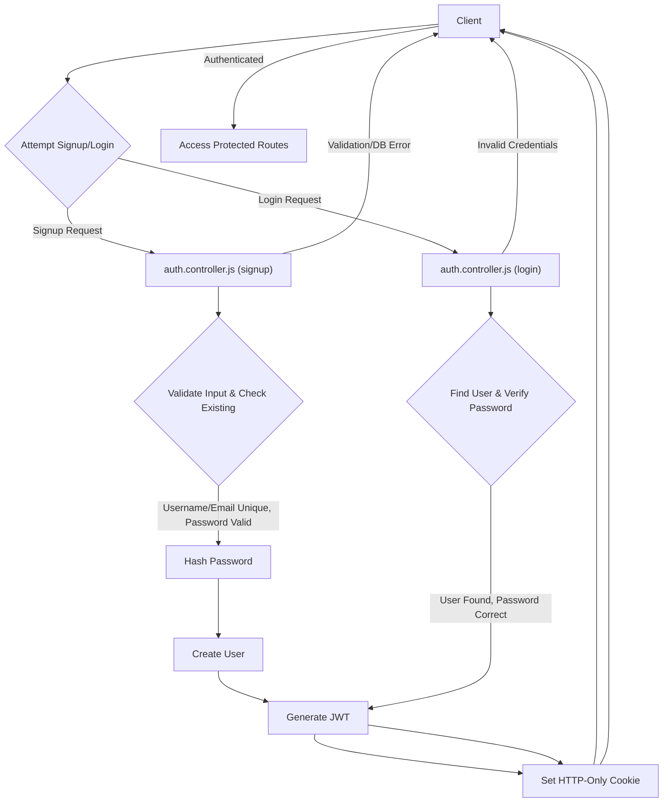
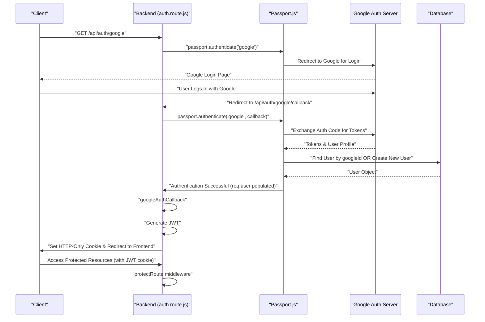

 # Authentication and Authorization

This section details the robust mechanisms implemented for managing user identities and access privileges. It covers the entire lifecycle from user registration and secure login to continuous session management and precise access control, ensuring a secure and user-friendly experience. The system supports both traditional email/password authentication and seamless integration with Google OAuth, providing flexibility and convenience.

## Core Authentication Mechanisms

The application employs a layered approach to authentication, leveraging standard security practices and integrating third-party services.

### User Registration (Signup)

New users can register by providing a unique username, email, and password. The system enforces strict validation rules for these credentials to enhance security and data integrity. Passwords are securely hashed using `bcryptjs` before storage, preventing plaintext exposure.

```javascript
// backend/src/controllers/auth.controller.js
export const signup = async (req, res) => {
    const {username, email, password} = req.body;
    try {
        // ... input validation checks ...
        const salt = await bcrypt.genSalt(10);
        const hashedPassword = await bcrypt.hash(password, salt);

        const newUser = new User({
            username,
            email,
            password: hashedPassword,
            authProvider: 'email'
        });
        if(newUser){
            generateToken(newUser._id, res); // Generate and set JWT token
            await newUser.save();

            res.status(201).json({
                _id: newUser._id,
                username: newUser.username,
                email: newUser.email,   
                profilePic: newUser.profilePic,
                authProvider: newUser.authProvider
            });
        }
    } catch (error) {
        console.log("Error in signup controller", error.message)
        res.status(500).json({message: "Something went wrong."});
    }
};
```
<p>
  <a href="https://github.com/shinymack/Chat-App-MERN/blob/main/backend/src/controllers/auth.controller.js#L11-L60" target="_blank">View on GitHub (lines 11-60)</a>
</p>

After successful registration, a JSON Web Token (JWT) is generated and stored as an HTTP-only cookie, establishing a secure session for the new user.

### User Login

Registered users can log in using their email and password. The system verifies credentials by comparing the provided password with the stored hashed password.

```javascript
// backend/src/controllers/auth.controller.js
export const login = async (req, res) => {
    const {email, password} = req.body;
    try {
        const user = await User.findOne({email});

        if(!user) {
            return res.status(400).json({message: "Invalid credentials."});
        }
        // Handle Google-only accounts trying to log in with password
        if(user.authProvider === 'google' && !user.password){
            return res.status(400).json({ message: "Please sign in with Google." });
        }

        const isPasswordCorrect = await bcrypt.compare(password, user.password);
        if(!isPasswordCorrect) {
            return res.status(400).json({message: "Invalid credentials."});
        }

        generateToken(user._id, res); // Generate and set JWT token
        res.status(200).json({
            _id: user._id,
            username: user.username,
            email: user.email,
            profilePic: user.profilePic,
            authProvider: user.authProvider,
        });
    } catch (error) {
        console.log("Error in login controller", error.message);
        res.status(500).json({message: "Something went wrong."});
    }
};
```
<p>
  <a href="https://github.com/shinymack/Chat-App-MERN/blob/main/backend/src/controllers/auth.controller.js#L62-L99" target="_blank">View on GitHub (lines 62-99)</a>
</p>

Upon successful login, a JWT is generated and sent as an HTTP-only cookie to the client, maintaining the user's authenticated state.

### Session Management (Logout & `checkAuth`)

Sessions are managed primarily through JWTs.
The `logout` function clears the JWT cookie, effectively ending the user's session.
The `checkAuth` endpoint allows authenticated clients to verify their current session status and retrieve user details, often used to persist login state across page refreshes.

```javascript
// backend/src/controllers/auth.controller.js
export const logout = (req, res) => {
    try {
        res.cookie("jwt", "", {maxAge: 0}); // Clear the JWT cookie
        res.status(200).json({message: "Logged out successfully."})
    } catch(error) {
        console.log("Error in logout controller", error.message);
        res.status(500).json({message:"Internal Server Error"}); 
    }
};

export const checkAuth = (req, res) => {
    try {
        // req.user is populated by protectRoute middleware
        res.status(200).json({
            _id: req.user._id,
            username: req.user.username,
            email: req.user.email,
            profilePic: req.user.profilePic,
            authProvider: req.user.authProvider,
            createdAt: req.user.createdAt
        });
    } catch (error) {
        console.log("Error in checkAuth controller", error.message);
        res.status(500).json({message: "Internal Server Error"});
    }
};
```
<p>
  <a href="https://github.com/shinymack/Chat-App-MERN/blob/main/backend/src/controllers/auth.controller.js#L101-L127" target="_blank">View on GitHub (lines 101-127)</a>
</p>

### Diagram: Basic Authentication Flow (Signup/Login)





## Authorization & Access Control

Access control is primarily managed by the `protectRoute` middleware, which verifies the JWT for every protected request.

### `protectRoute` Middleware

This middleware ensures that only authenticated users can access specific routes. It extracts the JWT from the request cookies, verifies its authenticity, and then fetches the corresponding user details from the database, attaching them to `req.user`.

```javascript
// backend/src/middleware/auth.middleware.js
import jwt from "jsonwebtoken"
import User from "../models/user.model.js"

export const protectRoute = async (req, res, next) => {
    try {
        const token = req.cookies.jwt;
        if(!token){
            return res.status(401).json({message: "Unauthorized - No Token Provided"});
        }

        const decoded = jwt.verify(token, process.env.JWT_SECRET)

        if(!decoded) {
            return res.status(401).json({message: "Unauthorized - Invalid Token"});
        }
        const user = await User.findById(decoded.userId).select("-password"); // Exclude password

        if(!user) {
            return res.status(404).json({message: "User not found"});
        }
        req.user = user; // Attach user object to request

        next(); // Proceed to the next middleware/controller
    } catch (error) {
        console.log("Error in protectRoute middleware", error.message);
        res.status(500).json({message: "Internal Server Error"});
    }
};
```
<p>
  <a href="https://github.com/shinymack/Chat-App-MERN/blob/main/backend/src/middleware/auth.middleware.js#L4-L29" target="_blank">View on GitHub (lines 4-29)</a>
</p>

### Route Protection

Routes requiring authentication, such as `/update-profile` or `/check`, include `protectRoute` in their middleware chain.

```javascript
// backend/src/routes/auth.route.js
import express from "express"
import passport from 'passport';
import { login, logout, signup, updateProfile, checkAuth, googleAuthCallback, checkUsernameAvailability} from  "../controllers/auth.controller.js"
import { protectRoute } from "../middleware/auth.middleware.js"
const router = express.Router();

// Public routes
router.post("/signup", signup);
router.post("/login", login);
router.post("/logout", logout);

// Protected routes
router.put("/update-profile", protectRoute ,updateProfile);
router.get("/username/check/:username", protectRoute, checkUsernameAvailability);
router.get("/check", protectRoute, checkAuth);

// Google OAuth routes
router.get(
    '/google',
    passport.authenticate('google', { scope: ['profile', 'email'] })
);
router.get(
    '/google/callback',
    passport.authenticate('google', {
        failureRedirect: 'http://localhost:5173/login', 
        failureMessage: true 
    }),
    googleAuthCallback 
);
export default router;
```
<p>
  <a href="https://github.com/shinymack/Chat-App-MERN/blob/main/backend/src/routes/auth.route.js#L4-L31" target="_blank">View on GitHub (lines 4-31)</a>
</p>

## Google OAuth Integration

The application integrates Google as an authentication provider using `passport.js` and `passport-google-oauth20`.

### Passport Configuration

The `passport.config.js` file sets up the Google Strategy. It defines how user information received from Google should be handled:
*   **Existing User**: If a user with the Google ID already exists, they are logged in.
*   **New User**: If not, a new user account is created using information from the Google profile (email, display name). Unique usernames are ensured, and safeguards are in place for users trying to register with Google using an email already tied to a local account.

```javascript
// backend/src/lib/passport.config.js
import passport from 'passport';
import { Strategy as GoogleStrategy } from 'passport-google-oauth20';
import User from '../models/user.model.js'; 
import dotenv from 'dotenv';

dotenv.config(); 

export const configurePassport = () => {
    passport.use(new GoogleStrategy({
        clientID: process.env.GOOGLE_CLIENT_ID,
        clientSecret: process.env.GOOGLE_CLIENT_SECRET,
        callbackURL: process.env.GOOGLE_CALLBACK_URL,
        scope: ['profile', 'email'] 
    },
    async (accessToken, refreshToken, profile, done) => {
        try {
            let user = await User.findOne({ googleId: profile.id });
            if (user) {
                return done(null, user); // Existing user found
            } else {
                let username = profile.displayName.replace(/\s+/g, '').toLowerCase() || `user${Date.now()}`;
                // Logic to ensure username uniqueness and handle existing email conflicts
                const newUser = new User({
                    googleId: profile.id,
                    email: profile.emails && profile.emails[0] ? profile.emails[0].value : null,
                    username: username,
                    authProvider: 'google',
                });
                await newUser.save();
                return done(null, newUser); // New user created
            }
        } catch (error) {
            return done(error, null);
        }
    }));

    // Serialize user: store user ID in session
    passport.serializeUser((user, done) => {
        done(null, user.id);
    });

    // Deserialize user: retrieve user from DB using ID from session
    passport.deserializeUser(async (id, done) => {
        try {
            const user = await User.findById(id);
            done(null, user);
        } catch (error) {
            done(error, null);
        }
    });
};
```
<p>
  <a href="https://github.com/shinymack/Chat-App-MERN/blob/main/backend/src/lib/passport.config.js#L4-L78" target="_blank">View on GitHub (lines 4-78)</a>
</p>

### Google Callback

After Google authenticates the user, it redirects to the `GOOGLE_CALLBACK_URL`. This endpoint uses `passport.authenticate` to process the callback. If successful, `googleAuthCallback` generates a JWT for the user and redirects them to the frontend.

```javascript
// backend/src/controllers/auth.controller.js
export const googleAuthCallback = async (req, res) => {
    const frontendUrl = process.env.FRONTEND_URL || 'http://localhost:5173';
    try {
        if (!req.user) {
            // Passport.js would have set req.user if authentication was successful
            return res.redirect(`${frontendUrl}/login?error=google_auth_failed`);
        }
        generateToken(req.user._id, res); // Generate JWT for the Google authenticated user
        res.redirect(frontendUrl); // Redirect to frontend
    } catch (error) {
        console.error("Error in googleAuthCallback: ", error.message);
        res.redirect(`${frontendUrl}/login?error=google_auth_processing_error`);
    }
};
```
<p>
  <a href="https://github.com/shinymack/Chat-App-MERN/blob/main/backend/src/controllers/auth.controller.js#L130-L149" target="_blank">View on GitHub (lines 130-149)</a>
</p>

### Diagram: Google OAuth Flow





## User Profile Management

The system also provides functionality for authenticated users to update their profile information, such as their username and profile picture.

### Update Profile

The `updateProfile` controller allows users to change their username and/or update their profile picture. It handles validation for username uniqueness and length, and integrates with Cloudinary for image uploads. A new JWT is issued after an update to reflect any changes in user data.

```javascript
// backend/src/controllers/auth.controller.js
export const updateProfile = async (req, res) => {
    try {
        const { profilePic, username } = req.body;
        const userId = req.user._id;
        let userToUpdate = await User.findById(userId);

        if (!userToUpdate) return res.status(404).json({ message: "User not found." });

        const fieldsToUpdate = {};
        let newUsername = username ? username.trim() : null;

        // Handle username update logic
        if (newUsername && newUsername !== userToUpdate.username) {
            // ... username validation and uniqueness checks ...
            fieldsToUpdate.username = newUsername;
        }

        // Handle profile picture update logic with Cloudinary
        if (profilePic) {
            const uploadResponse = await cloudinary.uploader.upload(profilePic);
            fieldsToUpdate.profilePic = uploadResponse.secure_url;
        }

        if (Object.keys(fieldsToUpdate).length === 0) {
            return res.status(400).json({ message: "No changes provided to update." });
        }

        const updatedUser = await User.findByIdAndUpdate(userId, { $set: fieldsToUpdate }, { new: true });
        generateToken(updatedUser._id, res); // Refresh JWT with updated info
        res.status(200).json(updatedUser);

    } catch (error) {
        console.error("Error in updateProfile controller", error.message);
        res.status(500).json({ message: "Internal Server Error while updating profile." });
    }
};
```
<p>
  <a href="https://github.com/shinymack/Chat-App-MERN/blob/main/backend/src/controllers/auth.controller.js#L202-L260" target="_blank">View on GitHub (lines 202-260)</a>
</p>

## Key Integration Points

*   **`auth.controller.js`**: Contains the core business logic for all authentication-related operations (signup, login, logout, Google callback, profile updates, username checks).
*   **`auth.route.js`**: Defines the API endpoints for authentication and links them to the appropriate controller functions and middleware. It clearly segregates public routes from protected ones.
*   **`auth.middleware.js`**: Provides the `protectRoute` middleware, crucial for securing endpoints by validating JWTs and ensuring only authenticated users can access specific resources.
*   **`passport.config.js`**: Centralizes the configuration for `passport.js`, specifically implementing the Google OAuth strategy and managing user serialization/deserialization for session handling.
*   **JWT Utility (`generateToken`)**: A utility function (not shown in snippets but called) is responsible for creating and setting the HTTP-only JWT cookie upon successful authentication or registration.

By separating concerns into controllers, routes, and middleware, the authentication system achieves modularity, making it easier to maintain, test, and scale. The use of HTTP-only cookies for JWTs mitigates CSRF attacks, and password hashing with `bcryptjs` ensures user credential security. The dual authentication strategy provides flexibility for users while `passport.js` simplifies complex OAuth flows.