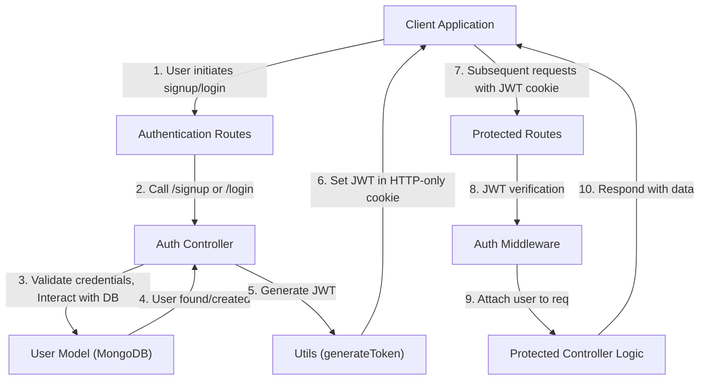

 # Authentication and User Management

This section details the core components of user authentication and management within the application, including user registration, login, logout, profile updates, and secure route protection. It covers the Express routes, controller logic, Mongoose user model, and middleware responsible for these critical functions.

## Authentication Flow Overview

The authentication system supports both traditional email/password registration and Google OAuth. JWT (JSON Web Tokens) are used for session management, stored as HTTP-only cookies to enhance security.

Here's a high-level overview of the main authentication processes:

-   **Signup**: Users register with a username, email, and password. Validation ensures unique credentials and strong passwords.
-   **Login**: Users authenticate with their email and password. Upon successful login, a JWT is generated and set as an HTTP-only cookie.
-   **Google OAuth**: Users can sign in using their Google account. Passport.js is utilized to handle the OAuth flow, after which a JWT is issued.
-   **Logout**: Clears the JWT cookie, effectively ending the user's session.
-   **Protected Routes**: A middleware verifies the JWT from incoming requests, ensuring only authenticated users can access specific resources.
-   **Profile Management**: Authenticated users can update their profile picture and username.

<br/>





<br/>

## User Model (`backend/src/models/user.model.js`)

The `User` model defines the schema for user data stored in MongoDB. It includes fields for email, username, password (hashed), profile picture, social connections (friends, friend requests), and an `authProvider` to distinguish between email/password and Google authenticated users.

```javascript
import mongoose from "mongoose"

const  userSchema = new mongoose.Schema(
    {
        email: {
            type: String,
            required: true,
            unique: true
        },
        username: {
            type: String,
            required: [true, "Username is required"],
            unique: true,
            trim: true,
            minlength: [3, "Username must be at least 3 characters long"],
            maxlength: [20, "Username cannot be more than 20 characters long"]
        },
        password: {
            type: String,
            minlength: 6,
        },
        profilePic: {
            type: String,
            default: "",
        },
        friends: [{
            type: mongoose.Schema.Types.ObjectId,
            ref: "User",
            default: []
        }],
        friendRequests: [{
            type: mongoose.Schema.Types.ObjectId,
            ref: "User",
            default: []
        }],
        sentRequests: [{
            type: mongoose.Schema.Types.ObjectId,
            ref: "User",
            default: []
        }],
        authProvider: {
            type: String,
            enum: ['email', 'google'],
            default: 'email'
        },
        googleId: {
            type: String,
            unique: true,
            sparse: true
        },
    },
    {
        timestamps: true
    }
);

userSchema.pre('save', async function(next) {
    if (this.authProvider === 'google' && !this.isModified('password')) {
        this.password = undefined;
    }
    if (this.authProvider === 'email' && !this.password && this.isNew) {
        return next(new Error('Password is required for email signup.'));
    }
    next();
});

const User = mongoose.model("User", userSchema);

export default User;
```
<br/>
[View on GitHub](https://github.com/shinymack/Chat-App-MERN/blob/main/backend/src/models/user.model.js)

**Key Features of the User Model:**

*   **Unique Identifiers**: `email` and `username` are unique to prevent duplicate accounts. `googleId` is also unique for Google OAuth users.
*   **Password Handling**: Passwords are required for `email` provider and are not stored for `google` provider users to prevent conflicts and ensure correct authentication methods.
*   **Social Fields**: `friends`, `friendRequests`, and `sentRequests` arrays store references to other `User` documents, enabling social features.
*   **Authentication Provider**: The `authProvider` enum (`email`, `google`) helps determine the user's origin and authentication method.
*   **Pre-save Hook**: A `pre('save')` hook ensures that Google-authenticated users do not have a password field and that email-authenticated users always provide one on initial creation.

## Authentication Controllers (`backend/src/controllers/auth.controller.js`)

This file contains the logic for handling all authentication-related API requests.

```javascript
// Excerpt from backend/src/controllers/auth.controller.js

export const signup = async (req, res) => {
    const {username, email, password} = req.body;
    try {
        // ... input validation and existing user checks ...
        const salt = await bcrypt.genSalt(10);
        const hashedPassword = await bcrypt.hash(password, salt);

        const newUser = new User({
            username,
            email,
            password: hashedPassword,
            authProvider: 'email'
        });
        if(newUser){
            generateToken(newUser._id, res); // Generate JWT and set cookie
            await newUser.save();
            res.status(201).json({ /* user data */ });
        } else {
            res.status(400).json({message: "Invalid user data."});
        }
    } catch (error) {
        console.log("Error in signup controller", error.message)
        res.status(500).json({message: "Something went wrong."});
    }
};

export const login = async (req, res) => {
    const {email, password} = req.body;
    try {
        const user = await User.findOne({email});
        if(!user || !(await bcrypt.compare(password, user.password))) {
            return res.status(400).json({message: "Invalid credentials."});
        }
        if(user.authProvider === 'google' && !user.password){
            return res.status(400).json({ message: "Please sign in with Google." });
        }
        generateToken(user._id, res); // Generate JWT and set cookie
        res.status(200).json({ /* user data */ });
    } catch (error) {
        console.log("Error in login controller", error.message);
        res.status(500).json({message: "Something went wrong."});
    }
};

export const logout = (req, res) => {
    try {
        res.cookie("jwt", "", {maxAge: 0}); // Clear JWT cookie
        res.status(200).json({message: "Logged out successfully."})
    } catch(error) {
        console.log("Error in logout controller", error.message);
        res.status(500).json({message:"Internal Server Error"});
    }
};

export const updateProfile = async (req, res) => {
    try {
        const { profilePic, username } = req.body;
        const userId = req.user._id;
        let userToUpdate = await User.findById(userId);

        // ... logic for validating and updating username and profilePic ...

        const updatedUser = await User.findByIdAndUpdate(userId, { $set: fieldsToUpdate }, { new: true });
        generateToken(updatedUser._id, res); // Re-issue token with potentially new user data
        res.status(200).json(updatedUser);

    } catch (error) {
        console.error("Error in updateProfile controller", error.message);
        res.status(500).json({ message: "Internal Server Error while updating profile." });
    }
};
```
<br/>
[View on GitHub](https://github.com/shinymack/Chat-App-MERN/blob/main/backend/src/controllers/auth.controller.js)

**Controller Responsibilities:**

*   **`signup`**: Handles user registration, performs input validation, hashes passwords using `bcryptjs`, creates a new `User` document, and generates a JWT.
*   **`login`**: Authenticates users, validates credentials, and generates a JWT upon successful login. It also includes specific handling for users initially created via Google OAuth.
*   **`logout`**: Deletes the JWT cookie from the client, effectively logging the user out.
*   **`checkAuth`**: Returns the currently authenticated user's details, typically used to verify session status.
*   **`googleAuthCallback`**: Completes the Google OAuth flow, generating a JWT and redirecting the user to the frontend.
*   **`checkUsernameAvailability`**: Allows checking if a username is available before a user attempts to update their profile or during signup.
*   **`updateProfile`**: Enables authenticated users to update their `profilePic` (via Cloudinary integration) and `username`. It includes validation and conflict checks for the username.

## Authentication Middleware (`backend/src/middleware/auth.middleware.js`)

The `protectRoute` middleware is crucial for securing API endpoints.

```javascript
import jwt from "jsonwebtoken"
import User from "../models/user.model.js"

export const protectRoute = async (req, res, next) => {
    try {
        const token = req.cookies.jwt;
        if(!token){
            return res.status(401).json({message: "Unauthorized - No Token Provided"});
        }

        const decoded = jwt.verify(token, process.env.JWT_SECRET)

        if(!decoded) {
            return res.status(401).json({message: "Unauthorized - Invalid Token"});
        }
        const user = await User.findById(decoded.userId).select("-password");

        if(!user) {
            return res.status(404).json({message: "User not found"});
        }
        req.user = user; // Attach user object to the request

        next(); // Proceed to the next middleware/controller
    } catch (error) {
        console.log("Error in protectRoute middleware", error.message);
        res.status(500).json({message: "Internal Server Error"});
    }
};
```
<br/>
[View on GitHub](https://github.com/shinymack/Chat-App-MERN/blob/main/backend/src/middleware/auth.middleware.js)

**`protectRoute` Functionality:**

*   **Token Retrieval**: Extracts the JWT from the `jwt` HTTP-only cookie in the request.
*   **Token Verification**: Uses `jwt.verify` to decode and validate the token against the `JWT_SECRET`.
*   **User Lookup**: If the token is valid, it extracts the `userId` and fetches the corresponding user from the database, excluding the password field for security.
*   **Request Augmentation**: Attaches the fetched user object to `req.user`, making it accessible in subsequent middleware and controller functions.
*   **Authorization**: If any step fails (no token, invalid token, user not found), it sends appropriate 401/404/500 status codes.

## Authentication Routes (`backend/src/routes/auth.route.js`)

This file defines all API endpoints related to authentication and links them to their respective controller functions and middleware.

```javascript
import express from "express"
import passport from 'passport';
import { login, logout, signup, updateProfile, checkAuth, googleAuthCallback, checkUsernameAvailability} from  "../controllers/auth.controller.js"
import { protectRoute } from "../middleware/auth.middleware.js"
const router = express.Router();

router.post("/signup", signup);
router.post("/login", login);
router.post("/logout", logout);

router.put("/update-profile", protectRoute ,updateProfile);
router.get("/username/check/:username", protectRoute, checkUsernameAvailability);
router.get("/check", protectRoute, checkAuth);

router.get(
    '/google',
    passport.authenticate('google', { scope: ['profile', 'email'] })
);
router.get(
    '/google/callback',
    passport.authenticate('google', {
        failureRedirect: 'http://localhost:5173/login',
        failureMessage: true
    }),
    googleAuthCallback
);

export default router;
```
<br/>
[View on GitHub](https://github.com/shinymack/Chat-App-MERN/blob/main/backend/src/routes/auth.route.js)

**Defined Endpoints:**

*   `POST /api/auth/signup`: User registration.
*   `POST /api/auth/login`: User login.
*   `POST /api/auth/logout`: User logout.
*   `PUT /api/auth/update-profile`: Update user profile details (requires authentication via `protectRoute`).
*   `GET /api/auth/username/check/:username`: Check username availability (requires authentication).
*   `GET /api/auth/check`: Verify current user session (requires authentication).
*   `GET /api/auth/google`: Initiates Google OAuth flow.
*   `GET /api/auth/google/callback`: Handles Google OAuth callback and token generation.

## Key Integration Points

### Authentication Sequence Diagram

The following diagram illustrates a typical user login sequence, highlighting the roles of the client, routes, middleware, and controllers.


```mermaid
sequenceDiagram
    participant C as "Client (Browser)"
    participant R as "Auth Router"
    participant M as "Auth Middleware"
    participant A as "Auth Controller"
    participant DB as "MongoDB (User Model)"

    C ->>+ R: POST /api/auth/login {"email", "password"}
    R ->>+ A: "login" controller
    A ->> DB: "Find user by email"
    DB -->> A: "User document"
    A ->> A: "Compare hashed password"
    alt Authentication successful
        A ->> A: "Generate JWT"
        A -->>- R: "Set-Cookie: jwt=<token>"
        R -->>- C: "200 OK" {"user data"}
    else Authentication failed
        A -->>- R: "400 Bad Request" {"Invalid credentials"}
        R -->>- C: "400 Bad Request" {"message"}
    end

    C ->>+ R: GET /api/auth/check (with "jwt" cookie)
    R ->>+ M: "protectRoute" middleware
    M ->> M: "Verify JWT token"
    alt Token valid
        M ->> DB: "Find user by userId from token"
        DB -->> M: "User document"
        M ->> R: "req.user = user"
        R ->>+ A: "checkAuth" controller
        A -->>- R: "200 OK" {"user data"}
        R -->>- C: "200 OK" {"user data"}
    else Token invalid or missing
        M -->>- R: "401 Unauthorized" {"No Token Provided"}
        R -->>- C: "401 Unauthorized" {"message"}
    end
```


<br/>

### Security Considerations

*   **HTTP-Only Cookies**: JWTs are stored in HTTP-only cookies to mitigate XSS (Cross-Site Scripting) attacks, preventing client-side JavaScript from accessing the token.
*   **Password Hashing**: `bcryptjs` is used to securely hash user passwords, protecting them against direct exposure in case of a database breach.
*   **Input Validation**: Extensive validation is performed in the controllers to ensure data integrity and prevent common vulnerabilities like injection attacks.
*   **Rate Limiting**: (Not explicitly shown but recommended) Implementing rate limiting on authentication routes (`/login`, `/signup`) can help prevent brute-force attacks.
*   **Environment Variables**: Sensitive information like `JWT_SECRET` and `FRONTEND_URL` are stored in environment variables, keeping them out of the codebase.

### Future Enhancements

*   **Two-Factor Authentication (2FA)**: Add an extra layer of security for user accounts.
*   **Password Reset**: Implement a secure password reset flow using email verification.
*   **Session Management**: More robust session management allowing users to view and revoke active sessions.
*   **OAuth for Other Providers**: Extend OAuth capabilities to other providers like GitHub or Facebook.