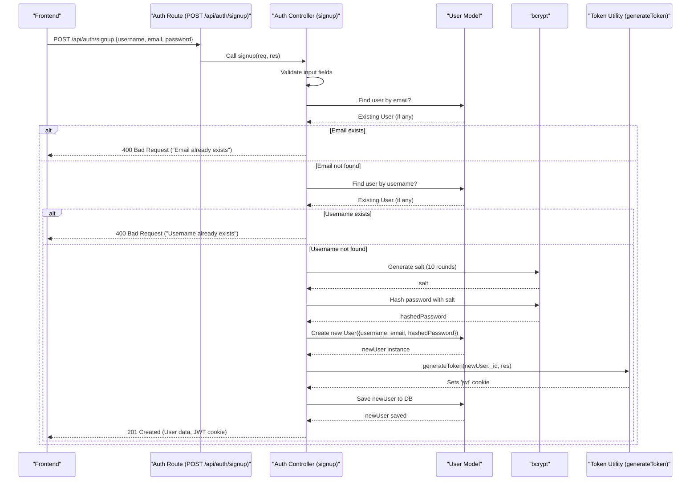

 # Backend API Endpoints and Controllers

This document provides a comprehensive overview of the backend API endpoints and their corresponding controller functions, detailing how user authentication and messaging functionalities are handled within the application. Understanding these components is crucial for developers working on the backend, as well as for frontend developers integrating with these services.

The backend API is structured to provide clear, RESTful interfaces for interacting with user data, authentication processes, and real-time messaging. Each route is typically handled by a specific controller function responsible for processing the request, interacting with the database, and sending back an appropriate response. Middleware, such as `protectRoute`, is used to enforce authentication and authorization where necessary.

## Authentication System

The authentication system manages user registration, login, logout, profile management, and Google OAuth integration. It relies on `bcrypt` for password hashing, `jsonwebtoken` for session management (handled by `generateToken` utility), and `passport` for Google authentication.

### Authentication Routes (`backend/src/routes/auth.route.js`)

The `auth.route.js` file defines the API endpoints related to user authentication. Each endpoint maps to a specific controller function.

```javascript
// backend/src/routes/auth.route.js
import express from "express"
import passport from 'passport';
import { login, logout, signup, updateProfile, checkAuth, googleAuthCallback, checkUsernameAvailability} from  "../controllers/auth.controller.js"
import { protectRoute } from "../middleware/auth.middleware.js"
const router = express.Router();

router.post("/signup", signup);
router.post("/login", login);
router.post("/logout", logout);
router.put("/update-profile", protectRoute ,updateProfile)
router.get("/username/check/:username", protectRoute, checkUsernameAvailability);
router.get("/check", protectRoute, checkAuth)
router.get(
    '/google',
    passport.authenticate('google', { scope: ['profile', 'email'] })
);
router.get(
    '/google/callback',
    passport.authenticate('google', {
        // successRedirect: 'http://localhost:5173/',
        failureRedirect: 'http://localhost:5173/login',
        failureMessage: true // Allows passing failure messages
    }),
    googleAuthCallback
);
export default router;
```

[View on GitHub](https://github.com/shinymack/Chat-App-MERN/blob/main/backend/src/routes/auth.route.js)

This router defines the following key authentication endpoints:

*   **`POST /api/auth/signup`**: Registers a new user.
*   **`POST /api/auth/login`**: Authenticates an existing user.
*   **`POST /api/auth/logout`**: Logs out the current user by clearing the JWT cookie.
*   **`PUT /api/auth/update-profile`**: Updates the current user's profile (protected route).
*   **`GET /api/auth/username/check/:username`**: Checks if a username is available (protected route).
*   **`GET /api/auth/check`**: Verifies if a user is currently authenticated (protected route).
*   **`GET /api/auth/google`**: Initiates Google OAuth authentication.
*   **`GET /api/auth/google/callback`**: Handles the callback from Google OAuth.

### Authentication Controllers (`backend/src/controllers/auth.controller.js`)

The `auth.controller.js` file contains the logic for handling authentication-related requests.

#### `signup` Controller

Handles new user registration. It validates input, hashes passwords, checks for existing users, creates a new user, generates a JWT token, and saves the user to the database.

```javascript
// backend/src/controllers/auth.controller.js
export const signup = async (req, res) => {
    const {username, email, password} = req.body;
    try {
        if(!username || !email || !password) {
            return res.status(400).json({message: "Please fill in all fields."});
        }
        // ... (username and password length validations) ...
        const user = await User.findOne({email});
        if (user) return res.status(400).json({message: "Email already exists."});

        const existingUserByUsername = await User.findOne({ username });
        if (existingUserByUsername) {
            return res.status(400).json({ message: "Username already exists. Please choose another." });
        }

        const salt = await bcrypt.genSalt(10);
        const hashedPassword = await bcrypt.hash(password, salt);

        const newUser = new User({
            username,
            email,
            password: hashedPassword,
            authProvider: 'email'
        });
        if(newUser){
            generateToken(newUser._id, res); // Generate JWT token
            await newUser.save();

            res.status(201).json({
                _id: newUser._id,
                username: newUser.username,
                email: newUser.email,
                profilePic: newUser.profilePic,
                authProvider: newUser.authProvider
            });
        } else {
            res.status(400).json({message: "Invalid user data."});
        }
    } catch (error) {
        console.log("Error in signup controller", error.message)
        res.status(500).json({message: "Something went wrong."});
    }
};
```

[View on GitHub](https://github.com/shinymack/Chat-App-MERN/blob/main/backend/src/controllers/auth.controller.js#L6-L54)

#### `login` Controller

Authenticates a user by verifying their email and password. If credentials are valid, it generates a JWT token and returns user details.

```javascript
// backend/src/controllers/auth.controller.js
export const login = async (req, res) => {
    const {email, password} = req.body;
    try {
        const user = await User.findOne({email});

        if(!user) {
            return res.status(400).json({message: "Invalid credentials."});
        }

        if(user.authProvider === 'google' && !user.password){
            return res.status(400).json({ message: "Please sign in with Google." });
        }

        const isPasswordCorrect = await bcrypt.compare(password, user.password);
        if(!isPasswordCorrect) {
            return res.status(400).json({message: "Invalid credentials."});
        }

        generateToken(user._id, res);
        res.status(200).json({
            _id: user._id,
            username: user.username,
            email: user.email,
            profilePic: user.profilePic,
            authProvider: user.authProvider,
        });
    } catch (error) {
        console.log("Error in login controller", error.message);
        res.status(500).json({message: "Something went wrong."});
    }
};
```

[View on GitHub](https://github.com/shinymack/Chat-App-MERN/blob/main/backend/src/controllers/auth.controller.js#L56-L89)

#### `updateProfile` Controller

Allows an authenticated user to update their profile picture and username. It includes validation for the new username and handles image uploads via Cloudinary.

```javascript
// backend/src/controllers/auth.controller.js
export const updateProfile = async (req, res) => {
    try {
        const { profilePic, username } = req.body;
        const userId = req.user._id;
        let userToUpdate = await User.findById(userId);

        if (!userToUpdate) {
            return res.status(404).json({ message: "User not found." });
        }

        const fieldsToUpdate = {};
        let newUsername = username ? username.trim() : null;

        if (newUsername && newUsername !== userToUpdate.username) {
            if (newUsername.length < 3 || newUsername.length > 20) {
                return res.status(400).json({ message: "Username must be between 3 and 20 characters." });
            }
            const existingUserWithNewUsername = await User.findOne({ username: newUsername, _id: { $ne: userId } });
            if (existingUserWithNewUsername) {
                return res.status(400).json({ message: "This username is already taken by someone else." });
            }
            fieldsToUpdate.username = newUsername;
        }

        if (profilePic) {
            const uploadResponse = await cloudinary.uploader.upload(profilePic);
            fieldsToUpdate.profilePic = uploadResponse.secure_url;
        }

        if (Object.keys(fieldsToUpdate).length === 0) {
            return res.status(400).json({ message: "No changes provided to update." });
        }

        const updatedUser = await User.findByIdAndUpdate(userId, { $set: fieldsToUpdate }, { new: true });
        generateToken(updatedUser._id, res);
        res.status(200).json(updatedUser);

    } catch (error) {
        console.error("Error in updateProfile controller", error.message);
        if (error.code === 11000 && error.keyValue && error.keyValue.username) {
            return res.status(400).json({ message: "This username is already taken." });
        }
        res.status(500).json({ message: "Internal Server Error while updating profile." });
    }
};
```

[View on GitHub](https://github.com/shinymack/Chat-App-MERN/blob/main/backend/src/controllers/auth.controller.js#L182-L245)

#### `googleAuthCallback` Controller

Handles the final step of Google OAuth authentication, issuing a JWT token upon successful authentication and redirecting to the frontend.

```javascript
// backend/src/controllers/auth.controller.js
export const googleAuthCallback = async (req, res) => {
 const frontendUrl = process.env.FRONTEND_URL || 'http://localhost:5173';

    try {
        if (!req.user) {
            return res.redirect(`${frontendUrl}/login?error=google_auth_failed`);
        }

        generateToken(req.user._id, res);

        res.redirect(frontendUrl);

    } catch (error) {
        console.error("Error in googleAuthCallback: ", error.message);
        res.redirect(`${frontendUrl}/login?error=google_auth_processing_error`);
    }
};
```

[View on GitHub](https://github.com/shinymack/Chat-App-MERN/blob/main/backend/src/controllers/auth.controller.js#L145-L165)

## Messaging System

The messaging system facilitates private conversations between users. It allows fetching a list of available chat partners, retrieving message history for a specific conversation, and sending new messages, including image attachments. Real-time updates are handled via WebSockets.

### Messaging Routes (`backend/src/routes/message.route.js`)

The `message.route.js` file defines the API endpoints for messaging functionalities. All messaging routes are protected, requiring user authentication.

```javascript
// backend/src/routes/message.route.js
import express from "express"
import { protectRoute } from "../middleware/auth.middleware.js";
import { getUsersForSidebar, getMessages, sendMessage } from "../controllers/message.controller.js";
const router = express.Router();

router.get("/users", protectRoute, getUsersForSidebar);
router.get("/:id", protectRoute, getMessages);
router.post("/send/:id", protectRoute, sendMessage);

export default router;
```

[View on GitHub](https://github.com/shinymack/Chat-App-MERN/blob/main/backend/src/routes/message.route.js)

This router defines the following key messaging endpoints:

*   **`GET /api/messages/users`**: Retrieves a list of users available for chat (excluding the current user).
*   **`GET /api/messages/:id`**: Fetches all messages exchanged between the current user and a specific `id` (the chat partner).
*   **`POST /api/messages/send/:id`**: Sends a new message to the user specified by `id`.

### Messaging Controllers (`backend/src/controllers/message.controller.js`)

The `message.controller.js` file contains the logic for handling message-related requests.

#### `getUsersForSidebar` Controller

Retrieves a list of all users registered in the system, excluding the currently logged-in user. This is typically used to populate a chat sidebar.

```javascript
// backend/src/controllers/message.controller.js
export const getUsersForSidebar = async (req, res) => {
    try {
        const loggedInUserId = req.user._id;
        const filteredUsers = await User.find({
            _id: { $ne: loggedInUserId }}).select("-password");
        res.status(200).json(filteredUsers);
    }
    catch (error) {
        console.log("Error in getUsersForSidebar: ", error);
        res.status(500).json({ error: "Internal Server Error" });
    }
};
```

[View on GitHub](https://github.com/shinymack/Chat-App-MERN/blob/main/backend/src/controllers/message.controller.js#L7-L18)

#### `sendMessage` Controller

Handles sending a new message. It can include text and an optional image. If an image is provided, it's uploaded to Cloudinary. The message is saved to the database, and if the receiver is online, a real-time `newMessage` event is emitted via WebSockets.

```javascript
// backend/src/controllers/message.controller.js
export const sendMessage = async (req, res) => {
    try {
        const { text, image } = req.body;
        const { id: receiverId } = req.params;
        const senderId = req.user._id;

        let imageUrl;
        if (image) {
            const uploadResponse = await cloudinary.uploader.upload(image);
            imageUrl = uploadResponse.secure_url;
        }
        const newMessage = new Message({
            senderId,
            receiverId,
            text,
            image: imageUrl,
        });

        await newMessage.save();

        const receiverSocketId = getReceiverSocketId(receiverId);

        if(receiverSocketId) {
            io.to(receiverSocketId).emit("newMessage", newMessage);
        }

        res.status(201).json(newMessage);

    } catch (error) {
        console.log("Error in sendMessage controller:  ", error);
        res.status(500).json({ error: "Internal Server Error" });
    }
};
```

[View on GitHub](https://github.com/shinymack/Chat-App-MERN/blob/main/backend/src/controllers/message.controller.js#L37-L69)

## Key Integration Points

The backend integrates several services and functionalities to deliver a robust application.

### User Signup Flow

The signup process involves several validation steps, password hashing, user creation, and session management.





### Sending a Message Flow

Sending a message combines database persistence with real-time WebSocket communication.

```mermaid
flowchart LR
    A["Frontend (User Action)"] --> B{"Send Message (POST /api/messages/send/:id)"}
    B -- Call --> C["Message Controller (sendMessage)"]
    C -- Extract --> D["Request Body (text, image), Params (receiverId), User (senderId)"]
    D --> E{Image Attached?}
    E -- Yes --> F["Upload Image to Cloudinary"]
    F -- Get URL --> G["imageUrl"]
    E -- No --> H["imageUrl = null"]
    G --> I["Create new Message instance {senderId, receiverId, text, imageUrl}"]
    H --> I
    I --> J["Save Message to MongoDB"]
    J --> K{"Is Receiver Online?"}
    K -- Yes --> L["Get Receiver's Socket ID"]
    L --> M["Emit 'newMessage' event via Socket.IO to Receiver's Socket ID"]
    K -- No --> N["No Real-time Notification"]
    M --> O["Respond 201 Created (newMessage)"]
    N --> O
    O --> P["Frontend (Update UI)"]
```


