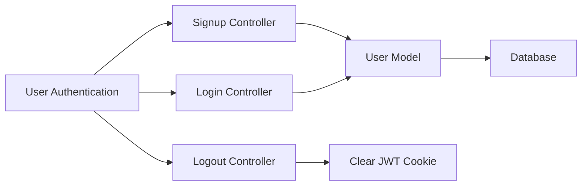

# Controllers

This section details the controllers within the backend of the `shinymack/Chat-App-MERN` project. Controllers are responsible for handling incoming requests, processing data, and sending responses. They act as intermediaries between the routes and the models, enforcing business logic and ensuring data consistency. This project utilizes controllers for authentication, messaging, and friend management.

## Authentication Controller (`auth.controller.js`)

The `auth.controller.js` file manages user authentication functionalities such as signup, login, logout, and Google OAuth. It handles user registration, session management, and ensures secure access to the application.

### Signup

The signup controller handles user registration, validating input data, hashing passwords, and creating new user records in the database.

```javascript title="backend/src/controllers/auth.controller.js"
export const signup = async (req, res) => {
    const {username, email, password} = req.body;
    try {
        if(!username || !email || !password) {
            return res.status(400).json({message: "Please fill in all fields."});
        }

        const user = await User.findOne({email});
        if (user) return res.status(400).json({message: "Email already exists."});
        
        const existingUserByUsername = await User.findOne({ username });
        if (existingUserByUsername) {
            return res.status(400).json({ message: "Username already exists. Please choose another." });
        }

        const salt = await bcrypt.genSalt(10);
        const hashedPassword = await bcrypt.hash(password, salt);

        const newUser = new User({
            username,
            email,
            password: hashedPassword,
            authProvider: 'email'
        });
        if(newUser){
            generateToken(newUser._id, res);
            await newUser.save();

            res.status(201).json({
                _id: newUser._id,
                username: newUser.username,
                email: newUser.email,   
                profilePic: newUser.profilePic,
                authProvider: newUser.authProvider
            });
        } else {
            res.status(400).json({message: "Invalid user data."});
        }
    } catch (error) {
        console.log("Error in signup controller", error.message)
        res.status(500).json({message: "Something went wrong."});
    }
};
```

**Explanation:**

1.  The function extracts `username`, `email`, and `password` from the request body.
2.  It validates that all required fields are present.
3.  It checks if the email already exists in the database.
4.  It hashes the password using `bcrypt` and saves the new user to the database.
5.  It generates a JWT token using `generateToken` and sends it in a cookie.
6.  Finally, it sends a JSON response containing the user's information.

[View on GitHub](https://github.com/shinymack/Chat-App-MERN/blob/main/backend/src/controllers/auth.controller.js)

### Login

The login controller authenticates users by verifying their email and password against the stored credentials.

```javascript title="backend/src/controllers/auth.controller.js"
export const login = async (req, res) => {
    const {email, password} = req.body;
    try {
        const user = await User.findOne({email});

        if(!user) {
            return res.status(400).json({message: "Invalid credentials."});
        }

        if(user.authProvider === 'google' && !user.password){
            return res.status(400).json({ message: "Please sign in with Google." });
        }

        const isPasswordCorrect = await bcrypt.compare(password, user.password);
        if(!isPasswordCorrect) {
            return res.status(400).json({message: "Invalid credentials."});
        }

        generateToken(user._id, res);
        res.status(200).json({
            _id: user._id,
            username: user.username,
            email: user.email,
            profilePic: user.profilePic,
            authProvider: user.authProvider,
        });
    } catch (error) {
        console.log("Error in login controller", error.message);
        res.status(500).json({message: "Something went wrong."});
    }
};
```

**Explanation:**

1.  The function extracts `email` and `password` from the request body.
2.  It checks if a user with the provided email exists in the database.
3.  It compares the provided password with the stored hashed password using `bcrypt`.
4.  If the credentials are valid, it generates a JWT token and sends it in a cookie.
5.  Finally, it sends a JSON response containing the user's information.

[View on GitHub](https://github.com/shinymack/Chat-App-MERN/blob/main/backend/src/controllers/auth.controller.js)

### Logout

The logout controller clears the JWT token cookie, effectively logging the user out.

```javascript title="backend/src/controllers/auth.controller.js"
export const logout = (req, res) => {
    try {
        res.cookie("jwt", "", {maxAge: 0});
        res.status(200).json({message: "Logged out successfully."})
    } catch(error) {
        console.log("Error in logout controller", error.message);
        res.status(500).json({message:"Internal Server Error"}); 
    }
};
```

**Explanation:**

1.  This function clears the `jwt` cookie by setting its value to an empty string and setting `maxAge` to 0. This effectively deletes the cookie from the client's browser.
2.  A success message is sent back to the client.

[View on GitHub](https://github.com/shinymack/Chat-App-MERN/blob/main/backend/src/controllers/auth.controller.js)

### Update Profile

The update profile controller allows users to update their profile information, including their profile picture and username.

```javascript title="backend/src/controllers/auth.controller.js"
export const updateProfile = async (req, res) => {
    try {
        const { profilePic, username } = req.body;
        const userId = req.user._id;
        let userToUpdate = await User.findById(userId);

        if (!userToUpdate) {
            return res.status(404).json({ message: "User not found." });
        }

        const fieldsToUpdate = {};
        let newUsername = username ? username.trim() : null;
        let usernameChanged = false;

        if (newUsername && newUsername !== userToUpdate.username) {
            if (newUsername.length < 3 || newUsername.length > 20) {
                return res.status(400).json({ message: "Username must be between 3 and 20 characters." });
            }

            const existingUserWithNewUsername = await User.findOne({ username: newUsername, _id: { $ne: userId } });
            if (existingUserWithNewUsername) {
                return res.status(400).json({ message: "This username is already taken by someone else." });
            }
            fieldsToUpdate.username = newUsername;
            usernameChanged = true;
        }

        if (profilePic) {
            const uploadResponse = await cloudinary.uploader.upload(profilePic);
            fieldsToUpdate.profilePic = uploadResponse.secure_url;
        }

        if (Object.keys(fieldsToUpdate).length === 0) {
            return res.status(400).json({ message: "No changes provided to update." });
        }

        const updatedUser = await User.findByIdAndUpdate(userId, { $set: fieldsToUpdate }, { new: true });

        if (!updatedUser) {
            return res.status(404).json({ message: "Failed to update user."});
        }

        generateToken(updatedUser._id, res);

        res.status(200).json(updatedUser);

    } catch (error) {
        console.error("Error in updateProfile controller", error.message);
        if (error.code === 11000 && error.keyValue && error.keyValue.username) {
            return res.status(400).json({ message: "This username is already taken." });
        }
        res.status(500).json({ message: "Internal Server Error while updating profile." });
    }
};
```

**Explanation:**

1.  This function handles the updating of a user's profile, including their username and profile picture.
2.  It validates the new username to ensure it meets the required length and is not already taken.
3.  It uploads the new profile picture to Cloudinary and stores the URL.
4.  The function updates the user's document in the database with the new information.
5.  A new JWT token is generated to reflect any changes in the user's information.

[View on GitHub](https://github.com/shinymack/Chat-App-MERN/blob/main/backend/src/controllers/auth.controller.js)

## Friend Controller (`friend.controller.js`)

The `friend.controller.js` file handles friend request and friend management functionalities.

### Send Friend Request

```javascript title="backend/src/controllers/friend.controller.js"
export const sendFriendRequest = async (req, res) => {
    try {
        const { identifier } = req.body; // Expecting { identifier: "some_username_or_email" }
        const senderId = req.user._id;

        if (!identifier) {
            return res.status(400).json({ message: "Username or email is required." });
        }

        // Find receiver by username OR email
        const receiver = await User.findOne({
            $or: [{ username: identifier }, { email: identifier }]
        });

        if (!receiver) {
            return res.status(404).json({ message: "User not found." });
        }
        
        const receiverId = receiver._id;

        if (senderId.toString() === receiverId.toString()) {
            return res.status(400).json({ message: "You cannot send a friend request to yourself." });
        }

        const sender = await User.findById(senderId);

        // --- Rest of the logic is the same ---
        if (sender.friends.includes(receiverId)) {
            return res.status(400).json({ message: "You are already friends with this user." });
        }
        if (sender.sentRequests.includes(receiverId)) {
            return res.status(400).json({ message: "Friend request already sent." });
        }
        if (sender.friendRequests.includes(receiverId)) {
            return res.status(400).json({ message: "This user has already sent you a friend request." });
        }

        sender.sentRequests.push(receiverId);
        receiver.friendRequests.push(senderId);

        await sender.save();
        await receiver.save();

        res.status(200).json({ message: "Friend request sent successfully." });

    } catch (error) {
        console.error("Error in sendFriendRequest: ", error.message);
        res.status(500).json({ message: "Internal server error", error: error.message });
    }
};
```

**Explanation:**

1.  The function extracts the identifier (username or email) of the receiver from the request body.
2.  It finds the receiver by either username or email.
3.  It checks if the sender and receiver are the same user.
4.  It checks if the users are already friends or if a friend request has already been sent.
5.  It updates the `sentRequests` and `friendRequests` arrays for both users.
6.  Finally, it saves the changes to the database.

[View on GitHub](https://github.com/shinymack/Chat-App-MERN/blob/main/backend/src/controllers/friend.controller.js)

## Message Controller (`message.controller.js`)

The `message.controller.js` file manages message-related functionalities, including retrieving messages, sending new messages, and fetching users for the sidebar.

### Send Message

```javascript title="backend/src/controllers/message.controller.js"
export const sendMessage = async (req, res) => {
    try {
        const { text, image } = req.body;
        const { id: receiverId } = req.params;
        const senderId = req.user._id;

        let imageUrl;
        if (image) {
            const uploadResponse = await cloudinary.uploader.upload(image);

            imageUrl = uploadResponse.secure_url;
        }
        const newMessage = new Message({
            senderId,
            receiverId,
            text,
            image: imageUrl,
        });

        await newMessage.save();

        const receiverSocketId = getReceiverSocketId(receiverId);

        if(receiverSocketId) {
            io.to(receiverSocketId).emit("newMessage", newMessage);
        }


        res.status(201).json(newMessage);   
        
    } catch (error) {
        console.log("Error in sendMessage controller:  ", error);
        res.status(500).json({ error: "Internal Server Error" });
    }
};
```

**Explanation:**

1.  This function handles sending a new message from one user to another. It extracts the message text and optional image from the request body, as well as the receiver's ID from the request parameters.  The sender's ID is retrieved from the authenticated user (`req.user`).
2.  If an image is included, it's uploaded to Cloudinary, and the resulting secure URL is stored.
3.  A new `Message` document is created with the sender, receiver, text, and image URL.
4.  The message is saved to the database.
5.  The receiver's socket ID is retrieved using `getReceiverSocketId`, and if the receiver is online (socket ID found), a "newMessage" event is emitted to them via Socket.IO.
6.  The newly created message is sent back to the sender in the response.

[View on GitHub](https://github.com/shinymack/Chat-App-MERN/blob/main/backend/src/controllers/message.controller.js)

### Get Users For Sidebar

```javascript title="backend/src/controllers/message.controller.js"
export const getUsersForSidebar = async (req, res) => {
    try {
        const loggedInUserId = req.user._id;
        const filteredUsers = await User.find({
            _id: { $ne: loggedInUserId }}).select("-password");  
        res.status(200).json(filteredUsers);
    }
    catch (error) {
        console.log("Error in getUsersForSidebar: ", error);
        res.status(500).json({ error: "Internal Server Error" });
    }
};
```

**Explanation:**

1.  This function retrieves a list of users to display in the sidebar, excluding the currently logged-in user.  The logged-in user's ID is retrieved from the `req.user` object (set by the authentication middleware).
2.  It uses `User.find` to query the database for all users whose IDs are not equal to the logged-in user's ID (`$ne` operator).
3.  `.select("-password")` is used to exclude the password field from the returned user objects, for security reasons.
4.  The resulting array of users is sent back in the response.

[View on GitHub](https://github.com/shinymack/Chat-App-MERN/blob/main/backend/src/controllers/message.controller.js)





## Key Integration Points

The controllers in this application are critical for handling the business logic and facilitating communication between the frontend and the database.

*   **Authentication Flow:** The `auth.controller.js` manages the complete authentication lifecycle, from user registration to session termination. It leverages JWT tokens for secure session management.
*   **Friend Management:**  The `friend.controller.js` handles friend requests, acceptances, rejections, and removals, updating user relationships within the database.
*   **Messaging:** The `message.controller.js` handles the core functionality of sending and receiving messages. It integrates with Cloudinary for image uploads and Socket.IO for real-time communication.
*   **Error Handling:**  Each controller includes comprehensive error handling to manage exceptions and provide informative responses to the client.

By following a well-structured controller design, the application maintains a clear separation of concerns, making it easier to maintain and scale. The consistent use of asynchronous functions and error handling ensures a robust and reliable backend.
```