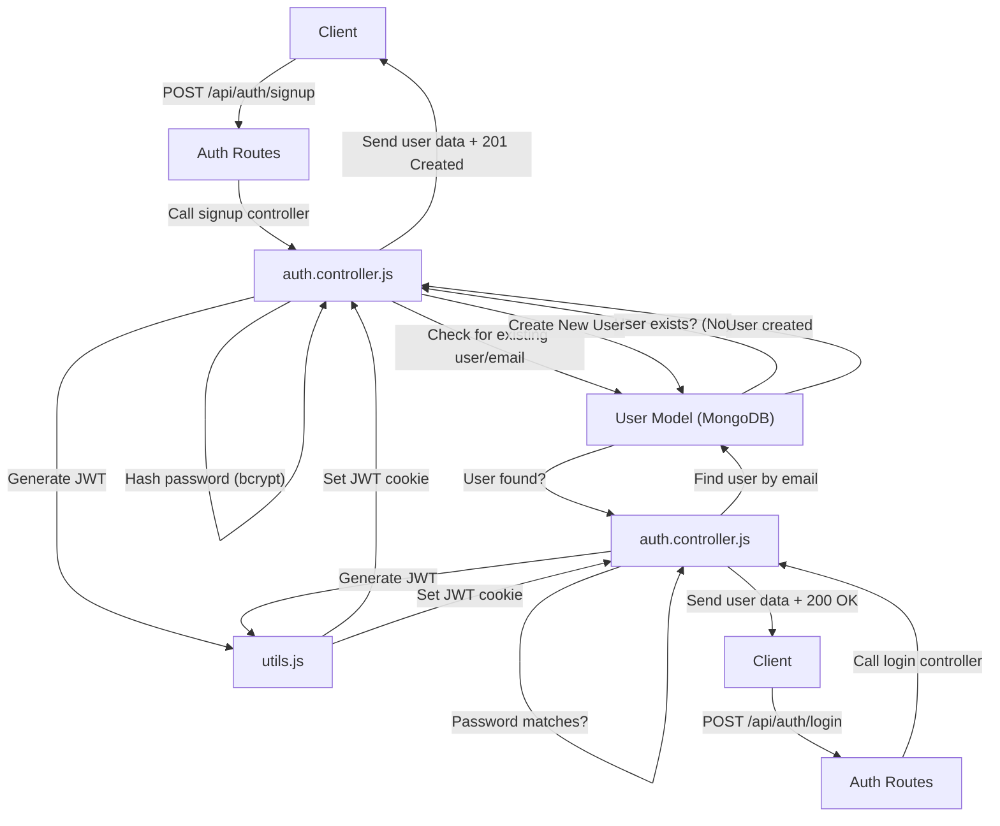
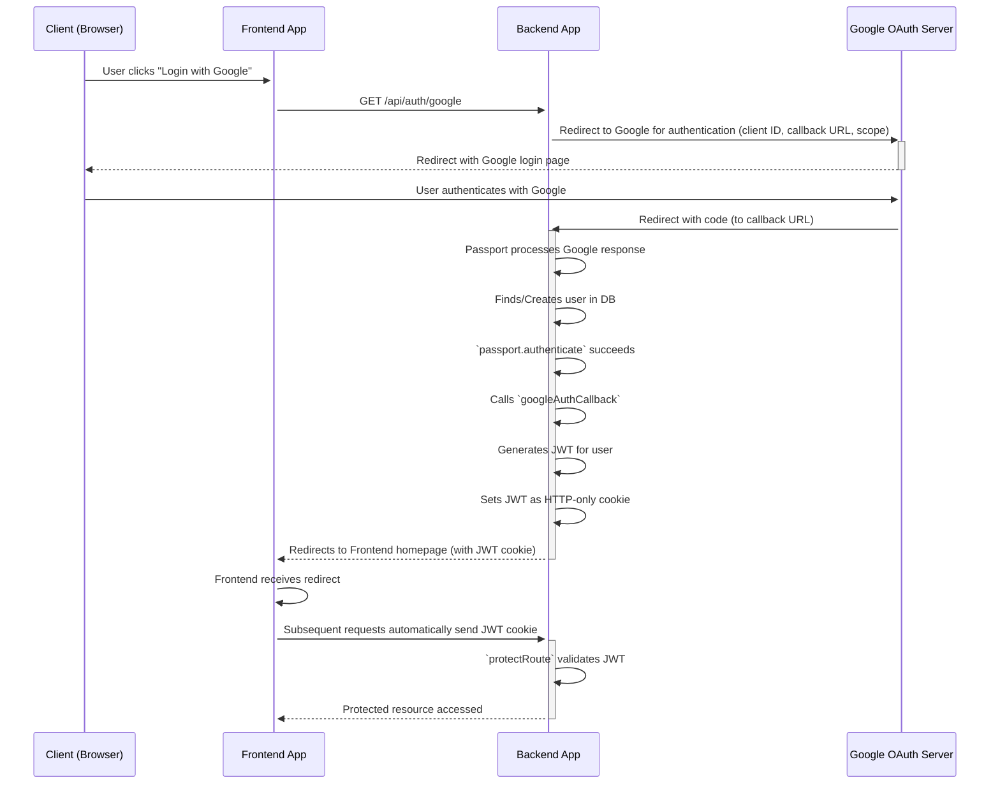

 # User Authentication and Authorization

This documentation details the comprehensive user authentication and authorization system within the application, covering registration, login, session management, access control, and third-party authentication via Google. The system is built using Node.js, Express, MongoDB, `bcrypt.js` for password hashing, `jsonwebtoken` for session management, and `passport.js` for Google OAuth.

## Core Authentication Mechanisms

The application employs a robust authentication strategy that includes:

*   **User Registration (Signup)**: Allows new users to create accounts with a unique username and email, secured by hashed passwords.
*   **User Login**: Authenticates existing users by verifying their credentials against stored hashes.
*   **Session Management**: Utilizes JSON Web Tokens (JWT) for maintaining user sessions, stored as HTTP-only cookies.
*   **Logout**: Invalidates the current user session by clearing the JWT cookie.
*   **Google OAuth**: Provides an alternative, secure login and registration method through Google.
*   **Profile Management**: Enables users to update their profile information, including username and profile picture.
*   **Access Control**: Implements middleware to protect routes, ensuring only authenticated users can access specific resources.

## Registration and Login Flow

New users can register by providing a username, email, and password. Upon successful registration, a JWT is generated and set as an HTTP-only cookie, logging the user in automatically. The login process follows a similar mechanism: credentials are verified, and a JWT is issued.

### Signup Controller Logic

The `signup` function in `auth.controller.js` handles user registration, including input validation and password hashing.

```javascript filename="backend/src/controllers/auth.controller.js" {15-20}
import cloudinary from "../lib/cloudinary.js";
import { generateToken } from "../lib/utils.js";
import User from "../models/user.model.js";
import bcrypt from "bcryptjs";

export const signup = async (req, res) => {
    const {username, email, password} = req.body;
    try {
        if(!username || !email || !password) {
            return res.status(400).json({message: "Please fill in all fields."});
        }
        if (username.length < 3) {
            return res.status(400).json({ message: "Username must be at least 3 characters." });
        }
        // ... (other validations)
        
        const salt = await bcrypt.genSalt(10);
        const hashedPassword = await bcrypt.hash(password, salt);

        const newUser = new User({
            username,
            email,
            password: hashedPassword,
            authProvider: 'email'
        });
        if(newUser){
            generateToken(newUser._id, res); // Generate JWT
            await newUser.save();

            res.status(201).json({
                _id: newUser._id,
                username: newUser.username,
                email: newUser.email,   
                profilePic: newUser.profilePic,
                authProvider: newUser.authProvider
            });
        } else {
            res.status(400).json({message: "Invalid user data."});
        }
    } catch (error) {
        console.log("Error in signup controller", error.message)
        res.status(500).json({message: "Something went wrong."});
    }
};
```
[View on GitHub](https://github.com/shinymack/Chat-App-MERN/blob/main/backend/src/controllers/auth.controller.js#L6-L53)

### Login Controller Logic

The `login` function authenticates users and issues a JWT.

```javascript filename="backend/src/controllers/auth.controller.js" {5-10}
export const login = async (req, res) => {
    const {email, password} = req.body;
    try {
        const user = await User.findOne({email});

        if(!user) {
            return res.status(400).json({message: "Invalid credentials."});
        }
        const isPasswordCorrect = await bcrypt.compare(password, user.password);
        if(!isPasswordCorrect) {
            return res.status(400).json({message: "Invalid credentials."});
        }

        generateToken(user._id, res); // Generate JWT
        res.status(200).json({
            _id: user._id,
            username: user.username,
            email: user.email,
            profilePic: user.profilePic,
            authProvider: user.authProvider,
        });
    } catch (error) {
        console.log("Error in login controller", error.message);
        res.status(500).json({message: "Something went wrong."});
    }
};
```
[View on GitHub](https://github.com/shinymack/Chat-App-MERN/blob/main/backend/src/controllers/auth.controller.js#L55-L84)

### Authentication Flow Diagram

This diagram illustrates the general flow for user registration and login with email/password.





## Session Management with JWT

The application uses JWTs for stateless session management. Upon successful login or registration, a JWT is signed with the user's ID and a secret, then sent to the client as an HTTP-only cookie. This cookie is automatically sent with subsequent requests.

### JWT Generation Utility

The `generateToken` function, residing in `backend/src/lib/utils.js` (not provided in this excerpt but referenced), is responsible for signing the JWT and setting the cookie.

```javascript
// Simplified example of generateToken (from utils.js)
import jwt from "jsonwebtoken";

export const generateToken = (userId, res) => {
    const token = jwt.sign({ userId }, process.env.JWT_SECRET, {
        expiresIn: '15d' 
    });

    res.cookie("jwt", token, {
        maxAge: 15 * 24 * 60 * 60 * 1000, // 15 days
        httpOnly: true, // Prevent XSS attacks
        sameSite: "strict", // CSRF protection
        secure: process.env.NODE_ENV !== "development", // Use secure cookies in production
    });
};
```

### Logout Functionality

The `logout` controller simply clears the `jwt` cookie, effectively ending the user's session.

```javascript filename="backend/src/controllers/auth.controller.js" {3-4}
export const logout = (req, res) => {
    try {
        res.cookie("jwt", "", {maxAge: 0}); // Clear the JWT cookie
        res.status(200).json({message: "Logged out successfully."})
    } catch(error) {
        console.log("Error in logout controller", error.message);
        res.status(500).json({message:"Internal Server Error"}); 
    }
};
```
[View on GitHub](https://github.com/shinymack/Chat-App-MERN/blob/main/backend/src/controllers/auth.controller.js#L86-L95)

## Access Control with `protectRoute` Middleware

The `protectRoute` middleware ensures that only authenticated users can access certain routes. It verifies the JWT from the request cookie, decodes it, and attaches the user object to `req.user`.

```javascript filename="backend/src/middleware/auth.middleware.js" {5-11}
import jwt from "jsonwebtoken"
import User from "../models/user.model.js"

export const protectRoute = async (req, res, next) => {
    try {
        const token = req.cookies.jwt; // Get JWT from cookie
        if(!token){
            return res.status(401).json({message: "Unauthorized - No Token Provided"});
        }

        const decoded = jwt.verify(token, process.env.JWT_SECRET) // Verify token

        if(!decoded) {
            return res.status(401).json({message: "Unauthorized - Invalid Token"});
        }
        const user = await User.findById(decoded.userId).select("-password"); // Find user

        if(!user) {
            return res.status(404).json({message: "User not found"});
        }
        req.user = user; // Attach user to request

        next(); // Proceed to the next middleware/controller
    } catch (error) {
        console.log("Error in protectRoute middleware", error.message);
        res.status(500).json({message: "Internal Server Error"});

    }

};
```
[View on GitHub](https://github.com/shinymack/Chat-App-MERN/blob/main/backend/src/middleware/auth.middleware.js#L5-L29)

### Example Route Protection

```javascript filename="backend/src/routes/auth.route.js"
import express from "express"
import passport from 'passport';
import { login, logout, signup, updateProfile, checkAuth, googleAuthCallback, checkUsernameAvailability} from  "../controllers/auth.controller.js"
import { protectRoute } from "../middleware/auth.middleware.js" // Import middleware
const router = express.Router();

// ... other routes

router.put("/update-profile", protectRoute ,updateProfile) // Protected route
router.get("/username/check/:username", protectRoute, checkUsernameAvailability); // Protected route
router.get("/check", protectRoute, checkAuth) // Protected route

// ... other routes
```
[View on GitHub](https://github.com/shinymack/Chat-App-MERN/blob/main/backend/src/routes/auth.route.js#L9-L34)

## Google OAuth Integration

The application supports Google login/signup using `passport.js` with the `passport-google-oauth20` strategy. This allows users to register or log in using their Google accounts without needing a separate password.

### Passport Configuration

The `configurePassport` function sets up the Google Strategy. It handles finding an existing user by `googleId` or creating a new user if one doesn't exist, assigning a unique username and leveraging Google-provided email and profile information.

```javascript filename="backend/src/lib/passport.config.js" {10-30}
import passport from 'passport';
import { Strategy as GoogleStrategy } from 'passport-google-oauth20';
import User from '../models/user.model.js'; 
import dotenv from 'dotenv';

dotenv.config(); 

export const configurePassport = () => {
    passport.use(new GoogleStrategy({
        clientID: process.env.GOOGLE_CLIENT_ID,
        clientSecret: process.env.GOOGLE_CLIENT_SECRET,
        callbackURL: process.env.GOOGLE_CALLBACK_URL,
        scope: ['profile', 'email'] 
    },
    async (accessToken, refreshToken, profile, done) => {
        try {
            let user = await User.findOne({ googleId: profile.id });

            if (user) {
                return done(null, user);
            } else {
                let username = profile.displayName.replace(/\s+/g, '').toLowerCase() || `user${Date.now()}`;
                // Logic to ensure unique username
                const existingUserByUsername = await User.findOne({ username });
                if (existingUserByUsername) {
                    username = `${username}${Date.now().toString().slice(-4)}`;
                }
                if (username.length > 20) username = username.substring(0,20);

                const newUser = new User({
                    googleId: profile.id,
                    email: profile.emails && profile.emails[0] ? profile.emails[0].value : null,
                    username: username,
                    authProvider: 'google',
                });

                if (!newUser.email) {
                    return done(new Error("Email not provided by Google."), null);
                }
                
                // Check if email already exists with a different authProvider
                const existingUserByEmail = await User.findOne({ email: newUser.email });
                if (existingUserByEmail && existingUserByEmail.authProvider !== 'google') {
                    return done(null, false, { message: `An account with email ${newUser.email} already exists. Please sign in using your original method.` });
                }

                await newUser.save();
                return done(null, newUser);
            }
        } catch (error) {
            return done(error, null);
        }
    }));

    passport.serializeUser((user, done) => {
        done(null, user.id);
    });

    passport.deserializeUser(async (id, done) => {
        try {
            const user = await User.findById(id);
            done(null, user);
        } catch (error) {
            done(error, null);
        }
    });
};
```
[View on GitHub](https://github.com/shinymack/Chat-App-MERN/blob/main/backend/src/lib/passport.config.js#L7-L77)

### Google OAuth Callback

After Google authenticates the user, it redirects to the `callbackURL`. The `passport.authenticate` middleware processes the Google response, and the `googleAuthCallback` controller then generates a JWT and redirects the user to the frontend.

```javascript filename="backend/src/controllers/auth.controller.js" {5-10}
export const googleAuthCallback = async (req, res) => {
 const frontendUrl = process.env.FRONTEND_URL || 'http://localhost:5173';

    try {
        if (!req.user) { // Passport populates req.user on successful auth
            return res.redirect(`${frontendUrl}/login?error=google_auth_failed`);
        }

        generateToken(req.user._id, res); // Generate JWT for the Google-authenticated user

        res.redirect(frontendUrl); // Redirect to frontend

    } catch (error) {
        console.error("Error in googleAuthCallback: ", error.message);
        res.redirect(`${frontendUrl}/login?error=google_auth_processing_error`);
    }
};
```
[View on GitHub](https://github.com/shinymack/Chat-App-MERN/blob/main/backend/src/controllers/auth.controller.js#L110-L127)

### Google OAuth Flow Diagram

This sequence diagram illustrates the steps involved in authenticating a user via Google.





## Profile Management

Users can update their profile, including changing their username and profile picture. The `updateProfile` controller handles these operations, including uploading images to Cloudinary and ensuring username uniqueness.

```javascript filename="backend/src/controllers/auth.controller.js" {17-20, 24-26, 32}
export const updateProfile = async (req, res) => {
    try {
        const { profilePic, username } = req.body;
        const userId = req.user._id;
        let userToUpdate = await User.findById(userId);

        if (!userToUpdate) {
            return res.status(404).json({ message: "User not found." });
        }

        const fieldsToUpdate = {};
        let newUsername = username ? username.trim() : null;

        if (newUsername && newUsername !== userToUpdate.username) {
            // Validate new username length
            if (newUsername.length < 3 || newUsername.length > 20) {
                return res.status(400).json({ message: "Username must be between 3 and 20 characters." });
            }
            // Check for username uniqueness (excluding current user)
            const existingUserWithNewUsername = await User.findOne({ username: newUsername, _id: { $ne: userId } });
            if (existingUserWithNewUsername) {
                return res.status(400).json({ message: "This username is already taken by someone else." });
            }
            fieldsToUpdate.username = newUsername;
        }

        // Handle profile picture upload to Cloudinary
        if (profilePic) {
            const uploadResponse = await cloudinary.uploader.upload(profilePic);
            fieldsToUpdate.profilePic = uploadResponse.secure_url;
        }

        if (Object.keys(fieldsToUpdate).length === 0) {
            return res.status(400).json({ message: "No changes provided to update." });
        }

        const updatedUser = await User.findByIdAndUpdate(userId, { $set: fieldsToUpdate }, { new: true });

        generateToken(updatedUser._id, res); // Re-generate token to update cookie if user info changed

        res.status(200).json(updatedUser);

    } catch (error) {
        console.error("Error in updateProfile controller", error.message);
        if (error.code === 11000 && error.keyValue && error.keyValue.username) {
            return res.status(400).json({ message: "This username is already taken." });
        }
        res.status(500).json({ message: "Internal Server Error while updating profile." });
    }
};
```
[View on GitHub](https://github.com/shinymack/Chat-App-MERN/blob/main/backend/src/controllers/auth.controller.js#L168-L232)

## Key Integration Points

*   **Authentication Routes (`auth.route.js`)**: Serves as the entry point for all authentication-related requests, directing them to the appropriate controller functions and applying middleware like `protectRoute`.
*   **User Model**: Stores user data, including hashed passwords, Google IDs, and profile information.
*   **JWT Utility (`generateToken`)**: Centralized function for creating and setting JWTs.
*   **Passport Configuration (`passport.config.js`)**: Manages the Google OAuth strategy, user serialization, and deserialization for session management with Passport.

This modular design ensures clear separation of concerns, making the authentication system robust, scalable, and maintainable. The combination of local authentication with `bcrypt.js` and third-party authentication with `passport.js` provides flexibility for users while maintaining high security standards through JWTs and HTTP-only cookies.