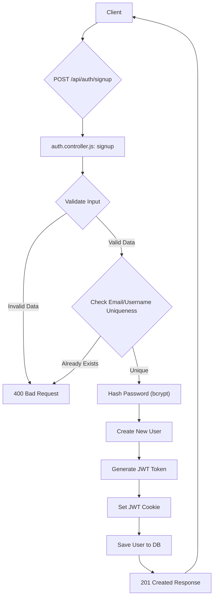
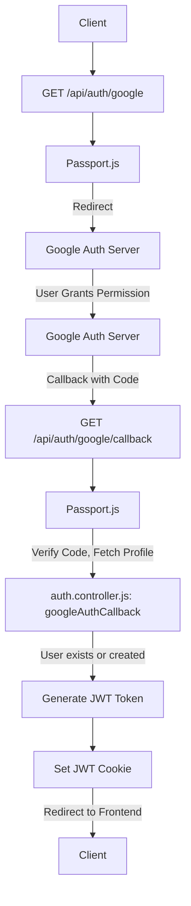

 # User Management and Authentication

This document details the user management and authentication mechanisms implemented in the application's backend. It covers user registration, login via both email/password and Google OAuth, session management using JWTs, profile updates, and username availability checks. The system ensures secure user access and robust identity verification.

## Core Components

The authentication system is built around several key files that manage user data, authentication logic, and routing.

*   **`backend/src/models/user.model.js`**: Defines the Mongoose schema for user data, including fields for email, username, hashed password, profile picture, social connections, and authentication provider.
*   **`backend/src/controllers/auth.controller.js`**: Contains the primary logic for user authentication operations such as `signup`, `login`, `logout`, `checkAuth`, `googleAuthCallback`, `checkUsernameAvailability`, and `updateProfile`.
*   **`backend/src/routes/auth.route.js`**: Sets up the API endpoints for authentication, mapping URLs to controller functions and integrating Passport.js for Google OAuth.
*   **`backend/src/lib/passport.config.js`**: Configures Passport.js strategies, specifically `GoogleStrategy`, for OAuth-based authentication, handling user serialization and deserialization.

## User Registration (Signup)

The signup process allows new users to register with a unique email and username, secured by a hashed password.

### Process Flow





### Key Logic in `signup` Controller

The `signup` controller handles input validation, checks for existing users, hashes passwords, and generates a JWT upon successful registration.

```javascript
// backend/src/controllers/auth.controller.js
// Lines 6-51
export const signup = async (req, res) => {
    const {username, email, password} = req.body;
    try {
        if(!username || !email || !password) {
            return res.status(400).json({message: "Please fill in all fields."});
        }
        if (username.length < 3 || username.length > 20) {
            return res.status(400).json({ message: "Username must be between 3 and 20 characters." });
        }
        if (password.length < 6) {
            return res.status(400).json({message: "Password must be at least 6 characters."});
        }
        const user = await User.findOne({email});
        if (user) return res.status(400).json({message: "Email already exists."});
        
        const existingUserByUsername = await User.findOne({ username });
        if (existingUserByUsername) {
            return res.status(400).json({ message: "Username already exists. Please choose another." });
        }

        const salt = await bcrypt.genSalt(10);
        const hashedPassword = await bcrypt.hash(password, salt);

        const newUser = new User({
            username,
            email,
            password: hashedPassword,
            authProvider: 'email'
        });
        if(newUser){
            generateToken(newUser._id, res); // Sets JWT cookie
            await newUser.save();
            res.status(201).json({
                _id: newUser._id,
                username: newUser.username,
                email: newUser.email,   
                profilePic: newUser.profilePic,
                authProvider: newUser.authProvider
            });
        } else {
            res.status(400).json({message: "Invalid user data."});
        }
    } catch (error) {
        console.log("Error in signup controller", error.message)
        res.status(500).json({message: "Something went wrong."});
    }
};
```
[View on GitHub](https://github.com/shinymack/Chat-App-MERN/blob/main/backend/src/controllers/auth.controller.js#L6-L51)

## User Login

Users can log in using their registered email and password. Google OAuth is also supported for alternative login.

### Email/Password Login

The `login` controller verifies credentials and issues a JWT token.

```javascript
// backend/src/controllers/auth.controller.js
// Lines 53-83
export const login = async (req, res) => {
    const {email, password} = req.body;
    try {
        const user = await User.findOne({email});

        if(!user) {
            return res.status(400).json({message: "Invalid credentials."});
        }

        if(user.authProvider === 'google' && !user.password){
            return res.status(400).json({ message: "Please sign in with Google." });
        }

        const isPasswordCorrect = await bcrypt.compare(password, user.password);
        if(!isPasswordCorrect) {
            return res.status(400).json({message: "Invalid credentials."});
        }

        generateToken(user._id, res); // Sets JWT cookie
        res.status(200).json({
            _id: user._id,
            username: user.username,
            email: user.email,
            profilePic: user.profilePic,
            authProvider: user.authProvider,
        });
    } catch (error) {
        console.log("Error in login controller", error.message);
        res.status(500).json({message: "Something went wrong."});
    }
};
```
[View on GitHub](https://github.com/shinymack/Chat-App-MERN/blob/main/backend/src/controllers/auth.controller.js#L53-L83)

### Google OAuth Login

Google OAuth uses Passport.js to authenticate users via their Google accounts.

#### Passport Configuration

The `passport.config.js` file sets up the `GoogleStrategy` for Passport.js. It handles finding or creating a user based on their Google ID and email.

```javascript
// backend/src/lib/passport.config.js
// Lines 12-70
export const configurePassport = () => {
    passport.use(new GoogleStrategy({
        clientID: process.env.GOOGLE_CLIENT_ID,
        clientSecret: process.env.GOOGLE_CLIENT_SECRET,
        callbackURL: process.env.GOOGLE_CALLBACK_URL,
        scope: ['profile', 'email'] 
    },
    async (accessToken, refreshToken, profile, done) => {
        try {
            let user = await User.findOne({ googleId: profile.id });

            if (user) {
                return done(null, user);
            } else {
                let username = profile.displayName.replace(/\s+/g, '').toLowerCase() || `user${Date.now()}`;
                const existingUserByUsername = await User.findOne({ username });
                if (existingUserByUsername) {
                    username = `${username}${Date.now().toString().slice(-4)}`;
                }
                if (username.length > 20) username = username.substring(0,20);

                const newUser = new User({
                    googleId: profile.id,
                    email: profile.emails && profile.emails[0] ? profile.emails[0].value : null,
                    username: username,
                    authProvider: 'google',
                });

                if (!newUser.email) {
                    return done(new Error("Email not provided by Google. Cannot create account."), null);
                }

                const existingUserByEmail = await User.findOne({ email: newUser.email });
                if (existingUserByEmail && existingUserByEmail.authProvider !== 'google') {
                    return done(null, false, { message: `An account with email ${newUser.email} already exists. Please sign in using your original method.` });
                }

                await newUser.save();
                return done(null, newUser);
            }
        } catch (error) {
            return done(error, null);
        }
    }));

    passport.serializeUser((user, done) => {
        done(null, user.id);
    });

    passport.deserializeUser(async (id, done) => {
        try {
            const user = await User.findById(id);
            done(null, user);
        } catch (error) {
            done(error, null);
        }
    });
};
```
[View on GitHub](https://github.com/shinymack/Chat-App-MERN/blob/main/backend/src/lib/passport.config.js#L12-L70)

#### Google OAuth Flow





### Logout

The `logout` function clears the JWT cookie, effectively logging the user out.

```javascript
// backend/src/controllers/auth.controller.js
// Lines 85-93
export const logout = (req, res) => {
    try {
        res.cookie("jwt", "", {maxAge: 0});
        res.status(200).json({message: "Logged out successfully."})
    } catch(error) {
        console.log("Error in logout controller", error.message);
        res.status(500).json({message:"Internal Server Error"}); 
    }
};
```
[View on GitHub](https://github.com/shinymack/Chat-App-MERN/blob/main/backend/src/controllers/auth.controller.js#L85-L93)

## User Profile and Session Management

### Check Authentication

The `checkAuth` endpoint allows the client to verify if a user is currently authenticated and retrieve their basic profile information. It relies on the `protectRoute` middleware to ensure a valid JWT token is present.

```javascript
// backend/src/controllers/auth.controller.js
// Lines 96-108
export const checkAuth = (req, res) => {
    try {
        res.status(200).json({
            _id: req.user._id,
            username: req.user.username,
            email: req.user.email,
            profilePic: req.user.profilePic,
            authProvider: req.user.authProvider,
            createdAt: req.user.createdAt
        });
    } catch (error) {
        console.log("Error in checkAuth controller", error.message);
        res.status(500).json({message: "Internal Server Error"});
    }
};
```
[View on GitHub](https://github.com/shinymack/Chat-App-MERN/blob/main/backend/src/controllers/auth.controller.js#L96-L108)

### Update Profile

Users can update their profile picture and username. The `updateProfile` controller handles these changes, including validation and interaction with Cloudinary for image uploads.

```javascript
// backend/src/controllers/auth.controller.js
// Lines 179-236
export const updateProfile = async (req, res) => {
    try {
        const { profilePic, username } = req.body;
        const userId = req.user._id;
        let userToUpdate = await User.findById(userId);

        if (!userToUpdate) {
            return res.status(404).json({ message: "User not found." });
        }

        const fieldsToUpdate = {};
        let newUsername = username ? username.trim() : null;

        if (newUsername && newUsername !== userToUpdate.username) {
            if (newUsername.length < 3 || newUsername.length > 20) {
                return res.status(400).json({ message: "Username must be between 3 and 20 characters." });
            }
            const existingUserWithNewUsername = await User.findOne({ username: newUsername, _id: { $ne: userId } });
            if (existingUserWithNewUsername) {
                return res.status(400).json({ message: "This username is already taken by someone else." });
            }
            fieldsToUpdate.username = newUsername;
        }

        if (profilePic) {
            const uploadResponse = await cloudinary.uploader.upload(profilePic);
            fieldsToUpdate.profilePic = uploadResponse.secure_url;
        }

        if (Object.keys(fieldsToUpdate).length === 0) {
            return res.status(400).json({ message: "No changes provided to update." });
        }

        const updatedUser = await User.findByIdAndUpdate(userId, { $set: fieldsToUpdate }, { new: true });

        if (!updatedUser) {
            return res.status(404).json({ message: "Failed to update user."});
        }

        generateToken(updatedUser._id, res); // Refresh JWT token
        res.status(200).json(updatedUser);

    } catch (error) {
        console.error("Error in updateProfile controller", error.message);
        if (error.code === 11000 && error.keyValue && error.keyValue.username) {
            return res.status(400).json({ message: "This username is already taken." });
        }
        res.status(500).json({ message: "Internal Server Error while updating profile." });
    }
};
```
[View on GitHub](https://github.com/shinymack/Chat-App-MERN/blob/main/backend/src/controllers/auth.controller.js#L179-L236)

### Username Availability Check

This feature allows clients to check if a desired username is available before a user attempts to update their profile or sign up.

```javascript
// backend/src/controllers/auth.controller.js
// Lines 134-176
export const checkUsernameAvailability = async (req, res) => {
    try {
        const { username } = req.params;
        const currentUserId = req.user._id; 

        if (!username || username.trim().length < 3) {
            return res.status(400).json({ available: false, message: "Username must be at least 3 characters." });
        }
        if (username.trim().length > 20) {
            return res.status(400).json({ available: false, message: "Username cannot be more than 20 characters." });
        }
    
        if (req.user.username === username) {
            return res.status(200).json({ available: true, message: "This is your current username." });
        }

        const existingUser = await User.findOne({ username: username });

        if (existingUser) {
            return res.status(200).json({ available: false, message: "Username is already taken." });
        }

        res.status(200).json({ available: true, message: "Username is available." });

    } catch (error) {
        console.error("Error in checkUsernameAvailability:", error.message);
        res.status(500).json({ available: false, message: "Error checking username availability." });
    }
};
```
[View on GitHub](https://github.com/shinymack/Chat-App-MERN/blob/main/backend/src/controllers/auth.controller.js#L134-L176)

## User Model

The `User` Mongoose model defines the structure and validation rules for user documents in the MongoDB database.

```javascript
// backend/src/models/user.model.js
// Lines 3-64
import mongoose from "mongoose"

const  userSchema = new mongoose.Schema(
    {
        email: { 
            type: String,
            required: true,
            unique: true
        },
        username: {
            type: String,
            required: [true, "Username is required"],
            unique: true,
            trim: true,
            minlength: [3, "Username must be at least 3 characters long"],
            maxlength: [20, "Username cannot be more than 20 characters long"]
        }
        ,
        password: {
            type: String,
            minlength: 6,
        },
        profilePic: {
            type: String,
            default: "",
        },
        friends: [{
            type: mongoose.Schema.Types.ObjectId,
            ref: "User",
            default: [] 
        }],
        friendRequests: [{
            type: mongoose.Schema.Types.ObjectId,
            ref: "User",
            default: []
        }],
        sentRequests: [{
            type: mongoose.Schema.Types.ObjectId,
            ref: "User",
            default: []
        }],
        authProvider: {
            type: String,
            enum: ['email', 'google'],
            default: 'email'
        },
        googleId: {
            type: String,
            unique: true,
            sparse: true
        },
    },
    { 
        timestamps: true
    } 
);

userSchema.pre('save', async function(next) {
    if (this.authProvider === 'google' && !this.isModified('password')) {
        this.password = undefined; // Ensure password is not saved for Google accounts without one
    }
    if (this.authProvider === 'email' && !this.password && this.isNew) {
        return next(new Error('Password is required for email signup.'));
    }
    next();
});

const User = mongoose.model("User", userSchema);

export default User;
```
[View on GitHub](https://github.com/shinymack/Chat-App-MERN/blob/main/backend/src/models/user.model.js#L3-L64)

## Key Integration Points

*   **JWT for Session Management**: A JSON Web Token (JWT) is generated upon successful login or signup and stored as an `httpOnly` cookie. This token is used by the `protectRoute` middleware to authenticate subsequent requests, ensuring that sensitive routes are only accessible to authenticated users. This method provides stateless session management, which is scalable.
*   **Password Hashing**: Passwords are never stored in plain text. `bcryptjs` is used to hash passwords with a salt, significantly enhancing security against brute-force attacks and data breaches.
*   **Dual Authentication Providers**: The system supports both traditional email/password authentication and Google OAuth. The `authProvider` field in the `User` model tracks how a user registered, allowing for differentiated login flows (e.g., preventing email login for Google-only accounts).
*   **Unique Constraints**: Both `email` and `username` fields in the `User` model have unique constraints, preventing duplicate registrations and ensuring distinct user identities. For Google accounts, `googleId` also has a unique and sparse index.
*   **Middleware Protection**: Routes that require authentication (e.g., `/update-profile`, `/check`, `/username/check`) are protected by the `protectRoute` middleware. This middleware deserializes the JWT, verifies its signature, and attaches the user object to the `req` object for easy access in controllers.
*   **Cloudinary Integration**: For profile picture updates, Cloudinary is used to securely upload and store image assets, offloading media management from the backend server.
*   **Frontend Redirection for OAuth**: After Google OAuth, the backend redirects to the frontend with an appropriate status (success or failure) to complete the authentication flow and provide a seamless user experience.