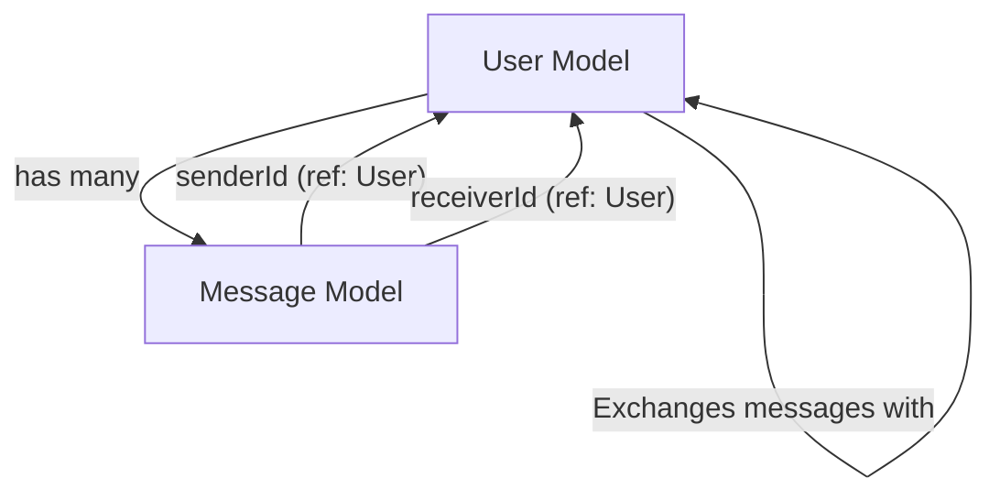
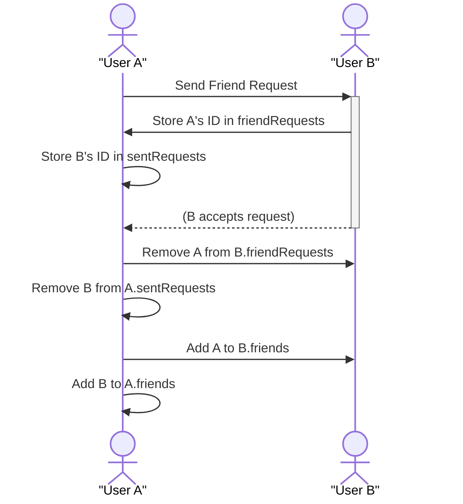

 # Backend Data Models and Schemas

This document provides a comprehensive overview of the core database models used in the backend of the application: the `User` model and the `Message` model. These Mongoose schemas define the structure, validation rules, and relationships for how user accounts and chat messages are stored and managed within the MongoDB database. Understanding these models is crucial for comprehending data flow, authentication mechanisms, and messaging functionality across the application.

## User Data Model

The `User` model represents individual users within the system. It encompasses a wide range of information, from basic authentication credentials to social features like friend lists and requests. Designed with flexibility in mind, it supports both traditional email/password authentication and third-party authentication providers like Google.

The core structure of the `userSchema` is defined as follows:

```javascript
import mongoose from "mongoose"

const  userSchema = new mongoose.Schema(
    {
        email: {
            type: String,
            required: true,
            unique: true
        },
        username: {
            type: String,
            required: [true, "Username is required"],
            unique: true,
            trim: true,
            minlength: [3, "Username must be at least 3 characters long"],
            maxlength: [20, "Username cannot be more than 20 characters long"]
        }
        ,
        password: {
            type: String,
            minlength: 6,
        },
        profilePic: {
            type: String,
            default: "",
        },
        friends: [{
            type: mongoose.Schema.Types.ObjectId,
            ref: "User",
            default: []
        }],
        friendRequests: [{ // Incoming friend requests
            type: mongoose.Schema.Types.ObjectId,
            ref: "User",
            default: []
        }],
        sentRequests: [{ // Outgoing friend requests
            type: mongoose.Schema.Types.ObjectId,
            ref: "User",
            default: []
        }],
        authProvider: {
            type: String,
            enum: ['email', 'google'],
            default: 'email'
        },
        googleId: {
            type: String,
            unique: true,
            sparse: true
        },
    },
    {
        timestamps: true
    }
);
```
[View User Model on GitHub](https://github.com/shinymack/Chat-App-MERN/blob/main/backend/src/models/user.model.js)

### Fields Explanation

*   **`email`**:
    *   **Type**: `String`
    *   **Required**: `true`
    *   **Unique**: `true`
    *   **Purpose**: Stores the user's email address, used for login and as a primary unique identifier.
*   **`username`**:
    *   **Type**: `String`
    *   **Required**: `true` (with a custom message)
    *   **Unique**: `true`
    *   **Trim**: `true` (removes whitespace)
    *   **Min/Max Length**: `3` to `20` characters
    *   **Purpose**: A user-facing identifier. Strict validation ensures usability and uniqueness.
*   **`password`**:
    *   **Type**: `String`
    *   **Min Length**: `6` characters
    *   **Purpose**: Stores the hashed password for email-based authentication. This field is optional if `authProvider` is 'google'.
*   **`profilePic`**:
    *   **Type**: `String`
    *   **Default**: `""`
    *   **Purpose**: URL to the user's profile picture.
*   **`friends`**:
    *   **Type**: Array of `mongoose.Schema.Types.ObjectId`
    *   **Ref**: `"User"`
    *   **Default**: `[]`
    *   **Purpose**: Stores an array of `_id`s of other `User` documents that are friends with this user, establishing a many-to-many relationship.
*   **`friendRequests`**:
    *   **Type**: Array of `mongoose.Schema.Types.ObjectId`
    *   **Ref**: `"User"`
    *   **Default**: `[]`
    *   **Purpose**: Stores `_id`s of `User` documents that have sent a friend request *to* this user.
*   **`sentRequests`**:
    *   **Type**: Array of `mongoose.Schema.Types.ObjectId`
    *   **Ref**: `"User"`
    *   **Default**: `[]`
    *   **Purpose**: Stores `_id`s of `User` documents that this user has sent a friend request *to*.
*   **`authProvider`**:
    *   **Type**: `String`
    *   **Enum**: `['email', 'google']`
    *   **Default**: `'email'`
    *   **Purpose**: Indicates the authentication method used by the user, allowing for conditional logic (e.g., password validation).
*   **`googleId`**:
    *   **Type**: `String`
    *   **Unique**: `true`
    *   **Sparse**: `true` (allows multiple documents to have a null value for this field)
    *   **Purpose**: Stores the unique ID provided by Google for users authenticating via Google.

### Pre-save Hook for Authentication Logic

A `pre('save')` Mongoose hook is implemented to manage password requirements based on the `authProvider`. This ensures that users authenticating via Google do not require a local password, while email-based users do.

```javascript
userSchema.pre('save', async function(next) {
    if (this.authProvider === 'google' && !this.isModified('password')) {
        this.password = undefined;
    }
    if (this.authProvider === 'email' && !this.password && this.isNew) {
        return next(new Error('Password is required for email signup.'));
    }
    next();
});

const User = mongoose.model("User", userSchema);

export default User;
```
[View Pre-save Hook on GitHub (lines 66-73)](https://github.com/shinymack/Chat-App-MERN/blob/main/backend/src/models/user.model.js#L66-L73)

**Logic Breakdown:**
1.  **Google Authentication**: If a user is authenticating via `google` and their `password` field has not been modified (e.g., during an initial Google sign-up or subsequent saves where password isn't being explicitly set), the `password` field is set to `undefined`. This prevents unnecessary storage of a non-existent or irrelevant password for Google users.
2.  **Email Authentication**: If a user is authenticating via `email` and no `password` is provided *during initial creation* (`this.isNew`), an error is thrown, enforcing the password requirement for email sign-ups.

This hook centralizes important authentication logic, ensuring data integrity and correct handling of different user types.

## Message Data Model

The `Message` model is designed to store individual chat messages exchanged between users. It captures who sent the message, who received it, the content, and optional media.

The `messageSchema` is defined as follows:

```javascript
import express from "express";
import mongoose from "mongoose";

const messageSchema = new mongoose.Schema(
    {
     senderId: {
        type: mongoose.Schema.Types.ObjectId,
        ref: "User",
        required: true,
     },
     receiverId: {
        type: mongoose.Schema.Types.ObjectId,
        ref: "User",
        required: true,
     },
     text: {
        type: String,
     },
     image: {
        type: String,
     },
    },
    {timestamps: true}
);

export default mongoose.model("Message", messageSchema);
```
[View Message Model on GitHub](https://github.com/shinymack/Chat-App-MERN/blob/main/backend/src/models/message.model.js)

### Fields Explanation

*   **`senderId`**:
    *   **Type**: `mongoose.Schema.Types.ObjectId`
    *   **Ref**: `"User"`
    *   **Required**: `true`
    *   **Purpose**: A reference to the `User` who sent this message.
*   **`receiverId`**:
    *   **Type**: `mongoose.Schema.Types.ObjectId`
    *   **Ref**: `"User"`
    *   **Required**: `true`
    *   **Purpose**: A reference to the `User` who is the intended recipient of this message.
*   **`text`**:
    *   **Type**: `String`
    *   **Purpose**: The textual content of the message. This field is optional, allowing for image-only messages.
*   **`image`**:
    *   **Type**: `String`
    *   **Purpose**: A URL to an image attached to the message. This field is optional, allowing for text-only messages.

Both `text` and `image` fields are optional, enabling messages to contain either text, an image, or both. The `timestamps: true` option automatically adds `createdAt` and `updatedAt` fields, crucial for message ordering and historical tracking.

## Key Integration Points

The `User` and `Message` models are intrinsically linked, forming the backbone of the application's functionality.

### User-Message Relationship

Messages directly reference `User` documents through `senderId` and `receiverId`. This allows for efficient population of user details when retrieving messages and ensures referential integrity.





When displaying a conversation, the application can query for messages where `senderId` or `receiverId` matches the currently logged-in user and their chat partner. This forms the basis of individual and group chat views.

### User-User Social Features

The `User` model itself manages complex social relationships:
*   **Friendship**: The `friends` array on the `User` model represents a bidirectional friendship. When User A adds User B as a friend, both A's `friends` array and B's `friends` array should be updated to include each other's `_id`.
*   **Friend Requests**: The `friendRequests` and `sentRequests` arrays facilitate the friend request lifecycle. When User A sends a request to User B, User B's `friendRequests` array should include A's `_id`, and User A's `sentRequests` array should include B's `_id`. Upon acceptance, these entries are removed, and both users are added to each other's `friends` list.

This structure allows for clear tracking of pending requests and established friendships, enabling the development of robust social features.





### Authentication Flows

The `authProvider` and `googleId` fields on the `User` model are central to managing different authentication strategies:

*   **Email/Password**: Users signing up with email provide a `password`, which is then hashed and stored. The `authProvider` is set to `'email'`.
*   **Google OAuth**: Users signing up or logging in with Google will have their `googleId` stored, and `authProvider` set to `'google'`. Their `password` field will be `undefined` due to the pre-save hook.

This flexible design allows the application to cater to diverse user preferences for login, while maintaining data consistency.

### Best Practices and Considerations

*   **Indexes**: For performance, especially with `ref` fields and `unique` constraints, ensure appropriate indexes are created on `email`, `username`, `senderId`, `receiverId`, and `googleId` fields. Mongoose automatically creates unique indexes for fields marked `unique: true`.
*   **Population**: When querying messages, Mongoose's `populate` method can be used to retrieve full `User` objects for `senderId` and `receiverId`, avoiding multiple database queries. Similarly, when fetching a user's friends or requests, `populate` can be used on the respective arrays.
*   **Data Validation**: The models leverage Mongoose's built-in validation (e.g., `required`, `minlength`, `maxlength`, `enum`, custom error messages) to maintain data integrity at the database level.
*   **Security**: Passwords must always be hashed before saving to the database. The pre-save hook handles the `password` field's existence but does not perform hashing itself, which should be done in a separate middleware or controller.
*   **Scalability**: For very large friend lists or message histories, consider strategies like pagination for fetching array fields to keep query sizes manageable.