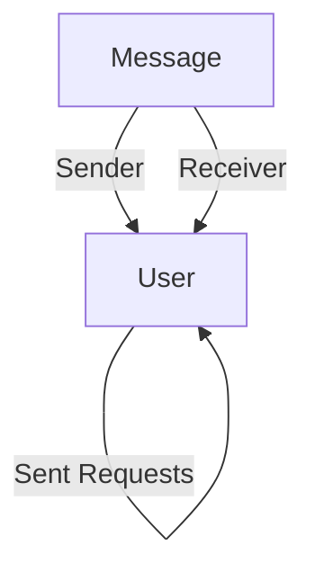

# Data Modeling and Storage

This section details the data models used in the Chat App MERN backend and how this data is persisted. The application leverages MongoDB as its primary database, with Mongoose as the Object Data Modeling (ODM) library for schema definition and interaction.

## Database Connection

The application establishes a connection to a MongoDB instance using Mongoose. The connection URI is expected to be provided via an environment variable `MONGODB_URI`.

```javascript
import mongoose from "mongoose"

export const connectDB = async () => {
  try {
    const conn = await mongoose.connect(process.env.MONGODB_URI);
    console.log(`MongoDB connected:  ${conn.connection.host}`);
  }
  catch(error){
    console.log("MongoDB connection error: ", error);
  }
}
```

## User Model

The `User` model represents a user within the chat application. It stores essential user information, authentication details, and social connections like friends and friend requests.

```javascript
import mongoose from "mongoose"

const userSchema = new mongoose.Schema(
    {
        email: {
            type: String,
            required: true,
            unique: true
        },
        username: {
            type: String,
            required: [true, "Username is required"],
            unique: true,
            trim: true,
            minlength: [3, "Username must be at least 3 characters long"],
            maxlength: [20, "Username cannot be more than 20 characters long"]
        },
        password: {
            type: String,
            minlength: 6,
        },
        profilePic: {
            type: String,
            default: "",
        },
        friends: [{
            type: mongoose.Schema.Types.ObjectId,
            ref: "User",
            default: []
        }],
        friendRequests: [{ // Incoming friend requests
            type: mongoose.Schema.Types.ObjectId,
            ref: "User",
            default: []
        }],
        sentRequests: [{ // Outgoing friend requests
            type: mongoose.Schema.Types.ObjectId,
            ref: "User",
            default: []
        }],
        authProvider: {
            type: String,
            enum: ['email', 'google'],
            default: 'email'
        },
        googleId: {
            type: String,
            unique: true,
            sparse: true
        },
    },
    {
        timestamps: true
    }
);

userSchema.pre('save', async function(next) {
    if (this.authProvider === 'google' && !this.isModified('password')) {
        this.password = undefined;
    }
    if (this.authProvider === 'email' && !this.password && this.isNew) {
        return next(new Error('Password is required for email signup.'));
    }
    next();
});

const User = mongoose.model("User", userSchema);

export default User;
```

## Message Model

The `Message` model defines the structure for chat messages exchanged between users. Each message includes sender and receiver IDs, and can contain either text content or an image.

```javascript
import express from "express";
import mongoose from "mongoose";

const messageSchema = new mongoose.Schema(
    {
     senderId: {
        type: mongoose.Schema.Types.ObjectId,
        ref: "User",
        required: true,
     },
     receiverId: {
        type: mongoose.Schema.Types.ObjectId,
        ref: "User",
        required: true,
     },
     text: {
        type: String,
     },
     image: {
        type: String,
     },
    },
    {timestamps: true}
);

export default mongoose.model("Message", messageSchema);
```

## Data Model Relationship Diagram

The following diagram illustrates the primary relationships between the core data models:





## Key Takeaways

*   **MongoDB**: The application utilizes MongoDB for flexible and scalable data storage.
*   **Mongoose ODM**: Mongoose provides a robust schema definition and validation layer, simplifying database interactions.
*   **User Authentication**: The `User` model supports both email/password and Google OAuth authentication, with specific fields (`authProvider`, `googleId`) to manage this.
*   **Social Connections**: Relationships like friendships and friend requests are managed through embedded ObjectIds referencing other `User` documents.
*   **Message Structure**: The `Message` model is designed to handle both text and image-based communication, with timestamps for tracking message chronology.