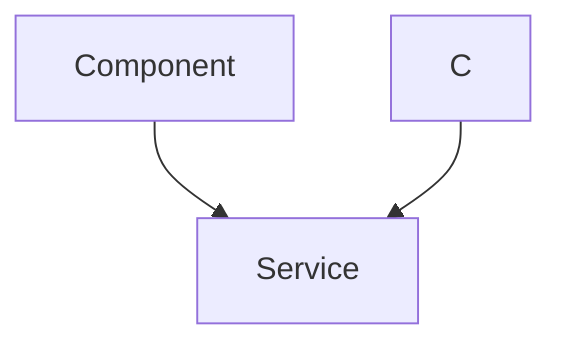

 # Data Models and Database

This section details the fundamental data structures and the underlying database connection mechanism used in the application. MongoDB is employed as the NoSQL database, with Mongoose providing an elegant object data modeling (ODM) solution for Node.js. Mongoose schemas define the shape and behavior of the data, ensuring consistency and enabling powerful querying capabilities.

The primary data models are `User` and `Message`, which are central to the application's functionality. The `User` model, in particular, is complex, handling not only user authentication details but also intricate social network relationships like friends, sent requests, and received requests.

## Database Connection

The application establishes a connection to MongoDB using Mongoose. The connection logic is encapsulated in a utility file, ensuring that the application can reliably interact with the database.

The `connectDB` function attempts to connect to the MongoDB URI specified in the environment variables. Upon a successful connection, it logs the host; otherwise, it logs an error message.

```javascript
// File: backend/src/lib/db.js
import mongoose from "mongoose"

export const connectDB = async () => {
  try {
    const conn = await mongoose.connect(process.env.MONGODB_URI);
    console.log(`MongoDB connected:  ${conn.connection.host}`);
  }
  catch(error){
    console.log("MongoDB connection error: ", error);
  }
}
```
[View on GitHub](https://github.com/shinymack/Chat-App-MERN/blob/main/backend/src/lib/db.js)

This connection function is typically called once when the application starts up, providing a persistent link to the database.

## User Data Model

The `User` model (`backend/src/models/user.model.js`) is arguably the most critical data model, as it underpins all user-centric features, including authentication, user profiles, and the entire friend system.

It defines several key fields:
*   **`email`**: Unique identifier for the user, required for email-based authentication.
*   **`username`**: A public, unique identifier for the user, used for display and searching.
*   **`password`**: Hashed password for email-based logins. It has a minimum length requirement.
*   **`profilePic`**: URL to the user's profile picture.
*   **`friends`**: An array of `ObjectId` references to other `User` documents, representing established friendships.
*   **`friendRequests`**: An array of `ObjectId` references to `User` documents who have sent a friend request to the current user (incoming requests).
*   **`sentRequests`**: An array of `ObjectId` references to `User` documents to whom the current user has sent a friend request (outgoing requests).
*   **`authProvider`**: Indicates the authentication method used (e.g., `'email'`, `'google'`).
*   **`googleId`**: Unique identifier for users who signed up via Google, ensuring integration with Google OAuth.

The schema also includes `timestamps` for `createdAt` and `updatedAt` fields, and a `pre('save')` hook to handle password requirements based on the `authProvider`. For instance, if a user signs up with Google, their password field is not strictly required.

```javascript
// File: backend/src/models/user.model.js
import mongoose from "mongoose"

const  userSchema = new mongoose.Schema(
    {
        email: {
            type: String,
            required: true,
            unique: true
        },
        username: {
            type: String,
            required: [true, "Username is required"],
            unique: true,
            trim: true,
            minlength: [3, "Username must be at least 3 characters long"],
            maxlength: [20, "Username cannot be more than 20 characters long"]
        }
        ,
        password: {
            type: String,
            minlength: 6,
        },
        profilePic: {
            type: String,
            default: "",
        },
        friends: [{
            type: mongoose.Schema.Types.ObjectId,
            ref: "User",
            default: []
        }],
        friendRequests: [{ // Incoming friend requests
            type: mongoose.Schema.Types.ObjectId,
            ref: "User",
            default: []
        }],
        sentRequests: [{ // Outgoing friend requests
            type: mongoose.Schema.Types.ObjectId,
            ref: "User",
            default: []
        }],
        authProvider: {
            type: String,
            enum: ['email', 'google'],
            default: 'email'
        },
        googleId: {
            type: String,
            unique: true,
            sparse: true
        },
    },
    {
        timestamps: true
    }
);

userSchema.pre('save', async function(next) {
    if (this.authProvider === 'google' && !this.isModified('password')) {
        this.password = undefined;
    }
    if (this.authProvider === 'email' && !this.password && this.isNew) {
        return next(new Error('Password is required for email signup.'));
    }
    next();
});

const User = mongoose.model("User", userSchema);

export default User;
```
[View on GitHub](https://github.com/shinymack/Chat-App-MERN/blob/main/backend/src/models/user.model.js)

### User Model Structure

The `User` model exhibits self-referential relationships, where users can refer to other users for their social connections.





## Message Data Model

The `Message` model (`backend/src/models/message.model.js`) is straightforward, designed to store individual messages exchanged between users.

It includes the following fields:
*   **`senderId`**: `ObjectId` reference to the `User` who sent the message.
*   **`receiverId`**: `ObjectId` reference to the `User` who is the intended recipient of the message.
*   **`text`**: The textual content of the message.
*   **`image`**: A string (e.g., URL) if the message includes an image.

Like the `User` schema, it also utilizes `timestamps` to record when messages were created and updated.

```javascript
// File: backend/src/models/message.model.js
import express from "express";
import mongoose from "mongoose";

const messageSchema = new mongoose.Schema(
    {
     senderId: {
        type: mongoose.Schema.Types.ObjectId,
        ref: "User",
        required: true,
     },
     receiverId: {
        type: mongoose.Schema.Types.ObjectId,
        ref: "User",
        required: true,
     },
     text: {
        type: String,
     },
     image: {
        type: String,
     },
    },
    {timestamps: true}
);

export default mongoose.model("Message", messageSchema);
```
[View on GitHub](https://github.com/shinymack/Chat-App-MERN/blob/main/backend/src/models/message.model.js)

## Friend Management Logic

The `backend/src/controllers/friend.controller.js` file contains the core business logic for managing friendships and friend requests. These functions directly interact with the `User` model to modify the `friends`, `friendRequests`, and `sentRequests` arrays.

### Sending a Friend Request

The `sendFriendRequest` function allows a user to send a friend request to another user. It identifies the receiver by username or email and performs several checks (e.g., not sending to self, already friends, request already sent/received) before updating both the sender's `sentRequests` and the receiver's `friendRequests` arrays.

```javascript
// File: backend/src/controllers/friend.controller.js
export const sendFriendRequest = async (req, res) => {
    try {
        const { identifier } = req.body;
        const senderId = req.user._id;

        // ... (validation and finding receiver)

        const sender = await User.findById(senderId);

        if (sender.friends.includes(receiverId)) {
            return res.status(400).json({ message: "You are already friends with this user." });
        }
        if (sender.sentRequests.includes(receiverId)) {
            return res.status(400).json({ message: "Friend request already sent." });
        }
        if (sender.friendRequests.includes(receiverId)) {
            return res.status(400).json({ message: "This user has already sent you a friend request." });
        }

        sender.sentRequests.push(receiverId);
        receiver.friendRequests.push(senderId);

        await sender.save();
        await receiver.save();

        res.status(200).json({ message: "Friend request sent successfully." });

    } catch (error) {
        console.error("Error in sendFriendRequest: ", error.message);
        res.status(500).json({ message: "Internal server error", error: error.message });
    }
};
```
[View on GitHub](https://github.com/shinymack/Chat-App-MERN/blob/main/backend/src/controllers/friend.controller.js#L11-L55)

### Accepting a Friend Request

The `acceptFriendRequest` function is responsible for promoting a pending friend request to an active friendship. It adds both users to each other's `friends` list and removes the respective entries from `friendRequests` (for the receiver) and `sentRequests` (for the sender).

```javascript
// File: backend/src/controllers/friend.controller.js
export const acceptFriendRequest = async (req, res) => {
    try {
        const { senderId } = req.params;
        const receiverId = req.user._id;

        const sender = await User.findById(senderId);
        const receiver = await User.findById(receiverId);

        // ... (error handling for user not found and request not found)

        // Add to friends list for both users
        receiver.friends.push(senderId);
        sender.friends.push(receiverId);

        // Remove from requests lists
        receiver.friendRequests = receiver.friendRequests.filter(id => id.toString() !== senderId.toString());
        sender.sentRequests = sender.sentRequests.filter(id => id.toString() !== receiverId.toString());

        await receiver.save();
        await sender.save();

        res.status(200).json({ message: "Friend request accepted." });

    } catch (error) {
        console.error("Error in acceptFriendRequest: ", error.message);
        res.status(500).json({ message: "Internal server error", error: error.message });
    }
};
```
[View on GitHub](https://github.com/shinymack/Chat-App-MERN/blob/main/backend/src/controllers/friend.controller.js#L58-L96)

### Rejecting and Removing Friends

Similarly, `rejectFriendRequest` removes the request from both users' lists without establishing a friendship. `removeFriend` handles the termination of an existing friendship by removing each user from the other's `friends` array.

### Retrieving Friends and Requests

Functions like `getFriends`, `getPendingRequests`, and `getSentRequests` leverage Mongoose's `populate` method to retrieve the full `User` objects associated with the stored `ObjectIds` in the respective arrays. This allows the application to fetch detailed information about friends or users involved in requests without making separate database calls for each ID.

```javascript
// File: backend/src/controllers/friend.controller.js
export const getFriends = async (req, res) => {
    try {
        const userId = req.user._id;
        const user = await User.findById(userId).populate({
            path: "friends",
            select: "username email profilePic _id"
        });

        if (!user) {
            return res.status(404).json({ message: "User not found." });
        }

        res.status(200).json(user.friends);

    } catch (error) {
        console.error("Error in getFriends: ", error.message);
        res.status(500).json({ message: "Internal server error", error: error.message });
    }
};
```
[View on GitHub](https://github.com/shinymack/Chat-App-MERN/blob/main/backend/src/controllers/friend.controller.js#L173-L191)

This population mechanism is crucial for displaying user-friendly lists of friends and pending requests, as it provides more than just an ID.

### Friend Request Flow Example

The lifecycle of a friend request involves multiple interactions between the client, API server, and the database through the User model.


```mermaid
sequenceDiagram
    participant C as "Client"
    participant A as "API Server"
    participant U as "User Model (MongoDB)"

    C->>+A: "POST /api/friends/request (Send Request)"
    A ->> U: "Find sender and receiver by identifier"
    U -->> A: "Sender & Receiver User objects"
    A ->> A: "Check for existing friendships/requests"
    alt Request valid
        A ->> U: "Update sender.sentRequests (add receiverId)"
        A ->> U: "Update receiver.friendRequests (add senderId)"
        U -->> A: "Confirmation (Saved User objects)"
        A->>-C: "200 OK (Friend request sent)"
    else Request invalid
        A->>-C: "400 Bad Request (Error message)"
    end

    C->>+A: "GET /api/friends/pending (Get Pending Requests)"
    A ->> U: "Find current user by ID and populate friendRequests"
    U -->> A: "User object with populated friendRequests"
    A->>-C: "200 OK (List of pending requests)"

    C->>+A: "PUT /api/friends/accept/:senderId (Accept Request)"
    A ->> U: "Find sender and receiver"
    U -->> A: "Sender & Receiver User objects"
    A ->> U: "Add senderId to receiver.friends"
    A ->> U: "Add receiverId to sender.friends"
    A ->> U: "Remove senderId from receiver.friendRequests"
    A ->> U: "Remove receiverId from sender.sentRequests"
    U -->> A: "Confirmation (Saved User objects)"
    A->>-C: "200 OK (Friend request accepted)"
```


## Key Integration Points

*   **Loose Coupling with Strong Relationships:** Mongoose allows defining strong relationships (e.g., `ref: "User"`) between collections, even in a NoSQL environment. This enables powerful features like `populate` without rigid table joins.
*   **Encapsulation of Business Logic:** The `friend.controller.js` demonstrates how specific business rules (e.g., cannot send a request to self, check for existing friendships) are implemented and interact directly with the Mongoose models.
*   **Scalability of Document-Oriented Data:** For features like friend lists and message histories, a document-oriented database like MongoDB with flexible schemas is highly efficient. Storing arrays of `ObjectIds` within user documents for friends and requests simplifies queries for individual users' social circles.
*   **Authentication and Authorization:** The `User` model integrates fields for different authentication providers, highlighting a flexible approach to user management. The `pre('save')` hook further enforces business logic specific to these providers.