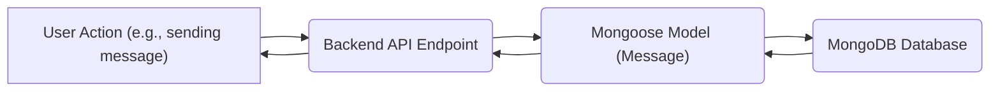
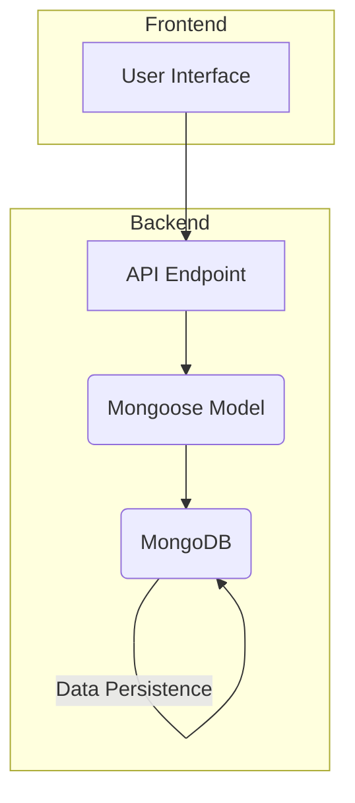

# Data Models and Persistence

This section explains the data models used in the Chat-App-MERN application and how data is persisted using MongoDB. The backend utilizes Mongoose, an Object Data Modeling (ODM) library for MongoDB and Node.js, to define schemas and interact with the database.

## Data Models

The application primarily uses two data models: `User` and `Message`. These models define the structure of the data stored in the MongoDB database.

### User Model

The `User` model, defined in `backend/src/models/user.model.js`, represents a user of the application.

```javascript
// File: backend/src/models/user.model.js
import mongoose from "mongoose"

const  userSchema = new mongoose.Schema(
    {
        email: { 
            type: String,
            required: true,
            unique: true
        },
        username: {
            type: String,
            required: [true, "Username is required"],
            unique: true,
            trim: true,
            minlength: [3, "Username must be at least 3 characters long"],
            maxlength: [20, "Username cannot be more than 20 characters long"]
        }
        ,
        password: {
            type: String,
            minlength: 6,
        },
        profilePic: {
            type: String,
            default: "",
        },
        friends: [{
            type: mongoose.Schema.Types.ObjectId,
            ref: "User",
            default: [] 
        }],
        friendRequests: [{ // Incoming friend requests
            type: mongoose.Schema.Types.ObjectId,
            ref: "User",
            default: []
        }],
        sentRequests: [{ // Outgoing friend requests
            type: mongoose.Schema.Types.ObjectId,
            ref: "User",
            default: []
        }],
        authProvider: {
            type: String,
            enum: ['email', 'google'],
            default: 'email'
        },
        googleId: {
            type: String,
            unique: true,
            sparse: true
        },
    },
    { 
        timestamps: true
    } 
);

userSchema.pre('save', async function(next) {
    if (this.authProvider === 'google' && !this.isModified('password')) {
        this.password = undefined;
    }
    if (this.authProvider === 'email' && !this.password && this.isNew) {
        return next(new Error('Password is required for email signup.'));
    }
    next();
});

const User = mongoose.model("User", userSchema);

export default User;
```

[View on GitHub](https://github.com/shinymack/Chat-App-MERN/blob/main/backend/src/models/user.model.js)

The schema defines the following fields:

-   `email`: User's email address (required, unique).
-   `username`: User's username (required, unique, trimmed, with length constraints).
-   `password`: User's password (minimum length of 6).
-   `profilePic`: URL of the user's profile picture (optional, default is empty string).
-   `friends`: An array of user IDs representing the user's friends. References the `User` model itself.
-   `friendRequests`: An array of user IDs representing pending incoming friend requests.
-   `sentRequests`: An array of user IDs representing pending outgoing friend requests.
-   `authProvider`: Specifies the authentication provider ('email' or 'google').
-   `googleId`: User's Google ID (unique, sparse, only for Google authentication).
-   `timestamps`: Automatically adds `createdAt` and `updatedAt` fields.

The `userSchema.pre('save', ...)` middleware function is used to handle password requirements based on the authentication provider. If using Google OAuth, the password field is automatically undefined and will not persist in the database. If a user signs up with email, the password field is required.

### Message Model

The `Message` model, defined in `backend/src/models/message.model.js`, represents a message exchanged between users.

```javascript
// File: backend/src/models/message.model.js
import express from "express";
import mongoose from "mongoose";

const messageSchema = new mongoose.Schema(
    {
     senderId: {
        type: mongoose.Schema.Types.ObjectId,
        ref: "User",
        required: true,
     },
     receiverId: {
        type: mongoose.Schema.Types.ObjectId,
        ref: "User",
        required: true,
     },
     text: {
        type: String,
     },
     image: {
        type: String,
     },
    },
    {timestamps: true}
);

export default mongoose.model("Message", messageSchema);
```

[View on GitHub](https://github.com/shinymack/Chat-App-MERN/blob/main/backend/src/models/message.model.js)

The schema defines the following fields:

-   `senderId`: ID of the user who sent the message.  References the `User` model.
-   `receiverId`: ID of the user who received the message. References the `User` model.
-   `text`: The message text content (String).
-   `image`: URL of an image attached to the message (optional).
-   `timestamps`: Automatically adds `createdAt` and `updatedAt` fields.

## Data Persistence

The application uses MongoDB as its database and Mongoose as the ODM. The `connectDB` function in `backend/src/lib/db.js` handles the connection to the MongoDB database.

```javascript
// File: backend/src/lib/db.js
import mongoose from "mongoose"

export const connectDB = async () => {
  try {
    const conn = await mongoose.connect(process.env.MONGODB_URI);
    console.log(`MongoDB connected:  ${conn.connection.host}`);
  }
  catch(error){
    console.log("MongoDB connection error: ", error);
  }
}
```

[View on GitHub](https://github.com/shinymack/Chat-App-MERN/blob/main/backend/src/lib/db.js)

This function retrieves the MongoDB connection URI from the environment variables (`process.env.MONGODB_URI`) and uses Mongoose to connect to the database.  Error handling is included to catch connection errors.

The data flow can be illustrated using the following diagram:





## Environment Variables

The MongoDB connection URI is stored in an environment variable. This practice helps keep sensitive information secure and allows for easy configuration changes without modifying the code.

```plaintext
MONGODB_URI=mongodb+srv://<username>:<password>@<cluster>.mongodb.net/<database>?retryWrites=true&w=majority
```

You should replace `<username>`, `<password>`, `<cluster>`, and `<database>` with your actual MongoDB credentials. This environment variable is typically set in a `.env` file or through the hosting environment's configuration settings.

## Mongoose Querying Examples

Here are a few examples of how Mongoose is used to interact with the database:

### Creating a New User

```javascript
// Example: Creating a new user
import User from './models/user.model.js';

async function createUser(userData) {
  try {
    const newUser = new User(userData);
    const savedUser = await newUser.save();
    console.log('New user created:', savedUser);
    return savedUser;
  } catch (error) {
    console.error('Error creating user:', error);
    throw error;
  }
}
```

This snippet shows how to create a new user using the `User` model and the `save()` method.

### Finding a User by Username

```javascript
// Example: Finding a user by username
import User from './models/user.model.js';

async function findUserByUsername(username) {
  try {
    const user = await User.findOne({ username: username });
    return user;
  } catch (error) {
    console.error('Error finding user:', error);
    throw error;
  }
}
```

This snippet uses the `findOne()` method to find a user with a specific username.

### Sending and Saving Messages

```javascript
// Example: Save the message
import Message from "./models/message.model.js";

async function saveMessage(senderId, receiverId, text, image) {
  try {
    const newMessage = new Message({
      senderId: senderId,
      receiverId: receiverId,
      text: text,
      image: image,
    });

    const savedMessage = await newMessage.save();
    console.log("Message saved successfully:", savedMessage);
    return savedMessage;
  } catch (error) {
    console.error("Error saving message:", error);
    throw error;
  }
}
```

This function creates and saves a new message using the `Message` model, storing information about the sender, receiver, message content, and any associated image.

### Adding a friend

```javascript
// Example: Add a friend to the friends array of a user.
import User from "./models/user.model.js";

async function addFriend(userId, friendId) {
  try {
    const user = await User.findByIdAndUpdate(
      userId,
      { $push: { friends: friendId } },
      { new: true }
    );

    if (!user) {
      console.log("User not found");
      return null;
    }

    console.log("Friend added successfully:", user);
    return user;
  } catch (error) {
    console.error("Error adding friend:", error);
    throw error;
  }
}
```

This code shows how to use `$push` and `findByIdAndUpdate` to add a new friend to the user's friend array.

## Key Integration Points

The data models and persistence mechanisms are critical for storing and retrieving user data, messages, and relationships. The use of Mongoose simplifies database interactions and provides a structured way to manage data.

### Best Practices
- **Validation:** Implement robust validation on the frontend and backend to ensure data integrity.
- **Error Handling:** Implement comprehensive error handling to gracefully manage database connection issues and query errors.
- **Security:** Protect sensitive data like passwords by using hashing and salting techniques.
- **Environment Variables:** Always store sensitive information like database credentials in environment variables.




